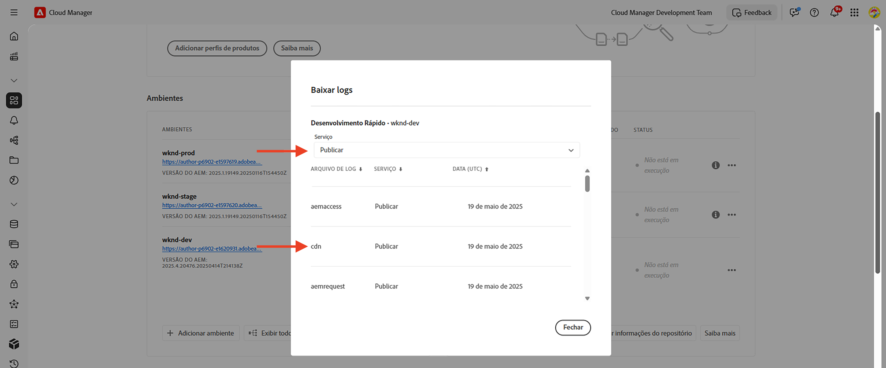
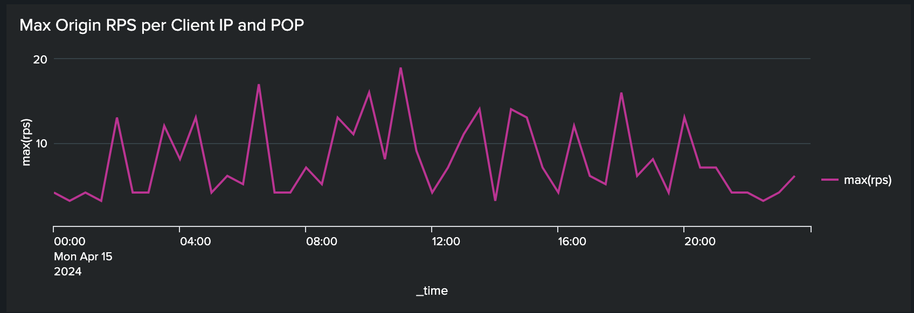

# Bloqueio de ataques de DoS e DDoS usando regras de filtro de tráfego

Saiba como bloquear ataques de Negação de Serviço (DoS) e de Negação de Serviço Distribuída (DDoS) usando regras de **filtro de limite de tráfego de taxa** e outras estratégias na CDN gerenciada pelo AEM as a Cloud Service (AEMCS). Esses ataques causam picos de tráfego na CDN e possivelmente no serviço de publicação do AEM (também conhecido como origem) e podem afetar a capacidade de resposta e a disponibilidade do site.

Este tutorial serve como um guia sobre _como analisar seus padrões de tráfego e configurar as [regras de filtro de tráfego](https://experienceleague.adobe.com/en/docs/experience-manager-cloud-service/content/security/traffic-filter-rules-including-waf)_ de limite de taxa para mitigar esses ataques. O tutorial também descreve como [configurar alertas](https://experienceleague.adobe.com/en/docs/experience-manager-cloud-service/content/security/traffic-filter-rules-including-waf#traffic-filter-rules-alerts) para que você seja notificado quando houver suspeita de ataque.

## Noções básicas sobre proteção

Vamos entender as proteções de DDoS padrão para seu site da AEM:

- **Armazenamento em cache:** com boas políticas de armazenamento em cache, o impacto de um ataque de DDoS é mais limitado porque a CDN impede que a maioria das solicitações vá para a origem e cause degradação de desempenho.
- **Dimensionamento automático:** os serviços de autoria e publicação do AEM se dimensionam automaticamente para lidar com picos de tráfego, embora ainda possam ser afetados por aumentos súbitos e maciços no tráfego.
- **Bloqueio:** a CDN da Adobe bloqueará o tráfego para a origem se ela exceder uma taxa definida pela Adobe de um endereço IP específico, por PoP (Ponto de Presença) da CDN.
- **Alertas:** a Central de Ações envia uma notificação de alerta de pico de tráfego na origem quando o tráfego excede uma determinada taxa. Este alerta é disparado quando o tráfego para qualquer PoP de CDN excede uma taxa de solicitação _definida pela Adobe_ por endereço IP. Consulte [Alertas das regras de filtro de tráfego](https://experienceleague.adobe.com/en/docs/experience-manager-cloud-service/content/security/traffic-filter-rules-including-waf#traffic-filter-rules-alerts) para obter mais detalhes.

Essas proteções integradas devem ser consideradas uma linha de base para a capacidade de uma organização de minimizar o impacto no desempenho de um ataque de DDoS. Como cada site tem características de desempenho diferentes e pode observar essa degradação de desempenho antes que o limite de taxa definido pela Adobe seja atingido, é recomendável estender as proteções padrão por meio da _configuração do cliente_.

Vamos analisar algumas medidas adicionais e recomendadas que os clientes podem tomar para proteger seus sites contra ataques de DDoS:

- Declarar **regras de filtro de limite de taxa** para bloquear o tráfego que excede uma determinada taxa de um único endereço IP por PoP. Normalmente, esses são um limite mais baixo do que o limite de taxa definido pela Adobe.
- Configure **alertas** sobre regras de filtro de limite de taxa por meio de uma &quot;ação de alerta&quot; para que, quando a regra for acionada, uma notificação da Central de Ações seja enviada.
- Aumente a cobertura do cache declarando **solicitar transformações** para ignorar os parâmetros de consulta.

### Variações das regras de tráfego de limite de taxa {#rate-limit-variations}

Há duas variações de regras de tráfego de limite de taxa:

1. Edge - bloqueia solicitações com base na taxa de todo o tráfego (incluindo o que pode ser veiculado a partir do cache CDN), para um determinado IP, por PoP.
1. Origem - bloqueia solicitações com base na taxa de tráfego destinada à origem, para um determinado IP, por PoP.

## Jornada do cliente

As etapas abaixo refletem o processo provável pelo qual os clientes devem proteger seus sites.

1. Reconheça a necessidade de uma regra de filtro de tráfego de limite de taxa. Isso pode ser o resultado do recebimento do alerta predefinido de pico de tráfego na origem do Adobe, ou pode ser uma decisão proativa para tomar precauções a fim de reduzir o risco de um DDoS bem-sucedido.
1. Analise os padrões de tráfego usando um painel, se o site já estiver ativo, para determinar os limites ideais para suas regras de filtro de tráfego de limite de taxa. Se o site ainda não estiver ativo, escolha valores com base nas expectativas de tráfego.
1. Usando os valores da etapa anterior, configure as regras de filtro de tráfego de limite de taxa. Ative os alertas correspondentes para ser notificado sempre que o limite for atingido.
1. Receba alertas de regras de filtro de tráfego sempre que picos de tráfego ocorrerem, fornecendo informações valiosas sobre se sua organização está sendo potencialmente alvo de agentes mal-intencionados.
1. Aja sobre o alerta, conforme necessário. Analise o tráfego para determinar se o pico reflete solicitações legítimas em vez de um ataque. Aumente os limites se o tráfego for legítimo, ou diminua-os se não for.

O restante deste tutorial o orienta por esse processo.

## Reconhecendo a necessidade de configurar regras {#recognize-the-need}

Como mencionado anteriormente, o Adobe, por padrão, bloqueia o tráfego na CDN que excede uma determinada taxa. No entanto, alguns sites podem enfrentar desempenho degradado abaixo desse limite. Portanto, as regras de filtro de tráfego de limite de taxa devem ser configuradas.

Idealmente, você configuraria as regras antes de entrar em produção. Na prática, muitas organizações declaram regras reativamente apenas uma vez alertadas de um pico de tráfego, indicando um provável ataque.

O Adobe envia um alerta de pico de tráfego na origem como uma [Notificação do Centro de Ações](https://experienceleague.adobe.com/en/docs/experience-manager-cloud-service/content/operations/actions-center) quando um limite padrão de tráfego de um único endereço IP é excedido, para um determinado PoP. Se você recebeu esse alerta, é recomendável configurar uma regra de filtro de tráfego de limite de taxa. Esse alerta padrão é diferente dos alertas que devem ser ativados explicitamente pelos clientes ao definir as regras de filtro de tráfego, sobre as quais você aprenderá em uma seção futura.

## Análise de padrões de tráfego {#analyze-traffic}

Se o site já estiver ativo, você poderá analisar os padrões de tráfego usando logs CDN e painéis fornecidos pela Adobe.

- **Painel de Tráfego da CDN**: fornece informações sobre o tráfego por meio da taxa de solicitação de CDN e Origem, taxas de erro 4xx e 5xx e solicitações não armazenadas em cache. Também fornece o máximo de solicitações CND e Origin por segundo por endereço IP de cliente e mais insights para otimizar as configurações de CDN.

- **Taxa de Acertos do Cache do CDN**: fornece informações sobre a taxa de acertos do cache total e a contagem total de solicitações por status HIT, PASS e MISS. Também fornece os principais URLs de HIT, PASS e MISS.

Configure a ferramenta de painel usando _uma das seguintes opções_:

### ELK - configurando ferramentas de painel de controle

A ferramenta de painel **Elasticsearch, Logstash e Kibana (ELK)** fornecida pela Adobe pode ser usada para analisar os logs de CDN. Essa ferramenta inclui um painel que visualiza os padrões de tráfego, facilitando a determinação dos limites ideais para suas regras de filtro de tráfego de limite de taxa.

- Clonar o [repositório GitHub AEMCS-CDN-Log-Analysis-Tooling](https://github.com/adobe/AEMCS-CDN-Log-Analysis-Tooling).
- Configure a ferramenta seguindo as etapas [Como configurar o contêiner ELK Docker](https://github.com/adobe/AEMCS-CDN-Log-Analysis-Tooling/blob/main/ELK/README.md#how-to-set-up-the-elk-docker-containerhow-to-setup-the-elk-docker-container).
- Como parte da configuração, importe o arquivo `traffic-filter-rules-analysis-dashboard.ndjson` para visualizar os dados. O painel _Tráfego do CDN_ inclui visualizações que mostram o número máximo de solicitações por IP/POP no Edge e na Origem do CDN.
- No cartão [Ambientes _do_ Cloud Manager](https://my.cloudmanager.adobe.com/), baixe os logs de CDN do serviço de publicação do AEMCS.

  

  >[!TIP]
  >
  > Pode levar até 5 minutos para que as novas solicitações apareçam nos logs de CDN.

### Splunk - configurando as ferramentas do painel

Os clientes que têm o [encaminhamento do Log de Splunk habilitado](https://experienceleague.adobe.com/en/docs/experience-manager-cloud-service/content/implementing/developing/logging#splunk-logs) podem criar novos painéis para analisar os padrões de tráfego.

Para criar painéis no Splunk, siga [painéis do Splunk para as etapas de Análise de Log da CDN do AEMCS](https://github.com/adobe/AEMCS-CDN-Log-Analysis-Tooling/blob/main/Splunk/README.md#splunk-dashboards-for-aemcs-cdn-log-analysis).

### Examinando dados

As seguintes visualizações estão disponíveis nos painéis ELK e Splunk:

- **Edge RPS por IP e POP do Cliente**: esta visualização mostra o número máximo de solicitações por IP/POP **na Edge CDN**. O pico na visualização indica o número máximo de solicitações.

  **Painel ELK**:
  

  **Painel do Splunk**:
  

- **RPS de Origem por IP e POP de Cliente**: esta visualização mostra o número máximo de solicitações por IP/POP **na origem**. O pico na visualização indica o número máximo de solicitações.

  **Painel ELK**:
  

  **Painel do Splunk**:
  

## Escolha de valores de limite

Os valores-limite para as regras de filtro de tráfego limite de taxa devem se basear na análise acima e garantir que o tráfego legítimo não seja bloqueado. Consulte a tabela a seguir para obter orientação sobre como escolher os valores de limite:

| Variação | Valor |
| :--------- | :------- |
| Origem | Use o valor mais alto do Máximo de Solicitações de Origem por IP/POP em condições de tráfego **normais** (ou seja, não a taxa no momento de um DDoS) e aumente-o em um múltiplo |
| Edge | Use o valor mais alto do Máximo de Solicitações Edge por IP/POP em condições de tráfego **normais** (ou seja, não a taxa no momento de um DDoS) e aumente-o em um múltiplo |

O múltiplo a ser usado depende de suas expectativas de picos normais no tráfego devido ao tráfego orgânico, campanhas e outros eventos. Um múltiplo entre 5-10 pode ser razoável.

Se o site ainda não estiver ativo, não há dados para analisar e você deve fazer uma suposição detalhada sobre os valores apropriados a serem definidos para as regras de filtro de tráfego de limite de taxa. Por exemplo:

| Variação | Valor |
|------------------------------ |:-----------:|
| Edge | 500 |
| Origem | 100 |

## Configuração de regras {#configure-rules}

Configure as regras de **filtro de limite de taxa** no arquivo `/config/cdn.yaml` do seu projeto do AEM, com valores baseados na discussão acima. Se necessário, consulte sua equipe de Segurança da Web para verificar se os valores de limite de taxa são apropriados e não bloqueiam o tráfego legítimo.

Consulte [Criar regras no seu projeto do AEM](https://experienceleague.adobe.com/en/docs/experience-manager-learn/cloud-service/security/traffic-filter-and-waf-rules/how-to-setup#create-rules-in-your-aem-project) para obter mais detalhes.

```yaml
kind: CDN
version: '1'
metadata:
  envTypes:
    - dev
    - stage
    - prod
data:
  trafficFilters:
    rules:
    ...
    #  Prevent attack at edge by blocking client for 5 minutes if they make more than 500 requests per second on average
      - name: prevent-dos-attacks-edge
        when:
          reqProperty: tier
          in: ["author","publish"]
        rateLimit:
          limit: 500 # replace with the appropriate value
          window: 10 # compute the average over 10s
          penalty: 300 # block IP for 5 minutes
          count: all # count all requests
          groupBy:
            - reqProperty: clientIp
        action:
          type: log
          alert: true
    #  Prevent attack at origin by blocking client for 5 minutes if they make more than 100 requests per second on average
      - name: prevent-dos-attacks-origin
        when:
          reqProperty: tier
          in: ["author","publish"]
        rateLimit:
          limit: 100 # replace with the appropriate value
          window: 10 # compute the average over 10s
          penalty: 300 # block IP for 5 minutes
          count: fetches # count only fetches
          groupBy:
            - reqProperty: clientIp
        action:
          type: log
          alert: true
```

Observe que as regras de origem e de borda são declaradas e que a propriedade de alerta está definida como `true` para que você possa receber alertas sempre que o limite for atingido, provavelmente indicando um ataque.

Recomenda-se que o tipo de ação seja definido para registrar inicialmente, para que você possa monitorar o tráfego por algumas horas ou dias, garantindo que o tráfego legítimo não exceda essas taxas. Após alguns dias, altere para o modo de bloqueio.

Siga as etapas abaixo para implantar as alterações no ambiente do AEM CS:

- Confirme e envie as alterações acima para o repositório Git do Cloud Manager.
- Implante as alterações no ambiente do AEM CS usando o pipeline de configuração do Cloud Manager. Consulte [Implantar regras por meio do Cloud Manager](https://experienceleague.adobe.com/en/docs/experience-manager-learn/cloud-service/security/traffic-filter-and-waf-rules/how-to-setup#deploy-rules-through-cloud-manager) para obter mais detalhes.
- Para verificar se a **regra de filtro de limite de taxa** está funcionando como esperado, você pode simular um ataque conforme descrito na seção [Simulação de ataque](#attack-simulation). Limite o número de solicitações a um valor maior que o valor limite da taxa definido na regra.

### Configurar regras de transformação de solicitação {#configure-request-transform-rules}

Além das regras de filtro de limite de taxa de tráfego, é recomendável usar [solicitar transformações](https://experienceleague.adobe.com/en/docs/experience-manager-cloud-service/content/implementing/content-delivery/cdn-configuring-traffic#request-transformations) para desdefinir parâmetros de consulta não necessários para o aplicativo, a fim de minimizar as formas de ignorar o cache por meio de técnicas de eliminação de cache. Por exemplo, se você quiser permitir apenas `search` e `campaignId` parâmetros de consulta, a seguinte regra pode ser declarada:

```yaml
kind: "CDN"
version: "1"
metadata:
  envTypes:
    - dev
    - stage
    - prod
data:
  requestTransformations:
    rules:
      - name: unset-all-query-params-except-those-needed
        when:
          reqProperty: tier
          in: ["publish"]
        actions:
          - type: unset
            queryParamMatch: ^(?!search$|campaignId$).*$
```

## Recebimento de alertas de regras de filtro de tráfego {#receiving-alerts}

Como mencionado acima, se a regra de filtro de tráfego incluir *alerta: true*, um alerta será recebido quando a regra for correspondida.

## Atuação em alertas {#acting-on-alerts}

Às vezes, o alerta é informativo, o que dá uma ideia da frequência dos ataques. Vale a pena analisar seus dados de CDN usando o painel descrito acima, para validar se o pico de tráfego se deve a um ataque e não apenas a um aumento no volume de tráfego legítimo. No último caso, considere aumentar o limite.

## Simulação de ataque{#attack-simulation}

Esta seção descreve métodos para simular um ataque de DoS, que podem ser usados para gerar dados para os painéis usados neste tutorial e para validar se as regras configuradas bloqueiam os ataques com êxito.

>[!CAUTION]
>
> Não execute essas etapas em um ambiente de produção. As etapas a seguir são somente para fins de simulação.
>
>Se você recebeu um alerta indicando um pico no tráfego, prossiga para a seção [Analisando padrões de tráfego](#analyzing-traffic-patterns).

Para simular um ataque, ferramentas como o [Apache Benchmark](https://httpd.apache.org/docs/2.4/programs/ab.html), o [Apache JMeter](https://jmeter.apache.org/), o [Vegeta](https://github.com/tsenart/vegeta) e outras podem ser usadas.

### solicitações do Edge

Usando o seguinte comando [Vegeta](https://github.com/tsenart/vegeta), você pode fazer muitas solicitações para o seu site:

```shell
$ echo "GET https://<YOUR-WEBSITE-DOMAIN>" | vegeta attack -rate=120 -duration=60s | vegeta report
```

O comando acima faz 120 solicitações por 5 segundos e gera um relatório. Supondo que o site não tenha taxa limitada, isso pode causar um pico no tráfego.

### Solicitações de origem

Para ignorar o cache da CDN e fazer solicitações à origem (serviço de Publicação do AEM), você pode adicionar um parâmetro de consulta exclusivo ao URL. Consulte o exemplo de script Apache JMeter do [Simular ataque DoS usando o script JMeter](https://experienceleague.adobe.com/en/docs/experience-manager-learn/foundation/security/modsecurity-crs-dos-attack-protection#simulate-dos-attack-using-jmeter-script)

