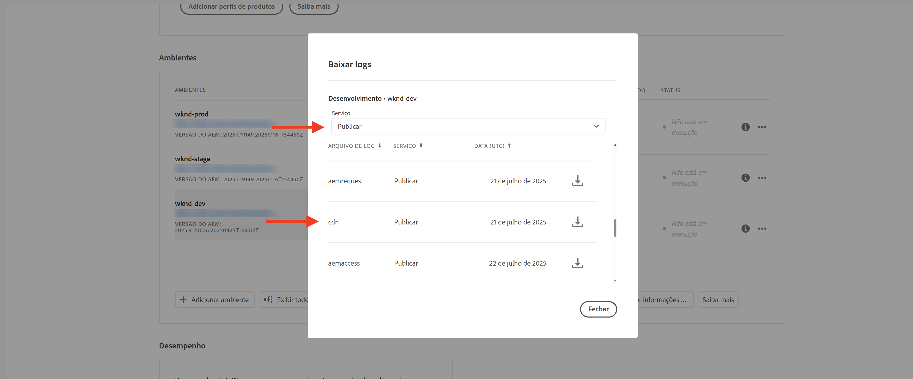

# Monitorar solicitações sensíveis

Saiba como monitorar solicitações sensíveis, registrando-as com regras de filtro de tráfego no AEM as a Cloud Service.

Os logs permitem observar padrões de tráfego sem afetar os usuários finais ou os serviços, sendo uma primeira etapa essencial antes de implementar regras de bloqueio.

Este tutorial demonstra como **registrar solicitações de caminhos de logon e logoff da WKND** no serviço do AEM Publish.

## Por que e quando registrar solicitações

O registro de solicitações específicas é uma prática de baixo risco e alto valor que ajuda a entender como os usuários e agentes potencialmente maliciosos estão interagindo com o seu aplicativo do AEM. Ele é útil principalmente antes de aplicar as regras de bloqueio, proporcionando confiança para refinar a sua postura de segurança sem interromper o tráfego legítimo.

Exemplos de casos comuns de registro:

- Validar o impacto e o alcance de uma regra antes de promovê-la para o modo `block`.
- Monitorar caminhos de logon/logoff e pontos de acesso de autenticação em busca de padrões incomuns ou tentativas de força bruta.
- Rastrear acessos de alta frequência a pontos de acesso da API em busca de possíveis abusos ou atividades de DoS.
- Estabelecer linhas de base para o comportamento de bots antes de aplicar controles mais rigorosos.
- Em caso de incidentes de segurança, fornecer dados forenses para entender a natureza do ataque e os recursos afetados.

## Pré-requisitos

Antes de continuar, certifique-se de ter realizado a configuração necessária, conforme descrito no tutorial [Como configurar as regras de filtro de tráfego e do WAF](../setup.md). Além disso, certifique-se de ter clonado e implantado o [Projeto de sites da WKND no AEM](https://github.com/adobe/aem-guides-wknd) no seu ambiente do AEM.

## Exemplo: registrar solicitações de logon e logoff da WKND

Neste exemplo, você cria uma regra de filtro de tráfego para registrar solicitações feitas nos caminhos de logon e logoff da WKND no serviço do AEM Publish. Ela ajuda a monitorar as tentativas de autenticação e identificar possíveis problemas de segurança.

- Adicione a regra a seguir ao arquivo `/config/cdn.yaml` do projeto da WKND.

```yaml
kind: "CDN"
version: "1"
metadata:
  envTypes: ["dev", "stage", "prod"]
data:
  trafficFilters:
    rules:
    # On AEM Publish service log WKND Login and Logout requests
    - name: publish-auth-requests
      when:
        allOf:
          - reqProperty: tier
            matches: publish
          - reqProperty: path
            in:
              - /system/sling/login/j_security_check
              - /system/sling/logout
      action: log   
```

- Confirme e envie as alterações ao repositório do Git do Cloud Manager.

- Implante as alterações no ambiente do AEM, usando o pipeline de configuração do Cloud Manager [criado anteriormente](../setup.md#deploy-rules-using-adobe-cloud-manager).

- Para testar a regra, faça logon e logoff no site da WKND do seu programa (por exemplo, `https://publish-pXXXX-eYYYY.adobeaemcloud.com/us/en.html`). Você pode usar `asmith/asmith` como nome de usuário e senha.

  

## Análise

Vamos analisar os resultados da regra `publish-auth-requests`, baixando os logs da CDN do AEMCS do Cloud Manager e usando as [Ferramentas de análise de logs da CDN do AEMCS](../setup.md#setup-the-elastic-dashboard-tool).

- No cartão **Ambientes** do [Cloud Manager](https://my.cloudmanager.adobe.com/), baixe os logs de CDN do serviço AEMCS **Publish**.

  

  >[!TIP]
  >
  > Pode levar até 5 minutos para que as novas solicitações apareçam nos logs da CDN.

- Copie o arquivo de log baixado (por exemplo, `publish_cdn_2023-10-24.log` na captura de tela abaixo) para a pasta `logs/dev` do projeto da ferramenta do painel “Elástico”.

  

- Atualize a página da ferramenta do painel “Elástico”.
   - Na seção superior de **Filtro global**, edite o filtro `aem_env_name.keyword` e selecione o valor de ambiente `dev`.

     

   - Para alterar o intervalo de tempo, clique no ícone de calendário, no canto superior direito, e selecione o intervalo de tempo desejado.

     

- Analise os painéis **Solicitações analisadas**, **Solicitações sinalizadas** e **Detalhes das solicitações sinalizadas** do painel atualizado. Para entradas do log da CDN correspondentes, ele deve mostrar os valores de IP do cliente (cli_ip), host, URL, ação (waf_action) e nome da regra (waf_match) de cada entrada.

  
