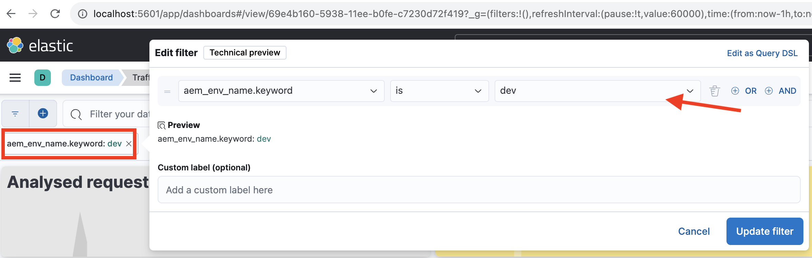

# Monitoramento de solicitações confidenciais

Saiba como monitorar solicitações confidenciais registrando-as usando regras de filtro de tráfego no AEM as a Cloud Service.

O registro permite observar padrões de tráfego sem afetar os usuários finais ou serviços, sendo uma primeira etapa essencial antes de implementar regras de bloqueio.

Este tutorial demonstra como **registrar solicitações de caminhos de logon e logout da WKND** no serviço de Publicação do AEM.

## Por que e quando registrar solicitações

O registro de solicitações específicas é uma prática de alto risco e alto valor para entender como os usuários e os agentes potencialmente mal-intencionados estão interagindo com o aplicativo AEM. É especialmente útil antes de aplicar as regras de bloqueio, oferecendo confiança para refinar sua postura de segurança sem interromper o tráfego legítimo.

Cenários comuns para registro incluem:

- Validando o impacto e o alcance de uma regra antes de promovê-la para o modo `block`.
- Monitoramento de caminhos de logon/logout e endpoints de autenticação para padrões incomuns ou tentativas de força bruta.
- Rastreamento de acesso de alta frequência a endpoints da API para possível abuso ou atividade de DoS.
- Estabelecer linhas de base para o comportamento de bot antes de aplicar controles mais rigorosos.
- Em caso de incidentes de segurança, forneça dados forenses para entender a natureza do ataque e os recursos afetados.

## Pré-requisitos

Antes de continuar, verifique se você concluiu a configuração necessária, conforme descrito no [tutorial Como configurar o filtro de tráfego e as regras do WAF](../setup.md). Além disso, você clonou e implantou o [Projeto do AEM WKND Sites](https://github.com/adobe/aem-guides-wknd) no seu ambiente AEM.

## Exemplo: registrar solicitações de logon e logout da WKND

Neste exemplo, você cria uma regra de filtro de tráfego para registrar solicitações feitas nos caminhos de logon e logout da WKND no serviço de publicação do AEM. Ele ajuda a monitorar as tentativas de autenticação e identificar possíveis problemas de segurança.

- Adicione a regra a seguir ao arquivo `/config/cdn.yaml` do projeto da WKND.

```yaml
kind: "CDN"
version: "1"
metadata:
  envTypes: ["dev", "stage", "prod"]
data:
  trafficFilters:
    rules:
    # On AEM Publish service log WKND Login and Logout requests
    - name: publish-auth-requests
      when:
        allOf:
          - reqProperty: tier
            matches: publish
          - reqProperty: path
            in:
              - /system/sling/login/j_security_check
              - /system/sling/logout
      action: log   
```

- Confirme e envie as alterações ao repositório do Git do Cloud Manager.

- Implante as alterações no ambiente do AEM usando o pipeline de configuração do Cloud Manager [criado anteriormente](../setup.md#deploy-rules-using-adobe-cloud-manager).

- Teste a regra entrando e saindo do site WKND do programa (por exemplo, `https://publish-pXXXX-eYYYY.adobeaemcloud.com/us/en.html`). Você pode usar `asmith/asmith` como nome de usuário e senha.

  

## Análise

Vamos analisar os resultados da regra `publish-auth-requests` baixando os logs de CDN do AEMCS da Cloud Manager e usando a [Ferramenta de Análise de Logs da CDN do AEMCS](../setup.md#setup-the-elastic-dashboard-tool).

- No cartão **Ambientes** do [Cloud Manager](https://my.cloudmanager.adobe.com/), baixe os logs de CDN do serviço AEMCS **Publish**.

  

  >[!TIP]
  >
  > Pode levar até 5 minutos para que as novas solicitações apareçam nos logs da CDN.

- Copie o arquivo de log baixado (por exemplo, `publish_cdn_2023-10-24.log` na captura de tela abaixo) para a pasta `logs/dev` do projeto da ferramenta do painel “Elástico”.

  

- Atualize a página da ferramenta do painel “Elástico”.
   - Na seção superior de **Filtro global**, edite o filtro `aem_env_name.keyword` e selecione o valor de ambiente `dev`.

     

   - Para alterar o intervalo de tempo, clique no ícone de calendário, no canto superior direito, e selecione o intervalo de tempo desejado.

     

- Analise os painéis **Solicitações analisadas**, **Solicitações sinalizadas** e **Detalhes das solicitações sinalizadas** do painel atualizado. Para entradas do log da CDN correspondentes, ele deve mostrar os valores de IP do cliente (cli_ip), host, URL, ação (waf_action) e nome da regra (waf_match) de cada entrada.

  

