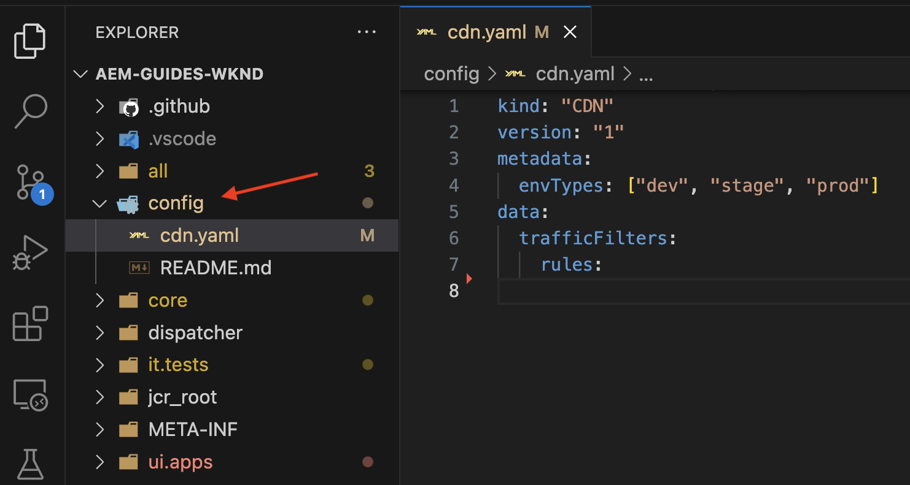

# Como configurar regras de filtro de tráfego, incluindo regras do WAF

Saiba **como configurar** regras de filtro de tráfego, incluindo regras de firewall de aplicativos web (WAF, na sigla em inglês). Neste tutorial, estabelecemos as bases para tutoriais futuros, onde você configurará e implantará regras, seguidas de testes e análise dos resultados.

Para demonstrar o processo de configuração, o tutorial usa o [Projeto de sites da WKND no AEM](https://github.com/adobe/aem-guides-wknd).

>[!VIDEO](https://video.tv.adobe.com/v/3469395/?quality=12&learn=on)

## Visão geral da configuração

As bases para tutoriais futuros envolvem as seguintes etapas:

- _Criar regras_ no seu projeto do AEM na pasta `config`
- _implantar regras_ com o pipeline de configuração do Adobe Cloud Manager.
- _Testar regras_ com ferramentas como Curl, Vegeta e Nikto
- _Analisar resultados_ com a ferramenta de análise de logs da CDN do AEMCS

## Criar regras no seu projeto do AEM

Para definir as regras de filtro de tráfego **padrão** e de **WAF** no seu projeto do AEM, siga estas etapas:

1. No nível superior do seu projeto do AEM, crie uma pasta chamada `config`.

2. Dentro da pasta `config`, crie um arquivo chamado `cdn.yaml`.

3. Use a seguinte estrutura de metadados em `cdn.yaml`:

```yaml
kind: "CDN"
version: "1"
metadata:
  envTypes: ["dev", "stage", "prod"]
data:
  trafficFilters:
    rules:
```



No [próximo tutorial](#next-steps), você aprenderá a adicionar o **filtro de tráfego padrão recomendado e as regras do WAF** da Adobe ao arquivo acima, como uma base sólida para a sua implementação.

## Implantar regras com o Adobe Cloud Manager

Em preparação para implantar as regras, siga estas etapas:

1. Faça logon em [my.cloudmanager.adobe.com](https://my.cloudmanager.adobe.com/) e selecione o seu programa.

2. Na página **Visão geral do programa**, acesse o cartão **Pipelines** e clique em **+Adicionar** para criar um novo pipeline.

   

3. No assistente de pipeline:

   - **Tipo**: pipeline de implantação
   - **Nome do pipeline**: Dev-Config

   

4. Configuração do código-fonte:

   - **Código a ser implantado**: implantação direcionada
   - **Inclua**: Config
   - **Ambiente de implantação**: por exemplo, `wknd-program-dev`
   - **Repositório**: repositório do Git (por exemplo, `wknd-site`)
   - **Ramificação do Git**: a sua ramificação de trabalho
   - **Local do código**: `/config`

   

5. Revise a configuração do pipeline e clique em **Salvar**.

No [próximo tutorial](#next-steps), você aprenderá a implantar o pipeline no seu ambiente do AEM.

## Testar regras com ferramentas

Para testar a eficácia do filtro de tráfego padrão e das regras do WAF, você pode usar várias ferramentas para simular solicitações e analisar como as suas regras respondem.

Confirme que as seguintes ferramentas estão instaladas no computador local ou siga as instruções para instalá-las:

- [Curl](https://curl.se/): testar fluxo de solicitação/resposta.
- [Vegeta](https://github.com/tsenart/vegeta): simular carga de solicitação alta (testes de DoS).
- [Nikto](https://github.com/sullo/nikto/wiki): procurar vulnerabilidades.

Você pode verificar a instalação por meio dos seguintes comandos:

```shell
# Curl version check
$ curl --version

# Vegeta version check
$ vegeta -version

# Nikto version check
$ cd <PATH-OF-CLONED-REPO>/program
$ ./nikto.pl -Version
```

No [próximo tutorial](#next-steps), você aprenderá a usar essas ferramentas para simular altas cargas de solicitação e solicitações maliciosas para testar a eficácia do seu filtro de tráfego e das regras do WAF.

## Analisar resultados

Para preparar-se para analisar os resultados, siga estas etapas:

1. Instale a **Ferramenta de análise de logs da CDN do AEMCS** para visualizar e analisar os padrões por meio de painéis pré-criados.

2. Execute a **assimilação de logs da CDN**, baixando logs da IU do Cloud Manager. Alternativamente, encaminhe os logs diretamente a um destino de log hospedado compatível, como Splunk ou Elasticsearch.

### Ferramentas de análise de logs da CDN do AEMCS

Para analisar os resultados do filtro de tráfego e das regras do WAF, você pode usar a **Ferramenta de análise de logs da CDN do AEMCS**. Essa ferramenta fornece painéis pré-criados para visualizar o tráfego da CDN e a atividade do WAF, utilizando os logs coletados da CDN do AEMCS.

A ferramenta de análise de logs da CDN do AEMCS é compatível com duas plataformas de observação: **ELK** (Elasticsearch, Logstash, Kibana) e **Splunk**.

É possível usar o recurso de encaminhamento de logs para transmitir os seus logs para um serviço de log do ELK ou Splunk hospedado, onde você pode instalar um painel para visualizar e analisar o filtro de tráfego padrão e as regras de filtro de tráfego do WAF. No entanto, neste tutorial, você configurará o painel em uma instância local do ELK instalada no seu computador.

1. Clone o repositório [AEMCS-CDN-Log-Analysis-Tooling](https://github.com/adobe/AEMCS-CDN-Log-Analysis-Tooling).

2. Siga o [Guia de configuração de container do ELK Docker](https://github.com/adobe/AEMCS-CDN-Log-Analysis-Tooling/blob/main/ELK/README.md) para instalar e configurar a pilha do ELK localmente.

3. Usando os painéis do ELK, você pode explorar métricas como solicitações de IP, tráfego bloqueado, padrões de URI e alertas de segurança.

   

>[!NOTE]
> 
> Se os logs ainda não tiverem sido assimilados da CDN do AEMCS, os painéis estarão vazios.

### Assimilação de logs da CDN

Para assimilar logs da CDN na pilha do ELK, siga estas etapas:

- No cartão **Ambientes** do [Cloud Manager](https://my.cloudmanager.adobe.com/), baixe os logs de CDN do serviço AEMCS **Publish**.

  

  >[!TIP]
  >
  > Pode levar até 5 minutos para que as novas solicitações apareçam nos logs da CDN.

- Copie o arquivo de log baixado (por exemplo, `publish_cdn_2025-06-06.log` na captura de tela abaixo) para a pasta `logs/dev` do projeto da ferramenta do painel “Elástico”.

  {width="800" zoomable="yes"}

- Atualize a página da ferramenta do painel “Elástico”.
   - Na seção superior de **Filtro global**, edite o filtro `aem_env_name.keyword` e selecione o valor de ambiente `dev`.

     

   - Para alterar o intervalo de tempo, clique no ícone de calendário, no canto superior direito, e selecione o intervalo de tempo desejado.

- No [próximo tutorial](#next-steps), você aprenderá a analisar os resultados do filtro de tráfego padrão e das regras do filtro de tráfego do WAF, usando os painéis pré-criados na pilha do ELK.

  

## Resumo

Você criou com sucesso as bases para a implementação das regras de filtro de tráfego, incluindo as regras do WAF, no AEM as a Cloud Service. Você criou uma estrutura de arquivos de configuração, e um pipeline de implantação, e preparou as ferramentas para testar e analisar os resultados.

## Próximas etapas

Saiba como implementar as regras recomendadas pela Adobe nos seguintes tutoriais:

<!-- CARDS
{target = _self}

* ./use-cases/using-traffic-filter-rules.md
  {title = Protecting AEM websites using standard traffic filter rules}
  {description = Learn how to protect AEM websites from DoS, DDoS and bot abuse using Adobe-recommended standard traffic filter rules in AEM as a Cloud Service.}
  {image = ./assets/use-cases/using-traffic-filter-rules.png}
  {cta = Apply Rules}

* ./use-cases/using-waf-rules.md
  {title = Protecting AEM websites using WAF traffic filter rules}
  {description = Learn how to protect AEM websites from sophisticated threats including DoS, DDoS, and bot abuse using Adobe-recommended Web Application Firewall (WAF) traffic filter rules in AEM as a Cloud Service.}
  {image = ./assets/use-cases/using-waf-rules.png}
  {cta = Activate WAF}
-->
<!-- START CARDS HTML - DO NOT MODIFY BY HAND -->
<div class="columns">
    <div class="column is-half-tablet is-half-desktop is-one-third-widescreen" aria-label="Protecting AEM websites using standard traffic filter rules">
        <div class="card" style="height: 100%; display: flex; flex-direction: column; height: 100%;">
            <div class="card-image">
                <figure class="image x-is-16by9">
                    <a href="./use-cases/using-traffic-filter-rules.md" title="Proteger sites do AEM com regras de filtro de tráfego padrão" target="_self" rel="referrer">
                        
                    </a>
                </figure>
            </div>
            <div class="card-content is-padded-small" style="display: flex; flex-direction: column; flex-grow: 1; justify-content: space-between;">
                <div class="top-card-content">
                    <p class="headline is-size-6 has-text-weight-bold">
                        <a href="./use-cases/using-traffic-filter-rules.md" target="_self" rel="referrer" title="Proteger sites do AEM com regras de filtro de tráfego padrão">Proteger sites do AEM com regras de filtro de tráfego padrão</a>
                    </p>
                    <p class="is-size-6">Saiba como proteger sites do AEM contra DoS, DDoS e abuso de bot, usando as regras de filtro de tráfego padrão recomendadas pela Adobe no AEM as a Cloud Service.</p>
                </div>
                <a href="./use-cases/using-traffic-filter-rules.md" target="_self" rel="referrer" class="spectrum-Button spectrum-Button--outline spectrum-Button--primary spectrum-Button--sizeM" style="align-self: flex-start; margin-top: 1rem;">
                    <span class="spectrum-Button-label has-no-wrap has-text-weight-bold">Aplicar regras</span>
                </a>
            </div>
        </div>
    </div>
    <div class="column is-half-tablet is-half-desktop is-one-third-widescreen" aria-label="Protecting AEM websites using WAF traffic filter rules">
        <div class="card" style="height: 100%; display: flex; flex-direction: column; height: 100%;">
            <div class="card-image">
                <figure class="image x-is-16by9">
                    <a href="./use-cases/using-waf-rules.md" title="Proteger sites do AEM com regras de filtro de tráfego do WAF" target="_self" rel="referrer">
                        
                    </a>
                </figure>
            </div>
            <div class="card-content is-padded-small" style="display: flex; flex-direction: column; flex-grow: 1; justify-content: space-between;">
                <div class="top-card-content">
                    <p class="headline is-size-6 has-text-weight-bold">
                        <a href="./use-cases/using-waf-rules.md" target="_self" rel="referrer" title="Proteger sites do AEM com regras de filtro de tráfego do WAF">Proteger sites do AEM com regras de filtro de tráfego do WAF</a>
                    </p>
                    <p class="is-size-6">Saiba como proteger sites do AEM contra ameaças sofisticadas, incluindo DoS, DDoS e abuso de bot, usando regras de filtro de tráfego do firewall de aplicativos web (WAF, na sigla em inglês) recomendadas pela Adobe no AEM as a Cloud Service.</p>
                </div>
                <a href="./use-cases/using-waf-rules.md" target="_self" rel="referrer" class="spectrum-Button spectrum-Button--outline spectrum-Button--primary spectrum-Button--sizeM" style="align-self: flex-start; margin-top: 1rem;">
                    <span class="spectrum-Button-label has-no-wrap has-text-weight-bold">Ativar WAF</span>
                </a>
            </div>
        </div>
    </div>
</div>
<!-- END CARDS HTML - DO NOT MODIFY BY HAND -->

## Casos de uso avançados

Além do filtro de tráfego padrão e das regras do WAF recomendados pela Adobe, é possível implementar casos avançados para satisfazer requisitos específicos da empresa. Esses casos incluem:

<!-- CARDS
{target = _self}

* ./how-to/request-logging.md

* ./how-to/request-blocking.md

* ./how-to/request-transformation.md
-->
<!-- START CARDS HTML - DO NOT MODIFY BY HAND -->
<div class="columns">
    <div class="column is-half-tablet is-half-desktop is-one-third-widescreen" aria-label="Monitoring sensitive requests">
        <div class="card" style="height: 100%; display: flex; flex-direction: column; height: 100%;">
            <div class="card-image">
                <figure class="image x-is-16by9">
                    <a href="./how-to/request-logging.md" title="Monitorar solicitações sensíveis" target="_self" rel="referrer">
                        
                    </a>
                </figure>
            </div>
            <div class="card-content is-padded-small" style="display: flex; flex-direction: column; flex-grow: 1; justify-content: space-between;">
                <div class="top-card-content">
                    <p class="headline is-size-6 has-text-weight-bold">
                        <a href="./how-to/request-logging.md" target="_self" rel="referrer" title="Monitorar solicitações sensíveis">Monitorar solicitações sensíveis</a>
                    </p>
                    <p class="is-size-6">Saiba como monitorar solicitações sensíveis, registrando-as com regras de filtro de tráfego no AEM as a Cloud Service.</p>
                </div>
                <a href="./how-to/request-logging.md" target="_self" rel="referrer" class="spectrum-Button spectrum-Button--outline spectrum-Button--primary spectrum-Button--sizeM" style="align-self: flex-start; margin-top: 1rem;">
                    <span class="spectrum-Button-label has-no-wrap has-text-weight-bold">Saiba mais</span>
                </a>
            </div>
        </div>
    </div>
    <div class="column is-half-tablet is-half-desktop is-one-third-widescreen" aria-label="Restricting access">
        <div class="card" style="height: 100%; display: flex; flex-direction: column; height: 100%;">
            <div class="card-image">
                <figure class="image x-is-16by9">
                    <a href="./how-to/request-blocking.md" title="Restringir o acesso" target="_self" rel="referrer">
                        
                    </a>
                </figure>
            </div>
            <div class="card-content is-padded-small" style="display: flex; flex-direction: column; flex-grow: 1; justify-content: space-between;">
                <div class="top-card-content">
                    <p class="headline is-size-6 has-text-weight-bold">
                        <a href="./how-to/request-blocking.md" target="_self" rel="referrer" title="Restringir o acesso">Restringir o acesso</a>
                    </p>
                    <p class="is-size-6">Saiba como restringir o acesso, bloqueando solicitações específicas com regras de filtro de tráfego no AEM as a Cloud Service.</p>
                </div>
                <a href="./how-to/request-blocking.md" target="_self" rel="referrer" class="spectrum-Button spectrum-Button--outline spectrum-Button--primary spectrum-Button--sizeM" style="align-self: flex-start; margin-top: 1rem;">
                    <span class="spectrum-Button-label has-no-wrap has-text-weight-bold">Saiba mais</span>
                </a>
            </div>
        </div>
    </div>
    <div class="column is-half-tablet is-half-desktop is-one-third-widescreen" aria-label="Normalizing requests">
        <div class="card" style="height: 100%; display: flex; flex-direction: column; height: 100%;">
            <div class="card-image">
                <figure class="image x-is-16by9">
                    <a href="./how-to/request-transformation.md" title="Normalizar solicitações" target="_self" rel="referrer">
                        
                    </a>
                </figure>
            </div>
            <div class="card-content is-padded-small" style="display: flex; flex-direction: column; flex-grow: 1; justify-content: space-between;">
                <div class="top-card-content">
                    <p class="headline is-size-6 has-text-weight-bold">
                        <a href="./how-to/request-transformation.md" target="_self" rel="referrer" title="Normalizar solicitações">Normalizar solicitações</a>
                    </p>
                    <p class="is-size-6">Saiba como normalizar solicitações, transformando-as com regras de filtro de tráfego no AEM as a Cloud Service.</p>
                </div>
                <a href="./how-to/request-transformation.md" target="_self" rel="referrer" class="spectrum-Button spectrum-Button--outline spectrum-Button--primary spectrum-Button--sizeM" style="align-self: flex-start; margin-top: 1rem;">
                    <span class="spectrum-Button-label has-no-wrap has-text-weight-bold">Saiba mais</span>
                </a>
            </div>
        </div>
    </div>
</div>
<!-- END CARDS HTML - DO NOT MODIFY BY HAND -->

## Recursos adicionais

- [Regras de filtro de tráfego, incluindo regras do WAF](https://experienceleague.adobe.com/pt-br/docs/experience-manager-cloud-service/content/security/traffic-filter-rules-including-waf)
