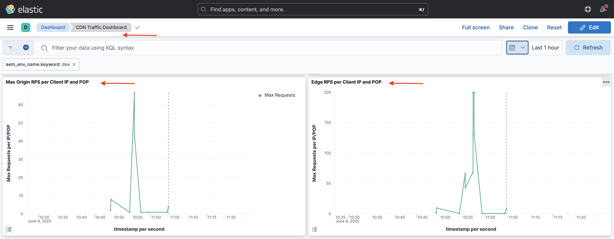

# Proteger sites do AEM com regras de filtro de tráfego padrão

Saiba como proteger sites do AEM contra DoS (negação de Serviço), DDoS (negação de serviço distribuída) e abuso de bot, usando as **regras de filtro de tráfego padrão** _recomendadas pela Adobe_ no AEM as a Cloud Service.


>[!VIDEO](https://video.tv.adobe.com/v/3469396/?quality=12&learn=on)

## Metas de aprendizagem

- Revise as regras de filtro de tráfego padrão recomendadas pela Adobe.
- Defina, implante, teste e analise os resultados das regras.
- Entenda quando e como refinar as regras com base nos padrões de tráfego.
- Saiba como usar o centro de ações do AEM para revisar os alertas gerados pelas regras.

### Visão geral da implementação

As etapas de implementação incluem:

- Adicionar as regras de filtro de tráfego padrão ao arquivo `/config/cdn.yaml` do projeto da WKND no AEM.
- Confirmar e enviar as alterações ao repositório do Git do Cloud Manager.
- Implantar as alterações no ambiente do AEM por meio do pipeline de configuração do Cloud Manager.
- Testar as regras por meio da simulação de um ataque de DoS com o [Vegeta](https://github.com/tsenart/vegeta)
- Analisar os resultados com os logs da CDN do AEMCS e a ferramenta do painel do ELK.

## Pré-requisitos

Antes de continuar, certifique-se de ter estabelecido as bases necessárias, conforme descrito no tutorial [Como configurar as regras de filtro de tráfego e do WAF](../setup.md). Além disso, certifique-se de ter clonado e implantado o [Projeto de sites da WKND no AEM](https://github.com/adobe/aem-guides-wknd) no seu ambiente do AEM.

## Principais ações das regras

Antes de analisarmos os detalhes das regras de filtro de tráfego padrão, vamos entender as principais ações que essas regras executam. O atributo `action` de cada regra define como o filtro de tráfego deve responder quando as condições forem satisfeitas. As ações incluem:

- **Log**: as regras registram os eventos para monitoramento e análise, permitindo que você revise os padrões de tráfego e ajuste os limites, conforme necessário. Ele é especificado pelo atributo `type: log`.

- **Alerta**: as regras acionam alertas quando as condições são satisfeitas, ajudando a identificar possíveis problemas. Ele é especificado pelo atributo `alert: true`.

- **Bloqueio**: as regras bloqueiam o tráfego quando as condições são satisfeitas, impedindo o acesso ao seu site do AEM. Ele é especificado pelo atributo `action: block`.

## Revisar e definir regras

As regras de filtro de tráfego padrão recomendadas pela Adobe servem como uma camada fundamental para identificar padrões de tráfego potencialmente maliciosos, registrando eventos como limites de taxa baseados em IP que estão sendo excedidos e bloqueando o tráfego de países específicos. Esses logs ajudam as equipes a validarem os limites e tomarem decisões fundamentadas em relação à **transição para as regras de modo de bloqueio** sem interromper o tráfego legítimo.

Vamos revisar as três regras de filtro de tráfego padrão que você deve adicionar ao arquivo `/config/cdn.yaml` do projeto da WKND no AEM:

- **Impedir DoS na borda**: esta regra detecta possíveis ataques de negação de serviço (DoS) na borda da CDN, monitorando solicitações por segundo (RPS) de IPs de clientes.
- **Impedir DoS na origem**: esta regra detecta possíveis ataques de negação de serviço (DoS) na origem, monitorando solicitações de obtenção de IPs de clientes.
- **Bloquear países do OFAC**: esta regra bloqueia o acesso de países específicos que estejam sob restrições do Gabinete de Controle de Ativos Estrangeiros (OFAC, na sigla em inglês).

### &#x200B;1. Impedir DoS na borda

Esta regra **envia um alerta** quando detecta um possível ataque de negação de serviço (DoS) na CDN. Os critérios para acionar essa regra são quando um cliente excede **500 solicitações por segundo** (em média, mais de 10 segundos) por POP (ponto de presença) da CDN na borda.

Ela considera **todas** as solicitações e as agrupa por IP do cliente.

```yaml
kind: "CDN"
version: "1"
metadata:
  envTypes: ["dev", "stage", "prod"]
data:
  trafficFilters:
    rules:
    - name: prevent-dos-attacks-edge
      when:
        reqProperty: tier
        equals: 'publish'
      rateLimit:
        limit: 500
        window: 10
        penalty: 300
        count: all
        groupBy:
          - reqProperty: clientIp
      action:
        type: log
        alert: true
```

O atributo `action` especifica que a regra deve registrar os eventos e acionar um alerta quando as condições forem satisfeitas. Assim, ela ajuda a monitorar possíveis ataques de DoS sem bloquear o tráfego legítimo. No entanto, o seu objetivo final é fazer a transição dessa regra para o modo de bloqueio depois de validar os padrões de tráfego e ajustar os limites.

### &#x200B;2. Impedir DoS na origem

Esta regra **envia um alerta** quando detecta um possível ataque de negação de serviço (DoS) na origem. Os critérios para acionar esta regra são quando um cliente excede **100 solicitações por segundo** (em média, mais de 10 segundos) por IP do cliente na origem.

Ela considera as **obtenções** (solicitações de ignorar o cache) e as agrupa por IP do cliente.

```yaml
...
    - name: prevent-dos-attacks-origin
      when:
        reqProperty: tier
        equals: 'publish'
      rateLimit:
        limit: 100
        window: 10
        penalty: 300
        count: fetches
        groupBy:
          - reqProperty: clientIp
      action:
        type: log
        alert: true
```

O atributo `action` especifica que a regra deve registrar os eventos e acionar um alerta quando as condições forem satisfeitas. Assim, ela ajuda a monitorar possíveis ataques de DoS sem bloquear o tráfego legítimo. No entanto, o seu objetivo final é fazer a transição dessa regra para o modo de bloqueio depois de validar os padrões de tráfego e ajustar os limites.

### &#x200B;3. Bloquear países do OFAC

Esta regra bloqueia o acesso de países específicos que se enquadram nas restrições do [OFAC](https://ofac.treasury.gov/sanctions-programs-and-country-information).
Você pode revisar e modificar a lista de países, conforme necessário.

```yaml
...
    - name: block-ofac-countries
      when:
        allOf:
          - { reqProperty: tier, in: ["author", "publish"] }
          - reqProperty: clientCountry
            in:
              - SY
              - BY
              - MM
              - KP
              - IQ
              - CD
              - SD
              - IR
              - LR
              - ZW
              - CU
              - CI
      action: block
```

O atributo `action` especifica que a regra deve bloquear o acesso dos países especificados. Isso ajuda a impedir o acesso ao site do AEM de regiões que podem representar riscos de segurança.

O arquivo `cdn.yaml` completo com as regras acima tem esta aparência:


## Implantar regras

Para implantar as regras acima, siga estas etapas:

- Confirme e envie as alterações ao repositório do Git do Cloud Manager.

- Implante as alterações no ambiente do AEM, usando o pipeline de configuração do Cloud Manager [criado anteriormente](../setup.md#deploy-rules-using-adobe-cloud-manager).

  

## Testar regras

Para verificar a eficácia das regras de filtro de tráfego padrão, tanto na **borda da CDN** quanto na **origem**, simule um alto tráfego de solicitação com o [Vegeta](https://github.com/tsenart/vegeta), uma ferramenta versátil de teste de carga HTTP.

- Testar a regra de DoS na borda (limite de 500 RPS). O comando a seguir simula 200 solicitações por segundo durante 15 segundos, o que excede o limite da borda (500 RPS).

  ```shell
  $echo "GET https://publish-p63947-e1249010.adobeaemcloud.com/us/en.html" | vegeta attack -rate=200 -duration=15s | vegeta report
  ```

  

  >[!IMPORTANT]
  >
  >  Observe os códigos de status *100%* de sucesso e _200_ no relatório acima. Como as regras estão definidas como `log` e `alert`, as solicitações _não estão bloqueadas_, mas são registradas para fins de monitoramento, análise e alerta.

- Testar a regra de DoS na origem (limite de 100 RPS). O comando a seguir simula 110 solicitações de obtenção por segundo durante 1 segundo, o que excede o limite da origem (100 RPS). Para simular solicitações de ignorar o cache, o arquivo `targets.txt` é criado com parâmetros de consulta exclusivos para garantir que cada solicitação seja tratada como uma solicitação de obtenção.

  ```shell
  # Create targets.txt with unique query parameters
  $for i in {1..110}; do
    echo "GET https://publish-p63947-e1249010.adobeaemcloud.com/us/en.html?ts=$(date +%s)$i"
  done > targets.txt
  
  # Use the targets.txt file to simulate fetch requests
  $vegeta attack -rate=110 -duration=1s -targets=targets.txt | vegeta report
  ```

  

  >[!IMPORTANT]
  >
  >  Observe os códigos de status *100%* de sucesso e _200_ no relatório acima. Como as regras estão definidas como `log` e `alert`, as solicitações _não estão bloqueadas_, mas são registradas para fins de monitoramento, análise e alerta.

- Para simplificar, a regra do OFAC não é testada aqui.

## Revisar alertas

Os alertas são gerados quando as regras de filtro de tráfego são acionadas. Você pode revisar esses alertas no [Centro de ações do AEM](https://experience.adobe.com/aem/actions-center).


## Analisar resultados

Para analisar os resultados das regras de filtro de tráfego, você pode usar os logs da CDN do AEMCS e a ferramenta do painel do ELK. Siga as instruções da seção de configuração [Assimilação de logs da CDN](../setup.md#ingest-cdn-logs) para assimilar os logs da CDN na pilha do ELK.

Na captura de tela a seguir, você pode ver os logs da CDN do ambiente de desenvolvimento do AEM assimilados na pilha do ELK.


Dentro do aplicativo do ELK, o **Painel de tráfego da CDN** deve mostrar o pico na **borda** e na **origem** durante os ataques de DoS simulados.

Os dois painéis, _RPS na borda por IP do cliente e POP_ e _RPS na origem por IP do cliente e POP_, exibem as solicitações por segundo (RPS) na borda e na origem, respectivamente, agrupadas por IP do cliente e ponto de presença (POP).



Você também pode usar outros painéis do painel de tráfego da CDN para analisar os padrões de tráfego, como _Principais IPs dos clientes_, _Principais países_ e _Principais agentes usuários_. Esses painéis ajudam a identificar possíveis ameaças e ajustar as regras do filtro de tráfego conforme necessário.

### Integração com o Splunk

Clientes que têm o [encaminhamento do log do Splunk habilitado](https://experienceleague.adobe.com/pt-br/docs/experience-manager-cloud-service/content/implementing/developing/logging#splunk-logs) podem criar novos painéis para analisar os padrões de tráfego.

Para criar painéis no Splunk, siga as etapas em [Painéis do Splunk para análise de log da CDN do AEMCS](https://github.com/adobe/AEMCS-CDN-Log-Analysis-Tooling/blob/main/Splunk/README.md#splunk-dashboards-for-aemcs-cdn-log-analysis).

A captura de tela a seguir mostra um exemplo de um painel do Splunk que exibe o máximo de solicitações na origem e na borda por IP, o que pode ajudar a identificar possíveis ataques de DoS.


## Quando e como refinar as regras

O seu objetivo é evitar o bloqueio do tráfego legítimo e, ao mesmo tempo, proteger o site do AEM contra possíveis ameaças. As regras de filtro de tráfego padrão são projetadas para alertar e registrar (podendo chegar a bloquear, se esse modo estiver ativado) ameaças sem bloquear o tráfego legítimo.

Para refinar as regras, considere as seguintes etapas:

- **Monitorar padrões de tráfego**: use os logs da CDN e o painel do ELK para monitorar os padrões de tráfego e identificar quaisquer anomalias ou picos no tráfego.
- **Ajustar limites**: com base nos padrões de tráfego, ajuste os limites (aumente ou diminua os limites de taxa) das regras de acordo com os seus requisitos específicos. Por exemplo, se você observar que o tráfego legítimo acionou os alertas, poderá aumentar os limites de taxa ou ajustar os agrupamentos.
A tabela a seguir oferece orientações de como escolher os valores dos limites:

  | Variação | Valor |
  | :--------- | :------- |
  | Origem | Use o valor mais alto do máximo de solicitações de origem por IP/POP em condições de tráfego **normais** (ou seja, não a taxa no momento de um DDoS) e multiplique-o |
  | Borda | Use o valor mais alto do máximo de solicitações de borda por IP/POP em condições de tráfego **normais** (ou seja, não a taxa no momento de um DDoS) e multiplique-o |

  Confira também a seção [Escolher os valores dos limites](../../blocking-dos-attack-using-traffic-filter-rules.md#choosing-threshold-values) para mais detalhes.

- **Passar para regras de bloqueio**: depois de validar os padrões de tráfego e ajustar os limites, você deve fazer a transição das regras para o modo de bloqueio.

## Resumo

Neste tutorial, você aprendeu a proteger os sites da AEM contra DoS (negação de serviço), DDoS (negação de serviço distribuída) e abuso de bot, usando as regras de filtro de tráfego padrão recomendadas pela Adobe no AEM as a Cloud Service.

## Regras do WAF recomendadas

Saiba como implementar as regras do WAF recomendadas pela Adobe para proteger os seus sites do AEM contra ameaças sofisticadas que usam técnicas avançadas para contornar as medidas de segurança tradicionais.

<!-- CARDS
{target = _self}

* ./using-waf-rules.md
  {title = Protecting AEM websites using WAF traffic filter rules}
  {description = Learn how to protect AEM websites from sophisticated threats including DoS, DDoS, and bot abuse using Adobe-recommended Web Application Firewall (WAF) traffic filter rules in AEM as a Cloud Service.}
  {image = ../assets/use-cases/using-waf-rules.png}
  {cta = Activate WAF}
-->
<!-- START CARDS HTML - DO NOT MODIFY BY HAND -->
<div class="columns">
    <div class="column is-half-tablet is-half-desktop is-one-third-widescreen" aria-label="Protecting AEM websites using WAF traffic filter rules">
        <div class="card" style="height: 100%; display: flex; flex-direction: column; height: 100%;">
            <div class="card-image">
                <figure class="image x-is-16by9">
                    <a href="./using-waf-rules.md" title="Proteger sites do AEM com regras de filtro de tráfego do WAF" target="_self" rel="referrer">
                        
                    </a>
                </figure>
            </div>
            <div class="card-content is-padded-small" style="display: flex; flex-direction: column; flex-grow: 1; justify-content: space-between;">
                <div class="top-card-content">
                    <p class="headline is-size-6 has-text-weight-bold">
                        <a href="./using-waf-rules.md" target="_self" rel="referrer" title="Proteger sites do AEM com regras de filtro de tráfego do WAF">Proteger sites do AEM com regras de filtro de tráfego do WAF</a>
                    </p>
                    <p class="is-size-6">Saiba como proteger sites do AEM contra ameaças sofisticadas, incluindo DoS, DDoS e abuso de bot, usando regras de filtro de tráfego do firewall de aplicativos web (WAF, na sigla em inglês) recomendadas pela Adobe no AEM as a Cloud Service.</p>
                </div>
                <a href="./using-waf-rules.md" target="_self" rel="referrer" class="spectrum-Button spectrum-Button--outline spectrum-Button--primary spectrum-Button--sizeM" style="align-self: flex-start; margin-top: 1rem;">
                    <span class="spectrum-Button-label has-no-wrap has-text-weight-bold">Ativar WAF</span>
                </a>
            </div>
        </div>
    </div>
</div>
<!-- END CARDS HTML - DO NOT MODIFY BY HAND -->


## Casos de uso: além das regras padrão

Para casos mais avançados, você pode explorar os seguintes casos de uso, que demonstram como implementar regras de filtro de tráfego personalizadas com base em requisitos específicos da empresa:

<!-- CARDS
{target = _self}

* ../how-to/request-logging.md

* ../how-to/request-blocking.md

* ../how-to/request-transformation.md
-->
<!-- START CARDS HTML - DO NOT MODIFY BY HAND -->
<div class="columns">
    <div class="column is-half-tablet is-half-desktop is-one-third-widescreen" aria-label="Monitoring sensitive requests">
        <div class="card" style="height: 100%; display: flex; flex-direction: column; height: 100%;">
            <div class="card-image">
                <figure class="image x-is-16by9">
                    <a href="../how-to/request-logging.md" title="Monitorar solicitações sensíveis" target="_self" rel="referrer">
                        
                    </a>
                </figure>
            </div>
            <div class="card-content is-padded-small" style="display: flex; flex-direction: column; flex-grow: 1; justify-content: space-between;">
                <div class="top-card-content">
                    <p class="headline is-size-6 has-text-weight-bold">
                        <a href="../how-to/request-logging.md" target="_self" rel="referrer" title="Monitorar solicitações sensíveis">Monitorar solicitações sensíveis</a>
                    </p>
                    <p class="is-size-6">Saiba como monitorar solicitações sensíveis, registrando-as com regras de filtro de tráfego no AEM as a Cloud Service.</p>
                </div>
                <a href="../how-to/request-logging.md" target="_self" rel="referrer" class="spectrum-Button spectrum-Button--outline spectrum-Button--primary spectrum-Button--sizeM" style="align-self: flex-start; margin-top: 1rem;">
                    <span class="spectrum-Button-label has-no-wrap has-text-weight-bold">Saiba mais</span>
                </a>
            </div>
        </div>
    </div>
    <div class="column is-half-tablet is-half-desktop is-one-third-widescreen" aria-label="Restricting access">
        <div class="card" style="height: 100%; display: flex; flex-direction: column; height: 100%;">
            <div class="card-image">
                <figure class="image x-is-16by9">
                    <a href="../how-to/request-blocking.md" title="Restringir o acesso" target="_self" rel="referrer">
                        
                    </a>
                </figure>
            </div>
            <div class="card-content is-padded-small" style="display: flex; flex-direction: column; flex-grow: 1; justify-content: space-between;">
                <div class="top-card-content">
                    <p class="headline is-size-6 has-text-weight-bold">
                        <a href="../how-to/request-blocking.md" target="_self" rel="referrer" title="Restringir o acesso">Restringir o acesso</a>
                    </p>
                    <p class="is-size-6">Saiba como restringir o acesso, bloqueando solicitações específicas com regras de filtro de tráfego no AEM as a Cloud Service.</p>
                </div>
                <a href="../how-to/request-blocking.md" target="_self" rel="referrer" class="spectrum-Button spectrum-Button--outline spectrum-Button--primary spectrum-Button--sizeM" style="align-self: flex-start; margin-top: 1rem;">
                    <span class="spectrum-Button-label has-no-wrap has-text-weight-bold">Saiba mais</span>
                </a>
            </div>
        </div>
    </div>
    <div class="column is-half-tablet is-half-desktop is-one-third-widescreen" aria-label="Normalizing requests">
        <div class="card" style="height: 100%; display: flex; flex-direction: column; height: 100%;">
            <div class="card-image">
                <figure class="image x-is-16by9">
                    <a href="../how-to/request-transformation.md" title="Normalizar solicitações" target="_self" rel="referrer">
                        
                    </a>
                </figure>
            </div>
            <div class="card-content is-padded-small" style="display: flex; flex-direction: column; flex-grow: 1; justify-content: space-between;">
                <div class="top-card-content">
                    <p class="headline is-size-6 has-text-weight-bold">
                        <a href="../how-to/request-transformation.md" target="_self" rel="referrer" title="Normalizar solicitações">Normalizar solicitações</a>
                    </p>
                    <p class="is-size-6">Saiba como normalizar solicitações, transformando-as com regras de filtro de tráfego no AEM as a Cloud Service.</p>
                </div>
                <a href="../how-to/request-transformation.md" target="_self" rel="referrer" class="spectrum-Button spectrum-Button--outline spectrum-Button--primary spectrum-Button--sizeM" style="align-self: flex-start; margin-top: 1rem;">
                    <span class="spectrum-Button-label has-no-wrap has-text-weight-bold">Saiba mais</span>
                </a>
            </div>
        </div>
    </div>
</div>
<!-- END CARDS HTML - DO NOT MODIFY BY HAND -->


## Recursos adicionais

- [Regras iniciais recomendadas](https://experienceleague.adobe.com/pt-br/docs/experience-manager-cloud-service/content/security/traffic-filter-rules-including-waf#recommended-starter-rules)
