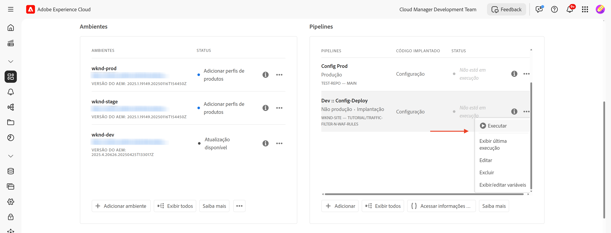

# Proteger sites do AEM com regras do WAF

Saiba como proteger sites do AEM contra ameaças sofisticadas, incluindo DoS, DDoS e abuso de bot, usando as **regras do firewall de aplicativos web (WAF, na sigla em inglês)** _recomendadas pela Adobe_ no AEM as a Cloud Service.

Os ataques sofisticados são caracterizados por altas taxas de solicitação, padrões complexos e uso de técnicas avançadas para contornar as medidas de segurança tradicionais.

>[!IMPORTANT]
>
> As regras de filtro de tráfego do WAF exigem uma licença adicional de **Proteção do WAF contra DDoS** ou **Segurança aprimorada**. As regras de filtro de tráfego padrão estão disponíveis para clientes do Sites e do Forms por padrão.


>[!VIDEO](https://video.tv.adobe.com/v/3469435/?quality=12&learn=on&captions=por_br)

## Metas de aprendizagem

- Confira as regras do WAF recomendadas pela Adobe.
- Defina, implante, teste e analise os resultados das regras.
- Entenda quando e como refinar as regras com base nos resultados.
- Saiba como usar o centro de ações do AEM para revisar os alertas gerados pelas regras.

### Visão geral da implementação

As etapas de implementação incluem:

- Adicionar as regras do WAF ao arquivo `/config/cdn.yaml` do projeto da WKND no AEM.
- Confirmar e enviar as alterações ao repositório do Git do Cloud Manager.
- Implantar as alterações no ambiente do AEM por meio do pipeline de configuração do Cloud Manager.
- Testar as regras por meio da simulação de um ataque de DDoS com o [Nikto](https://github.com/sullo/nikto/wiki).
- Analisar os resultados com os logs da CDN do AEMCS e a ferramenta do painel do ELK.

## Pré-requisitos

Antes de continuar, certifique-se de ter realizado a configuração necessária, conforme descrito no tutorial [Como configurar as regras de filtro de tráfego e do WAF](../setup.md). Além disso, certifique-se de ter clonado e implantado o [Projeto dos sites da WKND no AEM](https://github.com/adobe/aem-guides-wknd) no seu ambiente do AEM.

## Revisar e definir regras

As regras do firewall de aplicativos web (WAF, na sigla em inglês) recomendadas pela Adobe são essenciais para proteger sites do AEM contra ameaças sofisticadas, incluindo DoS, DDoS e abuso de bot. Os ataques sofisticados muitas vezes são caracterizados por altas taxas de solicitação, padrões complexos e uso de técnicas avançadas (ataques baseados no protocolo ou no conteúdo) para contornar as medidas de segurança tradicionais.

Vamos analisar três regras do WAF recomendadas que devem ser adicionadas ao arquivo `cdn.yaml` no projeto da WKND no AEM:

### &#x200B;1. Bloquear ataques de IPs maliciosos conhecidos

Esta regra **bloqueia** solicitações que pareçam suspeitas *e* que provêm de endereços IP sinalizados como maliciosos. Como ambos os critérios são satisfeitos, podemos ter a certeza de que o risco de falsos positivos (bloqueio do tráfego legítimo) é muito baixo. Os IPs maliciosos conhecidos são identificados com base em feeds de informações sobre ameaças e outras fontes.

O sinalizador do WAF `ATTACK-FROM-BAD-IP` é usado para identificar essas solicitações. Ele agrega vários sinalizadores do WAF [listados aqui](https://experienceleague.adobe.com/pt-br/docs/experience-manager-cloud-service/content/security/traffic-filter-rules-including-waf#waf-flags-list).

```yaml
kind: "CDN"
version: "1"
metadata:
  envTypes: ["dev", "stage", "prod"]
data:
  trafficFilters:
    rules:
    - name: attacks-from-bad-ips-globally
      when:
        reqProperty: tier
        in: ["author", "publish"]
      action:
        type: block
        wafFlags:
          - ATTACK-FROM-BAD-IP
```

### &#x200B;2. Registrar (e então bloquear) ataques de qualquer IP globalmente

Esta regra **registra** solicitações identificadas como possíveis ataques, mesmo que os endereços IP não sejam encontrados nos feeds de informações sobre ameaças.

O sinalizador do WAF `ATTACK` é usado para identificar essas solicitações. Semelhante ao `ATTACK-FROM-BAD-IP`, ele agrega vários sinalizadores do WAF.

Essas solicitações provavelmente são maliciosas, mas, como os endereços IP não são identificados nos feeds de informações sobre ameaças, pode ser prudente começar no modo `log` em vez de no modo de bloqueio. Analise os logs em busca de falsos positivos e, uma vez validado, **certifique-se de mudar a regra para o modo `block`**.

```yaml
...
    - name: attacks-from-any-ips-globally
      when:
        reqProperty: tier
        in: ["author", "publish"]
      action:
        type: log
        alert: true
        wafFlags:
          - ATTACK
```

Alternativamente, você pode optar por usar o modo `block` imediatamente, caso os requisitos da sua empresa não deixem nenhum espaço que possa permitir um tráfego malicioso.

Essas regras do WAF recomendadas fornecem uma camada adicional de segurança contra ameaças conhecidas e emergentes.


## Migrar para as regras do WAF recomendadas pela Adobe mais recentes

Antes da introdução dos sinalizadores do WAF `ATTACK-FROM-BAD-IP` e `ATTACK` (em julho de 2025), as regras do WAF recomendadas eram as mostradas abaixo. Elas continham uma lista de sinalizadores do WAF específicos para bloquear solicitações que correspondessem a determinados critérios, como `SANS`, `TORNODE`, `NOUA` etc.

```yaml
...
data:
  trafficFilters:
    rules:
    ...
    # Enable WAF protections (only works if WAF is enabled for your environment)
      - name: block-waf-flags
        when:
          reqProperty: tier
          matches: "author|publish"
        action:
          type: block
          wafFlags:
            - SANS
            - TORNODE
            - NOUA
            - SCANNER
            - USERAGENT
            - PRIVATEFILE
            - ABNORMALPATH
            - TRAVERSAL
            - NULLBYTE
            - BACKDOOR
            - LOG4J-JNDI
            - SQLI
            - XSS
            - CODEINJECTION
            - CMDEXE
            - NO-CONTENT-TYPE
            - UTF8
...
```

A regra acima ainda é válida, mas é recomendável migrar para as novas regras, que usam os sinalizadores do WAF `ATTACK-FROM-BAD-IP` e `ATTACK`, _caso você ainda não tenha personalizado o `wafFlags` para suprir as necessidades da sua empresa_.

Você pode migrar para as novas regras a fim de manter a consistência com as práticas recomendadas, seguindo estas etapas:

- Revise as regras do WAF existentes no arquivo `cdn.yaml`, que podem ser semelhantes ao exemplo acima. Confirme que não há nenhuma personalização do `wafFlags` específica para as necessidades da sua empresa.

- Substitua as regras do WAF existentes pelas novas regras do WAF recomendadas pela Adobe, que usam os sinalizadores `ATTACK-FROM-BAD-IP` e `ATTACK`. Certifique-se de que todas as regras estejam no modo de bloqueio.

Se você tiver personalizado o `wafFlags` anteriormente, ainda será possível migrar para essas novas regras, mas faça isso com cuidado, certificando-se de que qualquer personalização seja transferida para as regras revisadas.

A migração deve ajudar a simplificar as suas regras do WAF e, ao mesmo tempo, fornecer uma proteção robusta contra ameaças sofisticadas. As novas regras foram projetadas para ser mais eficazes e fáceis de gerenciar.


## Implantar regras

Para implantar as regras acima, siga estas etapas:

- Confirme e envie as alterações ao repositório do Git do Cloud Manager.

- Implante as alterações no ambiente do AEM, usando o pipeline de configuração do Cloud Manager [criado anteriormente](../setup.md#deploy-rules-using-adobe-cloud-manager).

  

## Testar regras

Para confirmar a eficácia das regras do WAF, simule um ataque com o [Nikto](https://github.com/sullo/nikto), um verificador de servidor web que detecta vulnerabilidades e configurações incorretas. O comando a seguir aciona ataques de injeção de SQL no site da WKND no AEM, que é protegido pelas regras do WAF.

```shell
$./nikto.pl -useragent "AttackSimulationAgent (Demo/1.0)" -D V -Tuning 9 -ssl -h https://publish-pXXXX-eYYYY.adobeaemcloud.com/us/en.html
```


Para saber mais sobre a simulação de ataques, consulte a documentação [Nikto: sintonização da varredura](https://github.com/sullo/nikto/wiki/Scan-Tuning), que informa como especificar os tipos de ataque de teste a serem incluídos ou excluídos.

## Revisar alertas

Os alertas são gerados quando as regras de filtro de tráfego são acionadas. Você pode revisar esses alertas no [Centro de ações do AEM](https://experience.adobe.com/aem/actions-center).


## Analisar resultados

Para analisar os resultados das regras de filtro de tráfego, você pode usar os logs da CDN do AEMCS e a ferramenta do painel do ELK. Siga as instruções da seção de configuração [Assimilação de logs da CDN](../setup.md#ingest-cdn-logs) para assimilar os logs da CDN na pilha do ELK.

Na captura de tela a seguir, você pode ver os logs da CDN do ambiente de desenvolvimento do AEM assimilados na pilha do ELK.


Dentro do aplicativo do ELK, o **Painel do WAF** deve mostrar as solicitações sinalizadas e os valores correspondentes nas colunas de IP do cliente (cli_ip), host, URL, ação (waf_action) e nome da regra (waf_match).


Além disso, os painéis **Distribuição de sinalizadores do WAF** e **Principais ataques** mostram detalhes adicionais.


### Integração com o Splunk

Clientes que têm o [encaminhamento do log do Splunk habilitado](https://experienceleague.adobe.com/pt-br/docs/experience-manager-cloud-service/content/implementing/developing/logging#splunk-logs) podem criar novos painéis para analisar os padrões de tráfego.

Para criar painéis no Splunk, siga as etapas em [Painéis do Splunk para análise de log da CDN do AEMCS](https://github.com/adobe/AEMCS-CDN-Log-Analysis-Tooling/blob/main/Splunk/README.md#splunk-dashboards-for-aemcs-cdn-log-analysis).

## Quando e como refinar as regras

O seu objetivo é evitar o bloqueio do tráfego legítimo e, ao mesmo tempo, proteger os sites do AEM contra ameaças sofisticadas. As regras do WAF recomendadas foram projetadas para ser um ponto de partida para a sua estratégia de segurança.

Para refinar as regras, considere as seguintes etapas:

- **Monitorar padrões de tráfego**: use os logs da CDN e o painel do ELK para monitorar padrões de tráfego e identificar quaisquer anomalias ou picos no tráfego. Preste atenção aos painéis _Distribuição de sinalizadores do WAF_ e _Principais ataques_ no painel do ELK para entender os tipos de ataque que estão sendo detectados.
- **Ajustar wafFlags**: se os sinalizadores `ATTACK` estiverem sendo acionados com muita frequência ou
se for necessário ajustar o vetor de ataque, você poderá criar regras personalizadas com sinalizadores do WAF específicos. Confira uma lista completa de [sinalizadores do WAF](https://experienceleague.adobe.com/pt-br/docs/experience-manager-cloud-service/content/security/traffic-filter-rules-including-waf#waf-flags-list) na documentação. Primeiro, considere experimentar novas regras personalizadas no modo `log`.
- **Passar para regras de bloqueio**: depois de validar os padrões de tráfego e ajustar os sinalizadores do WAF, você pode considerar passar para as regras de bloqueio.

## Resumo

Neste tutorial, você aprendeu a proteger sites do AEM contra ameaças sofisticadas, incluindo DoS, DDoS e abuso de bot, usando as regras do firewall de aplicativos web (WAF, na sigla em inglês) recomendadas pela Adobe.

## Casos de uso: além das regras padrão

Para casos mais avançados, você pode explorar os seguintes casos de uso, que demonstram como implementar regras de filtro de tráfego personalizadas com base em requisitos específicos da empresa:

<!-- CARDS
{target = _self}

* ../how-to/request-logging.md

* ../how-to/request-blocking.md

* ../how-to/request-transformation.md
-->
<!-- START CARDS HTML - DO NOT MODIFY BY HAND -->
<div class="columns">
    <div class="column is-half-tablet is-half-desktop is-one-third-widescreen" aria-label="Monitoring sensitive requests">
        <div class="card" style="height: 100%; display: flex; flex-direction: column; height: 100%;">
            <div class="card-image">
                <figure class="image x-is-16by9">
                    <a href="../how-to/request-logging.md" title="Monitorar solicitações sensíveis" target="_self" rel="referrer">
                        
                    </a>
                </figure>
            </div>
            <div class="card-content is-padded-small" style="display: flex; flex-direction: column; flex-grow: 1; justify-content: space-between;">
                <div class="top-card-content">
                    <p class="headline is-size-6 has-text-weight-bold">
                        <a href="../how-to/request-logging.md" target="_self" rel="referrer" title="Monitorar solicitações sensíveis">Monitorar solicitações sensíveis</a>
                    </p>
                    <p class="is-size-6">Saiba como monitorar solicitações sensíveis, registrando-as com regras de filtro de tráfego no AEM as a Cloud Service.</p>
                </div>
                <a href="../how-to/request-logging.md" target="_self" rel="referrer" class="spectrum-Button spectrum-Button--outline spectrum-Button--primary spectrum-Button--sizeM" style="align-self: flex-start; margin-top: 1rem;">
                    <span class="spectrum-Button-label has-no-wrap has-text-weight-bold">Saiba mais</span>
                </a>
            </div>
        </div>
    </div>
    <div class="column is-half-tablet is-half-desktop is-one-third-widescreen" aria-label="Restricting access">
        <div class="card" style="height: 100%; display: flex; flex-direction: column; height: 100%;">
            <div class="card-image">
                <figure class="image x-is-16by9">
                    <a href="../how-to/request-blocking.md" title="Restringir o acesso" target="_self" rel="referrer">
                        
                    </a>
                </figure>
            </div>
            <div class="card-content is-padded-small" style="display: flex; flex-direction: column; flex-grow: 1; justify-content: space-between;">
                <div class="top-card-content">
                    <p class="headline is-size-6 has-text-weight-bold">
                        <a href="../how-to/request-blocking.md" target="_self" rel="referrer" title="Restringir o acesso">Restringir o acesso</a>
                    </p>
                    <p class="is-size-6">Saiba como restringir o acesso, bloqueando solicitações específicas com regras de filtro de tráfego no AEM as a Cloud Service.</p>
                </div>
                <a href="../how-to/request-blocking.md" target="_self" rel="referrer" class="spectrum-Button spectrum-Button--outline spectrum-Button--primary spectrum-Button--sizeM" style="align-self: flex-start; margin-top: 1rem;">
                    <span class="spectrum-Button-label has-no-wrap has-text-weight-bold">Saiba mais</span>
                </a>
            </div>
        </div>
    </div>
    <div class="column is-half-tablet is-half-desktop is-one-third-widescreen" aria-label="Normalizing requests">
        <div class="card" style="height: 100%; display: flex; flex-direction: column; height: 100%;">
            <div class="card-image">
                <figure class="image x-is-16by9">
                    <a href="../how-to/request-transformation.md" title="Normalizar solicitações" target="_self" rel="referrer">
                        
                    </a>
                </figure>
            </div>
            <div class="card-content is-padded-small" style="display: flex; flex-direction: column; flex-grow: 1; justify-content: space-between;">
                <div class="top-card-content">
                    <p class="headline is-size-6 has-text-weight-bold">
                        <a href="../how-to/request-transformation.md" target="_self" rel="referrer" title="Normalizar solicitações">Normalizar solicitações</a>
                    </p>
                    <p class="is-size-6">Saiba como normalizar solicitações, transformando-as com regras de filtro de tráfego no AEM as a Cloud Service.</p>
                </div>
                <a href="../how-to/request-transformation.md" target="_self" rel="referrer" class="spectrum-Button spectrum-Button--outline spectrum-Button--primary spectrum-Button--sizeM" style="align-self: flex-start; margin-top: 1rem;">
                    <span class="spectrum-Button-label has-no-wrap has-text-weight-bold">Saiba mais</span>
                </a>
            </div>
        </div>
    </div>
</div>
<!-- END CARDS HTML - DO NOT MODIFY BY HAND -->

## Recursos adicionais

- [Regras iniciais recomendadas](https://experienceleague.adobe.com/pt-br/docs/experience-manager-cloud-service/content/security/traffic-filter-rules-including-waf#recommended-nonwaf-starter-rules)
- [Lista de sinalizadores do WAF](https://experienceleague.adobe.com/pt-br/docs/experience-manager-cloud-service/content/security/traffic-filter-rules-including-waf#waf-flags-list)
