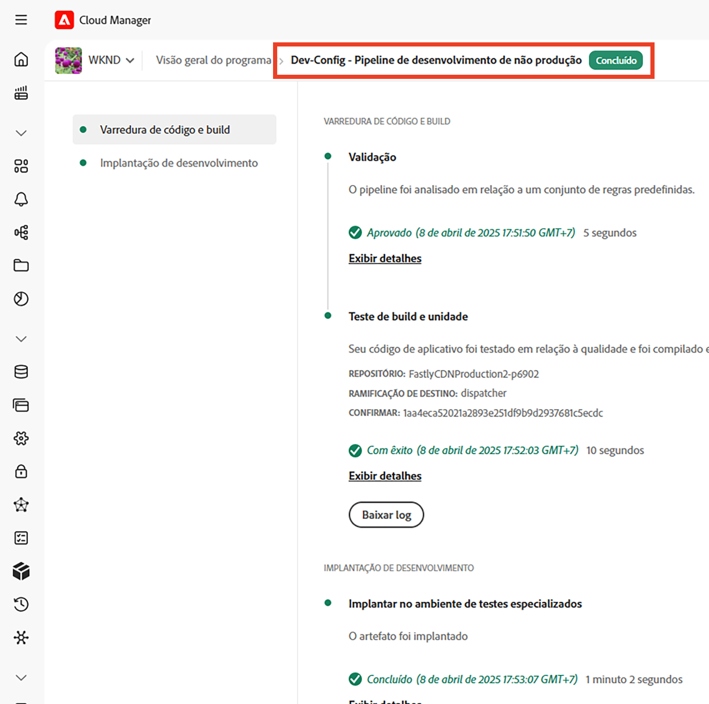
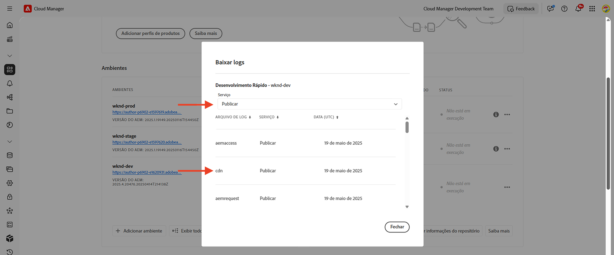
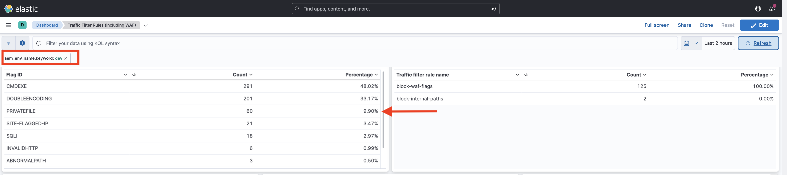

# Exemplos e análise de resultados de regras de filtro de tráfego, incluindo regras do WAF

Saiba como declarar vários tipos de regras de filtro de tráfego e analisar os resultados usando logs de CDN e ferramentas de painel do Adobe Experience Manager as a Cloud Service (AEMCS).

Nesta seção, você explorará exemplos práticos de regras de filtro de tráfego, incluindo regras do WAF. Você aprenderá a registrar, permitir e bloquear solicitações com base no URI (ou caminho), endereço IP, número de solicitações e diferentes tipos de ataques usando o [Projeto do AEM WKND Sites](https://github.com/adobe/aem-guides-wknd#aem-wknd-sites-project).

Além disso, você descobrirá como usar ferramentas de painel de controle que assimilam logs de CDN do AEM CS para visualizar métricas essenciais por meio de painéis de amostra fornecidos pela Adobe.

Para se alinhar aos seus requisitos específicos, você pode aprimorar e criar painéis personalizados, obtendo assim insights mais profundos e otimizando as configurações de regras para seus sites do AEM.

>[!VIDEO](https://video.tv.adobe.com/v/3425404?quality=12&learn=on)

## Exemplos

Vamos explorar vários exemplos de regras de filtro de tráfego, incluindo regras do WAF. Verifique se você concluiu o processo de configuração necessário, conforme descrito no capítulo [como configurar](./how-to-setup.md) anterior, e se você clonou o [Projeto do AEM WKND Sites](https://github.com/adobe/aem-guides-wknd#aem-wknd-sites-project).

### Registrando solicitações

Comece com **solicitações de logon e logout dos caminhos de logon e logout da WKND** no serviço de Publicação do AEM.

- Adicione a seguinte regra ao arquivo `/config/cdn.yaml` do projeto WKND.

```yaml
kind: CDN
version: '1'
metadata:
  envTypes:
    - dev
    - stage
    - prod
data:
  trafficFilters:
    rules:
    # On AEM Publish service log WKND Login and Logout requests
      - name: publish-auth-requests
        when:
          allOf:
            - reqProperty: tier
              matches: publish
            - reqProperty: path
              in:
                - /system/sling/login/j_security_check
                - /system/sling/logout
        action: log
```

- Confirme e envie as alterações para o repositório Git do Cloud Manager.

- Implante as alterações no ambiente de Desenvolvimento do AEM usando o pipeline de configuração [ do Cloud Manager `Dev-Config` criado anteriormente](how-to-setup.md#deploy-rules-through-cloud-manager).

  

- Teste a regra entrando e saindo do site WKND do programa no serviço de Publicação (por exemplo, `https://publish-pXXXX-eYYYY.adobeaemcloud.com/us/en.html`). Você pode usar `asmith/asmith` como nome de usuário e senha.

  

#### Análise{#analyzing}

Vamos analisar os resultados da regra `publish-auth-requests` baixando os logs de CDN do AEMCS da Cloud Manager e usando a [ferramenta de painel](how-to-setup.md#analyze-results-using-elk-dashboard-tool), que você configurou no capítulo anterior.

- No cartão **Ambientes** do [Cloud Manager](https://my.cloudmanager.adobe.com/), baixe os logs de CDN do serviço AEMCS **Publicar**.

  

  >[!TIP]
  >
  >    Pode levar até 5 minutos para que as novas solicitações apareçam nos logs de CDN.

- Copie o arquivo de log baixado (por exemplo, `publish_cdn_2023-10-24.log` na captura de tela abaixo) na pasta `logs/dev` do projeto da ferramenta de painel Elastic.

  {width="800" zoomable="yes"}

- Atualize a página da ferramenta Elastic dashboard.
   - Na seção superior **Filtro global**, edite o filtro `aem_env_name.keyword` e selecione o valor de ambiente `dev`.

     

   - Para alterar o intervalo de tempo, clique no ícone de calendário no canto superior direito e selecione o intervalo de tempo desejado.

     

- Revise os painéis **Solicitações analisadas**, **Solicitações sinalizadas** e **Detalhes das solicitações sinalizadas** do painel atualizado. Para entradas de log CDN correspondentes, ele deve mostrar os valores de IP do cliente (cli_ip), host, url, ação (waf_action) e nome da regra (waf_match) de cada entrada.

  


### Bloquear solicitações

Neste exemplo, vamos adicionar uma página em uma pasta _interna_ no caminho `/content/wknd/internal` no projeto WKND implantado. Em seguida, declare uma regra de filtro de tráfego que **bloqueie o tráfego** para subpáginas de qualquer lugar que não seja um endereço IP especificado que corresponda à sua organização (por exemplo, uma VPN corporativa).

Você pode criar sua própria página interna (por exemplo, `demo-page.html`) ou usar o [pacote anexado](./assets/demo-internal-pages-package.zip).

- Adicionar a seguinte regra no arquivo `/config/cdn.yaml` do projeto WKND:

```yaml
kind: CDN
version: '1'
metadata:
  envTypes:
    - dev
    - stage
    - prod
data:
  trafficFilters:
    rules:
    ...

    # Block requests to (demo) internal only page/s from public IP address but allow from internal IP address.
    # Make sure to replace the IP address with your own IP address.
      - name: block-internal-paths
        when:
          allOf:
            - reqProperty: path
              matches: /content/wknd/internal
            - reqProperty: clientIp
              notIn: [192.150.10.0/24]
        action: block
```

- Confirme e envie as alterações para o repositório Git do Cloud Manager.

- Implante as alterações no ambiente de Desenvolvimento do AEM usando o pipeline de configuração [criado anteriormente](how-to-setup.md#deploy-rules-through-cloud-manager) `Dev-Config` no Cloud Manager.

- Teste a regra acessando a página interna do site WKND, por exemplo `https://publish-pXXXX-eYYYY.adobeaemcloud.com/content/wknd/internal/demo-page.html`, ou usando o comando CURL abaixo:

  ```bash
  $ curl -I https://publish-pXXXX-eYYYY.adobeaemcloud.com/content/wknd/internal/demo-page.html
  ```

- Repita a etapa acima a partir do endereço IP usado na regra e de um endereço IP diferente (por exemplo, usando seu celular).

#### Análise

Para analisar os resultados da regra `block-internal-paths`, siga as mesmas etapas descritas no [exemplo anterior](#analyzing).

No entanto, desta vez você deve ver as **Solicitações bloqueadas** e os valores correspondentes nas colunas de IP do cliente (cli_ip), host, URL, ação (waf_action) e nome da regra (waf_match).


### Impedir ataques de DoS

Vamos **impedir ataques de DoS** bloqueando solicitações de um endereço IP fazendo 100 solicitações por segundo, fazendo com que ele seja bloqueado por 5 minutos.

- Adicione a seguinte [regra de filtro de limite de taxa](https://experienceleague.adobe.com/docs/experience-manager-cloud-service/content/security/traffic-filter-rules-including-waf.html#ratelimit-structure) no arquivo `/config/cdn.yaml` do projeto WKND.

```yaml
kind: CDN
version: '1'
metadata:
  envTypes:
    - dev
    - stage
    - prod
data:
  trafficFilters:
    rules:
    ...
    #  Prevent DoS attacks by blocking client for 5 minutes if they make more than 100 requests in 1 second.
      - name: prevent-dos-attacks
        when:
          reqProperty: path
          like: '*'
        rateLimit:
          limit: 100
          window: 1
          penalty: 300
          groupBy:
            - reqProperty: clientIp
        action: block
```

>[!WARNING]
>
>Para seu ambiente de produção, colabore com sua equipe de Segurança da Web para determinar os valores apropriados para `rateLimit`,

- Confirme, envie por push e implante alterações conforme mencionado nos [exemplos anteriores](#logging-requests).

- Para simular o ataque de DoS, use o seguinte comando [Vegeta](https://github.com/tsenart/vegeta).

  ```shell
  $ echo "GET https://publish-pXXXX-eYYYY.adobeaemcloud.com/us/en.html" | vegeta attack -rate=120 -duration=60s | vegeta report
  ```

  Esse comando faz 120 solicitações por 5 segundos e gera um relatório. Como você pode ver, a taxa de sucesso é de 32,5%; um código de resposta HTTP 406 é recebido para o restante, demonstrando que o tráfego foi bloqueado.

  

#### Análise

Para analisar os resultados da regra `prevent-dos-attacks`, siga as mesmas etapas descritas no [exemplo anterior](#analyzing).

Desta vez você deve ver muitas **solicitações bloqueadas** e valores correspondentes nas colunas de IP do cliente (cli_ip), host, url, ação (waf_action) e nome-da-regra (waf_match).


Além disso, os **100 principais ataques por IP do cliente, país e agente-usuário** painéis mostram detalhes adicionais, que podem ser usados para otimizar ainda mais a configuração de regras.


Para obter mais informações sobre como evitar ataques de DoS e DDoS, consulte o [tutorial Bloqueio de ataques de DoS e DDoS usando regras de filtro de tráfego](../blocking-dos-attack-using-traffic-filter-rules.md).

### Regras do WAF

Os exemplos de regra de filtro de tráfego até o momento podem ser configurados por todos os clientes do Sites e do Forms.

A seguir, vamos explorar a experiência de um cliente que adquiriu uma licença de Segurança aprimorada ou Proteção WAF-DDoS, que permite configurar regras avançadas para proteger sites de ataques mais sofisticados.

Antes de continuar, habilite a Proteção WAF-DDoS para o seu programa, conforme descrito na documentação de regras de filtro de tráfego [etapas de configuração](https://experienceleague.adobe.com/docs/experience-manager-cloud-service/content/security/traffic-filter-rules-including-waf.html?lang=en#setup).

#### Sem WAFFlags

Vamos ver a experiência antes mesmo de as regras do WAF serem declaradas. Quando o WAF-DDoS está ativado em seu programa, o CDN registra, por padrão, quaisquer correspondências de tráfego mal-intencionado, para que você tenha as informações certas para criar as regras apropriadas.

Vamos começar atacando o site WKND sem adicionar uma regra do WAF (ou usando a propriedade `wafFlags`) e analisar os resultados.

- Para simular um ataque, use o comando [Nikto](https://github.com/sullo/nikto) abaixo, que envia cerca de 700 solicitações mal-intencionadas em 6 minutos.

  ```shell
  $ ./nikto.pl -useragent "AttackSimulationAgent (Demo/1.0)" -D V -Tuning 9 -ssl -h https://publish-pXXXX-eYYYY.adobeaemcloud.com/us/en.html
  ```

  

  Para saber mais sobre a simulação de ataque, reveja a documentação [Nikto - Scan Tuning](https://github.com/sullo/nikto/wiki/Scan-Tuning), que informa como especificar o tipo de ataques de teste a serem incluídos ou excluídos.

##### Análise

Para analisar os resultados da simulação de ataque, siga as mesmas etapas descritas no [exemplo anterior](#analyzing).

No entanto, desta vez você deve ver as **solicitações sinalizadas** e os valores correspondentes nas colunas de IP do cliente (cli_ip), host, url, ação (waf_action) e nome-da-regra (waf_match). Essas informações permitem analisar os resultados e otimizar a configuração da regra.


Observe como os painéis **Distribuição de sinalizadores do WAF** e **Principais ataques** mostram detalhes adicionais que podem ser usados para otimizar ainda mais a configuração da regra.


#### Com WAFFlags

Agora vamos adicionar uma regra do WAF que contém a propriedade `wafFlags` como parte da propriedade `action` e **bloquear as solicitações de ataque simuladas**.

De uma perspectiva de sintaxe, as regras WAF são semelhantes àquelas vistas anteriormente, no entanto, a propriedade `action` faz referência a um ou mais valores `wafFlags`. Para saber mais sobre `wafFlags`, reveja a seção [Lista de Sinalizadores do WAF](https://experienceleague.adobe.com/docs/experience-manager-cloud-service/content/security/traffic-filter-rules-including-waf.html#waf-flags-list).

- Adicione a seguinte regra no arquivo `/config/cdn.yaml` do projeto WKND. Observe como a regra `block-waf-flags` inclui alguns dos wafFlags que apareciam na ferramenta do painel quando atacados com tráfego mal-intencionado simulado. Na verdade, é uma boa prática ao longo do tempo analisar registros para determinar quais novas regras devem ser declaradas, à medida que o cenário de ameaças evolui.

```yaml
kind: CDN
version: '1'
metadata:
  envTypes:
    - dev
    - stage
    - prod
data:
  trafficFilters:
    rules:
    ...
    # Enable WAF protections (only works if WAF is enabled for your environment)
      - name: block-waf-flags
        when:
          reqProperty: tier
          matches: "author|publish"
        action:
          type: block
          wafFlags:
            - SANS
            - TORNODE
            - NOUA
            - SCANNER
            - USERAGENT
            - PRIVATEFILE
            - ABNORMALPATH
            - TRAVERSAL
            - NULLBYTE
            - BACKDOOR
            - LOG4J-JNDI
            - SQLI
            - XSS
            - CODEINJECTION
            - CMDEXE
            - NO-CONTENT-TYPE
            - UTF8
```

- Confirme, envie por push e implante alterações conforme mencionado nos [exemplos anteriores](#logging-requests).

- Para simular um ataque, use o mesmo comando [Nikto](https://github.com/sullo/nikto) de antes.

  ```shell
  $ ./nikto.pl -useragent "AttackSimulationAgent (Demo/1.0)" -D V -Tuning 9 -ssl -h https://publish-pXXXX-eYYYY.adobeaemcloud.com/us/en.html
  ```

##### Análise

Repita as mesmas etapas descritas no [exemplo anterior](#analyzing).

Desta vez, você deve ver entradas em **Solicitações bloqueadas** e os valores correspondentes nas colunas de IP do cliente (cli_ip), host, url, ação (waf_action) e nome da regra (waf_match).


Além disso, os painéis **Distribuição de sinalizadores do WAF** e **Principais ataques** mostram detalhes adicionais.




### Análise abrangente

Nas seções de _análise_ acima, você aprendeu a analisar os resultados de regras específicas usando a ferramenta de painel. Você pode explorar ainda mais a análise dos resultados usando outros painéis de painel, incluindo:


- Solicitações analisadas, sinalizadas e bloqueadas
- Distribuição dos sinalizadores do WAF ao longo do tempo
- Regras de filtro de tráfego acionadas ao longo do tempo
- Principais ataques por ID de sinalizador do WAF
- Filtro de tráfego mais acionado
- Os 100 principais invasores por IP de cliente, país e agente-usuário


## Próxima etapa

Familiarize-se com as [práticas recomendadas](./best-practices.md) para reduzir o risco de violações de segurança.

## Recursos adicionais

[Sintaxe das regras de filtro de tráfego](https://experienceleague.adobe.com/docs/experience-manager-cloud-service/content/security/traffic-filter-rules-including-waf.html#rules-syntax)

[Formato de Log da CDN](https://experienceleague.adobe.com/docs/experience-manager-cloud-service/content/security/traffic-filter-rules-including-waf.html#cdn-log-format)

