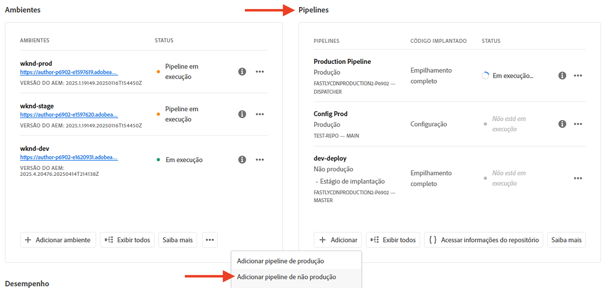
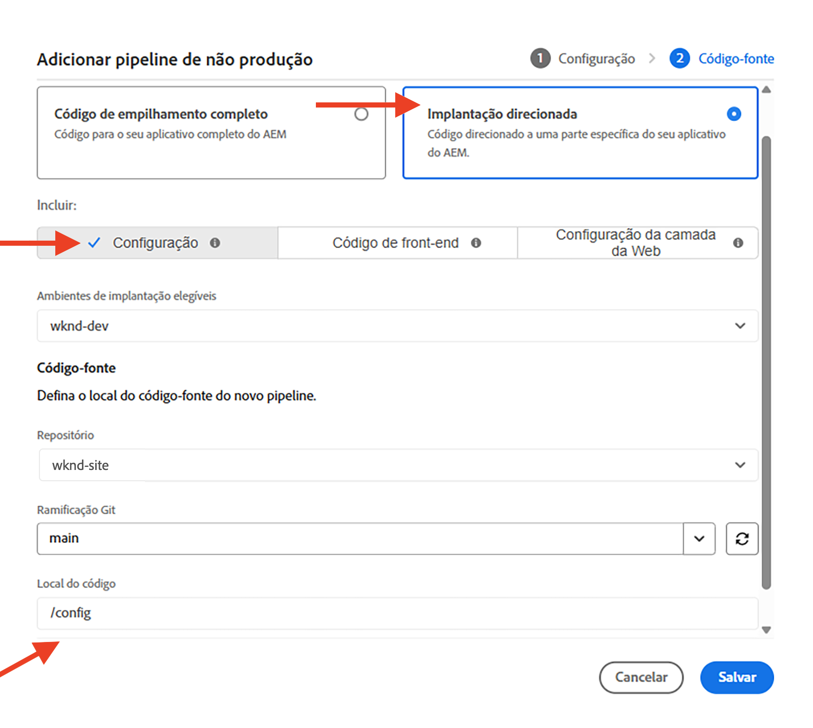

# Como configurar regras de filtro de tráfego, incluindo regras de WAF

Saiba **como configurar** regras de filtro de tráfego, incluindo regras de WAF. Saiba mais sobre como criar, implantar, testar e analisar resultados.

>[!VIDEO](https://video.tv.adobe.com/v/3425407?quality=12&learn=on)

## Configurar

O processo de configuração envolve o seguinte:

- _criar regras_ com uma estrutura de projeto e um arquivo de configuração apropriados do AEM.
- _implantar regras_ com o pipeline de configuração do Adobe Cloud Manager.
- _testar regras_ com várias ferramentas para gerar tráfego.
- _Analisar os resultados_ com logs da CDN e ferramentas do painel do AEMCS.

### Criar regras no seu projeto do AEM

Para criar regras, siga estas etapas:

1. No nível superior do seu projeto do AEM, crie uma pasta `config`.

1. Na pasta `config`, crie um novo arquivo chamado `cdn.yaml`.

1. Adicione os seguintes metadados ao arquivo `cdn.yaml`:

```yaml
kind: CDN
version: '1'
metadata:
  envTypes:
    - dev
    - stage
    - prod
data:
  trafficFilters:
    rules:
```

Veja um exemplo do arquivo `cdn.yaml` no projeto de site da WKND nos guias do AEM:

{width="800" zoomable="yes"}

### Implantar regras por meio do Cloud Manager {#deploy-rules-through-cloud-manager}

Para implantar as regras, siga estas etapas:

1. Faça logon no Cloud Manager em [my.cloudmanager.adobe.com](https://my.cloudmanager.adobe.com/) e selecione a organização e o programa apropriados.

1. Navegue até o cartão _Pipelines_ na página _Visão geral do programa_, clique no botão **+Adicionar** e selecione o pipeline desejado.

   

   No exemplo acima, _Adicionar pipeline de não produção_ está selecionado para fins de demonstração, pois um ambiente de desenvolvimento está sendo usado.

1. Na caixa de diálogo _Adicionar pipeline de não produção_, escolha e insira os seguintes detalhes:

   1. Etapa de configuração:

      - **Tipo**: pipeline de implantação
      - **Nome do pipeline**: Dev-Config

      

   2. Etapa do código-fonte:

      - **Código a ser implantado**: implantação direcionada
      - **Inclua**: Config
      - **Ambiente de implantação**: nome do seu ambiente, por exemplo, wknd-program-dev.
      - **Repositório**: o repositório do Git de onde o pipeline deve recuperar o código; por exemplo, `wknd-site`
      - **Ramificação do Git**: o nome da ramificação do repositório do Git.
      - **Localização do código**: `/config` correspondente à pasta de configuração de nível superior criada na etapa anterior.

      

### Testar regras por meio da geração de tráfego

Para testar as regras, há várias ferramentas de terceiros disponíveis, e pode ser que sua organização tenha uma ferramenta preferencial. Para fins de demonstração, usaremos as seguintes ferramentas:

- [Curl](https://curl.se/) para testes básicos, como invocar um URL e verificar o código de resposta.

- [Vegeta](https://github.com/tsenart/vegeta) para executar uma negação de serviço (DOS). Siga as instruções de instalação no [GitHub do Vegeta](https://github.com/tsenart/vegeta#install).

- [Nikto](https://github.com/sullo/nikto/wiki) para encontrar possíveis problemas e vulnerabilidades de segurança, como XSS, injeção de SQL, entre outros. Siga as instruções de instalação no [GitHub do Nikto](https://github.com/sullo/nikto).

- Verifique se as ferramentas estão instaladas e disponíveis no terminal executando os comandos abaixo:

  ```shell
  # Curl version check
  $ curl --version
  
  # Vegeta version check
  $ vegeta -version
  
  # Nikto version check
  $ cd <PATH-OF-CLONED-REPO>/program
  ./nikto.pl -Version
  ```

### Analisar resultados com a ferramenta do painel

Depois de criar, implantar e testar as regras, você pode analisar os resultados com os logs da **CDN** e o **AEMCS-CDN-Log-Analysis-Tooling**. Essas ferramentas fornecem um conjunto de painéis para visualizar os resultados da pilha Splunk e ELK (Elasticsearch, Logstash e Kibana).

As ferramentas podem ser clonadas do repositório do GitHub [AEMCS-CDN-Log-Analysis-Tooling](https://github.com/adobe/AEMCS-CDN-Log-Analysis-Tooling). Em seguida, siga as instruções para instalar e carregar o **Painel de tráfego da CDN** e o **Painel do WAF** para a sua ferramenta de observação preferida.

Neste tutorial, vamos usar a pilha ELK. Siga as instruções em [Container do ELK Docker para análise de log da CDN do AEMCS](https://github.com/adobe/AEMCS-CDN-Log-Analysis-Tooling/blob/main/ELK/README.md) para configurar a pilha ELK.

- Depois de carregar o painel de amostra, a página de ferramenta do painel Elastic deve ser semelhante à seguinte:

  

>[!NOTE]
>
>    Como ainda não há nenhum log da CDN do AEMCS assimilado, o painel está em branco.


## Próxima etapa

Saiba como declarar regras de filtro de tráfego, incluindo regras do WAF, no capítulo [Exemplos e análise de resultados](./examples-and-analysis.md), usando o projeto de site da WKND do AEM.
