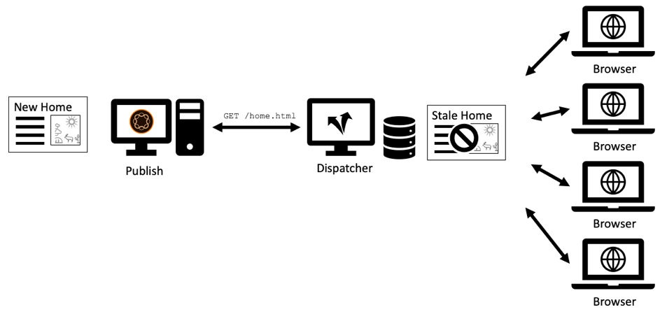

# Capítulo 1 - Conceitos, padrões e antipadrões do Dispatcher

## Visão geral

Este capítulo fornece uma breve introdução sobre a história e a mecânica do Dispatcher e discute como isso influencia a forma como um desenvolvedor do AEM projetaria seus componentes.

## Por que os desenvolvedores devem se preocupar com a infraestrutura

O Dispatcher é uma parte essencial da maioria das instalações do AEM, se não todas. Você pode encontrar muitos artigos online que discutem como configurar o Dispatcher, bem como dicas e truques.

No entanto, esses pedaços e informações sempre começam em um nível muito técnico - supondo que você já saiba o que deseja fazer e, portanto, forneça apenas detalhes sobre como alcançar o que deseja. Nunca encontramos nenhum documento conceitual descrevendo o _o que é e por que é_ quando se trata do que você pode ou não fazer com o dispatcher.

### Antirpadrão: Dispatcher como um pensamento

Essa falta de informações básicas leva a uma série de antipadrões que vimos em vários projetos do AEM:

1. Como o Dispatcher é instalado no servidor Web Apache, é tarefa dos &quot;deuses Unix&quot; no projeto configurá-lo. Um &quot;desenvolvedor java mortal&quot; não precisa se preocupar com ele.

2. O desenvolvedor do Java precisa garantir que seu código funcione... o dispatcher posteriormente o tornará magicamente rápido. O dispatcher sempre é um pensamento. No entanto, isso não está funcionando. Um desenvolvedor deve projetar seu código pensando no dispatcher. E ele precisa conhecer seus conceitos básicos para fazer isso.

### &quot;Primeiro faça funcionar - depois faça rápido&quot;, nem sempre está certo

Você pode ter ouvido os conselhos de programação _&quot;Primeiro, faça isso funcionar - depois faça rápido.&quot;_. Não é totalmente errado. No entanto, sem o contexto correto, tende a ser mal interpretado e não aplicado corretamente.

O conselho deve impedir que o desenvolvedor otimize o código prematuramente, que pode nunca ser executado - ou é executado tão raramente, que uma otimização não teria um impacto suficiente para justificar o esforço sendo colocado na otimização. Além disso, a otimização poderia levar a um código mais complexo e, portanto, introduzir erros. Portanto, se você for desenvolvedor, não gaste muito tempo com a microotimização de cada linha de código. Certifique-se de escolher as estruturas de dados, algoritmos e bibliotecas certos e aguarde a análise de um ponto de acesso do criador de perfis para ver onde uma otimização mais completa poderia aumentar o desempenho geral.

### Decisões e artefatos arquitetônicos

No entanto, o conselho &quot;Primeiro faça funcionar - depois faça rápido&quot; é totalmente errado quando se trata de decisões &quot;arquitetônicas&quot;. Quais são as decisões arquitetônicas? Simplificando, são as decisões que são caras, difíceis e/ou impossíveis de mudar posteriormente. Lembre-se que &quot;caro&quot; às vezes é o mesmo que &quot;impossível&quot;.  Por exemplo, quando seu projeto está acabando com o orçamento, mudanças caras são impossíveis de implementar. As mudanças infraestruturais no são o primeiro tipo de mudanças nessa categoria que vêm à mente da maioria das pessoas. Mas há também outro tipo de artefatos &quot;arquitetônicos&quot; que podem se tornar muito desagradáveis para mudar:

1. Partes de código no &quot;centro&quot; de um aplicativo, das quais muitas outras partes dependem. Para alterá-las, é necessário alterar e testar novamente todas as dependências ao mesmo tempo.

2. Artefatos, que estão envolvidos em algum cenário assíncrono e dependente do tempo em que a entrada - e, portanto, o comportamento do sistema pode variar muito aleatoriamente. As alterações podem ter efeitos imprevisíveis e podem ser difíceis de testar.

3. Padrões de software que são usados e reutilizados repetidamente, em todas as peças e partes do sistema. Se o padrão de software for sub-ideal, todos os artefatos que usam o padrão precisam ser recodificados.

Lembrar? Além dessa página, informamos que o Dispatcher é uma parte essencial de um aplicativo do AEM. O acesso a uma aplicação web é muito aleatório - os usuários estão chegando e chegando em momentos imprevisíveis. No final - todo o conteúdo será (ou deverá) armazenado em cache no Dispatcher. Então, se você prestasse muita atenção, poderia ter percebido que o armazenamento em cache poderia ser visto como um artefato &quot;arquitetônico&quot; e, portanto, deveria ser entendido por todos os membros da equipe, desenvolvedores e administradores, da mesma forma.

Não estamos dizendo que um desenvolvedor deveria realmente configurar o Dispatcher. Eles precisam conhecer os conceitos - especialmente os limites - para garantir que seu código possa ser aproveitado pelo Dispatcher também.

O Dispatcher não melhora magicamente a velocidade do código. Um desenvolvedor precisa criar seus componentes com o Dispatcher em mente. Portanto, ele precisa saber como funciona.

## Cache do Dispatcher - Princípios básicos

### Dispatcher como Http de Cache - Balanceador de Carga

O que é o Dispatcher e por que ele é chamado de &quot;Dispatcher&quot; em primeiro lugar?

O Dispatcher é

* Primeiro e acima de tudo um cache

* Um proxy reverso

* Um módulo para o servidor Web Apache httpd, adicionando recursos relacionados ao AEM à versatilidade do Apache e funcionando sem problemas com todos os outros módulos Apache (como SSL ou até mesmo SSI inclui, como veremos mais tarde)

Nos primeiros dias da Web, você esperava algumas centenas de visitantes de um site. Uma configuração de um Dispatcher, &quot;despachada&quot; ou balanceada a carga de solicitações em vários servidores de publicação do AEM e que normalmente era suficiente - portanto, o nome &quot;Dispatcher&quot;. Atualmente, no entanto, essa configuração não é mais usada com frequência.

Veremos formas diferentes de configurar Dispatchers e sistemas de publicação mais adiante neste artigo. Primeiro vamos começar com algumas noções básicas de armazenamento em cache http.


*Funcionalidade básica de um cache do Dispatcher*

<br> 

As noções básicas do dispatcher são explicadas aqui. O dispatcher é um simples proxy reverso de armazenamento em cache com a capacidade de receber e criar solicitações HTTP. Um ciclo normal de solicitação/resposta é semelhante a:

1. Um usuário solicita uma página
2. O Dispatcher verifica se já tem uma versão renderizada dessa página. Vamos supor que seja a primeira solicitação para esta página e o Dispatcher não consegue localizar uma cópia em cache local.
3. O Dispatcher solicita a página do sistema de Publicação
4. No sistema de Publicação, a página é renderizada por um JSP ou um modelo HTL
5. A página é retornada ao Dispatcher
6. O Dispatcher armazena em cache a página
7. O Dispatcher retorna a página para o navegador
8. Se a mesma página for solicitada uma segunda vez, ela poderá ser servida diretamente do cache do Dispatcher sem a necessidade de renderizá-la novamente na instância de publicação. Isso economiza tempo de espera para os ciclos do usuário e da CPU na instância de publicação.

Estávamos falando de &quot;páginas&quot; na última seção. Mas o mesmo esquema também se aplica a outros recursos como imagens, arquivos CSS, downloads de PDFs e assim por diante.

#### Como os dados são armazenados em cache

O módulo Dispatcher aproveita os recursos que o servidor Apache de hospedagem fornece. Recursos como páginas HTML, downloads e imagens são armazenados como arquivos simples no sistema de arquivos Apache. É tão simples assim.

O nome do arquivo é derivado do URL do recurso solicitado. Se você solicitar um arquivo `/foo/bar.html` ele será armazenado, por exemplo, em /`var/cache/docroot/foo/bar.html`.

Em princípio, se todos os arquivos forem armazenados em cache e, portanto, armazenados estaticamente no Dispatcher, você poderá puxar o plug do sistema de Publicação e o Dispatcher servirá como um servidor da Web simples. Mas isto serve apenas para ilustrar o princípio. A vida real é mais complicada. Não é possível armazenar em cache tudo, e o cache nunca estará completamente &quot;cheio&quot;, pois o número de recursos pode ser infinito devido à natureza dinâmica do processo de renderização. O modelo de um sistema de arquivos estático ajuda a gerar uma imagem aproximada dos recursos do dispatcher. E ajuda a explicar as limitações do dispatcher.

#### A estrutura de URL do AEM e o mapeamento do sistema de arquivos

Para entender o Dispatcher com mais detalhes, vamos revisitar a estrutura de um URL de amostra simples.  Vejamos o exemplo abaixo.

`http://domain.com/path/to/resource/pagename.selectors.html/path/suffix.ext?parameter=value&amp;otherparameter=value#fragment`

* `http` denota o protocolo

* `domain.com` é o nome do domínio

* `path/to/resource` é o caminho sob o qual o recurso é armazenado no CRX e, subsequentemente, no sistema de arquivos do servidor Apache

A partir daqui, as coisas diferem um pouco entre o sistema de arquivos AEM e o sistema de arquivos Apache.

No AEM,

* `pagename` é o rótulo de recursos

* `selectors` significa vários seletores usados no Sling para determinar como o recurso é renderizado. Um URL pode ter um número arbitrário de seletores. Elas são separadas por um ponto. Uma seção de seletores pode, por exemplo, ser algo como &quot;french.mobile.fancy&quot;. Os seletores devem conter somente letras, dígitos e traços.

* `html` como sendo o último dos &quot;seletores&quot; é chamado de extensão. No AEM/Sling, também determina parcialmente o script de renderização.

* `path/suffix.ext` é uma expressão semelhante a caminho que pode ser um sufixo do URL.  Ele pode ser usado em scripts AEM para controlar ainda mais como um recurso é renderizado. Teremos mais tarde uma seção sobre esta parte. Por enquanto, é suficiente saber que você pode usá-lo como um parâmetro adicional. Os sufixos devem ter uma extensão.

* `?parameter=value&otherparameter=value` é a seção de consulta do URL. É usado para transmitir parâmetros arbitrários para o AEM. URLs com parâmetros não podem ser armazenados em cache e, portanto, os parâmetros devem ser limitados aos casos em que são absolutamente necessários.

* `#fragment`, a parte do fragmento de um URL não é passada para o AEM, ele é usado somente no navegador; em estruturas JavaScript como &quot;parâmetros de roteamento&quot; ou para ir para uma determinada parte da página.

No Apache (*faça referência ao diagrama abaixo*),

* `pagename.selectors.html` é usado como o nome do arquivo no sistema de arquivos do cache.

Se o URL tiver um sufixo `path/suffix.ext`, então,

* `pagename.selectors.html` é criada como uma pasta

* `path` uma pasta na  `pagename.selectors.html` pasta

* `suffix.ext` é um arquivo na  `path` pasta . Observação: Se o sufixo não tiver uma extensão, o arquivo não será armazenado em cache.


*Layout do sistema de arquivos depois de obter URLs do Dispatcher*

<br> 

#### Limitações básicas

O mapeamento entre um URL, o recurso e o nome do arquivo é bastante simples.

No entanto, você pode ter notado algumas armadilhas.

1. URLs podem se tornar muito longos. Adicionar a parte &quot;path&quot; de um `/docroot` no sistema de arquivos local pode facilmente exceder os limites de alguns sistemas de arquivos. Executar o Dispatcher no NTFS no Windows pode ser um desafio. No entanto, você está seguro com o Linux.

2. Os URLs podem conter caracteres especiais e tremas. Isso geralmente não é um problema para o dispatcher. No entanto, lembre-se de que o URL é interpretado em muitos lugares de seu aplicativo. Na maioria das vezes, vimos comportamentos estranhos de um aplicativo - apenas para descobrir que um pedaço de código raramente usado (personalizado) não foi totalmente testado para caracteres especiais. Você deve evitá-los, se puder. E se você não pode, planeje testes completos.

3. No CRX, os recursos têm subrecursos. Por exemplo, uma página terá várias subpáginas. Isso não pode ser correspondido em um sistema de arquivos, pois os sistemas de arquivos têm arquivos ou pastas.

#### URLs sem extensão não são armazenados em cache

Os URLs sempre devem ter uma extensão. Embora você possa veicular URLs sem extensões no AEM. Esses URLs não serão armazenados em cache no Dispatcher.

**Exemplos**

`http://domain.com/home.html` é  **armazenável em cache**

`http://domain.com/home` não é  **armazenável em cache**

A mesma regra se aplica quando o URL contém um sufixo. O sufixo precisa ter uma extensão para poder ser armazenada em cache.

**Exemplos**

`http://domain.com/home.html/path/suffix.html` é  **armazenável em cache**

`http://domain.com/home.html/path/suffix` não é  **armazenável em cache**

Você pode se perguntar, o que acontece se a parte de recurso não tiver uma extensão, mas o sufixo tiver uma? Nesse caso, o URL não tem nenhum sufixo. Veja o próximo exemplo:

**Exemplo**

`http://domain.com/home/path/suffix.ext`

O `/home/path/suffix` é o caminho para o recurso... portanto, não há sufixo no URL.

**Conclusão**

Sempre adicione extensões ao caminho e ao sufixo. Pessoas com reconhecimento de SEO às vezes argumentam, que isso está classificando você em resultados de pesquisa. Mas uma página sem cache seria super lenta e ficaria ainda mais próxima.

#### URLs de sufixo em conflito

Considere que você tem dois URLs válidos

`http://domain.com/home.html`

e

`http://domain.com/home.html/suffix.html`

Eles são absolutamente válidos no AEM. Você não veria nenhum problema em sua máquina de desenvolvimento local (sem um Dispatcher). O mais provável é que você também não encontre nenhum problema no teste de UAT ou de carga. O problema que enfrentamos é tão sutil que escorre pela maioria dos testes.  Isso o afetará bastante quando você estiver no horário de pico e você estará limitado no tempo para resolvê-lo, provavelmente não terá acesso ao servidor nem recursos para corrigi-lo. Nós estivemos lá...

Então... qual é o problema?

`home.html` em um sistema de arquivos pode ser um arquivo ou uma pasta. Não ambos ao mesmo tempo que no AEM.

Se você solicitar `home.html` primeiro, ele será criado como um arquivo.

As solicitações subsequentes para `home.html/suffix.html` retornam resultados válidos, mas como o arquivo `home.html` &quot;bloqueia&quot; a posição no sistema de arquivos, `home.html` não pode ser criado uma segunda vez como uma pasta e, portanto, `home.html/suffix.html` não é armazenado em cache.


*Posição de bloqueio de arquivos no sistema de arquivos que impede o armazenamento de sub-recursos em cache*

<br> 

Se você fizer isso do contrário, primeiro solicitando `home.html/suffix.html`, `suffix.html` será armazenado em cache em uma pasta `/home.html` no início. No entanto, essa pasta é excluída e substituída por um arquivo `home.html` quando você subsequentemente solicita `home.html` como um recurso.


*Exclusão de uma estrutura de caminho quando um pai é buscado como um recurso*

<br> 

Portanto, o resultado do que é armazenado em cache é totalmente aleatório e depende da ordem das solicitações recebidas. O que torna as coisas ainda mais complicadas, é o fato de você geralmente ter mais de um expedidor. E o desempenho, a taxa de ocorrência de cache e o comportamento podem variar de forma diferente de um Dispatcher para outro. Se você quiser descobrir por que seu site não responde, você precisa ter certeza de que está olhando para o Dispatcher correto com a ordem infeliz de armazenamento em cache. Se você estiver olhando para o Dispatcher que - por sorte - teve um padrão de solicitação mais favorável, você se perderá ao tentar encontrar o problema.

#### Como evitar URLs em conflito

Você pode evitar &quot;URLs em conflito&quot;, onde um nome de pasta e um nome de arquivo &quot;competem&quot; pelo mesmo caminho no sistema de arquivos, quando você está usando uma extensão diferente para o recurso quando tem um sufixo.

**Exemplo**

* `http://domain.com/home.html`

* `http://domain.com/home.dir/suffix.html`

Ambos são perfeitamente armazenáveis em cache.


Escolha de uma extensão dedicada &quot;dir&quot; para um recurso ao solicitar um sufixo ou evite usar o sufixo completamente. Há casos raros em que são úteis. E é fácil implementar estes casos corretamente.  Como veremos no próximo capítulo, quando estamos falando de invalidação e liberação de cache.

#### Solicitações sem Cache

Vamos revisar um resumo rápido do último capítulo e mais algumas exceções. O Dispatcher pode armazenar um URL em cache se ele estiver configurado como armazenável em cache e se for uma solicitação GET. Ele não pode ser armazenado em cache com uma das exceções a seguir.

**Solicitações em Cache**

* A solicitação está configurada para ser armazenada em cache na configuração do Dispatcher
* Solicitação é uma solicitação GET simples

**Solicitações ou respostas não acessíveis**

* Solicitação negada ao armazenamento em cache pela configuração (Caminho, Padrão, Tipo MIME)
* Respostas que retornam um &quot;Dispatcher: cabeçalho sem cache&quot;
* Resposta que retorna um &quot;Cache-Control: cabeçalho no-cache|private&quot;
* Resposta que retorna um &quot;Pragma: cabeçalho sem cache&quot;
* Solicitação com parâmetros de consulta
* URL sem extensão
* URL com um sufixo que não tem uma extensão
* Resposta que retorna um código de status diferente de 200
* Solicitação POST

## Invalidar e liberar o cache

### Visão geral

O último capítulo listou um grande número de exceções, quando o Dispatcher não pode armazenar em cache uma solicitação. Mas há mais coisas a serem consideradas: Como o Dispatcher _pode_ armazena em cache uma solicitação, isso não significa necessariamente que ele _deve_.

A questão é: O armazenamento em cache geralmente é fácil. O Dispatcher só precisa armazenar o resultado de uma resposta e retorná-la na próxima vez que a mesma solicitação for recebida. Direito? Errado!

A parte difícil é a _invalidação_ ou _liberação_ do cache. O Dispatcher precisa descobrir quando um recurso foi alterado e precisa ser renderizado novamente.

Parece uma tarefa trivial à primeira vista... mas não é. Leia mais e você descobrirá algumas diferenças delicadas entre recursos únicos e simples e páginas que dependem de uma estrutura altamente mesclada de vários recursos.

### Recursos simples e descarga

Configuramos nosso sistema AEM para criar dinamicamente uma representação de miniatura para cada imagem quando solicitado com um seletor especial de &quot;polegada&quot;:

`/content/dam/path/to/image.thumb.png`

E, é claro, fornecemos um URL para veicular a imagem original com um URL sem seletor:

`/content/dam/path/to/image.png`

Se baixarmos ambos, a miniatura e a imagem original, acabaremos com algo como:

```
/var/cache/dispatcher/docroot/content/dam/path/to/image.thumb.png

/var/cache/dispatcher/docroot/content/dam/path/to/image.png
```

no sistema de arquivos do Dispatcher.

Agora, o usuário faz upload e ativa uma nova versão desse arquivo. Em última análise, uma solicitação de invalidação é enviada do AEM para o Dispatcher,

```
GET /invalidate
invalidate-path:  /content/dam/path/to/image

<no body>
```

A invalidação é fácil assim: Uma simples solicitação GET para um URL especial &quot;/invalidate&quot; no Dispatcher. Não é necessário um corpo HTTP, a &quot;carga&quot; é apenas o cabeçalho &quot;invalidate-path&quot;. Observe também que o invalidate-path no cabeçalho é o recurso que o AEM conhece - e não o arquivo ou arquivos que o Dispatcher armazenou em cache. O AEM só sabe sobre recursos. Extensões, seletores e sufixos são usados em tempo de execução quando um recurso é solicitado. O AEM não faz nenhuma contabilidade sobre quais seletores foram usados em um recurso, portanto, o caminho do recurso é tudo o que ele sabe ao ativar um recurso.

No nosso caso, isso é suficiente. Se um recurso tiver sido alterado, podemos assumir com segurança que todas as representações desse recurso também foram alteradas. No nosso exemplo, se a imagem mudou, uma nova miniatura também será renderizada.

O Dispatcher pode excluir com segurança o recurso com todas as renderizações que ele armazenou em cache. Vai fazer algo como:

`$ rm /content/dam/path/to/image.*`

remover `image.png` e `image.thumb.png` e todas as outras representações correspondentes a esse padrão.

Super simples de fato... desde que você use um recurso somente para responder a uma solicitação.

### Referências e conteúdo de malha

#### O problema de conteúdo em malha

Em contraste com imagens ou outros arquivos binários carregados no AEM, as páginas HTML não são animais solitários. Eles vivem em bandos e são altamente interligados entre si por hiperlinks e referências. A ligação simples é inofensiva, mas torna-se complicada quando estamos a falar de referências de conteúdo. A navegação superior onipresente ou teasers em páginas são referências de conteúdo.

#### Referências de conteúdo e por que elas são um problema

Vejamos um exemplo simples. Uma agência de viagens tem uma página na web promovendo uma viagem ao Canadá. Essa promoção é apresentada na seção de teaser em duas outras páginas, na página &quot;Início&quot; e em uma página &quot;Especiais de inverno&quot;.

Como ambas as páginas exibem o mesmo teaser, seria desnecessário solicitar ao autor que crie o teaser várias vezes para cada página em que ele deve ser exibido. Em vez disso, a página de destino &quot;Canadá&quot; reserva uma seção nas propriedades da página para fornecer as informações para o teaser - ou melhor, para fornecer um URL que renderize o teaser completamente:

`<sling:include resource="/content/home/destinations/canada" addSelectors="teaser" />`

ou

`<sling:include resource="/content/home/destinations/canada/jcr:content/teaser" />`


No AEM, isso funciona apenas como charm, mas se você usar um Dispatcher na instância de publicação, algo estranho acontece.

Imagine, você publicou seu site. O título da sua página no Canadá é &quot;Canadá&quot;. Quando um visitante solicita sua página inicial - que tem uma referência de teaser para essa página - o componente na página &quot;Canadá&quot; renderiza algo como

```
<div class="teaser">
  <h3>Canada</h3>
  
</div>
```

** na página inicial. A página inicial é armazenada pelo Dispatcher como um arquivo .html estático, incluindo o teaser e seu título no arquivo.

Agora, o comerciante aprendeu que as manchetes de teaser devem ser acionáveis. Assim, ele decide alterar o título de &quot;Canadá&quot; para &quot;Visita ao Canadá&quot; e também atualiza a imagem.

Ele publica a página editada do &quot;Canadá&quot; e revisita a página inicial anteriormente publicada para ver suas alterações. Mas nada mudou. Ele ainda exibe o teaser antigo. Ele verifica duas vezes o &quot;Especial de inverno&quot;. Essa página nunca foi solicitada antes e, portanto, não é armazenada em cache estaticamente no Dispatcher. Assim, essa página é renderizada recentemente pelo Publish e essa página agora contém o novo teaser &quot;Visit Canada&quot;.


*Dispatcher armazenando conteúdo incluso obsoleto na página inicial*

<br> 

O que aconteceu? O Dispatcher armazena uma versão estática de uma página contendo todo o conteúdo e a marcação que foram retirados de outros recursos durante a renderização.

O Dispatcher, sendo um mero servidor Web baseado em sistemas de arquivos, é rápido, mas também relativamente simples. Se um recurso incluído for alterado, isso não ocorrerá. Ele ainda se prende ao conteúdo que estava lá quando a página de inclusão foi renderizada.

A página &quot;Especial de inverno&quot; ainda não foi renderizada, portanto, não há versão estática no Dispatcher e, portanto, será exibida com o novo teaser, pois ela será renderizada recentemente mediante solicitação.

Você pode pensar que o Dispatcher manteria o controle de todos os recursos que ele toca ao renderizar e liberar todas as páginas que usaram esse recurso, quando esse recurso for alterado. Mas o Dispatcher não renderiza as páginas. A renderização é executada pelo sistema Publish . O Dispatcher não sabe quais recursos são adicionados a um arquivo .html renderizado.

Ainda não está convencido? Você pode pensar *&quot;deve haver uma maneira de implementar algum tipo de rastreamento de dependência&quot;*. Bem, há, ou mais precisamente lá *era*. Communiqué 3, o tataravô do AEM tinha um rastreador de dependência implementado na _sessão_ que foi usada para renderizar uma página.

Durante uma solicitação, cada recurso adquirido por meio desta sessão foi rastreado como uma dependência do URL que estava sendo renderizado no momento.

Mas acontece que controlar as dependências era muito caro. As pessoas logo descobriram que o site é mais rápido se desativarem completamente o recurso de rastreamento de dependência e dependerem na renderização de todas as páginas html depois que uma página html foi alterada. Além disso, esse sistema também não era perfeito - havia uma série de armadilhas e exceções no caminho. Em alguns casos, você não estava usando a sessão padrão de solicitações para obter um recurso, mas uma sessão de administrador para obter alguns recursos de ajuda para renderizar uma solicitação. Essas dependências geralmente não eram rastreadas e resultavam em dores de cabeça e chamadas telefônicas para a equipe ops, pedindo para liberar manualmente o cache. Você teve sorte se eles tivessem um procedimento padrão para fazer isso. Havia mais craques no caminho, mas... vamos parar de lembrar. Isso leva a 2005. Em última análise, esse recurso foi desativado no Communiqué 4 por padrão e não voltou para o CQ5, que então se tornou AEM.

### Invalidação automática

#### Quando A Liberação Completa É Mais Barata Que O Rastreamento De Dependência

Como o CQ5 dependemos totalmente da invalidação, mais ou menos, do site inteiro se apenas uma das páginas mudar. Esse recurso é chamado de &quot;Invalidação automática&quot;.

Mas novamente - como pode ser, que jogar fora e renderizar novamente centenas de páginas é mais barato do que fazer um rastreamento de dependência adequado e renderização parcial?

Há duas razões principais:

1. Em um site médio, apenas um pequeno subconjunto de páginas é frequentemente solicitado. Portanto, mesmo que você descarte todo o conteúdo renderizado, apenas algumas dúzias serão solicitadas imediatamente depois. A renderização do longo rabo das páginas pode ser distribuída ao longo do tempo, quando elas são realmente solicitadas. Portanto, na verdade, a carga nas páginas de renderização não é tão alta quanto você poderia esperar. É claro que sempre há exceções... discutiremos alguns truques para lidar com a disponibilidade igualmente distribuída em sites maiores com caches do Dispatcher vazios, mais tarde.

2. Todas as páginas são conectadas pela navegação principal de qualquer maneira. Assim, quase todas as páginas são dependentes umas das outras. Isso significa que mesmo o rastreador de dependência mais inteligente descobrirá o que já sabemos: Se uma das páginas for alterada, será necessário invalidar todas as outras.

Você não acredita? Vamos ilustrar o último ponto.

Estamos usando o mesmo argumento do último exemplo com teasers que fazem referência ao conteúdo de uma página remota. Só agora estamos usando um exemplo mais extremo: Uma Navegação principal renderizada automaticamente. Assim como no teaser, o título da navegação é extraído da página vinculada ou &quot;remota&quot; como uma referência de conteúdo. Os títulos de navegação remota não são armazenados na página renderizada no momento. Lembre-se de que a navegação é renderizada em cada página do seu site. Assim, o título de uma página é usado repetidamente em todas as páginas que têm uma navegação principal. E se quiser alterar um título de navegação, você deseja fazer isso apenas uma vez na página remota, não em cada página que faz referência à página.

Assim, em nosso exemplo, a navegação mede todas as páginas usando o &quot;NavigationTitle&quot; da página de destino para renderizar um nome na navegação. O título de navegação para &quot;Islândia&quot; é extraído da página &quot;Islândia&quot; e renderizado em cada página que tem uma navegação principal.


*Navegação principal - inevitavelmente, o conteúdo da malha de todas as páginas, unindo os seus &quot;Títulos de navegação&quot;*

<br> 

Se alterar o NavigationTitle na página da Islândia de &quot;Islândia&quot; para &quot;Bela Islândia&quot;, esse título muda imediatamente no menu principal de todas as outras páginas. Assim, as páginas renderizadas e armazenadas em cache antes dessa alteração, todas se tornam obsoletas e precisam ser invalidadas.

#### Como a Invalidação automática é implementada: O arquivo .stat

Agora, se você tem um site grande com milhares de páginas, levaria algum tempo para executar loop por todas as páginas e excluí-las fisicamente. Durante esse período, o Dispatcher pode, involuntariamente, veicular conteúdo obsoleto. Pior ainda, pode haver alguns conflitos ao acessar os arquivos de cache, talvez uma página seja solicitada enquanto está sendo excluída ou uma página seja excluída novamente devido a uma segunda invalidação que ocorreu após uma ativação subsequente imediata. Considere que confusão seria essa. Felizmente, não é isso que acontece. O Dispatcher usa um truque inteligente para evitar que: Em vez de excluir centenas e milhares de arquivos, ele coloca um arquivo simples e vazio na raiz do sistema de arquivos quando um arquivo é publicado e, portanto, todos os arquivos dependentes são considerados inválidos. Esse arquivo é chamado de &quot;arquivo de status&quot;. O arquivo de status é um arquivo vazio, o que importa sobre o arquivo de status é somente sua data de criação.

Todos os arquivos no dispatcher, que têm uma data de criação anterior ao arquivo de status, foram renderizados antes da última ativação (e invalidação) e, portanto, são considerados &quot;inválidos&quot;. Eles ainda estão fisicamente presentes no sistema de arquivos, mas o Dispatcher os ignora. Eles são &quot;obsoletos&quot;. Sempre que uma solicitação para um recurso obsoleto é feita, o Dispatcher solicita ao sistema AEM que renderize novamente a página. Essa página renderizada recentemente é armazenada no sistema de arquivos. Agora, com uma nova data de criação, ela é atualizada novamente.


*A data de criação do arquivo .stat define qual conteúdo é obsoleto e qual é novo*

<br> 

Você pode perguntar por que é chamado de &quot;.stat&quot;? E não talvez &quot;.invalidado&quot;? Bem, você pode imaginar, ter esse arquivo em seu sistema de arquivos ajuda o Dispatcher a determinar quais recursos podem *estaticamente* ser oferecidos - exatamente como de um servidor Web estático. Esses arquivos não precisam mais ser renderizados dinamicamente.

A verdadeira natureza do nome, no entanto, é menos metafórica. Ela é derivada da chamada do sistema Unix `stat()`, que retorna o tempo de modificação de um arquivo (entre outras propriedades).

#### Misturando validação simples e automática

Mas esperem... mais cedo dissemos que os recursos únicos são excluídos fisicamente. Agora dizemos que um arquivo de status mais recente praticamente os tornaria inválidos aos olhos do Dispatcher. Por que então a exclusão física, primeiro?

A resposta é simples. Geralmente se usam ambas as estratégias em paralelo - mas para diferentes tipos de recursos. Ativos binários, como imagens, são autocontidos. Eles não estão conectados a outros recursos de uma forma que eles precisam de suas informações para serem renderizadas.

Por outro lado, as páginas HTML são altamente interdependentes. Então, você aplicaria a invalidação automática sobre eles. Essa é a configuração padrão no Dispatcher. Todos os arquivos pertencentes a um recurso invalidado são excluídos fisicamente. Além disso, os arquivos que terminam com &quot;.html&quot; são invalidados automaticamente.

O Dispatcher decide sobre a extensão de arquivo, se deve ou não aplicar o esquema de invalidação automática.

As terminações de arquivo para invalidação automática são configuráveis. Em teoria, você poderia incluir todas as extensões para a invalidação automática. Mas lembrem-se, isto tem um preço muito alto. Você não verá recursos obsoletos fornecidos de forma não intencional, mas o desempenho do delivery se degrada muito devido à invalidação excessiva.

Imagine, por exemplo, que você implemente um esquema em que PNGs e JPGs são renderizados dinamicamente e dependem de outros recursos para isso. Talvez você queira redimensionar imagens de alta resolução para uma resolução menor compatível com a Web. Enquanto você estiver nele, altere também a taxa de compactação. A resolução e a taxa de compactação neste exemplo não são constantes fixas, mas parâmetros configuráveis no componente que usa a imagem. Agora, se esse parâmetro for alterado, será necessário invalidar as imagens.

Sem problemas - acabamos de aprender, que poderíamos adicionar imagens à invalidação automática e sempre ter imagens renderizadas recentemente sempre que algo mudar.

#### Atirando o Bebê com a Bathwater

Isso mesmo - e isso é um grande problema. Leia novamente o último parágrafo. &quot;...imagens renderizadas recentemente sempre que algo muda.&quot;. Como sabem, um bom site é constantemente alterado; adicionar novo conteúdo aqui, corrigir um erro de digitação, ajustar um teaser em outro lugar. Isso significa que todas as suas imagens são invalidadas constantemente e precisam ser renderizadas novamente. Não subestime isso. A renderização e transferência dinâmicas de dados da imagem funcionam em milissegundos na máquina de desenvolvimento local. Seu ambiente de produção precisa fazer isso cem vezes mais, por segundo.

E sejamos claros aqui, seus jpgs precisam ser renderizados novamente, quando uma página html mudar e vice-versa. Há apenas um &quot;bucket&quot; de arquivos a serem invalidados automaticamente. É libertado como um todo. Sem qualquer meio de desagregação em outras estruturas detalhadas.

Há um bom motivo para a invalidação automática ser mantida em &quot;.html&quot; por padrão. O objetivo é manter esse balde o menor possível. Não jogue fora o bebê com a água do banho simplesmente invalidando tudo - apenas para estar do lado seguro.

Os recursos autônomos devem ser servidos no caminho desse recurso. Isso ajuda muito na invalidação. Mantenha simples, não crie esquemas de mapeamento como &quot;resource /a/b/c&quot; é exibido de &quot;/x/y/z&quot;. Faça seus componentes funcionarem com as configurações padrão de invalidação automática do Dispatcher. Não tente reparar um componente mal projetado com invalidação excessiva no Dispatcher.

##### Exceções à invalidação automática: Invalidação ResourceOnly

A solicitação de invalidação do Dispatcher geralmente é acionada a partir dos sistemas de publicação por um agente de replicação.

Se você se sentir super confiante sobre suas dependências, poderá tentar criar seu próprio agente de replicação invalidante.

Seria um pouco além deste guia para entrar nos detalhes, mas queremos dar a você pelo menos algumas dicas.

1. Realmente saiba o que está fazendo. Ter direito à invalidação é muito difícil. Essa é uma das razões pelas quais a invalidação automática é tão rigorosa; para evitar o fornecimento de conteúdo obsoleto.

2. Se o agente enviar um cabeçalho HTTP `CQ-Action-Scope: ResourceOnly`, isso significa que essa única solicitação de invalidação não aciona uma invalidação automática. Esse ( [https://github.com/cqsupport/webinar-dispatchercache/tree/master/src/refetching-flush-agent/refetch-bundle](https://github.com/cqsupport/webinar-dispatchercache/tree/master/src/refetching-flush-agent/refetch-bundle)) pedaço de código pode ser um bom ponto de partida para seu próprio agente de replicação.

3. `ResourceOnly`, só impede a invalidação automática. Para realmente fazer a resolução e as invalidações de dependência necessárias, você deve acionar as solicitações de invalidação sozinho. Você pode querer verificar o pacote Regras de liberação do Dispatcher ([https://adobe-consulting-services.github.io/acs-aem-commons/features/dispatcher-flush-rules/index.html](https://adobe-consulting-services.github.io/acs-aem-commons/features/dispatcher-flush-rules/index.html)) para obter inspiração sobre como isso pode realmente acontecer.

Não recomendamos que você crie um esquema de resolução de dependência. Há demasiados esforços e poucos ganhos - e, como já foi dito, há demasiado que nos enganaremos.

Em vez disso, o que você deve fazer é descobrir quais recursos não têm dependências de outros recursos e podem ser invalidados sem invalidação automática. No entanto, não é necessário usar um Agente de Replicação personalizado para esse fim. Basta criar uma regra personalizada na configuração do Dispatcher que exclui esses recursos da invalidação automática.

Dissemos que a navegação principal ou teasers são uma fonte de dependências. Bem - se carregar a navegação e os teasers de forma assíncrona ou incluí-los com um script SSI no Apache, você não terá essa dependência para rastrear. Vamos nos desenvolver no carregamento assíncrono de componentes posteriormente neste documento quando falarmos sobre &quot;Sling Dynamic Includes&quot;.

O mesmo se aplica a janelas pop-up ou conteúdo que é carregado em um lightbox. Essas partes também raramente possuem navegações (também conhecidas como &quot;dependências&quot;) e podem ser invalidadas como um único recurso.

## Criação de componentes tendo em mente o Dispatcher

### Aplicação da Mecânica do Dispatcher em um Exemplo do Mundo Real

No último capítulo explicamos como a mecânica básica do Dispatcher, como ela funciona em geral e quais são as limitações.

Agora queremos aplicar esses mecanismos a um tipo de componentes que você provavelmente encontrará nos requisitos de seu projeto. Escolhemos o componente deliberadamente para demonstrar problemas que você também enfrentará mais cedo ou mais tarde. Receio que não - nem todos os componentes precisam dessa quantidade de consideração que iremos apresentar. Mas se você vê a necessidade de construir um componente desse tipo, você está bem ciente das consequências e sabe como lidar com elas.

### O Padrão Anti-spool (Componente de spool)

#### O componente de imagem responsiva

Ilustremos um padrão comum (ou anti-padrão) de um componente com binários interconectados. Criaremos um componente &quot;respi&quot; - para &quot;imagem responsiva&quot;. Esse componente deve ser capaz de adaptar a imagem exibida ao dispositivo no qual ela é exibida. Em desktops e tablets, mostra a resolução completa da imagem, em telefones, uma versão menor com um corte estreito - ou talvez até mesmo um motivo completamente diferente (isto é chamado de &quot;direção da arte&quot; no mundo responsivo).

Os ativos são carregados na área DAM do AEM e somente _referenciado_ no componente de imagem responsiva.

O componente de resposta cuida da renderização da marcação e do fornecimento dos dados de imagem binária.

A maneira como implementamos aqui é um padrão comum que vimos em muitos projetos e até mesmo um dos componentes principais do AEM é baseado nesse padrão. Portanto, é muito provável que você, como desenvolvedor, possa adaptar esse padrão. Ele tem seus pontos doces em termos de encapsulamento, mas requer muito esforço para prepará-lo para Dispatcher. Discutiremos várias opções sobre como atenuar o problema posteriormente.

Chamamos o padrão usado aqui de &quot;Padrão Spooler&quot;, porque o problema remonta aos primeiros dias do Communiqué 3, onde havia um método &quot;spool&quot; que poderia ser chamado em um recurso para transmitir seus dados brutos binários na resposta.

O termo original &quot;spooling&quot; refere-se, na verdade, a periféricos offline lentos compartilhados, como impressoras, por isso não é aplicado aqui corretamente. Mas gostamos do termo de qualquer forma porque raramente é possível distingui-lo no mundo online. E cada padrão deveria ter um nome distinto, certo? Cabe a vocês decidir se este é um padrão ou um anti-padrão.

#### Implementação

Veja como nosso componente de imagem responsiva é implementado:

O componente tem duas partes; a primeira parte renderiza a marcação HTML da imagem, a segunda &quot;spools&quot; os dados binários da imagem referenciada. Como este é um site moderno com um design responsivo, não estamos renderizando uma tag `` simples, mas um conjunto de imagens na tag `<picture/>` . Para cada dispositivo, carregamos duas imagens diferentes no DAM e as referenciamos do componente de imagem.

O componente tem três scripts de renderização (implementados em JSP, HTL ou como um servlet) cada um endereçado com um seletor dedicado:

1. `/respi.jsp` - sem seletor para renderizar a marcação HTML
2. `/respi.img.java` para renderizar a versão de desktop
3. `/respi.img.mobile.java` para renderizar a versão móvel.


O componente é colocado no parsys da página inicial. A estrutura resultante no CRX é ilustrada abaixo.


*Estrutura de recursos da imagem responsiva no CRX*

<br> 

A marcação de componentes é renderizada assim.

```plain
  #GET /content/home.html

  <html>

  …

  <div class="responsive-image>

  <picture>
    <source src="/content/home/jcr:content/par/respi.img.mobile.jpg" …/>
    <source src="/content/home/jcr:content/par/respi.img.jpg …/>

    …

  </picture>
  </div>
  …
```

e... terminamos com nosso componente bem encapsulado.

#### Componente de imagem responsiva em ação

Agora um usuário solicita a página - e os ativos por meio do Dispatcher. Isso resulta em arquivos no sistema de arquivos do Dispatcher, conforme ilustrado abaixo,


*Estrutura em cache do componente de imagem responsiva encapsulado*

<br> 

Considere que um usuário faz upload e ativa uma nova versão das duas imagens de flor no DAM. O AEM enviará de acordo com a solicitação de invalidação para

`/content/dam/flower.jpg`

e

`/content/dam/flower-mobile.jpg`

ao Dispatcher. Mas estes pedidos são em vão. O conteúdo foi armazenado em cache como arquivos abaixo da subestrutura do componente. Esses arquivos agora estão obsoletos, mas ainda são enviados mediante solicitações.


*Incompatibilidade de estrutura que leva a conteúdo obsoleto*

<br> 

Há outra advertência nessa abordagem. Considere o uso do mesmo arquivo flor.jpg em várias páginas. Em seguida, você terá o mesmo ativo armazenado em cache em vários URLs ou arquivos,

```
/content/home/products/jcr:content/par/respi.img.jpg

/content/home/offers/jcr:content/par/respi.img.jpg

/content/home/specials/jcr:content/par/respi.img.jpg

…
```

Cada vez que uma página nova e não armazenada em cache é solicitada, os ativos são buscados no AEM em URLs diferentes. Nenhum armazenamento em cache do Dispatcher e nenhum armazenamento em cache do navegador podem acelerar o delivery.

#### Onde o padrão do Spooler brilha

Há uma exceção natural, em que esse padrão, mesmo em sua forma simples, é útil: Se o binário for armazenado no próprio componente - e não no DAM. No entanto, isso é útil apenas para imagens usadas uma vez no site, e não armazenar ativos no DAM significa que você tem dificuldades para gerenciar seus ativos. Imagine apenas sua licença de uso para um ativo específico que está acabando. Como descobrir quais componentes você usou o ativo?

Está vendo? O &quot;M&quot; no DAM significa &quot;Gerenciamento&quot; - como no Gerenciamento de ativos digitais. Você não quer dar esse recurso imediatamente.

#### Conclusão

Da perspectiva de um desenvolvedor do AEM, o padrão parecia super elegante. Mas com o Dispatcher levado em conta a equação, você pode concordar, que a abordagem ingênua pode não ser suficiente.

Deixamos a você decidir se isso é um padrão ou um anti-padrão por enquanto. E talvez você já tenha algumas boas ideias em mente sobre como mitigar os problemas explicados acima? Bom. Então, estará ansioso para ver como outros projetos resolveram esses problemas.

### Resolvendo problemas comuns do Dispatcher

#### Visão geral

Vamos falar sobre como isso poderia ter sido implementado um pouco mais amigável para cache. Há várias opções. Às vezes, não se pode escolher a melhor solução. Talvez você esteja em um projeto já em execução e tenha orçamento limitado para apenas corrigir o &quot;problema de cache&quot; em mãos e não o suficiente para fazer uma refatoração completa. Ou você enfrenta um problema, que é mais complexo do que o componente de imagem de exemplo.

Apresentaremos os princípios e as advertências nas seções que se seguem.

Mais uma vez, isso é baseado na experiência real. Já vimos todos esses padrões na natureza, então não é um exercício acadêmico. É por isso que estamos a mostrar-vos alguns padrões antirpadrões, pelo que têm a oportunidade de aprender com os erros que outros já cometeram.

#### Matador de cache

>[!WARNING]
>
>Isto é um anti-padrão. Não o utilize. Nunca.

Você já viu parâmetros de consulta como `?ck=398547283745`? Eles são chamados de cache-killer (&quot;ck&quot;). A ideia é que, se você adicionar um parâmetro de consulta, o recurso não será armazenado em cache. Além disso, se você adicionar um número aleatório como valor do parâmetro (como &quot;398547283745&quot;), o URL se tornará exclusivo e você se certificar de que nenhum outro cache entre o sistema AEM e sua tela poderá armazenar em cache. Suspeitos comuns intermediários seriam um cache &quot;Varnish&quot; na frente do Dispatcher, um CDN ou até mesmo o cache do navegador. Novamente: Não faça isso. Você deseja que seus recursos sejam armazenados em cache o máximo possível. O cache é seu amigo. Não mate amigos.

#### Invalidação automática

>[!WARNING]
>
>Isto é um anti-padrão. Evite usá-lo em ativos digitais. Tente manter a configuração padrão do Dispatcher, que > é invalidação automática para arquivos &quot;.html&quot;, somente

Em um curto prazo, você pode adicionar &quot;.jpg&quot; e &quot;.png&quot; à configuração de invalidação automática no Dispatcher. Isso significa que sempre que uma invalidação ocorre, todos os &quot;.jpg&quot;, &quot;.png&quot; e &quot;.html&quot; precisam ser renderizados novamente.

Esse padrão é implementado com facilidade se os proprietários de negócios se queixarem de não ver suas alterações se concretizarem no site ativo rapidamente o suficiente. Mas isso só pode lhe dar algum tempo para encontrar uma solução mais sofisticada.

Certifique-se de entender os grandes impactos no desempenho. Isso irá retardar significativamente o site e poderá até afetar a estabilidade - se o site for um site de alta carga com mudanças frequentes - como um portal de notícias.

#### Impressão digital de URL

Uma impressão digital de URL parece um assassino de cache. Mas não é. Não é um número aleatório, mas um valor que caracteriza o conteúdo do recurso. Pode ser um hash do conteúdo do recurso ou, ainda mais simples, um carimbo de data e hora quando o recurso foi carregado, editado ou atualizado.

Um carimbo de data e hora Unix é bom o suficiente para uma implementação real. Para melhorar a legibilidade, estamos usando um formato mais legível neste tutorial: `2018 31.12 23:59 or fp-2018-31-12-23-59`.

A impressão digital não deve ser usada como parâmetro de consulta, como URLs com parâmetros de consulta   não pode ser armazenado em cache. Você pode usar um seletor ou o sufixo da impressão digital.

Considere que o arquivo `/content/dam/flower.jpg` tem uma data `jcr:lastModified` de 31 de dezembro em 2018, 23:59. O URL com a impressão digital é `/content/home/jcr:content/par/respi.fp-2018-31-12-23-59.jpg`.

Esse URL permanece estável, desde que o arquivo de recurso referenciado (`flower.jpg`) não seja alterado. Assim, ele pode ser armazenado em cache por um período indefinido e não é um assassino em cache.

Observe que esse URL precisa ser criado e servido pelo componente de imagem responsiva. Não é uma funcionalidade pronta para uso do AEM.

Esse é o conceito básico. No entanto, há alguns pormenores que podem facilmente ser ignorados.

Em nosso exemplo, o componente foi renderizado e armazenado em cache às 23:59. Agora, a imagem mudou, digamos às 00:00.  O componente _geraria um novo URL digital em sua marcação._

Você pode pensar que _deveria_... mas não acha. Como apenas o binário da imagem foi alterado e a página de inclusão não foi tocada, a renderização da marcação HTML não é necessária. Assim, o Dispatcher fornece a página com a impressão digital antiga e, portanto, a versão antiga da imagem.


*Componente de imagem mais recente do que a imagem referenciada, nenhuma impressão digital nova renderizada.*

<br> 

Agora, se você reativasse a página inicial (ou qualquer outra página desse site) o arquivo de status seria atualizado, o Dispatcher consideraria o arquivo home.html obsoleto e o renderizaria novamente com uma nova impressão digital no componente de imagem.

Mas não ativamos a página inicial, certo? E por que devemos ativar uma página que não tocamos mesmo assim? Além disso, talvez não tenhamos direitos suficientes para ativar páginas ou o fluxo de trabalho de aprovação seja tão longo e demorado, que simplesmente não podemos fazer isso em breve. Então, o que fazer?

#### A Ferramenta do Administrador Preguiçoso - Diminuindo os Níveis de Arquivo de Status

>[!WARNING]
>
>Isto é um anti-padrão. Utilize-o apenas a curto prazo para ganhar algum tempo e encontrar uma solução mais sofisticada.

O administrador lento geralmente &quot;_define a invalidação automática para jpgs e o nível do arquivo de status como zero - o que sempre ajuda com problemas de armazenamento em cache de todos os tipos_.&quot; Você encontrará esse conselho em fóruns técnicos e isso ajudará com seu problema de invalidação.

Até agora não discutimos o nível do arquivo de status. Basicamente, a invalidação automática só funciona para arquivos na mesma subárvore. O problema, no entanto, é que as páginas e os ativos normalmente não vivem na mesma subárvore. As páginas estão em algum lugar abaixo de `/content/mysite`, enquanto os ativos estão abaixo de `/content/dam`.

O &quot;nível de arquivo de status&quot; define onde profundidade os nós raiz das subárvores são. No exemplo acima, o nível seria &quot;2&quot; (1=/content, 2=/mysite,dam)

A ideia de &quot;diminuir&quot; o nível do arquivo de status para 0 basicamente é definir toda a árvore de conteúdo /como a única e apenas a subárvore para fazer com que as páginas e os ativos vivam no mesmo domínio de invalidação automática. Assim, teríamos apenas uma árvore grande no nível (no ponto &quot;/&quot;). Porém, isso invalida automaticamente todos os sites no servidor sempre que algo é publicado - mesmo em sites completamente não relacionados. Confie em nós: Essa é uma má ideia a longo prazo, porque você vai degradar bastante a taxa geral de ocorrência do cache. Tudo o que você pode fazer é esperar que seus servidores AEM tenham poder de fogo suficiente para serem executados sem cache.

Você entenderá todos os benefícios de níveis de arquivo de status mais profundos um pouco depois.

#### Implementando um agente de invalidação personalizado

Enfim - precisamos informar ao Dispatcher de alguma forma, para invalidar as HTML-Pages se um &quot;.jpg&quot; ou &quot;.png&quot; for alterado para permitir a renderização novamente com um novo URL.

O que vimos em projetos é, por exemplo, agentes de replicação especiais no sistema de publicação que enviam solicitações de invalidação para um site sempre que uma imagem desse site é publicada.

Aqui, isso ajuda muito se você puder derivar o caminho do site do caminho do ativo por convenção de nomenclatura.

Em geral, é uma boa ideia corresponder os sites e os caminhos de ativos como este:

**Exemplo**

```
/content/dam/site-a
/content/dam/site-b

/content/site-a
/content/site-b
```

Dessa forma, seu agente de Liberação do Dispatcher personalizado pode enviar e invalidar facilmente a solicitação para /content/site-a quando encontrar uma alteração em `/content/dam/site-a`.

Na verdade, não importa qual caminho você instrui o Dispatcher a invalidar - desde que esteja no mesmo site, na mesma &quot;subárvore&quot;. Você nem precisa usar um caminho de recurso real. Também pode ser &quot;virtual&quot;:

`GET /dispatcher-invalidate
Invalidate-path /content/mysite/dummy`


1. Um ouvinte no sistema de publicação é acionado quando um arquivo no DAM é alterado

2. O ouvinte envia uma solicitação de invalidação para o Dispatcher. Devido à invalidação automática, não importa qual caminho enviamos na invalidação automática, a menos que esteja na página inicial do site - ou seja mais preciso no nível de arquivo de status do site.

3. O arquivo de status é atualizado.

4. Na próxima vez, a página inicial for solicitada, ela será renderizada novamente. A nova impressão digital/data é tirada da propriedade lastModified da imagem como um seletor adicional

5. Isso cria implicitamente uma referência a uma nova imagem

6. Se a imagem realmente for solicitada, uma nova representação será criada e armazenada no Dispatcher


#### Necessidade de limpeza

Ufa. Concluído. Rápido!

Bem... ainda não.

O caminho,

`/content/mysite/home/jcr:content/par/respi.img.fp-2018-31-12-23-59.jpg`

não se refere a nenhum dos recursos invalidados. Lembrar? Apenas invalidamos um recurso &quot;fictício&quot; e dependemos da invalidação automática para considerar &quot;inicial&quot; inválida. A própria imagem pode nunca ser _fisicamente_ excluída. Assim, o cache crescerá e crescerá. Quando as imagens são alteradas e ativadas, elas recebem novos nomes de arquivo no sistema de arquivos do Dispatcher.

Há três problemas com o não excluir fisicamente os arquivos em cache e mantê-los indefinidamente:

1. Você está desperdiçando capacidade de armazenamento - obviamente. Concedido - o armazenamento tornou-se mais barato e barato nos últimos anos. Mas resoluções de imagens e tamanhos de arquivos também cresceram nos últimos anos - com o advento de telas tipo retina que estão famintas por imagens cristalinas.

2. Mesmo que os discos rígidos tenham se tornado mais baratos, o &quot;armazenamento&quot; pode não ter se tornado mais barato. Vimos uma tendência de não ter (barato) armazenamento em HDD bare metal, mas alugar armazenamento virtual em um NAS pelo seu provedor de data center. Esse tipo de armazenamento é um pouco mais confiável e escalável, mas também um pouco mais caro. Talvez você não queira desperdiçá-lo armazenando lixo desatualizado. Isso não está relacionado apenas ao armazenamento principal - pense também nos backups. Se você tiver uma solução de backup pronta para uso, talvez não consiga excluir os diretórios de cache. No final, você também está fazendo backup dos dados de lixo.

3. Pior ainda: Você pode ter comprado licenças de uso para certas imagens apenas por um tempo limitado, contanto que precisasse delas. Agora, se você ainda armazenar a imagem depois que uma licença expirar, ela poderá ser vista como uma violação de direitos autorais. Você pode não usar mais a imagem em suas páginas da Web, mas o Google ainda as encontrará.

Então, finalmente, você terá algum cronjob para limpar todos os arquivos mais antigos que... digamos uma semana para manter esse tipo de lixo sob controle.

#### Abusando as impressões digitais do URL para ataques de negação de serviço

Mas espere, há outra falha nesta solução:

Como que abusamos de um seletor como parâmetro: fp-2018-31-12-23-59 é gerado dinamicamente como algum tipo de &quot;matador de cache&quot;. Mas talvez um garoto entediado (ou um rastreador de mecanismo de busca que ficou selvagem) comece a solicitar as páginas:

```
/content/mysite/home/jcr:content/par/img.fp-0000-00-00-00-00.jpg
/content/mysite/home/jcr:content/par/img.fp-0000-00-00-00-01.jpg
/content/mysite/home/jcr:content/par/img.fp-0000-00-00-00-02.jpg

…
```

Cada solicitação ignorará o Dispatcher, causando carregamento em uma instância de publicação. E - pior ainda - criar um arquivo de acordo com o Dispatcher.

Então.. em vez de usar a impressão digital como um simples matador de cache, você teria que verificar a data jcr:lastModified da imagem e retornar um 404 se não fosse a data esperada. Isso leva algum tempo e ciclos da CPU no sistema de publicação... que é o que você deseja evitar em primeiro lugar.

#### Avisos de impressões digitais de URL em versões de alta frequência

Você pode usar o schema de impressão digital não apenas para ativos provenientes do DAM, mas também para arquivos JS e CSS e recursos relacionados.

[O ](https://adobe-consulting-services.github.io/acs-aem-commons/features/versioned-clientlibs/index.html) Clientlibsis de versão é um módulo que usa essa abordagem.

Mas aqui você pode enfrentar outro problema com as impressões digitais do URL: Vincula o URL ao conteúdo. Não é possível alterar o conteúdo sem alterar também o URL (também conhecido como, atualizar a data de modificação). É para isso que as impressões digitais foram concebidas. Mas considere que você está lançando uma nova versão, com novos arquivos CSS e JS e, portanto, novos URLs com novas impressões digitais. Todas as suas páginas HTML ainda têm referências aos URLs digitais antigos. Assim, para que a nova versão funcione de forma consistente, é necessário invalidar todas as páginas HTML de uma só vez para forçar uma renderização com referências aos arquivos recém-impressos. Se você tiver vários sites confiando nas mesmas bibliotecas, isso pode ser uma quantidade considerável de renderização - e aqui você não pode aproveitar o `statfiles`. Portanto, esteja preparado para ver picos de carga em seus sistemas de publicação após uma implantação. Você pode considerar uma implantação azul-esverdeada com aquecimento de cache ou talvez um cache com base em TTL na frente do Dispatcher ... as possibilidades são infinitas.

#### Breve

Uau - Isso é um monte de detalhes a serem considerados, certo? E recusa ser entendida, testada e depurada facilmente. E tudo por uma solução aparentemente elegante. É certo que é elegante - mas apenas de uma perspectiva somente do AEM. Junto com o Dispatcher, fica desagradável.

E ainda assim - não resolve um problema básico, se uma imagem for usada várias vezes em páginas diferentes, ela será armazenada em cache nessas páginas. Não há muita sinergia em armazenamento em cache.

Em geral, a impressão digital de URL é uma boa ferramenta para ter em seu kit de ferramentas, mas é necessário aplicá-la com cuidado, pois pode causar novos problemas ao resolver apenas alguns existentes.

Então... foi um capítulo longo. Mas temos visto este padrão com tanta frequência, que sentimos que é necessário dar-vos o panorama completo com todos os prós e contras. As impressões digitais de URL resolvem alguns dos problemas inerentes no Padrão do Spooler, mas o esforço para implementar é bastante alto e você precisa considerar outras soluções - mais fáceis - também. Nosso conselho é sempre verificar se você pode basear seus URLs nos caminhos de recursos oferecidos e não ter um componente intermediário. Chegaremos a este ponto no próximo capítulo.

##### Resolução de Dependência de Tempo de Execução

A Resolução de Dependência de Tempo de Execução é um conceito que temos considerado em um projeto. Mas pensar através dela tornou-se bastante complexo e decidimos não implementá-lo.

Aqui está a ideia básica:

O Dispatcher não sabe sobre as dependências dos recursos. É apenas um monte de arquivos com pouca semântica.

O AEM também sabe pouco sobre dependências. Falta uma semântica adequada ou um &quot;rastreador de dependência&quot;.

O AEM está ciente de algumas referências. Ele usa esse conhecimento para avisá-lo quando você tenta excluir ou mover uma página ou ativo referenciado. Isso é feito consultando a pesquisa interna ao excluir um ativo. As referências de conteúdo têm um formulário muito específico. São expressões de caminho que começam com &quot;/content&quot;. Assim, eles podem ser facilmente indexados em texto completo - e consultados quando necessário.

No nosso caso, precisaríamos de um agente de replicação personalizado no sistema de Publicação, que dispara uma pesquisa por um caminho específico quando esse caminho foi alterado.

Vamos dizer

`/content/dam/flower.jpg`

Foi alterado em Publicar. O agente acionaria uma pesquisa por &quot;/content/dam/flower.jpg&quot; e encontraria todas as páginas que fazem referência a essas imagens.

Ela poderia então emitir várias solicitações de invalidação para o Dispatcher. Um para cada página que contém o ativo.

Em teoria, isso deveria funcionar. Mas somente para dependências de primeiro nível. Você não gostaria de aplicar esse esquema para dependências de vários níveis, por exemplo, ao usar a imagem em um fragmento de experiência usado em uma página. Na verdade, acreditamos que a abordagem é demasiado complexa - e pode haver questões de tempo de execução. E geralmente o melhor conselho é não fazer computação cara em manipuladores de eventos. E especialmente a busca pode tornar-se bastante cara.

##### Conclusão

Esperamos ter discutido o Padrão do Spooler o suficiente para ajudá-lo a decidir quando usá-lo e não usá-lo em sua implementação.

## Como evitar problemas do Dispatcher

### URLs baseados em recursos

Uma maneira muito mais elegante de resolver o problema da dependência é não ter dependências. Evite dependências artificiais que ocorram ao usar um recurso para simplesmente proxy outro - como fizemos no último exemplo. Tente ver os recursos como entidades &quot;solitárias&quot; o mais frequentemente possível.

Nosso exemplo é facilmente resolvido:


*Colocando a imagem em spool com um servlet vinculado à imagem, não ao componente.*

<br> 

Usamos os caminhos de recursos originais dos ativos para renderizar os dados. Se for necessário renderizar a imagem original como está, podemos usar o renderizador padrão do AEM para ativos.

Se precisarmos fazer algum processamento especial para um componente específico, registraríamos um servlet dedicado nesse caminho e o seletor para fazer a transformação em nome do componente. Fizemos isso aqui de forma exemplar com o &quot;.respi.&quot; seletor. É recomendável rastrear os nomes dos seletores usados no espaço global do URL (como `/content/dam`) e ter uma boa convenção de nomenclatura para evitar conflitos de nomes.

A propósito, não vemos nenhum problema com a coerência do código. O servlet pode ser definido no mesmo pacote Java que o modelo de sling de componentes.

Podemos até usar seletores adicionais no espaço global como, por exemplo,

`/content/dam/flower.respi.thumbnail.jpg`

Fácil, certo? Então por que as pessoas inventam padrões complicados como o Spooler?

Bem, poderíamos resolver o problema de evitar a referência de conteúdo interno porque o componente externo adicionou pouco valor ou informações à renderização do recurso interno, que poderia facilmente ser codificado em um conjunto de seletores estáticos que controlam a representação de um recurso solitário.

Mas há uma classe de casos que você não pode resolver facilmente com um URL baseado em recursos. Chamamos esse tipo de caso, &quot;Parâmetro Injetando Componentes&quot;, e os discutimos no próximo capítulo.

### Componentes injetores de parâmetros

#### Visão geral

O Spooler no último capítulo era apenas um invólucro fino em torno de um recurso. Isso causou mais problemas do que ajudar a resolver o problema.

Podemos facilmente substituir esse encapsulamento usando um seletor simples e adicionar um servlet de acordo para atender a essas solicitações.

Mas e se o componente &quot;respi&quot; for mais do que apenas um proxy. E se o componente realmente contribuir para a renderização do componente?

Vamos introduzir uma pequena extensão do nosso componente &quot;respi&quot;, que é um pouco uma mudança no jogo. Mais uma vez, introduziremos primeiro algumas soluções ingênuas para enfrentar os novos desafios e mostrar onde ficam aquém.

#### O Componente Respi2

O componente respi2 é um componente que exibe uma imagem responsiva, assim como o componente respi. Mas tem um ligeiro complemento.


*Estrutura do CRX: componente respi2 adicionando uma propriedade quality ao delivery*

<br> 

As imagens são jpegs e jpegs podem ser compactadas. Ao compactar uma imagem jpeg, você troca qualidade por tamanho de arquivo. A compactação é definida como um parâmetro numérico de &quot;qualidade&quot; que varia de &quot;1&quot; a &quot;100&quot;. &quot;1&quot; significa &quot;pequena, mas de má qualidade&quot;, &quot;100&quot; significa &quot;excelente qualidade, mas arquivos grandes&quot;. Então qual é o valor perfeito?

Como em todas as coisas de TI, a resposta é: &quot;Depende.&quot;

Aqui depende do motivo. Motivos com bordas de alto contraste, como motivos, incluindo texto escrito, fotos de edifícios, ilustrações, desenhos ou fotos de caixas de produtos (com contornos nítidos e texto escrito sobre eles) normalmente se encaixam nessa categoria. Motifs com transições mais suaves de cor e contraste como paisagens ou retratos podem ser compactados um pouco mais sem perda de qualidade visível. As fotografias da natureza enquadram-se normalmente nesta categoria.

Além disso, dependendo de onde a imagem for usada, talvez você queira usar um parâmetro diferente. Uma pequena miniatura em um teaser pode ter uma compactação melhor do que a mesma imagem usada em um banner herói de tela inteira. Isso significa que o parâmetro de qualidade não está inato à imagem, mas à imagem e ao contexto. E para o gosto do autor.

Resumindo: Não há uma configuração perfeita para todas as imagens. Não existe um único tamanho para todos. É melhor que o autor decida. Ele alterará o parâmetro de &quot;qualidade&quot; como uma propriedade no componente até que esteja satisfeito com a qualidade e não irá mais longe para não sacrificar a largura de banda.

Agora temos um arquivo binário no DAM e um componente, que fornece uma propriedade de qualidade. Como o URL deve ser? Qual componente é responsável pelo spool?

#### Abordagem nula 1: Enviar propriedades como parâmetros de consulta

>[!WARNING]
>
>Isto é um anti-padrão. Não o utilize.

No último capítulo, o URL da imagem renderizado pelo componente era semelhante a:

`/content/dam/flower.respi.jpg`

Tudo o que falta é o valor da qualidade. O componente sabe qual propriedade é inserida pelo autor... Ela pode ser facilmente passada para o servlet de renderização de imagem como um parâmetro de consulta quando a marcação é renderizada, como `flower.respi2.jpg?quality=60`:

```plain
  <div class="respi2">
  <picture>
    <source src="/content/dam/flower.respi2.jpg?quality=60" …/>
    …
  </picture>
  </div>
  …
```

Esta é uma má ideia. Lembrar? As solicitações com parâmetros de consulta não podem ser armazenadas em cache.

#### Abordagem nula 2: Enviar informações adicionais como seletor

>[!WARNING]
>
>Isto pode tornar-se um anti-padrão. Use-o com cuidado.


*Passar propriedades de componentes como seletores*

<br> 

Essa é uma pequena variação do último URL. Somente dessa vez usamos um seletor para passar a propriedade para o servlet, para que o resultado possa ser armazenado em cache:

`/content/dam/flower.respi.q-60.jpg`

Isso é muito melhor, mas lembre-se daquele cara de script desagradável do último capítulo que procura por tais padrões? Ele veria até que ponto pode chegar com o olhar sobre os valores:

```plain
  /content/dam/flower.respi.q-60.jpg
  /content/dam/flower.respi.q-61.jpg
  /content/dam/flower.respi.q-62.jpg
  /content/dam/flower.respi.q-63.jpg
  …
```

Isso novamente está ignorando o cache e criando carga no sistema de publicação. Então, pode ser uma má ideia. Você pode mitigar isso filtrando apenas um pequeno subconjunto de parâmetros. Você deseja permitir somente `q-20, q-40, q-60, q-80, q-100`.

#### Filtragem de solicitações inválidas ao usar seletores

A redução do número de seletores foi um bom começo. Como regra geral, você sempre deve limitar o número de parâmetros válidos a um mínimo absoluto. Se você fizer isso com inteligência, poderá até mesmo aproveitar um Firewall de aplicativos Web fora do AEM usando um conjunto estático de filtros sem conhecimento profundo do sistema AEM subjacente para proteger seus sistemas:

`Allow: /content/dam/(-\_/a-z0-9)+/(-\_a-z0-9)+
\.respi\.q-(20|40|60|80|100)\.jpg`

Se você não tiver um Firewall de Aplicativo Web, será necessário filtrar no Dispatcher ou no próprio AEM. Se fizer isso no AEM, certifique-se de que

1. O filtro é implementado com supereficiência, sem acessar o CRX demais e desperdiçar memória e tempo.

2. O filtro responde uma mensagem de erro &quot;404 - Not found&quot; (404 - Não encontrado)

Vamos enfatizar o último ponto novamente. A conversa HTTP seria assim:

```plain
  GET /content/dam/flower.respi.q-41.jpg

  Response: 404 – Not found
  << empty response body >>
```

Também vimos implementações que filtraram parâmetros inválidos, mas retornaram uma renderização de fallback válida quando um parâmetro inválido é usado. Vamos supor que permitimos apenas parâmetros de 20 a 100. Os valores entre eles são mapeados para os válidos. Então,

`q-41, q-42, q-43, …`

responderia sempre a mesma imagem que q-40 teria:

```plain
  GET /content/dam/flower.respi.q-41.jpg

  Response: 200 – OK
  << flower.jpg with quality = 40 >>
```

Essa abordagem não está de modo algum a ajudar. Na verdade, essas solicitações são solicitações válidas.  Eles consomem poder de processamento e ocupam espaço no diretório de cache no Dispatcher.

Melhor é retornar um `301 – Moved permanently`:

```plain
  GET /content/dam/flower.respi.q-41.jpg

  Response: 301 – Moved permanently
  Location: /content/dam/flower.respi.q-40.jpg
```

Aqui o AEM está informando ao navegador. &quot;Não tenho `q-41`. Mas ei - você pode me perguntar sobre `q-40` &quot;.

Isso adiciona um loop de solicitação-resposta adicional para a conversa, que é um pouco de sobrecarga, mas é mais barato do que fazer o processamento completo em `q-41`. E você pode aproveitar o arquivo que já está em cache em `q-40`. No entanto, é necessário entender que 302 respostas não são armazenadas em cache no Dispatcher. Estamos falando de lógica que é executada no AEM. De novo e de novo. Então é melhor torná-lo fino e rápido.

Nós, pessoalmente, mais gostamos que os 404 respondam. Isso torna super óbvio o que está acontecendo. E ajuda a detectar erros no site ao analisar arquivos de log. 301s pode ser destinado, onde 404 deve sempre ser analisado e eliminado.

## Segurança - Excursão

### Filtrar solicitações

#### Onde filtrar melhor

No final do último capítulo, apontamos a necessidade de filtrar o tráfego de entrada de seletores conhecidos. Fica assim a questão: Onde devo realmente filtrar solicitações?

Bem, depende. Quanto mais cedo melhor.

#### Firewalls de aplicativos da Web

Se você tiver um Web Application Firewall Appliance ou um &quot;WAF&quot; projetado para Segurança da Web, você deve utilizar esses recursos. Mas você pode descobrir que o WAF é operado por pessoas com conhecimento limitado de sua aplicação de conteúdo e que elas filtram solicitações válidas ou deixam passar muitas solicitações prejudiciais. Talvez você descubra que as pessoas que operam a WAF são atribuídas a um departamento diferente com turnos e programações de lançamento diferentes, a comunicação pode não ser tão estreita quanto com seus colegas diretos e nem sempre você recebe as mudanças no tempo, o que significa que, em última análise, seu desenvolvimento e velocidade do conteúdo sofrem.

Você pode acabar com algumas regras gerais ou até mesmo com uma lista de bloqueios, o que seu sentimento intestinal diz, pode ser mais apertado.

#### Dispatcher - Filtragem de publicação e Dispatcher

A próxima etapa é adicionar regras de filtragem de URL no núcleo do Apache e/ou no Dispatcher.

Aqui você tem acesso somente a URLs. Você está limitado a filtros baseados em padrões. Se você precisar configurar uma filtragem mais baseada em conteúdo (como permitir arquivos somente com um carimbo de data e hora correto) ou se desejar que parte da filtragem seja controlada em seu Autor - acabará gravando algo como um filtro de servlet personalizado.

#### Monitoramento e depuração

Na prática, você terá alguma segurança em cada nível. Mas, por favor, certifique-se de que você tem meios de descobrir em que nível uma solicitação é filtrada. Certifique-se de ter acesso direto ao sistema de Publicação, ao Dispatcher e aos arquivos de log no WAF para descobrir qual filtro na cadeia está bloqueando solicitações.

### Proliferação de Seletores e Seletores

A abordagem usando &quot;parâmetros de seletor&quot; no último capítulo é rápida e fácil e pode acelerar o tempo de desenvolvimento de novos componentes, mas tem limites.

Configurar uma propriedade de &quot;qualidade&quot; é apenas um exemplo simples. Mas, digamos, o servlet também espera que os parâmetros de &quot;largura&quot; sejam mais versáteis.

Você poderia reduzir o número de URLs válidos ao reduzir o número de valores de seletor possíveis. Também é possível fazer o mesmo com a largura:

qualidade = q-20, q-40, q-60, q-80, q-100

largura = w-100, w-200, w-400, w-800, w-1000, w-1200

Mas todas as combinações agora são URLs válidas:

```
/content/dam/flower.respi.q-40.w-200.jpg
/content/dam/flower.respi.q-60.w-400.jpg
…
```

Agora já temos 5x6=30 URLs válidas para um recurso. Cada propriedade adicional aumenta a complexidade. E pode haver propriedades, que não podem ser reduzidas a uma quantidade razoável de valores.

Assim, também esta abordagem tem limites.

#### Exposição inadvertida de uma API

O que está acontecendo aqui? Se olharmos atentamente, vemos que estamos gradualmente mudando de um site estaticamente renderizado para um site altamente dinâmico. E, inadvertidamente, estamos exibindo uma API de renderização de imagem no navegador do cliente que realmente foi criada para ser usada apenas por autores.

A configuração da qualidade e do tamanho de uma imagem deve ser feita pelo autor que edita a página. Ter os mesmos recursos expostos por um servlet pode ser visto como um recurso ou como vetor de um ataque de negação de serviço. O que realmente é, depende do contexto. Qual é a importância dos negócios no site? Quanta carga está nos servidores? Quanto espaço resta? Qual é o montante do seu orçamento para a sua execução? Você tem que equilibrar esses fatores. Você deve estar ciente dos prós e contras.

## Padrão do Spooler - Revisitado e Reabilitado

### Como o Spooler Evita a Exposição da API

Nós meio que desacreditamos o padrão do Spooler no último capítulo. É hora de reabilitá-lo.


O Padrão do Spooler impede o problema de expor uma API que discutimos no último capítulo. As propriedades são armazenadas e encapsuladas no componente. Tudo o que precisamos para acessar essas propriedades é o caminho para o componente. Não precisamos usar o URL como um veículo para transmitir os parâmetros entre marcação e renderização binária:

1. O cliente renderiza a marcação HTML quando o componente é solicitado dentro do loop de solicitação principal

2. O caminho do componente serve como uma referência retroativa da marcação para o componente

3. O navegador usa essa referência secundária para solicitar o binário

4. Conforme a solicitação atinge o componente, temos todas as propriedades na mão para redimensionar, compactar e spool os dados binários

5. A imagem é transmitida pelo componente para o navegador do cliente

Afinal, o Padrão Spooler não é tão ruim, por isso é tão popular. Se não for tão complicado quando se trata de invalidação de cache...

### O Spooler Invertido - O Melhor dos Dois Mundos?

Isso leva-nos à questão. Por que não conseguimos o melhor dos dois mundos? O bom encapsulamento do Padrão Spooler e as boas propriedades de armazenamento em cache de um URL baseado em recursos?

Temos que admitir, que não vimos isso em um projeto real. Mas ousemos, de qualquer forma, fazer aqui um pequeno experimento de reflexão - como ponto de partida para a vossa própria solução.

Chamaremos esse padrão de _Spooler Invertido_. O Spooler Invertido deve ser baseado no recurso de imagens, para ter todas as propriedades de invalidação de cache simpáticas.

Mas não deve expor quaisquer parâmetros. Todas as propriedades devem ser encapsuladas no componente. Mas podemos expor o caminho dos componentes - como uma referência opaca às propriedades.

Isso leva a um URL no formulário:

`/content/dam/flower.respi3.content-mysite-home-jcrcontent-par-respi.jpg`

`/content/dam/flower` é o caminho para o recurso da imagem

`.respi3` é um seletor para selecionar o servlet correto para entregar a imagem

`.content-mysite-home-jcrcontent-par-respi` é um seletor adicional. Ele codifica o caminho para o componente que armazena a propriedade necessária para a transformação da imagem. Os seletores são limitados a um intervalo menor de caracteres do que caminhos. O sistema de codificação aqui é apenas exemplar. Substitui &quot;/&quot; por &quot;-&quot;. Não é levando em conta que o caminho em si também pode conter &quot;-&quot;. Um sistema de codificação mais sofisticado seria aconselhável num exemplo real. Base64 deve estar bem. Mas torna a depuração um pouco mais difícil.

`.jpg` é o sufixo dos arquivos

### Conclusão

Nossa... a discussão do spooler ficou mais longa e complicada do que o esperado. Devemos-lhe uma desculpa. Mas sentimos que é necessário apresentar a vocês uma variedade de aspectos - bons e ruins - para que você possa desenvolver alguma intuição sobre o que funciona bem no Dispatcher-land e o que não funciona.

## Status-file e Status-Level

### Noções básicas

#### Introdução

Já mencionamos brevemente o _statfile_ antes. Está relacionado à invalidação automática:

Todos os arquivos de cache no sistema de arquivos do Dispatcher configurados para invalidação automática são considerados inválidos se a data da última modificação for anterior à data da última modificação `statfile's`.

>[!NOTE]
>
>A data da última modificação de que estamos falando é o arquivo em cache é a data em que o arquivo foi solicitado do navegador do cliente e, em última análise, criado no sistema de arquivos. Não é a data `jcr:lastModified` do recurso.

A data da última modificação do arquivo de status (`.stat`) é a data em que a solicitação de invalidação do AEM foi recebida no Dispatcher.

Se você tiver mais de um Dispatcher, isso pode causar efeitos estranhos. Seu navegador pode ter uma versão mais recente de um Dispatchers (se você tiver mais de um Dispatcher). Ou um Dispatcher pode achar que a versão do navegador emitida pelo outro Dispatcher está desatualizada e envia uma nova cópia desnecessariamente. Esses efeitos não têm um impacto significativo no desempenho ou nos requisitos funcionais. E elas nivelarão ao longo do tempo, quando o navegador tiver a versão mais recente. No entanto, pode ser um pouco confuso quando você está otimizando e depurando o comportamento de armazenamento em cache do navegador. Então, seja avisado.

#### Configuração de domínios de invalidação com /statfileslevel

Quando introduzimos a invalidação automática e o arquivo de status que informamos, os arquivos *all* são considerados inválidos quando há qualquer alteração e todos os arquivos são interdependentes de qualquer maneira.

Isso não é muito preciso. Geralmente, todos os arquivos que compartilham uma raiz de navegação principal comum são interdependentes. Mas uma instância do AEM pode hospedar vários sites - *sites independentes*. Não compartilhar uma navegação comum - na verdade, não compartilhar nada.

Não seria um desperdício invalidar o Site B porque há uma mudança no Site A? Sim, é. E não precisa ser assim.

O Dispatcher fornece um meio simples de separar os sites uns dos outros: O `statfiles-level`.

É um número que define a partir de qual nível no sistema de arquivos, duas subárvores são consideradas &quot;independentes&quot;.

Vamos analisar o caso padrão em que statfileslevel é 0.


`/statfileslevel "0":` O  `.stat` arquivo é criado no docroot. O domínio de invalidação abrange toda a instalação, incluindo todos os sites.

Qualquer que seja o arquivo invalidado, o arquivo `.stat` na parte superior da raiz do dispatchers é sempre atualizado. Portanto, ao invalidar `/content/site-b/home`, todos os arquivos em `/content/site-a` também são invalidados, pois agora são mais antigos que o arquivo `.stat` no docroot. Claramente, não é o que você precisa, quando você invalidar `site-b`.

Neste exemplo, você prefere definir `statfileslevel` como `1`.

Agora, se você publicar - e, portanto, invalidar `/content/site-b/home` ou qualquer outro recurso abaixo de `/content/site-b`, o arquivo `.stat` será criado em `/content/site-b/`.

O conteúdo abaixo de `/content/site-a/` não é afetado. Esse conteúdo seria comparado a um arquivo `.stat` em `/content/site-a/`. Criamos dois domínios de invalidação separados.


*Um statfileslevel &quot;1&quot; cria domínios de invalidação diferentes*

<br> 

Geralmente, grandes instalações são estruturadas um pouco mais complexas e profundas. Um esquema comum é a estrutura de sites por marca, país e idioma. Nesse caso, você pode definir o statfileslevel ainda mais alto. _1_ criaria domínios de invalidação por marca,  _2_ por país e  _3_ por idioma.

### Necessidade de uma Estrutura de Site Uniforme

O nível de arquivo de status é aplicado igualmente a todos os sites em sua configuração. Portanto, é necessário ter todos os sites seguindo a mesma estrutura e iniciando no mesmo nível.

Considere que você tem algumas marcas em seu portfólio que são vendidas somente em alguns pequenos mercados, enquanto outras são vendidas no mundo inteiro. Os pequenos mercados têm apenas uma língua local enquanto no mercado global há países onde mais de uma língua é falada:

```plain
  /content/tiny-local-brand/finland/home
  /content/tiny-local-brand/finland/products
  /content/tiny-local-brand/finland/about
                              ^
                          /statfileslevel "2"
  …

  /content/tiny-local-brand/norway
  …

  /content/shiny-global-brand/canada/en
  /content/shiny-global-brand/canada/fr
  /content/shiny-global-brand/switzerland/fr
  /content/shiny-global-brand/switzerland/de
  /content/shiny-global-brand/switzerland/it
                                          ^
                                /statfileslevel "3"
  ..
```

A primeira exigiria um `statfileslevel` de _2_, enquanto a segunda requer _3_.

Não é uma situação ideal. Se você configurá-lo para _3_, a invalidação automática não funcionaria nos sites menores entre as subramificações `/home`, `/products` e `/about`.

Definir para _2_ significa que, nos sites maiores, você está declarando `/canada/en` e `/canada/fr` dependentes, o que eles podem não ser. Assim, cada invalidação em `/en` também invalidaria `/fr`. Isso levará a uma taxa de ocorrência de cache ligeiramente reduzida, mas ainda é melhor do que fornecer conteúdo obsoleto em cache.

A melhor solução, é claro, é tornar todas as raízes de sites igualmente profundas:

```
/content/tiny-local-brand/finland/fi/home
/content/tiny-local-brand/finland/fi/products
/content/tiny-local-brand/finland/fi/about
…
/content/tiny-local-brand/norway/no/home
                                 ^
                        /statfileslevel "3"
```

### Vinculação entre sites

Agora, qual é o nível certo? Isso depende do número de dependências que você tem entre os sites. As inclusões que você resolve para renderizar uma página são consideradas &quot;dependências permanentes&quot;. Demonstramos esse _inclusion_ quando introduzimos o componente _Teaser_ no início deste guia.

__ Hiperlinks são uma forma mais suave de dependências. É muito provável que você faça hyperlinks dentro de um site... e não é improvável que tenha links entre seus sites. Os hiperlinks simples geralmente não criam dependências entre sites. Basta pensar em um link externo que você definiu do seu site para o facebook.. Você não precisaria renderizar a página se algo mudasse no facebook e vice-versa, certo?

Ocorre uma dependência ao ler o conteúdo do recurso vinculado (por exemplo, o título de navegação). Essas dependências podem ser evitadas se você depender apenas de títulos de navegação inseridos localmente e não desenhá-los na página de destino (como faria com links externos).

#### Uma dependência inesperada

No entanto, pode haver uma parte de sua configuração, onde os sites - supostamente independentes - se reúnem. Vejamos um cenário real que encontramos em um de nossos projetos.

O cliente tinha uma estrutura de site como a descrita no último capítulo:

```
/content/brand/country/language
```

Por exemplo,

```
/content/shiny-brand/switzerland/fr
/content/shiny-brand/switzerland/de

/content/shiny-brand/france/fr

/content/shiny-brand/germany/de
```

Cada país tinha o seu próprio domínio,

```
www.shiny-brand.ch

www.shiny-brand.fr

www.shiny-brand.de
```

Não havia links navegáveis entre os sites de idioma e nenhuma inclusão aparente, então definimos o statfileslevel como 3.

Todos os sites basicamente forneciam o mesmo conteúdo. A única grande diferença era a língua.

Mecanismos de pesquisa como o Google consideram ter o mesmo conteúdo em URLs diferentes como &quot;enganadores&quot;. Um usuário pode querer tentar obter classificações mais altas ou listadas com mais frequência, criando farms que servem conteúdo idêntico. Os mecanismos de pesquisa reconhecem essas tentativas e classificam páginas mais abaixo que simplesmente reciclam conteúdo.

Você pode evitar a degradação tornando transparente, ter mais de uma página com o mesmo conteúdo e não tentar &quot;jogar&quot; o sistema (consulte [&quot;Informar ao Google sobre versões localizadas de sua página&quot;](https://support.google.com/webmasters/answer/189077?hl=en)) ao definir tags `<link rel="alternate">` para cada página relacionada na seção de cabeçalho de cada página:

```
# URL: www.shiny-brand.fr/fr/home/produits.html

<head>

  <link rel="alternate" 
        hreflang="fr-ch" 
        href="http://www.shiny-brand.ch/fr/home/produits.html">
  <link rel="alternate" 
        hreflang="de-ch" 
        href="http://www.shiny-brand.ch/de/home/produkte.html">
  <link rel="alternate" 
        hreflang="de-de" 
        href="http://www.shiny-brand.de/de/home/produkte.html">

</head>

----

# URL www.shiny-brand.de/de/home/produkte.html

<head>

  <link rel="alternate" 
        hreflang="fr-fr" 
        href="http://www.shiny-brand.fr/fr/home/produits.html">
  <link rel="alternate" 
        hreflang="fr-ch" 
        href="http://www.shiny-brand.ch/fr/home/produits.html">
  <link rel="alternate" 
        hreflang="de-ch"
         href="http://www.shiny-brand.ch/de/home/produits.html">

</head>
```


*Intervinculação de tudo*

<br> 

Alguns especialistas da SEO até argumentam que isso poderia transferir a reputação ou o &quot;sumo de link&quot; de um site de alta classificação em um idioma para o mesmo site em um idioma diferente.

Este sistema criou não só uma série de ligações, mas também alguns problemas. O número de links necessários para _p_ nos idiomas _n_ é _p x (n<sup>2</sup>-n)_: Cada página vincula-se entre si (_n x n_), exceto a si mesma (_-n_). Esse esquema é aplicado a cada página. Se tivermos um site pequeno em 4 idiomas com 20 páginas, cada um equivalerá a _240_ links.

Primeiro, não é necessário que um editor mantenha manualmente esses links; eles devem ser gerados automaticamente pelo sistema.

Em segundo lugar, devem ser exatas. Sempre que o sistema detectar um novo &quot;relativo&quot;, você deseja vinculá-lo de todas as outras páginas com o mesmo conteúdo (mas em um idioma diferente).

Em nosso projeto, novas páginas relativas apareciam frequentemente. Mas eles não se materializaram como links &quot;alternativos&quot;. Por exemplo, quando a página `de-de/produkte` foi publicada no site alemão, ela não estava imediatamente visível nos outros sites.

O motivo era que, na nossa configuração, os sites deveriam ser independentes. Por isso, uma mudança no website alemão não provocou uma invalidação no website francês.

Já conhece uma solução para resolver esse problema. Basta diminuir o statfileslevel para 2 para expandir o domínio de invalidação. É claro que isso também diminui a proporção de ocorrências de cache - especialmente quando publicações - e, portanto, as invalidações ocorrem com mais frequência.

No nosso caso, era ainda mais complicado:

Embora tivéssemos o mesmo conteúdo, os nomes de marca não eram diferentes em cada país.

`shiny-brand` foi chamado  `marque-brillant` em França e  `blitzmarke` na Alemanha:

```
/content/marque-brillant/france/fr
/content/shiny-brand/switzerland/fr
/content/shiny-brand/switzerland/de
/content/blitzmarke/germany/de
…
```

Isso significaria definir o nível `statfiles` como 1 - o que resultaria em um domínio de invalidação muito grande.

A reestruturação do local teria corrigido esse problema. Mesclar todas as marcas em uma raiz comum. Mas nós não tínhamos a capacidade naquela época, e isso nos teria dado apenas um nível 2.

Decidimos manter o nível 3 e pagamos o preço de nem sempre ter links &quot;alternativos&quot; atualizados. Para mitigar, tínhamos um trabalho cron &quot;recauchutado&quot; em execução no Dispatcher, o que limpava arquivos com mais de uma semana de qualquer maneira. Então, eventualmente, todas as páginas foram renderizadas de qualquer maneira em algum momento. Mas essa é uma compensação que precisa ser decidida individualmente em cada projeto.

## Conclusão

Abordamos alguns princípios básicos sobre como o Dispatcher está funcionando em geral e demos alguns exemplos onde você pode ter que colocar um pouco mais de esforço de implementação para acertar e onde você pode querer fazer compensações.

Não entramos em detalhes sobre como isso é configurado no Dispatcher. Queríamos que você compreendesse os conceitos e problemas básicos primeiro, sem perder você no console muito cedo. E - o trabalho de configuração real está bem documentado - se você entender os conceitos básicos, deverá saber para que os vários switches são usados.

## Dicas e truques do Dispatcher

Concluiremos a primeira parte deste livro com uma coleção aleatória de dicas e truques que podem ser úteis em uma ou outra situação. Como fizemos antes, não estamos apresentando a solução, mas a ideia para que você tenha a chance de entender a ideia e o conceito e vincular a artigos que descrevem a configuração real com mais detalhes.

### Tempo de invalidação correto

Se você instalar um autor do AEM e publicar imediatamente, a topologia será um pouco estranha. O autor envia o conteúdo para os sistemas de publicação e a solicitação de invalidação para os Dispatchers ao mesmo tempo. Como ambos, os sistemas de Publicação e o Dispatcher, são dissociados do Autor por filas, o tempo pode ser um pouco infeliz. O Dispatcher pode receber a solicitação de invalidação do Autor antes que o conteúdo seja atualizado no sistema de Publicação.

Se um cliente solicitar esse conteúdo enquanto isso, o Dispatcher solicitará e armazenará conteúdo obsoleto.

Uma configuração mais confiável está enviando a solicitação de invalidação dos sistemas de publicação _depois de_ que eles receberam o conteúdo. O artigo &quot;[Invalidar o Cache do Dispatcher de uma Instância de Publicação](https://helpx.adobe.com/experience-manager/dispatcher/using/page-invalidate.html#InvalidatingDispatcherCachefromaPublishingInstance)&quot; descreve os detalhes.

**Referências**

[helpx.adobe.com - Invalidar o cache do Dispatcher de uma Instância de Publicação](https://helpx.adobe.com/experience-manager/dispatcher/using/page-invalidate.html#InvalidatingDispatcherCachefromaPublishingInstance)

### Cache de Cabeçalho e Cabeçalho HTTP

Antigamente, o Dispatcher estava apenas armazenando arquivos simples no sistema de arquivos. Se você precisava que cabeçalhos HTTP fossem entregues ao cliente, faria isso configurando o Apache com base nas pequenas informações que tinha do arquivo ou local. Isso foi especialmente irritante quando você implementou um aplicativo Web no AEM que dependia muito de cabeçalhos HTTP. Tudo funcionou bem na instância somente do AEM, mas não quando você usou um Dispatcher.

Geralmente, você começou a reaplicar os cabeçalhos ausentes aos recursos no servidor Apache com `mod_headers` usando informações que você poderia derivar pelo caminho e sufixo dos recursos. Mas isso nem sempre foi suficiente.

Particularmente irritante foi que, mesmo com o Dispatcher, a primeira resposta _não armazenada em cache_ ao navegador veio do sistema de Publicação com uma gama completa de cabeçalhos, enquanto as respostas subsequentes foram geradas pelo Dispatcher com um conjunto limitado de cabeçalhos.

A partir do Dispatcher 4.1.11, o Dispatcher pode armazenar cabeçalhos gerados pelos sistemas de publicação.

Isso evita que você duplique a lógica do cabeçalho no Dispatcher e libera todo o poder expressivo do HTTP e do AEM.

**Referências**

* [helpx.adobe.com - Cabeçalhos de resposta de cache](https://helpx.adobe.com/experience-manager/kb/dispatcher-cache-response-headers.html)

### Exceções de Cache Individual

Talvez você queira armazenar em cache todas as páginas e imagens em geral, mas faça uma exceção em algumas circunstâncias. Por exemplo, você deseja armazenar em cache imagens PNG, mas não imagens PNG exibindo um captcha (o que supostamente mudará em cada solicitação). O Dispatcher pode não reconhecer um captcha como um captcha... mas o AEM certamente reconhece. Ele pode solicitar que o Dispatcher não armazene essa solicitação em cache enviando um cabeçalho de acordo com a resposta:

```plain
  response.setHeader("Dispatcher", "no-cache");

  response.setHeader("Cache-Control: no-cache");

  response.setHeader("Cache-Control: private");

  response.setHeader("Pragma: no-cache");
```

Controle de cache e Pragma são cabeçalhos HTTP oficiais, que são propagados e interpretados por camadas de cache superior, como um CDN. O cabeçalho `Dispatcher` é apenas uma dica para o Dispatcher não armazenar em cache. Ele pode ser usado para dizer ao Dispatcher para não armazenar em cache, enquanto ainda permite que as camadas de cache superiores o façam. Na verdade, é difícil encontrar um caso em que isso possa ser útil. Mas temos a certeza de que há alguns, em algum lugar.

**Referências**

* [Dispatcher - Sem cache](https://helpx.adobe.com/experience-manager/kb/DispatcherNoCache.html)

### Armazenamento em cache do navegador

A resposta http mais rápida é a resposta fornecida pelo próprio navegador. Onde a solicitação e a resposta não precisam viajar pela rede para um servidor da Web em alta carga.

Você pode ajudar o navegador a decidir quando solicitar ao servidor uma nova versão do arquivo definindo uma data de expiração em um recurso.

Geralmente, você faz isso estaticamente usando o `mod_expires` do Apache ou armazenando o Cache-Control e o Cabeçalho Expires que vêm do AEM se precisar de um controle mais individual.

Um documento em cache no navegador pode ter três níveis de atualização.

1. _Atualização garantida_  - O navegador pode usar o documento em cache.

2. _Potencialmente obsoleto_  - O navegador deve perguntar ao servidor primeiro se o documento em cache ainda está atualizado,

3. _Stale_  - O navegador deve solicitar ao servidor uma nova versão.

O primeiro é garantido pela data de expiração definida pelo servidor. Se um recurso não tiver expirado, não é necessário perguntar novamente ao servidor.

Se o documento tiver atingido sua data de expiração, ainda poderá ser atualizado. A data de expiração é definida quando o documento é entregue. Mas, muitas vezes, você não sabe com antecedência quando novo conteúdo está disponível - então essa é apenas uma estimativa conservadora.

Para determinar se o documento no cache do navegador ainda é o mesmo que seria entregue em uma nova solicitação, o navegador pode usar a data `Last-Modified` do documento. O navegador pergunta ao servidor:

&quot;_Tenho uma versão de 10 de junho... preciso de uma atualização?_&quot; E o servidor pode responder com

&quot;_304 - Sua versão ainda está atualizada_&quot; sem retransmitir o recurso, ou o servidor pode responder com

&quot;_200 - aqui está uma versão mais recente_&quot; no cabeçalho HTTP e o conteúdo mais recente no corpo HTTP.

Para que a segunda parte funcione, certifique-se de transmitir a data `Last-Modified` ao navegador para que ele tenha um ponto de referência para solicitar atualizações.

Explicamos anteriormente que, quando a data `Last-Modified` é gerada pelo Dispatcher, pode variar entre diferentes solicitações porque o arquivo em cache - e sua data - é gerado quando o arquivo é solicitado pelo navegador. Uma alternativa seria usar &quot;e-tags&quot; - esses são números que identificam o conteúdo real (por exemplo, gerando um código de hash) em vez de uma data.

&quot;[Etag Support](https://adobe-consulting-services.github.io/acs-aem-commons/features/etag/index.html)&quot; do _ACS Commons Package_ usa essa abordagem. No entanto, isso vem com um preço: Como a E-Tag deve ser enviada como cabeçalho, mas o cálculo do código de hash requer a leitura completa da resposta, a resposta deve ser totalmente armazenada em buffer na memória principal antes que possa ser entregue. Isso pode ter um impacto negativo na latência quando o seu site tiver mais probabilidade de ter recursos não armazenados em cache e, é claro, você precisa manter um olho na memória consumida pelo seu sistema AEM.

Se você estiver usando impressões digitais de URL, poderá definir datas de expiração muito longas. Você pode armazenar em cache recursos digitais para sempre no navegador. Uma nova versão é marcada com um novo URL e versões mais antigas nunca precisam ser atualizadas.

Usamos impressões digitais de URL quando introduzimos o padrão do spooler. Os arquivos estáticos provenientes do `/etc/design` (CSS, JS) raramente são alterados, tornando-os também bons candidatos para uso como impressões digitais.

Para arquivos comuns, normalmente configuramos um esquema fixo, como verificar novamente o HTML a cada 30 minutos, imagens a cada 4 horas e assim por diante.

O armazenamento em cache do navegador é extremamente útil no sistema Autor. Você deseja armazenar em cache o máximo possível no navegador para aprimorar a experiência de edição. Infelizmente, os ativos mais caros, as páginas html não podem ser armazenadas em cache.. elas devem mudar com frequência no autor.

As bibliotecas granitas, que compõem a interface do usuário do AEM, podem ser armazenadas em cache por um bom tempo. Você também pode armazenar em cache os arquivos estáticos dos sites (fontes, CSS e JavaScript) no navegador. Mesmo imagens em `/content/dam` geralmente podem ser armazenadas em cache por cerca de 15 minutos, pois não são alteradas com a mesma frequência que copiar texto nas páginas. As imagens não são editadas interativamente no AEM. Eles são editados e aprovados primeiro, antes de serem carregados no AEM. Assim, você pode supor que eles não estão mudando com tanta frequência quanto o texto.

Armazenando arquivos da interface do usuário em cache, os arquivos e imagens da biblioteca de sites podem acelerar o recarregamento de páginas significativamente quando você está no modo de edição.


**Referências**

*[developer.mozilla.org - Cache](https://developer.mozilla.org/en-US/docs/Web/HTTP/Caching)

* [apache.org - Mod Expires](https://httpd.apache.org/docs/current/mod/mod_expires.html)

* [ACS Commons - Suporte a Etag](https://adobe-consulting-services.github.io/acs-aem-commons/features/etag/index.html)

### Truncando URLs

Seus recursos são armazenados em

`/content/brand/country/language/…`

Mas, claro, esse não é o URL que você deseja exibir para o cliente. Por motivos de estética, legibilidade e SEO, talvez você queira truncar a parte que já está representada no nome do domínio.

Se você tiver um domínio

`www.shiny-brand.fi`

geralmente não há necessidade de colocar a marca e o país no caminho. Em vez de,

`www.shiny-brand.fi/content/shiny-brand/finland/fi/home.html`

você gostaria de ter,

`www.shiny-brand.fi/home.html`

Você deve implementar esse mapeamento no AEM - porque o AEM precisa saber como renderizar links de acordo com esse formato truncado.

Mas não confie somente no AEM. Se o fizer, você terá caminhos como `/home.html` no diretório raiz do cache. Agora, esse é o &quot;lar&quot; do site finlandês ou alemão ou canadense? E se houver um arquivo `/home.html` no Dispatcher, como o Dispatcher sabe que isso deve ser invalidado quando uma solicitação de invalidação para `/content/brand/fi/fi/home` entrar.

Vimos um projeto que tinha documentos separados para cada domínio. Foi um pesadelo depurar e manter - e na verdade nunca o vimos a funcionar sem falhas.

Poderíamos resolver os problemas reestruturando o cache. Tínhamos um único docroot para todos os domínios e as solicitações de invalidação podiam ser tratadas como 1:1, pois todos os arquivos no servidor começavam com `/content`.

A parte truncada também foi muito fácil.  O AEM gerou links truncados devido a uma configuração de acordo em `/etc/map`.

Agora, quando uma solicitação `/home.html` está acessando o Dispatcher, a primeira coisa que acontece é aplicar uma regra de regravação que expande internamente o caminho.

Essa regra foi configurada estaticamente em cada configuração de vhost. Simplificando, as regras pareciam assim.

```plain
  # vhost www.shiny-brand.fi

  RewriteRule "^(.\*\.html)" "/content/shiny-brand/finland/fi/$1"
```

No sistema de arquivos, agora temos caminhos simples baseados em `/content`, que também seriam encontrados no Autor e na Publicação - o que ajudou a depurar muito. Sem mencionar a invalidação correta - isso já não era um problema.

Observe que fizemos isso somente para URLs &quot;visíveis&quot;, URLs exibidas no slot do URL do navegador. URLs de imagens, por exemplo, ainda eram URLs puras de &quot;/content&quot;. Acreditamos que a beleza do URL &quot;principal&quot; é suficiente em termos de Otimização do mecanismo de pesquisa.

Ter um docroot comum também tinha outro recurso bonito. Quando algo deu errado no Dispatcher, pudemos limpar todo o cache executando,

`rm -rf /cache/dispatcher/*`

(algo que você pode não querer fazer em picos de alta carga).

**Referências**

* [apache.org - Reescrita de Mod](https://httpd.apache.org/docs/2.4/mod/mod_rewrite.html)

* [helpx.adobe.com - Mapeamento de recursos](https://helpx.adobe.com/experience-manager/6-4/sites/deploying/using/resource-mapping.html)

### Reparação de erros

Em classes AEM, você aprende a programar um manipulador de erros no Sling. Isso não é tão diferente de escrever um modelo normal. Você simplesmente escreve um modelo em JSP ou HTL, certo?

Sim - mas essa é a parte do AEM, somente. Lembre-se - o Dispatcher não armazena em cache as respostas `404 – not found` ou `500 – internal server error`.

Se estiver renderizando essas páginas dinamicamente em cada solicitação (com falha), você terá uma alta carga desnecessária nos sistemas de Publicação.

O que consideramos útil é não renderizar a página de erro completa quando ocorrer um erro, mas apenas uma versão super simplificada e pequena - até mesmo estática dessa página, sem quaisquer ornamentos ou lógica.

É claro que não foi isso que o cliente viu. No Dispatcher, registramos `ErrorDocuments` da seguinte maneira:

```
ErrorDocument 404 "/content/shiny-brand/fi/fi/edocs/error-404.html"
ErrorDocument 500 "/content/shiny-brand/fi/fi/edocs/error-500.html"
```

Agora, o sistema AEM poderia simplesmente notificar o Dispatcher que algo estava errado, e o Dispatcher poderia fornecer uma versão brilhante e bonita do documento de erro.

Há duas coisas que devem ser observadas aqui.

Primeiro, `error-404.html` sempre é a mesma página. Portanto, não há mensagem individual como &quot;Sua pesquisa por &quot;_produkten_&quot; não produziu um resultado&quot;. Poderíamos viver facilmente com isso.

Segundo... bem, se vermos um erro interno do servidor - ou pior ainda que encontremos uma interrupção do sistema AEM, não há como pedir ao AEM para renderizar uma página de erro, certo? A solicitação subsequente necessária, conforme definido na diretiva `ErrorDocument`, também falharia. Resolvemos esse problema executando um trabalho cron que extraía periodicamente as páginas de erro de seus locais definidos por `wget` e as armazenava em locais de arquivo estáticos definidos na diretiva `ErrorDocuments`.

**Referências**

* [apache.org - Documentos de erro personalizados](https://httpd.apache.org/docs/2.4/custom-error.html)

### Armazenamento em cache de conteúdo protegido

O Dispatcher não verifica permissões quando fornece um recurso por padrão. É implementado assim de propósito - para acelerar seu site público. Se quiser proteger alguns recursos através de um logon, você basicamente terá três opções,

1. Proteja o recurso antes que a solicitação atinja o cache - ou seja, por um gateway SSO (Logon único) na frente do Dispatcher ou como um módulo no servidor Apache

2. Exclua recursos confidenciais de serem armazenados em cache e, portanto, sempre os coloque ao vivo do sistema de Publicação.

3. Usar armazenamento em cache sensível a permissão no Dispatcher

E é claro, você pode aplicar sua própria combinação de todas as três abordagens.

**Opção 1**. Um gateway &quot;SSO&quot; pode ser empregado pela sua organização de qualquer maneira. Se seu esquema de acesso estiver muito caro, talvez você não precise de informações do AEM para decidir se concede ou nega acesso a um recurso.

>[!NOTE]
>
>Este padrão requer um _Gateway_ que _intercepta_ cada solicitação e executa a _autorização_ real - concedendo ou negando solicitações ao Dispatcher. Se o seu sistema SSO for um _autenticator_, isso só estabelece a identidade de um usuário que você precisa implementar a Opção 3. Se você ler termos como &quot;SAML&quot; ou &quot;OAauth&quot; no manual do seu sistema SSO - esse é um forte indicador de que você precisa implementar a Opção 3.


**Opção 2**. &quot;Não armazenar em cache&quot; geralmente é uma má ideia. Se for para esse fim, verifique se a quantidade de tráfego e o número de recursos confidenciais excluídos são pequenos. Ou certifique-se de ter algum cache na memória no sistema de Publicação instalado, que os sistemas de Publicação possam lidar com a carga resultante - mais sobre isso na Parte III desta série.

**Opção 3**. O &quot;armazenamento em cache sensível a permissões&quot; é uma abordagem interessante. O Dispatcher está armazenando um recurso em cache - mas antes de entregá-lo, ele pergunta ao sistema AEM se ele pode fazer isso. Isso cria uma solicitação extra do Dispatcher para a Publicação, mas geralmente salva o sistema de Publicação de renderizar novamente uma página se ela já estiver armazenada em cache. No entanto, essa abordagem requer alguma implementação personalizada. Encontre detalhes aqui no artigo [Cache sensível a permissão](https://helpx.adobe.com/experience-manager/dispatcher/using/permissions-cache.html).

**Referências**

* [helpx.adobe.com - Armazenamento em cache sensível a permissões](https://helpx.adobe.com/experience-manager/dispatcher/using/permissions-cache.html)

### Configuração do período de carência

Se você estiver invalidando com frequência em uma sucessão curta - por exemplo, por uma ativação de árvore ou por simples necessidade de manter o conteúdo atualizado, pode acontecer que você esteja constantemente liberando o cache e que seus visitantes estejam quase sempre acessando um cache vazio.

O diagrama abaixo ilustra um possível tempo ao acessar uma única página.  O problema, é claro, fica pior quando o número de páginas diferentes solicitadas aumenta.


*Ativações frequentes que levam a cache inválido durante a maior parte do tempo*

<br> 

Para mitigar o problema dessa &quot;tempestade de invalidação de cache&quot;, como às vezes é chamada, você pode ser menos rigoroso sobre a interpretação `statfile`.

Você pode definir o Dispatcher para usar um `grace period` para invalidação automática. Isso adicionaria internamente algum tempo extra à data de modificação `statfiles`.

Digamos que seu `statfile` tenha um tempo de modificação de hoje 12:00 e seu `gracePeriod` esteja definido como 2 minutos. Em seguida, todos os arquivos invalidados automaticamente serão considerados válidos às 12:01 e às 12:02. Eles serão renderizados novamente depois das 12:02.

A configuração de referência propõe um `gracePeriod` de dois minutos por um bom motivo. Você pode pensar &quot;Dois minutos? Isso não é quase nada. Posso esperar facilmente 10 minutos para que o conteúdo apareça...&quot;.  Portanto, você pode ser tentado a definir um período mais longo, digamos 10 minutos, supondo que seu conteúdo apareça pelo menos após esses 10 minutos.

>[!WARNING]
>
>Não é assim que `gracePeriod` está funcionando. O período de carência é _e não_ o período após o qual é garantido que um documento seja invalidado, mas um período de tempo sem invalidação acontece. Cada invalidação subsequente que se encaixe nesse quadro _prolonga_ o período - isso pode ser indefinidamente longo.

Vamos ilustrar como `gracePeriod` está realmente trabalhando com um exemplo:

Digamos que você esteja operando um site de mídia e sua equipe de edição forneça atualizações regulares de conteúdo a cada 5 minutos. Considere que você definiu o período de carência como 5 minutos.

Começaremos com um exemplo rápido às 12:00.

12:00 - Status file é definido como 12:00. Todos os arquivos em cache são considerados válidos até 12:05.

12:01 - Ocorre uma invalidação. Isso prolonga o tempo da grade para 12:06

12:05 - Outro editor publica seu artigo - prolongando o tempo de carência por outro período de carência para 12:10.

E assim por diante.. o conteúdo nunca é invalidado. Cada invalidação *dentro de* o período de carência prolonga efetivamente o tempo de carência. O `gracePeriod` foi projetado para resistir à tempestade de invalidação... mas você deve sair para a chuva eventualmente... então, mantenha o `gracePeriod` consideravelmente curto para evitar se esconder no abrigo para sempre.

#### Um período de carência determinista

Gostaríamos de apresentar uma outra ideia de como você poderia enfrentar uma tempestade de invalidação. É apenas uma ideia. Nós não tentamos na produção, mas achamos o conceito interessante o suficiente para compartilhar a ideia com vocês.

O `gracePeriod` pode se tornar inprevisivelmente longo, se o intervalo de replicação regular for menor que o `gracePeriod`.

A ideia alternativa é a seguinte: Invalidar somente em intervalos de tempo fixos. O intervalo de tempo significa sempre veicular conteúdo obsoleto. A invalidação eventualmente ocorrerá, mas várias invalidações são coletadas em uma invalidação &quot;em massa&quot;, de modo que o Dispatcher tenha a chance de veicular algum conteúdo em cache enquanto isso, e dar ao sistema de Publicação algum ar para respirar.

A implementação seria semelhante a:

Use um &quot;Script de invalidação personalizado&quot; (consulte a referência), que seria executado depois da invalidação. Esse script leria a última data de modificação `statfile's` e a arredondaria até a próxima interrupção do intervalo. O comando Unix shell `touch --time`, vamos especificar uma hora.

Por exemplo, se você definir o período de carência como 30 segundos, o Dispatcher contornaria a data da última modificação do arquivo de status para os próximos 30 segundos. Solicitações de invalidação que acontecem entre apenas definidas os mesmos próximos 30 segundos completos.


*Adiar a invalidação para os próximos 30 segundos completos aumenta a taxa de ocorrência.*

<br> 

As ocorrências de cache que ocorrem entre a solicitação de invalidação e o próximo slot de 30 segundos da rodada são então consideradas obsoletas; Houve uma atualização em Publicar , mas o Dispatcher ainda serve conteúdo antigo.

Esta abordagem poderia ajudar a definir períodos de carência mais longos sem recear que os pedidos subsequentes prolongem o período de forma indeterminada. Embora como dissemos antes - é apenas uma ideia e não tivemos oportunidade de testá-la.

**Referências**

[helpx.adobe.com - Configuração do Dispatcher](https://helpx.adobe.com/experience-manager/dispatcher/using/dispatcher-configuration.html)

### Busca automática

Seu site tem um padrão de acesso muito específico. Você tem uma alta carga de tráfego de entrada e a maior parte do tráfego está concentrada em uma pequena fração de suas páginas. A página inicial, suas páginas de aterrissagem de campanha e suas páginas de detalhes de produtos mais em destaque recebem 90% do tráfego. Ou, se você operar um novo site, os artigos mais recentes terão números de tráfego mais altos em comparação aos artigos mais antigos.

Agora, essas páginas provavelmente são armazenadas em cache no Dispatcher, pois são solicitadas com tanta frequência.

Uma solicitação de invalidação arbitrária é enviada ao Dispatcher, fazendo com que todas as páginas - incluindo a mais popular uma vez - sejam invalidadas.

Posteriormente, como essas páginas são tão populares, há novas solicitações recebidas de navegadores diferentes. Vamos tomar a página inicial como exemplo.

Como agora o cache é inválido, todas as solicitações para a página inicial que chegam ao mesmo tempo são encaminhadas ao sistema de Publicação, gerando uma carga alta.


*Solicitações paralelas para o mesmo recurso em cache vazio: As solicitações são encaminhadas para publicação*

Com a recuperação automática, você pode atenuá-la até certo ponto. A maioria das páginas invalidadas ainda é fisicamente armazenada no Dispatcher após a invalidação automática. Eles só são _considerados_ obsoletos. _A_ Rebusca automática significa que você ainda serve essas páginas obsoletas por alguns segundos enquanto inicia  _uma única solicitação_ para o sistema de publicação a fim de buscar novamente o conteúdo obsoleto:



*Fornecer conteúdo obsoleto ao buscar novamente em segundo plano*

<br> 

Para habilitar a nova busca, você deve informar ao Dispatcher quais recursos serão buscados novamente após uma invalidação automática. Lembre-se de que qualquer página ativada também invalida automaticamente todas as outras páginas, incluindo as mais populares.

Recuperar significa dizer ao Dispatcher em cada (!) solicitação de invalidação que você deseja recuperar as mais populares - e quais são as mais populares.

Isso é feito colocando uma lista de URLs de recurso (URLs reais, não apenas caminhos) no corpo das solicitações de invalidação:

```
POST /dispatcher/invalidate.cache HTTP/1.1

CQ-Action: Activate
CQ-Handle: /content/my-brand/home/path/to/some/resource
Content-Type: Text/Plain
Content-Length: 207

/content/my-brand/home.html
/content/my-brand/campaigns/landing-page-1.html
/content/my-brand/campaigns/landing-page-2.html
/content/my-brand/products/product-1.html
/content/my-brand/products/product-2.html
```

Quando o Dispatcher vir essa solicitação, ele acionará a invalidação automática como de costume e colocará imediatamente em fila solicitações para buscar novamente conteúdo novo no sistema de Publicação.

Como agora estamos usando um corpo de solicitação, também precisamos definir o tipo de conteúdo e o comprimento do conteúdo de acordo com o padrão HTTP.

O Dispatcher também marca os URLs de acordo internamente para que ele saiba que pode entregar esses recursos diretamente, mesmo que sejam considerados inválidos por invalidação automática.

Todos os URLs listados são solicitados um por um. Portanto, não é necessário se preocupar em criar uma carga muito alta nos sistemas de Publicação. Mas você também não gostaria de colocar URLs demais nessa lista. No final, a fila precisa ser processada eventualmente em um tempo limitado para não fornecer conteúdo obsoleto por muito tempo. Basta incluir as 10 páginas acessadas com mais frequência.

Se você observar o diretório de cache do Dispatcher, verá arquivos temporários marcados com carimbos de data e hora. Esses são os arquivos que estão sendo carregados no segundo plano.

**Referências**

[helpx.adobe.com - Invalidar páginas em cache do AEM](https://helpx.adobe.com/experience-manager/dispatcher/using/page-invalidate.html)

### Protegendo o sistema de publicação

O Dispatcher oferece um pouco de segurança extra ao proteger o sistema de Publicação de solicitações que são destinadas apenas a fins de manutenção. Por exemplo, você não deseja expor seus URLs `/crx/de` ou `/system/console` ao público.

Não há nenhum problema em ter um firewall de aplicativo Web (WAF) instalado em seu sistema. Mas isso acrescenta um número significativo ao seu orçamento e nem todos os projetos se encontram numa situação em que podem pagar e - para não esquecer - operar e manter uma WAF.

O que vemos com frequência é um conjunto de regras de reescrita do Apache na configuração do Dispatcher que impedem o acesso dos recursos mais vulneráveis.

Mas você também pode considerar uma abordagem diferente:

De acordo com a configuração do Dispatcher, o módulo Dispatcher é vinculado a um determinado diretório:

```
<Directory />
  SetHandler dispatcher-handler
  …
</Directory>
```

Mas por que vincular o manipulador a todo o ponto, quando você precisa filtrar depois?

Você pode restringir o vínculo do manipulador em primeiro lugar. `SetHandler` apenas vincula um manipulador a um diretório, é possível vincular o manipulador a um URL ou a um padrão de URL:

```
<LocationMatch "^(/content|/etc/design|/dispatcher/invalidate.cache)/.\*">
  SetHandler dispatcher-handler
</LocationMatch>

<LocationMatch "^/dispatcher/invalidate.cache">
  SetHandler dispatcher-handler
</LocationMatch>

…
```

Se fizer isso, não se esqueça de vincular sempre o manipulador do dispatcher ao URL de invalidação do Dispatcher; caso contrário, você não poderá enviar solicitações de invalidação do AEM para o Dispatcher.

Outra alternativa para usar o Dispatcher como filtro é configurar diretivas de filtro no `dispatcher.any`

```
/filter {
  /0001  { /glob "\*" /type "deny" }
  /0002  { /type "allow"  /url "/content\*"  }
```

Não estamos a impor a utilização de uma diretiva em vez da outra, mas sim a recomendar uma combinação adequada de todas as diretivas.

Mas propomos que você considere restringir o espaço do URL o mais cedo possível na cadeia, o quanto for necessário, e faça isso da maneira mais simples possível. Lembre-se ainda de que essas técnicas não são uma substituição de uma WAF em sites altamente sensíveis. Algumas pessoas chamam essas técnicas de &quot;firewall do homem pobre&quot; - por uma razão.

**Referências**

[diretiva apache.org-sethandler](https://httpd.apache.org/docs/2.4/mod/core.html#sethandler)

[helpx.adobe.com - Configuração do acesso ao filtro de conteúdo](https://helpx.adobe.com/experience-manager/dispatcher/using/dispatcher-configuration.html#ConfiguringAccesstoContentfilter)

### Filtragem usando expressões regulares e Globs

Nos primeiros dias, você só podia usar &quot;globs&quot; - espaços reservados simples para definir filtros na configuração do Dispatcher.

Por sorte, isso mudou nas versões posteriores do Dispatcher. Agora, também é possível usar expressões regulares POSIX e acessar várias partes de uma solicitação para definir um filtro. Para alguém que acabou de começar com o Dispatcher, o que pode ser considerado um dado adquirido. Mas se você está acostumado a ter globos apenas, é um tipo de surpresa e facilmente pode ser ignorado. Além da sintaxe de globos e regexes, é muito semelhante. Vamos comparar duas versões que fazem o mesmo:

```
# Version A

/filter {
  /0001  { /glob "\*" /type "deny" }
  /0002  { /type "allow"  /url "/content\*"  }

# Version B

/filter {
  /0001  { /glob "\*" /type "deny" }
  /0002  { /type "allow"  /url '/content.\*'  }
```

Você vê a diferença?

A Versão B usa aspas simples `'` para marcar um _padrão de expressão regular_. &quot;Qualquer caractere&quot; é expresso usando `.*`.

_Os padrões_ de globalização, em contraste, usam aspas duplas  `"` e você só pode usar espaços reservados simples como  `*`.

Se você sabe essa diferença, é trivial - mas se não, você pode facilmente misturar as aspas e passar uma tarde ensolarada depurando sua configuração. Agora você é avisado.

&quot;Reconheço `'/url'` na configuração ... Mas o que é `'/glob'` no filtro que você pode perguntar?

Essa diretiva representa toda a cadeia de caracteres de solicitação, incluindo o método e o caminho. Pode ser suficiente

`"GET /content/foo/bar.html HTTP/1.1"`

esta é a string com a qual seu padrão seria comparado. Os iniciantes tendem a esquecer a primeira parte, a `method` (GET, POST, ...). Então, um padrão

`/0002  { /glob "/content/\*" /type "allow" }`

Ocorreria sempre uma falha, pois &quot;/content&quot; não corresponde a &quot;GET ..&quot; do pedido.

Então quando quiser usar o Globs,

`/0002  { /glob "GET /content/\*" /type "allow" }`

seria correto.

Para uma regra de negação inicial, como

`/0001  { /glob "\*" /type "deny" }`

isso é bom. Mas para as licenças subsequentes, é melhor e mais claro e mais expressivo e muito mais seguro usar as partes individuais de uma solicitação:

```
/method
/url
/path
/selector
/extension
/suffix
```

Assim:

```
/005  {

  /type "allow"
  /method "GET"
  /extension '(css|gif|ico|js|png|swf|jpe?g)' }
```

Observe que você pode misturar expressões regex e glob em uma regra.

Uma última palavra sobre os &quot;números de linha&quot; como `/005` na frente de cada definição,

Eles não têm nenhum significado! É possível escolher denominadores arbitrários para regras. Usar números não requer muito esforço para pensar em um esquema, mas tenha em mente que a ordem é importante.

Se você tiver centenas de regras como essa:

```
/001
/002
/003
…
/100
…
```

e você deseja inserir um entre /001 e /002, o que acontece com os números subsequentes? Você está aumentando seus números? Você está inserindo números intermediários?

```
/001
/001a
/002
/003
…
/100
…
```

Ou o que acontece se você alterar para reordenar /003 e /001, irá alterar os nomes e suas identidades ou você

```
/003
/002
/001
…
/100
…
```

A numeração, embora pareça ser uma escolha simples, em primeiro lugar alcança os limites a longo prazo. Sejamos honestos, escolher números como identificadores é um mau estilo de programação mesmo assim.

Gostaríamos de propor uma abordagem diferente: Provavelmente, você não terá identificadores significativos para cada regra de filtro individual. Mas eles provavelmente servem um propósito maior, então eles podem ser agrupados de alguma forma de acordo com esse propósito. Por exemplo, &quot;configuração básica&quot;, &quot;exceções específicas de aplicativo&quot;, &quot;exceções globais&quot; e &quot;segurança&quot;.

Em seguida, você pode nomear e agrupar as regras de acordo e fornecer ao leitor da configuração (seu querido colega), alguma orientação no arquivo:

```plain
  # basic setup:

  /filter {

    # basic setup

    /basic_01  { /glob "\*"             /type "deny"  }
    /basic_02  { /glob "/content/\*"    /type "allow" }
    /basic_03  { /glob "/etc/design/\*" /type "allow" }

    /basic_04  { /extension '(json|xml)'  /type "deny"  }
    …


    # login

    /login_01 { /glob "/api/myapp/login/\*" /type "allow" }
    /login_02 { … }

    # global exceptions

    /global_01 { /method "POST" /url '.\*contact-form.html' }
```


Provavelmente, você adicionará uma nova regra a um dos grupos - ou talvez até mesmo criará um novo grupo. Nesse caso, o número de itens para renomear/renumerar é limitado a esse grupo.

>[!WARNING]
>
>As configurações mais sofisticadas dividem as regras de filtragem em vários arquivos, que são incluídos pelo arquivo de configuração principal `dispatcher.any`. No entanto, um novo arquivo não introduz um novo namespace. Portanto, se você tem uma regra &quot;001&quot; em um arquivo e &quot;001&quot; em outro, você receberá um erro. Mais razão para criar nomes semanticamente fortes.

**Referências**

[helpx.adobe.com - Criação de padrões para propriedades globais](https://helpx.adobe.com/experience-manager/dispatcher/using/dispatcher-configuration.html#DesigningPatternsforglobProperties)

### Especificação do protocolo

A última dica não é uma dica de verdade, mas sentimos que valeria a pena compartilhar isso com vocês.

O AEM e o Dispatcher, na maioria dos casos, funcionam imediatamente. Portanto, você não encontrará uma especificação abrangente do protocolo Dispatcher sobre o protocolo de invalidação para criar seu próprio aplicativo na parte superior. As informações são públicas, mas um pouco dispersas por vários recursos.

Tentamos preencher a lacuna até certo ponto aqui. Esta é a aparência de uma solicitação de invalidação:

```
POST /dispatcher/invalidate.cache HTTP/1.1
CQ-Action: <action>
CQ-Handle: <path-pattern>
[CQ-Action-Scope]
[Content-Type: Text/Plain]
[Content-Length: <bytes in request body>]

<newline>

<refetch-url-1>
<refetch-url-2>

…

<refetch-url-n>
```

`POST /dispatcher/invalidate.cache HTTP/1.1` - A primeira linha é o URL do endpoint de controle do Dispatcher e você provavelmente não o alterará.

`CQ-Action: <action>` - O que deve acontecer. `<action>` é:

* `Activate:` exclui  `/path-pattern.*`
* `Deactive:` excluir  `/path-pattern.*`
E excluir  `/path-pattern/*`
* `Delete:`   excluir  `/path-pattern.*`
E excluir 
`/path-pattern/*`
* `Test:`   Retorne &quot;ok&quot;, mas não faça nada

`CQ-Handle: <path-pattern>` - O caminho do recurso de conteúdo a ser invalidado. Observe que `<path-pattern>` é na verdade um &quot;caminho&quot; e não um &quot;padrão&quot;.

`CQ-Action-Scope: ResourceOnly` - Facultativo: Se este cabeçalho estiver definido, o  `.stat` arquivo não será tocado.

```
[Content-Type: Text/Plain]
[Content-Length: <bytes in request body>]
```

Defina esses cabeçalhos se você definir uma lista de URLs de busca automática. `<bytes in request body>` é o número de caracteres no corpo HTTP

`<newline>` - Se você tiver um corpo de solicitação, ele deverá ser separado do cabeçalho por uma linha vazia.

```
<refetch-url-1>
<refetch-url-2>
…
<refetch-url-n>
```

Liste os URLs que você deseja recuperar imediatamente após a invalidação.

## Recursos adicionais

Uma boa visão geral e introdução ao armazenamento em cache do Dispatcher: [https://helpx.adobe.com/experience-manager/dispatcher/using/dispatcher.html](https://helpx.adobe.com/experience-manager/dispatcher/using/dispatcher.html)

Mais dicas e truques de otimização: [https://helpx.adobe.com/experience-manager/kb/optimizing-the-dispatcher-cache.html#use-ttls](https://helpx.adobe.com/experience-manager/kb/optimizing-the-dispatcher-cache.html#use-ttls)

Documentação do Dispatcher com todas as diretivas explicadas: [https://helpx.adobe.com/experience-manager/dispatcher/using/dispatcher-configuration.html](https://helpx.adobe.com/experience-manager/dispatcher/using/dispatcher-configuration.html)

Algumas perguntas frequentes: [https://helpx.adobe.com/experience-manager/using/dispatcher-faq.html](https://helpx.adobe.com/experience-manager/using/dispatcher-faq.html)

Registro de um webinar sobre a otimização do Dispatcher - altamente recomendado: [https://my.adobeconnect.com/p7th2gf8k43?proto=true](https://my.adobeconnect.com/p7th2gf8k43?proto=true)

Apresentação &quot;O poder subestimado da invalidação de conteúdo&quot;, conferência &quot;adaptTo()&quot; em Potsdam 2018 [https://adapt.to/2018/en/schedule/the-underappreciated-power-of-content-invalidation.html](https://adapt.to/2018/en/schedule/the-underappreciated-power-of-content-invalidation.html)

Invalidar páginas em cache do AEM: [https://helpx.adobe.com/experience-manager/dispatcher/using/page-invalidate.html](https://helpx.adobe.com/experience-manager/dispatcher/using/page-invalidate.html)

## Próxima etapa

* [2 - Padrão de infraestrutura](chapter-2.md)
