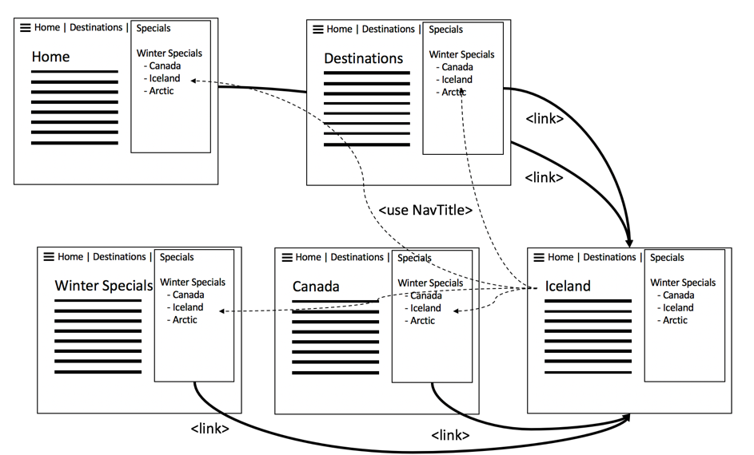
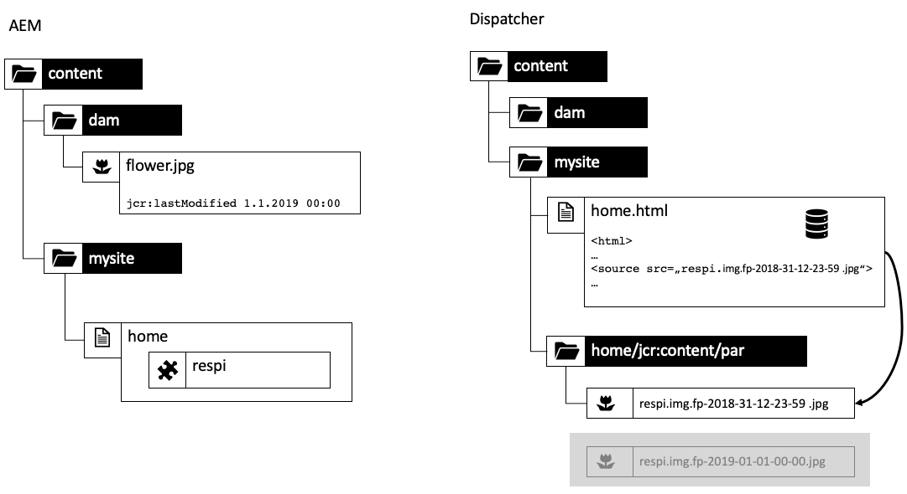

# Capítulo 1 - Conceitos, padrões e antipadrões do Dispatcher

## Visão geral

Este capítulo fornece uma breve introdução sobre a história e a mecânica do Dispatcher e discute como isso influencia como um desenvolvedor de AEM projetaria seus componentes.

## Por que os desenvolvedores devem se preocupar com a infraestrutura

O Dispatcher é uma parte essencial da maioria das instalações de AEM, se não de todas. Você pode encontrar muitos artigos online que discutem como configurar o Dispatcher, bem como dicas e truques.

No entanto, essas informações começam sempre em um nível muito técnico - supondo que você já saiba o que deseja fazer e, portanto, forneça apenas detalhes sobre como alcançar o que deseja. Nós nunca encontramos nenhum artigo conceitual descrevendo o _o que e por que_ quando se trata do que você pode ou não fazer com o dispatcher.

### Antipadrão: Dispatcher como um pensamento posterior

Esta falta de informação básica leva a uma série de anti-padrões Nós temos visto em uma série de projetos AEM:

1. Como o Dispatcher é instalado no servidor Web Apache, é trabalho dos &quot;deuses Unix&quot; no projeto configurá-lo. Um &quot;desenvolvedor Java mortal&quot; não precisa se preocupar com isso.

2. O desenvolvedor do Java precisa garantir que seu código funcione... o Dispatcher posteriormente o tornará mais rápido por mágica. O dispatcher sempre é um pensamento posterior. No entanto, isso não está funcionando. Um desenvolvedor deve projetar seu código tendo em mente o dispatcher. E ele precisa conhecer seus conceitos básicos para fazer isso.

### &quot;Primeiro, faça funcionar - depois faça mais rápido&quot; Nem sempre está certo

Você pode ter ouvido o conselho de programação _&quot;Primeiro, faça funcionar - depois faça funcionar mais rápido.&quot;_. Não é totalmente errado. No entanto, sem o contexto adequado, tende a ser mal interpretada e não aplicada corretamente.

A dica deve impedir que o desenvolvedor otimize prematuramente o código, que pode nunca ser executado - ou é executado tão raramente, que uma otimização não teria um impacto suficiente para justificar o esforço que está sendo colocado na otimização. Além disso, a otimização pode levar a códigos mais complexos e, portanto, introduzir erros. Portanto, se você for um desenvolvedor, não gaste muito tempo na microotimização de cada linha de código. Certifique-se apenas de escolher as estruturas de dados, os algoritmos e as bibliotecas corretos e aguardar a análise do ponto de acesso de um profiler para ver onde uma otimização mais completa pode aumentar o desempenho geral.

### Decisões e artefatos de arquitetura

No entanto, o conselho &quot;Primeiro fazê-lo funcionar - depois fazê-lo rápido&quot; é totalmente errado quando se trata de decisões &quot;arquitetônicas&quot;. O que são decisões arquitetônicas? Simplificando, são as decisões que são caras, difíceis e/ou impossíveis de serem alteradas posteriormente. Lembre-se, que &quot;caro&quot; às vezes é o mesmo que &quot;impossível&quot;.  Por exemplo, quando seu projeto está ficando sem orçamento, alterações caras são impossíveis de serem implementadas. Mudanças na infraestrutura são o primeiro tipo de mudanças nessa categoria que vem à mente da maioria das pessoas. Mas há também outro tipo de artefatos &quot;arquitetônicos&quot; que podem se tornar muito desagradáveis de mudar:

1. Partes do código no &quot;centro&quot; de um aplicativo, no qual muitas outras partes dependem. Alterar isso requer que todas as dependências sejam alteradas e testadas novamente de uma só vez.

2. Artefatos, que estão envolvidos em algum cenário assíncrono e dependente de tempo em que a entrada - e, portanto, o comportamento do sistema pode variar muito aleatoriamente. As alterações podem ter efeitos imprevisíveis e ser difíceis de testar.

3. Padrões de software que são usados e reutilizados repetidamente, em todas as partes do sistema. Se o padrão do software ficar abaixo do ideal, todos os artefatos que usam o padrão precisarão ser recodificados.

Lembrar? Na parte superior desta página, dissemos que o Dispatcher é uma parte essencial de um aplicativo AEM. O acesso a um aplicativo web é muito aleatório - os usuários estão chegando e indo em momentos imprevisíveis. No final, todo o conteúdo será (ou deve) ser armazenado em cache no Dispatcher. Portanto, se você prestasse muita atenção, perceberia que o armazenamento em cache poderia ser visto como um artefato &quot;arquitetônico&quot; e, portanto, deveria ser entendido por todos os membros da equipe, tanto desenvolvedores quanto administradores.

Não estamos dizendo que um desenvolvedor deve realmente configurar o Dispatcher. Eles precisam conhecer os conceitos, especialmente os limites, para garantir que seu código também possa ser aproveitado pelo Dispatcher.

O Dispatcher não melhora magicamente a velocidade do código. Um desenvolvedor precisa criar seus componentes tendo o Dispatcher em mente. Portanto, ele precisa saber como funciona.

## Armazenamento em cache do Dispatcher - Princípios básicos

### Dispatcher como cache Http - Balanceador de carga

O que é o Dispatcher e por que ele é chamado de &quot;Dispatcher&quot; em primeiro lugar?

O Dispatcher é

* Em primeiro lugar, um cache

* Um proxy reverso

* Um módulo para o servidor Web Apache httpd, adicionando recursos relacionados ao AEM à versatilidade do Apache e trabalhando sem problemas junto com todos os outros módulos do Apache (como SSL ou até mesmo SSI, como veremos mais tarde)

Nos primeiros dias da Web, você esperaria algumas centenas de visitantes de um site. Uma configuração de um Dispatcher, &quot;despachado&quot; ou balanceamento da carga de solicitações para vários servidores de publicação AEM e que geralmente era suficiente - portanto, o nome &quot;Dispatcher&quot;. Atualmente, no entanto, essa configuração não é mais usada com muita frequência.

Posteriormente, veremos diferentes maneiras de configurar Dispatchers e Sistemas de publicação neste artigo. Primeiro, vamos começar com algumas noções básicas de armazenamento em cache http.


*Funcionalidade básica de um cache do Dispatcher*

<br> 

Os conceitos básicos do dispatcher são explicados aqui. O dispatcher é um simples proxy reverso de cache com a capacidade de receber e criar solicitações HTTP. Um ciclo normal de solicitação/resposta é semelhante a:

1. Um usuário solicita uma página
2. O Dispatcher verifica se já tem uma versão renderizada dessa página. Suponhamos que seja a primeira solicitação para essa página e o Dispatcher não possa encontrar uma cópia local em cache.
3. O Dispatcher solicita a página do sistema de publicação
4. No sistema de publicação, a página é renderizada por um modelo JSP ou HTL
5. A página é retornada ao Dispatcher
6. O Dispatcher armazena a página em cache
7. O Dispatcher retorna a página para o navegador
8. Se a mesma página for solicitada uma segunda vez, ela poderá ser disponibilizada diretamente do cache do Dispatcher sem a necessidade de renderizá-la novamente na instância de Publicação. Isso economiza o tempo de espera do usuário e dos ciclos da CPU na instância de publicação.

Estávamos falando sobre &quot;páginas&quot; na última seção. Mas o mesmo esquema também se aplica a outros recursos, como imagens, arquivos CSS, downloads de PDF e assim por diante.

#### Como os dados são armazenados em cache

O módulo Dispatcher aproveita os recursos que o servidor Apache de hospedagem fornece. Recursos como páginas de HTML, downloads e imagens são armazenados como arquivos simples no sistema de arquivos Apache. É simples assim.

O nome do arquivo é derivado pela URL do recurso solicitado. Se você solicitar um arquivo `/foo/bar.html` é armazenado, por exemplo, em /`var/cache/docroot/foo/bar.html`.

Em princípio, se todos os arquivos forem armazenados em cache e, portanto, armazenados estaticamente no Dispatcher, você poderá obter o plug do sistema de publicação e o Dispatcher servirá como um simples servidor Web. Mas isso é apenas para ilustrar o princípio. A vida real é mais complicada. Não é possível armazenar tudo em cache, e o cache nunca está completamente &quot;cheio&quot;, pois o número de recursos pode ser infinito devido à natureza dinâmica do processo de renderização. O modelo de um sistema de arquivos estático ajuda a gerar uma imagem aproximada dos recursos do dispatcher. E isso ajuda a explicar as limitações do dispatcher.

#### A estrutura de URL do AEM e o mapeamento do sistema de arquivos

Para entender o Dispatcher com mais detalhes, vamos rever a estrutura de um URL de amostra simples.  Vamos analisar o exemplo abaixo,

`http://domain.com/path/to/resource/pagename.selectors.html/path/suffix.ext?parameter=value&amp;otherparameter=value#fragment`

* `http` indica o protocolo

* `domain.com` é o nome do domínio

* `path/to/resource` é o caminho no qual o recurso é armazenado no CRX e, subsequentemente, no sistema de arquivos do servidor Apache

A partir daqui, as coisas diferem um pouco entre o sistema de arquivos AEM e o sistema de arquivos Apache.

No AEM,

* `pagename` é o rótulo de recursos

* `selectors` significa vários seletores usados no Sling para determinar como o recurso é renderizado. Um URL pode ter um número arbitrário de seletores. Eles são separados por um ponto. Uma seção de seletores pode, por exemplo, ser algo como &quot;french.mobile.fantasia&quot;. Os seletores devem conter apenas letras, dígitos e traços.

* `html` como sendo o último dos &quot;seletores&quot; é chamado de extensão. No AEM/Sling, também determina parcialmente o script de renderização.

* `path/suffix.ext` é uma expressão semelhante a um caminho que pode ser um sufixo do URL.  Ele pode ser usado em scripts AEM para controlar ainda mais como um recurso é renderizado. Teremos uma seção inteira sobre esta parte mais tarde. Por enquanto, é suficiente saber que você pode usá-lo como um parâmetro adicional. Os sufixos devem ter uma extensão.

* `?parameter=value&otherparameter=value` é a seção de consulta do URL. É usado para transmitir parâmetros arbitrários ao AEM. URLs com parâmetros não podem ser armazenados em cache e, portanto, os parâmetros devem ser limitados a casos em que são absolutamente necessários.

* `#fragment`, a parte do fragmento de um URL não é transmitida ao AEM; ela é usada somente no navegador; em estruturas JavaScript, como &quot;parâmetros de roteamento&quot; ou para pular para uma determinada parte na página.

No Apache (*consulte o diagrama abaixo*),

* `pagename.selectors.html` é usado como o nome do arquivo no sistema de arquivos do cache.

Se o URL tiver um sufixo `path/suffix.ext` depois,

* `pagename.selectors.html` é criado como uma pasta

* `path` uma pasta na `pagename.selectors.html` pasta

* `suffix.ext` é um arquivo na `path` pasta. Observação: se o sufixo não tiver uma extensão, o arquivo não será armazenado em cache.


*Layout do sistema de arquivos após obter URLs do Dispatcher*

<br> 

#### Limitações básicas

O mapeamento entre um URL, o recurso e o nome do arquivo é muito simples.

No entanto, você pode ter notado algumas armadilhas,

1. Os URLs podem ficar muito longos. Adicionar a parte &quot;caminho&quot; de um `/docroot` no sistema de arquivos local pode facilmente exceder os limites de alguns sistemas de arquivos. Executar o Dispatcher no NTFS no Windows pode ser um desafio. No entanto, você está seguro com o Linux.

2. Os URLs podem conter caracteres especiais e tremas. Geralmente, isso não é um problema para o dispatcher. Tenha em mente, no entanto, que o URL é interpretado em muitos lugares do seu aplicativo. Na maioria das vezes, observamos comportamentos estranhos de um aplicativo - apenas para descobrir que uma parte do código raramente usado (personalizado) não foi totalmente testada em relação a caracteres especiais. Você deve evitá-los se puder. E se não puder, planeje testes completos.

3. No CRX, os recursos têm sub-recursos. Por exemplo, uma página terá várias subpáginas. Isso não pode ser correspondido em um sistema de arquivos, pois os sistemas de arquivos têm arquivos ou pastas.

#### Os URLs sem extensão não são armazenados em cache

Os URLs sempre devem ter uma extensão. Embora seja possível fornecer URLs sem extensões no AEM. Esses URLs não serão armazenados em cache no Dispatcher.

**Exemplos**

`http://domain.com/home.html` é **armazenável em cache**

`http://domain.com/home` é **não armazenável em cache**

A mesma regra se aplica quando o URL contém um sufixo. O sufixo precisa ter uma extensão para ser armazenável em cache.

**Exemplos**

`http://domain.com/home.html/path/suffix.html` é **armazenável em cache**

`http://domain.com/home.html/path/suffix` é **não armazenável em cache**

Você pode se perguntar, o que acontece se a parte do recurso não tiver uma extensão, mas o sufixo tiver uma? Nesse caso, o URL não tem nenhum sufixo. Veja o próximo exemplo:

**Exemplo**

`http://domain.com/home/path/suffix.ext`

A variável `/home/path/suffix` é o caminho para o recurso... portanto, não há sufixo no URL.

**Conclusão**

Sempre adicione extensões ao caminho e ao sufixo. As pessoas cientes de SEO às vezes argumentam que isso está classificando você nos resultados de pesquisa. Mas uma página não armazenada em cache seria muito lenta e classificada ainda mais.

#### URLs de Sufixo Conflitantes

Considere que você tem dois URLs válidos

`http://domain.com/home.html`

e

`http://domain.com/home.html/suffix.html`

Eles são absolutamente válidos no AEM. Você não veria nenhum problema na máquina de desenvolvimento local (sem um Dispatcher). Provavelmente, você também não encontrará nenhum problema no teste de carga ou UAT. O problema que enfrentamos é tão sutil que escorre pela maioria dos testes.  Ela afetará você quando estiver no horário de pico e você estiver limitado no tempo para resolvê-lo, provavelmente não terá acesso ao servidor nem recursos para corrigi-lo. Nós estivemos lá...

Então... qual é o problema?

`home.html` pode ser um arquivo ou uma pasta. Não ambos ao mesmo tempo que no AEM.

Se você solicitar `home.html` primeiro, é criado como um arquivo.

Solicitações subsequentes para `home.html/suffix.html` retornar resultados válidos, mas como o arquivo `home.html` &quot;bloqueia&quot; a posição no sistema de arquivos,  `home.html` não pode ser criada uma segunda vez como uma pasta e, portanto, `home.html/suffix.html` não está armazenado em cache.


*A posição de bloqueio de arquivos no sistema de arquivos, impedindo que sub-recursos sejam armazenados em cache*

<br> 

Se você fizer isso do outro lado, primeiro solicitando `home.html/suffix.html` depois `suffix.html` é armazenado em cache em uma pasta `/home.html` no início. No entanto, essa pasta é excluída e substituída por um arquivo `home.html` quando você solicitar posteriormente `home.html` como um recurso.


*Exclusão de uma estrutura de caminho quando um pai é buscado como um recurso*

<br> 

Portanto, o resultado do que é armazenado em cache é totalmente aleatório e depende da ordem das solicitações recebidas. O que torna as coisas ainda mais complicadas é o fato de que você geralmente tem mais de um dispatcher. E o desempenho, a taxa de ocorrência do cache e o comportamento podem variar de um Dispatcher para outro. Se quiser descobrir por que o seu site não responde, você precisa ter certeza de que está olhando para o Dispatcher correto com a ordem de armazenamento em cache infeliz. Se você estiver observando o Dispatcher que - por sorte de acaso - tinha um padrão de solicitação mais favorável, você se perderá ao tentar encontrar o problema.

#### Como evitar URLs em conflito

É possível evitar &quot;URLs conflitantes&quot;, em que um nome de pasta e um nome de arquivo &quot;competem&quot; pelo mesmo caminho no sistema de arquivos, quando você estiver usando uma extensão diferente para o recurso quando tiver um sufixo.

**Exemplo**

* `http://domain.com/home.html`

* `http://domain.com/home.dir/suffix.html`

Ambos são perfeitamente armazenáveis em cache,


Escolher uma extensão dedicada &quot;dir&quot; para um recurso ao solicitar um sufixo ou evitar usar o sufixo completamente. Há casos raros em que são úteis. E é fácil implementar esses casos corretamente.  Como veremos no próximo capítulo, quando falamos sobre invalidação e liberação de cache.

#### Solicitações Não Armazenáveis em Cache

Vamos analisar um resumo rápido do último capítulo, além de mais algumas exceções. O Dispatcher pode armazenar em cache um URL se estiver configurado como armazenável em cache e se for uma solicitação GET. Ele não pode ser armazenado em cache sob uma das exceções a seguir.

**Solicitações armazenáveis em cache**

* A solicitação está configurada para ser armazenada em cache na configuração do Dispatcher
* A solicitação é uma solicitação GET simples

**Solicitações ou Respostas Não Armazenáveis em Cache**

* Solicitação negada para armazenamento em cache pela configuração (Caminho, Padrão, Tipo MIME)
* Respostas que retornam um cabeçalho &quot;Dispatcher: sem cache&quot;
* Resposta que retorna um cabeçalho &quot;Cache-Control: no-cache|private&quot;
* Resposta que retorna um cabeçalho &quot;Pragma: no-cache&quot;
* Solicitação com parâmetros de consulta
* URL sem extensão
* URL com um sufixo que não tem uma extensão
* Resposta que retorna um código de status diferente de 200
* Solicitação POST

## Invalidação e liberação do cache

### Visão geral

O último capítulo listou um grande número de exceções quando o Dispatcher não podia armazenar uma solicitação em cache. Mas há mais coisas a serem consideradas: apenas porque o Dispatcher _pode_ armazenar uma solicitação em cache, isso não significa necessariamente que ela _deve_.

O ponto é: o armazenamento em cache geralmente é fácil. O Dispatcher só precisa armazenar o resultado de uma resposta e retorná-lo na próxima vez que a mesma solicitação for recebida. Direita? Errado!

A parte difícil é a _invalidação_ ou _rubor_ do cache. O Dispatcher precisa descobrir quando um recurso foi alterado e precisa ser renderizado novamente.

Parece ser uma tarefa trivial à primeira vista... mas não é. Leia mais e você descobrirá algumas diferenças complicadas entre recursos únicos e simples e páginas que dependem de uma estrutura altamente integrada de vários recursos.

### Recursos simples e liberação

Configuramos nosso sistema AEM para criar dinamicamente uma representação em miniatura de cada imagem quando solicitado com um seletor especial de &quot;miniatura&quot;:

`/content/dam/path/to/image.thumb.png`

E, é claro, fornecemos um URL para veicular a imagem original com um URL sem seletor:

`/content/dam/path/to/image.png`

Se baixarmos a miniatura e a imagem original, acabaremos com algo como:

```
/var/cache/dispatcher/docroot/content/dam/path/to/image.thumb.png

/var/cache/dispatcher/docroot/content/dam/path/to/image.png
```

no sistema de arquivos do Dispatcher.

Agora, o usuário carrega e ativa uma nova versão desse arquivo. Por fim, uma solicitação de invalidação é enviada do AEM para o Dispatcher,

```
GET /invalidate
invalidate-path:  /content/dam/path/to/image

<no body>
```

A invalidação é fácil assim: uma simples solicitação do GET para um URL &quot;/invalidate&quot; especial no Dispatcher. Um corpo HTTP não é necessário, a &quot;carga&quot; é apenas o cabeçalho &quot;invalidate-path&quot;. Observe também que o caminho de invalidação no cabeçalho é o recurso que o AEM conhece, e não os arquivos ou arquivos que o Dispatcher armazenou em cache. O AEM só sabe sobre recursos. Extensões, seletores e sufixos são usados em tempo de execução quando um recurso é solicitado. O AEM não faz nenhuma contabilidade sobre quais seletores foram usados em um recurso, portanto, o caminho do recurso é tudo o que ele sabe com certeza ao ativar um recurso.

No nosso caso, isso é suficiente. Se um recurso tiver sido alterado, podemos supor com segurança que todas as representações desse recurso também foram alteradas. No nosso exemplo, se a imagem tiver sido alterada, uma nova miniatura também será renderizada.

O Dispatcher pode excluir com segurança o recurso com todas as representações que ele armazenou em cache. Fará algo como:

`$ rm /content/dam/path/to/image.*`

removendo `image.png` e `image.thumb.png` e todas as outras representações que correspondem a esse padrão.

Supersimples mesmo... desde que você use um recurso apenas para responder a uma solicitação.

### Referências e conteúdo em malha

#### O problema do conteúdo em malha

Ao contrário de imagens ou outros arquivos binários carregados no AEM, as páginas de HTML não são animais solitários. Vivem em bandos e são altamente interconectados uns com os outros por hiperlinks e referências. O link simples é inofensivo, mas fica complicado quando falamos sobre referências de conteúdo. A navegação superior onipresente ou teasers nas páginas são referências de conteúdo.

#### Referências de conteúdo e por que elas são um problema

Vamos ver um exemplo simples. Uma agência de viagens tem uma página da Web promovendo uma viagem ao Canadá. Essa promoção é apresentada na seção de teaser em duas outras páginas, na página &quot;Home&quot; e em uma página &quot;Winter Specials&quot;.

Como ambas as páginas exibem o mesmo teaser, não seria necessário pedir ao autor para criar o teaser várias vezes para cada página em que ele deve ser exibido. Em vez disso, a página de destino &quot;Canadá&quot; reserva uma seção nas propriedades da página para fornecer as informações do teaser - ou melhor, para fornecer um URL que renderize todo o teaser:

`<sling:include resource="/content/home/destinations/canada" addSelectors="teaser" />`

ou

`<sling:include resource="/content/home/destinations/canada/jcr:content/teaser" />`


No AEM, somente isso funciona como charme, mas se você usar um Dispatcher na instância de publicação, algo estranho acontece.

Imagine, você publicou seu website. O título na sua página do Canadá é &quot;Canadá&quot;. Quando um visitante solicita sua página inicial, que tem uma referência de teaser para essa página, o componente na página &quot;Canadá&quot; renderiza algo como

```
<div class="teaser">
  <h3>Canada</h3>
  
</div>
```

*em* a home page. A página inicial é armazenada pelo Dispatcher como um arquivo .html estático, incluindo o teaser e seu título no arquivo.

Agora, o profissional de marketing aprendeu que as manchetes de teaser devem ser acionáveis. Então, ele decide mudar o título de &quot;Canada&quot; para &quot;Visit Canada&quot;, e atualiza a imagem também.

Ele publica a página &quot;Canada&quot; editada e visita novamente a página inicial publicada anteriormente para ver suas alterações. Mas - nada mudou lá. Ele ainda exibe o teaser antigo. Ele checa o &quot;Especial de inverno&quot;. Essa página nunca foi solicitada antes e, portanto, não é armazenada em cache estaticamente no Dispatcher. Portanto, esta página está recém-renderizada pelo Publish e agora contém o novo teaser de &quot;Visit Canada&quot;.


*Dispatcher que armazena conteúdo incluído obsoleto na página inicial*

<br> 

O que aconteceu? O Dispatcher armazena uma versão estática de uma página contendo todo o conteúdo e marcação que foi desenhada de outros recursos durante a renderização.

O Dispatcher, sendo um mero servidor Web baseado em sistema de arquivos, é rápido, mas também relativamente simples. Se um recurso incluído for alterado, ele não perceberá isso. Ele ainda se vincula ao conteúdo que estava lá quando a página de inclusão foi renderizada.

A página &quot;Especial de inverno&quot; ainda não foi renderizada, portanto, não há versão estática no Dispatcher e, portanto, é exibida com o novo teaser, pois ele é renderizado recentemente mediante solicitação.

Você pode pensar que o Dispatcher manteria o controle de cada recurso que toca ao renderizar e liberar todas as páginas que usaram esse recurso, quando esse recurso for alterado. Mas o Dispatcher não renderiza as páginas. A renderização é executada pelo sistema de publicação. O Dispatcher não sabe quais recursos entram em um arquivo .html renderizado.

Ainda não está convencido? Você pode pensar *&quot;deve haver uma maneira de implementar algum tipo de rastreamento de dependência&quot;*. Bem, existe, ou mais precisamente existe *foi*. Comunicado 3 o tatataravô do AEM teve um rastreador de dependência implementado no _session_ que foi usado para renderizar uma página.

Durante uma solicitação, cada recurso adquirido por meio desta sessão era rastreado como uma dependência do URL que estava sendo renderizado no momento.

Mas acontece que rastrear as dependências era muito caro. As pessoas logo descobriram que o site é mais rápido se desativarem completamente o recurso de rastreamento de dependência e dependerem de renderizar novamente todas as páginas html após uma página html ser alterada. Além disso, esse esquema também não era perfeito - havia uma série de armadilhas e exceções a caminho. Em alguns casos, você não estava usando a sessão padrão de solicitações para obter um recurso, mas uma sessão de administrador para obter alguns recursos de ajuda para renderizar uma solicitação. Essas dependências geralmente não eram rastreadas e resultavam em dores de cabeça e chamadas telefônicas para a equipe de operações pedindo para liberar manualmente o cache. Você teve sorte se eles tivessem um procedimento padrão para fazer isso. Havia mais armadilhas ao longo do caminho, mas... vamos parar de relembrar. Isso leva a volta de 2005. Em última análise, esse recurso foi desativado no Comunicado 4 por padrão e não voltou ao sucessor CQ5, que então se tornou AEM.

### Invalidação automática

#### Quando A Liberação Total For Mais Barata Que O Rastreamento De Dependência

Desde o CQ5, dependemos totalmente da invalidação, mais ou menos, do site inteiro se apenas uma das páginas for alterada. Esse recurso é chamado de &quot;Invalidação automática&quot;.

Mas, novamente - como pode ser, que jogar fora e renderizar novamente centenas de páginas é mais barato do que fazer um rastreamento de dependência adequado e renderização parcial?

Há dois motivos principais:

1. Em um site comum, somente um pequeno subconjunto das páginas é frequentemente solicitado. Mesmo assim, se você jogar fora todo o conteúdo renderizado, apenas algumas dúzias serão solicitadas imediatamente depois. A renderização da longa cauda das páginas pode ser distribuída ao longo do tempo, quando elas são realmente solicitadas. Na verdade, a carga na renderização de páginas não é tão alta quanto você esperaria. É claro que sempre há exceções... discutiremos alguns truques para lidar com cargas igualmente distribuídas em sites maiores com caches vazios do Dispatcher, posteriormente.

2. De qualquer forma, todas as páginas são conectadas pela navegação principal. Assim, quase todas as páginas são dependentes umas das outras. Isso significa que mesmo o rastreador de dependência mais inteligente descobrirá o que já sabemos: se uma das páginas mudar, será necessário invalidar todas as outras.

Você não acredita? Vamos ilustrar o último ponto.

Estamos usando o mesmo argumento do último exemplo com teasers que fazem referência ao conteúdo de uma página remota. Somente agora estamos usando um exemplo mais extremo: uma navegação principal renderizada automaticamente. Assim como com o teaser, o título da navegação é desenhado na página vinculada ou &quot;remota&quot; como uma referência de conteúdo. Os títulos de navegação remota não são armazenados na página renderizada atualmente. Você deve se lembrar de que a navegação é renderizada em cada página do site. Assim, o título de uma página é usado várias vezes em todas as páginas que têm uma navegação principal. E se você quiser alterar um título de navegação, é desejável fazer isso apenas uma vez na página remota, não em cada página que faz referência à página.

Portanto, no nosso exemplo, a navegação une todas as páginas usando o &quot;NavTitle&quot; da página de destino para renderizar um nome na navegação. O título de navegação de &quot;Islândia&quot; é desenhado a partir da página &quot;Islândia&quot; e renderizado em cada página que tem uma navegação principal.



*A navegação principal inevitavelmente mescla o conteúdo de todas as páginas ao puxar seus &quot;Títulos de navegação&quot;*

<br> 

Se você alterar o NavTitle na página da Islândia de &quot;Islândia&quot; para &quot;Bela Islândia&quot;, esse título será alterado imediatamente em todas as outras páginas do menu principal. Assim, as páginas renderizadas e armazenadas em cache antes dessa alteração se tornam obsoletas e precisam ser invalidadas.

#### Como a invalidação automática é implementada: o arquivo .stat

Agora, se você tem um site grande com milhares de páginas, levaria algum tempo para percorrer todas as páginas e excluí-las fisicamente. Durante esse período, o Dispatcher poderia fornecer conteúdo obsoleto involuntariamente. Pior ainda, podem ocorrer alguns conflitos ao acessar os arquivos do cache, talvez uma página seja solicitada enquanto está sendo excluída ou uma página seja excluída novamente devido a uma segunda invalidação que ocorreu após uma ativação subsequente imediata. Considere o que seria uma bagunça. Felizmente não é isso que acontece. O Dispatcher usa um truque inteligente para evitar isso: em vez de excluir centenas e milhares de arquivos, ele coloca um arquivo simples e vazio na raiz do sistema de arquivos quando um arquivo é publicado e, portanto, todos os arquivos dependentes são considerados inválidos. Esse arquivo é chamado de &quot;arquivo de status&quot;. O arquivo de status é um arquivo vazio - o que importa no arquivo de status é apenas a data de criação.

Todos os arquivos no Dispatcher, que têm uma data de criação anterior ao arquivo de status, foram renderizados antes da última ativação (e invalidação) e, portanto, são considerados &quot;inválidos&quot;. Eles ainda estão fisicamente presentes no sistema de arquivos, mas o Dispatcher os ignora. Eles estão &quot;obsoletos&quot;. Sempre que uma solicitação para um recurso obsoleto é feita, o Dispatcher solicita que o sistema AEM renderize a página novamente. Essa página recém-renderizada é armazenada no sistema de arquivos - agora com uma nova data de criação e está atualizada novamente.


*A data de criação do arquivo .stat define qual conteúdo está obsoleto e qual é novo*

<br> 

Você pode perguntar por que ele se chama &quot;.stat&quot;? E talvez não seja &quot;.invalidado&quot;? Bem, você pode imaginar que ter esse arquivo em seu sistema de arquivos ajuda o Dispatcher a determinar quais recursos podem *estaticamente* ser atendido - exatamente como em um servidor Web estático. Esses arquivos não precisam mais ser renderizados dinamicamente.

A verdadeira natureza do nome, no entanto, é menos metafórica. É derivado da chamada do sistema Unix `stat()`, que retorna a hora de modificação de um arquivo (entre outras propriedades).

#### Combinação de validação simples e automática

Mas espere... mais cedo dissemos, que recursos únicos são excluídos fisicamente. Agora dizemos que um arquivo de status mais recente virtualmente os tornaria inválidos aos olhos do Dispatcher. Por que então a exclusão física, primeiro?

A resposta é simples. Normalmente, você usa ambas as estratégias em paralelo, mas para diferentes tipos de recursos. Ativos binários, como imagens, são independentes. Eles não estão conectados a outros recursos para que suas informações sejam renderizadas.

As páginas de HTML, por outro lado, são altamente interdependentes. Então, você aplicaria a invalidação automática nelas. Essa é a configuração padrão no Dispatcher. Todos os arquivos pertencentes a um recurso invalidado são excluídos fisicamente. Além disso, os arquivos que terminam com &quot;.html&quot; são invalidados automaticamente.

O Dispatcher decide sobre a extensão do arquivo, se aplica ou não o esquema de invalidação automática.

As terminações de arquivo para invalidação automática são configuráveis. Em teoria, você poderia incluir todas as extensões para a invalidação automática. Mas lembre-se, isso tem um preço muito alto. Você não verá recursos obsoletos entregues involuntariamente, mas o desempenho do delivery será amplamente degradado devido à invalidação excessiva.

Imagine, por exemplo, que você implemente um esquema em que os PNGs e os JPG sejam renderizados dinamicamente e dependam de outros recursos para isso. Talvez você queira redimensionar imagens de alta resolução para uma resolução menor compatível com a Web. Enquanto estiver nessa, altere também a taxa de compactação. A resolução e a taxa de compactação neste exemplo não são constantes fixas, mas parâmetros configuráveis no componente que usa a imagem. Agora, se esse parâmetro for alterado, será necessário invalidar as imagens.

Sem problemas - acabamos de saber que poderíamos adicionar imagens à invalidação automática e sempre renderizamos imagens sempre que algo mudar.

#### Jogando fora o bebê com a água do banho

Isso mesmo - e isso é um grande problema. Leia o último parágrafo novamente. &quot;...imagens renderizadas recentemente sempre que algo mudar.&quot;. Como você sabe, um bom site é alterado constantemente; adicionando novo conteúdo aqui, corrigindo um erro de digitação lá, ajustando um teaser em outro lugar. Isso significa que todas as imagens são invalidadas constantemente e precisam ser renderizadas novamente. Não subestime isso. A renderização e transferência dinâmica de dados de imagem funciona em milissegundos em sua máquina de desenvolvimento local. Seu ambiente de produção precisa fazer isso cem vezes mais frequentemente — por segundo.

E vamos esclarecer aqui, seus jpgs precisam ser renderizados novamente, quando uma página html é alterada e vice-versa. Há apenas um &quot;bucket&quot; de arquivos a serem invalidados automaticamente. É enxaguado como um todo. Sem meios de quebrar em estruturas mais detalhadas.

Há um bom motivo para a invalidação automática ser mantida em &quot;.html&quot; por padrão. O objetivo é manter esse balde o menor possível. Não jogue fora o bebê com a água do banho apenas invalidando tudo - apenas para estar do lado seguro.

Os recursos autocontidos devem ser servidos no caminho desse recurso. Isso ajuda muito a invalidação. Mantenha simples: não crie esquemas de mapeamento, como &quot;resource /a/b/c&quot; é disponibilizado a partir de &quot;/x/y/z&quot;. Faça com que seus componentes funcionem com as configurações padrão de invalidação automática do Dispatcher. Não tente reparar um componente mal projetado com invalidação excessiva no Dispatcher.

##### Exceções à Invalidação Automática: Invalidação de ResourceOnly

A solicitação de invalidação do Dispatcher geralmente é acionada do(s) sistema(s) de publicação por um agente de replicação.

Se você se sentir super confiante sobre suas dependências, poderá tentar criar seu próprio agente de replicação de invalidação.

Seria um pouco além deste guia entrar nos detalhes, mas queremos dar pelo menos algumas dicas.

1. Realmente sei o que você está fazendo. Obter o direito de invalidação é muito difícil. Essa é uma das razões pelas quais a invalidação automática é tão rigorosa: evitar o fornecimento de conteúdo obsoleto.

2. Se o agente enviar um cabeçalho HTTP `CQ-Action-Scope: ResourceOnly`, isso significa que essa única solicitação de invalidação não aciona uma invalidação automática. Esse ( [https://github.com/cqsupport/webinar-dispatchercache/tree/master/src/refetching-flush-agent/refetch-bundle](https://github.com/cqsupport/webinar-dispatchercache/tree/master/src/refetching-flush-agent/refetch-bundle)) pode ser um bom ponto de partida para seu próprio agente de replicação.

3. `ResourceOnly`, apenas impede a invalidação automática. Para fazer realmente a resolução de dependências e as invalidações necessárias, você mesmo deve acionar as solicitações de invalidação. Verifique as regras de liberação do pacote do Dispatcher ([https://adobe-consulting-services.github.io/acs-aem-commons/features/dispatcher-flush-rules/index.html](https://adobe-consulting-services.github.io/acs-aem-commons/features/dispatcher-flush-rules/index.html)) para obter inspiração sobre como isso poderia realmente acontecer.

Não recomendamos que você crie um esquema de resolução de dependência. Há apenas muito esforço e pouco ganho - e como dito antes, há muito que você vai errar.

Em vez disso, você deve descobrir quais recursos não têm dependências em outros recursos e podem ser invalidados sem invalidação automática. Porém, você não precisa usar um agente de replicação personalizado para esse fim. Basta criar uma regra personalizada na configuração do Dispatcher que exclua esses recursos da invalidação automática.

Dissemos que a navegação principal ou teasers são uma fonte de dependências. Bem — se você carregar a navegação e os teasers de forma assíncrona ou incluí-los com um script SSI no Apache, você não terá essa dependência para rastrear. Posteriormente, abordaremos o carregamento assíncrono de componentes neste documento, quando falarmos sobre &quot;Inclusões dinâmicas do Sling&quot;.

O mesmo se aplica a janelas pop-up ou conteúdo que é carregado em um lightbox. Essas partes também raramente têm navegações (também conhecidas como &quot;dependências&quot;) e podem ser invalidadas como um único recurso.

## Criação de componentes tendo o Dispatcher em mente

### Aplicação da mecânica do Dispatcher em um exemplo do mundo real

No último capítulo, explicamos como a mecânica básica do Dispatcher funciona em geral e quais são as limitações.

Agora, queremos aplicar esses mecanismos a um tipo de componentes que você provavelmente encontrará nos requisitos do seu projeto. Escolhemos o componente deliberadamente para demonstrar problemas que você também enfrentará mais cedo ou mais tarde. Não temam - nem todos os componentes precisam dessa quantidade de consideração que apresentaremos. Mas se você vê a necessidade de construir um componente como esse, você está bem ciente das consequências e sabe como lidar com elas.

### O Padrão (Anti) Do Componente De Spool

#### O componente de imagem responsiva

Vamos ilustrar um padrão comum (ou antipadrão) de um componente com binários interconectados. Criaremos um componente &quot;respi&quot; - para &quot;imagem responsiva&quot;. Esse componente deve ser capaz de adaptar a imagem exibida ao dispositivo em que ela é exibida. Em desktops e tablets ele mostra a resolução total da imagem, em telefones uma versão menor com um corte estreito - ou talvez até mesmo um motivo completamente diferente (isto é chamado de &quot;direção de arte&quot; no mundo responsivo).

Os ativos são carregados na área DAM do AEM e somente _referenciado_ no componente de imagem responsiva.

O componente de resposta cuida da renderização da marcação e da entrega dos dados de imagem binária.

A maneira como implementamos isso aqui é um padrão comum que vimos em muitos projetos e até mesmo um dos componentes principais do AEM é baseado nesse padrão. Portanto, é muito provável que você, como desenvolvedor, possa adaptar esse padrão. Ele tem suas melhores manchas em termos de encapsulamento, mas requer muito esforço para ficar pronto para o Dispatcher. Discutiremos várias opções para mitigar o problema posteriormente.

Nós chamamos o padrão usado aqui de &quot;Padrão Spooler&quot;, porque o problema remonta aos primeiros dias do Comunicado 3, onde havia um método &quot;spool&quot; que poderia ser chamado em um recurso para transmitir seus dados binários brutos para a resposta.

O termo original &quot;spooling&quot; se refere, na verdade, a periféricos off-line lentos compartilhados, como impressoras, de modo que não é aplicado aqui corretamente. Mas nós gostamos do termo de qualquer maneira porque ele é raramente no mundo online, portanto, distinguível. E cada padrão deveria ter um nome diferenciável, certo? É você que decide se este é um padrão ou um anti-padrão.

#### Implementação

Veja como nosso componente de imagem responsiva é implementado:

O componente tem duas partes; a primeira parte renderiza a marcação HTML da imagem, a segunda parte &quot;faz spool&quot; dos dados binários da imagem referenciada. Como este é um site moderno com um design responsivo, não estamos renderizando um simples `` tag, mas um conjunto de imagens no `<picture/>` tag. Para cada dispositivo, carregamos duas imagens diferentes no DAM e as referenciamos do nosso componente de imagem.

O componente tem três scripts de renderização (implementados em JSP, HTL ou como um servlet), cada um endereçado com um seletor dedicado:

1. `/respi.jsp` - sem seletor para renderizar a marcação HTML
2. `/respi.img.java` para renderizar a versão para desktop
3. `/respi.img.mobile.java` para renderizar a versão móvel.


O componente é colocado no parsys da página inicial. A estrutura resultante no CRX está ilustrada abaixo.


*Estrutura de recursos da imagem responsiva no CRX*

<br> 

A marcação de componentes é renderizada assim,

```plain
  #GET /content/home.html

  <html>

  …

  <div class="responsive-image>

  <picture>
    <source src="/content/home/jcr:content/par/respi.img.mobile.jpg" …/>
    <source src="/content/home/jcr:content/par/respi.img.jpg …/>

    …

  </picture>
  </div>
  …
```

e... terminamos com nosso componente bem encapsulado.

#### Componente de imagem responsivo em ação

Agora um usuário solicita a página e os ativos por meio do Dispatcher. Isso resulta em arquivos no sistema de arquivos do Dispatcher, como ilustrado abaixo,


*Estrutura em cache do componente de imagem responsiva encapsulado*

<br> 

Considere que um usuário carregue e ative uma nova versão das duas imagens de flores no DAM. O AEM enviará de acordo com a solicitação de invalidação para

`/content/dam/flower.jpg`

e

`/content/dam/flower-mobile.jpg`

ao Dispatcher. No entanto, estes pedidos são em vão. O conteúdo foi armazenado em cache como arquivos abaixo da subestrutura do componente. Esses arquivos agora estão obsoletos, mas ainda são servidos mediante solicitações.


*Incompatibilidade de estrutura que resulta em conteúdo obsoleto*

<br> 

Há outra advertência a esta abordagem. Considere usar o mesmo flower.jpg em várias páginas. Em seguida, você terá o mesmo ativo armazenado em cache em vários URLs ou arquivos,

```
/content/home/products/jcr:content/par/respi.img.jpg

/content/home/offers/jcr:content/par/respi.img.jpg

/content/home/specials/jcr:content/par/respi.img.jpg

…
```

Cada vez que uma página nova e não armazenada em cache é solicitada, os ativos são buscados do AEM em URLs diferentes. Nenhum armazenamento em cache do Dispatcher e nenhum armazenamento em cache do navegador podem acelerar a entrega.

#### Onde brilha o padrão de spooler

Há uma exceção natural, em que esse padrão, mesmo em sua forma simples, é útil: se o binário for armazenado no próprio componente - e não no DAM. No entanto, isso é útil somente para imagens usadas uma vez no site, e não armazenar ativos no DAM significa que você tem dificuldades para gerenciar seus ativos. Imagine que sua licença de uso para um ativo específico termine. Como você pode descobrir em quais componentes usou o ativo?

Você vê? O &quot;M&quot; em DAM significa &quot;Gerenciamento&quot;, como em Gerenciamento de ativos digitais. Você não vai querer deixar essa característica de lado.

#### Conclusão

Da perspectiva de um desenvolvedor de AEM, o padrão parecia super elegante. Mas com o Dispatcher integrado à equação, você pode concordar, que a abordagem ingênua pode não ser suficiente.

Por enquanto, deixamos a você a decisão sobre se este é um padrão ou um anti padrão. E talvez você já tenha algumas boas ideias em mente sobre como mitigar os problemas explicados acima? Bom. Então você deve estar ansioso para ver como outros projetos resolveram essas questões.

### Resolução de problemas comuns do Dispatcher

#### Visão geral

Vamos falar sobre como isso poderia ter sido implementado com um pouco mais de compatibilidade com cache. Há várias opções. Às vezes você não pode escolher a melhor solução. Talvez você esteja em um projeto já em execução e tenha orçamento limitado para apenas corrigir o &quot;problema de cache&quot; em mãos e não o suficiente para fazer uma refatoração completa. Ou você enfrenta um problema, que é mais complexo que o componente de imagem de exemplo.

Vamos destacar os princípios e as limitações nas seções a seguir.

Novamente, isso é baseado na experiência da vida real. Já vimos todos esses padrões na natureza, então não é um exercício acadêmico. É por isso que estamos mostrando alguns antipadrões, então você tem a chance de aprender com erros que outros já cometeram.

#### Removedor de cache

>[!WARNING]
>
>Este é um antipadrão. Não o utilize. Nunca.

Você já viu parâmetros de consulta como `?ck=398547283745`? Eles são chamados de cache killer (&quot;ck&quot;). A ideia é que, se você adicionar qualquer parâmetro de consulta, o recurso não seja armazenado em cache. Além disso, se você adicionar um número aleatório como o valor do parâmetro (como &quot;398547283745&quot;), o URL se torna exclusivo e você garante que nenhum outro cache entre o sistema AEM e sua tela possa armazenar em cache. Os suspeitos comuns no meio seriam um cache &quot;Verniz&quot; na frente do Dispatcher, um CDN ou até mesmo o cache do navegador. Novamente: não faça isso. Você realmente deseja que seus recursos sejam armazenados em cache o máximo e o máximo possível. O cache é seu amigo. Não mate amigos.

#### Invalidação automática

>[!WARNING]
>
>Este é um antipadrão. Evite usá-lo para ativos digitais. Tente manter a configuração padrão do Dispatcher, que > é a invalidação automática para arquivos &quot;.html&quot;, somente

Em um curto prazo, você pode adicionar &quot;.jpg&quot; e &quot;.png&quot; à configuração de invalidação automática no Dispatcher. Isso significa que sempre que ocorrer uma invalidação, todos os &quot;.jpg&quot;, &quot;.png&quot; e &quot;.html&quot; precisarão ser renderizados novamente.

Esse padrão é muito fácil de ser implementado se os proprietários da empresa reclamarem por não verem suas alterações materializarem-se no site ativo com rapidez suficiente. Mas isso só pode lhe dar algum tempo para encontrar uma solução mais sofisticada.

Certifique-se de entender os vastos impactos no desempenho. Isso tornará seu site muito lento e poderá afetar a estabilidade, caso seja um site de alta carga com alterações frequentes, como um portal de notícias.

#### Impressão digital do URL

Uma impressão digital de URL se parece com um &quot;cache killer&quot;. Mas não é. Não é um número aleatório, mas um valor que caracteriza o conteúdo do recurso. Pode ser um hash do conteúdo do recurso ou, ainda mais simples, um carimbo de data e hora quando o recurso é carregado, editado ou atualizado.

Um carimbo de data e hora Unix é bom o suficiente para uma implementação real. Para melhorar a legibilidade, estamos usando um formato mais legível neste tutorial: `2018 31.12 23:59 or fp-2018-31-12-23-59`.

A impressão digital não deve ser usada como um parâmetro de consulta, pois os URLs com parâmetros de consulta não podem ser armazenados em cache. Você pode usar um seletor ou o sufixo para a impressão digital.

Vamos supor que o arquivo `/content/dam/flower.jpg` tem um `jcr:lastModified` data de 31 de dezembro de 2018, 23:59. O URL com a impressão digital é `/content/home/jcr:content/par/respi.fp-2018-31-12-23-59.jpg`.

Esse URL permanece estável, desde que o recurso referenciado (`flower.jpg`) não é alterado. Assim, ele pode ser armazenado em cache por um período indefinido e não é um eliminador de cache.

Observe que esse URL precisa ser criado e distribuído pelo componente de imagem responsivo. Não é uma funcionalidade AEM pronta para uso.

Esse é o conceito básico. No entanto, há alguns detalhes que podem ser facilmente ignorados.

No nosso exemplo, o componente foi renderizado e armazenado em cache às 23:59. Agora a imagem foi alterada, digamos, às 00:00.  O componente _seria_ gerar um novo URL com impressão digital na marcação.

Você pode pensar _deve_... mas não tem. Como somente o binário da imagem foi alterado e a página de inclusão não foi tocada, a renderização da marcação HTML não é necessária. Assim, o Dispatcher fornece a página com a impressão digital antiga e, portanto, a versão antiga da imagem.



*Componente de imagem mais recente do que a imagem referenciada, nenhuma impressão digital nova renderizada.*

<br> 

Agora, se você reativasse a página inicial (ou qualquer outra página desse site), o arquivo de status seria atualizado, o Dispatcher consideraria o home.html obsoleto e o renderizaria novamente com uma nova impressão digital no componente de imagem.

Mas não ativamos a página inicial, certo? E por que devemos ativar uma página que não tocamos mesmo assim? Além disso, talvez não tenhamos direitos suficientes para ativar páginas ou o fluxo de trabalho de aprovação seja tão longo e demorado, que simplesmente não podemos fazer isso em curto prazo. Então, o que fazer?

#### A ferramenta do administrador lento - Redução dos níveis do arquivo de status

>[!WARNING]
>
>Este é um antipadrão. Use-o apenas a curto prazo para ganhar tempo e criar uma solução mais sofisticada.

O administrador lento geralmente &quot;_define a invalidação automática como jpgs e o nível de arquivo de status como zero, o que sempre ajuda com problemas de armazenamento em cache de todos os tipos_.&quot; Você encontrará esse conselho em fóruns técnicos e ele ajuda em seu problema de invalidação.

Até agora, não discutimos o nível do arquivo. Basicamente, a invalidação automática só funciona para arquivos na mesma subárvore. No entanto, o problema é que páginas e ativos normalmente não estão na mesma subárvore. As páginas estão em algum lugar abaixo `/content/mysite` Considerando que os ativos vivem abaixo `/content/dam`.

O &quot;nível de arquivo de status&quot; define em que profundidade estão os nós raiz das subárvores. No exemplo acima, o nível seria &quot;2&quot; (1=/conteúdo, 2=/mysite,dam)

A ideia de &quot;diminuir&quot; o nível do arquivo de status para 0 basicamente é definir toda a árvore de /conteúdo como a única subárvore para fazer com que as páginas e os ativos fiquem no mesmo domínio de invalidação automática. Portanto, teríamos apenas uma árvore grande no nível (no docroot &quot;/&quot;). Mas isso invalida automaticamente todos os sites no servidor sempre que algo for publicado, mesmo em sites completamente não relacionados. Confie em nós: essa é uma má ideia a longo prazo, porque você degradará severamente sua taxa geral de acerto de cache. Tudo o que você pode fazer é esperar que seus servidores AEM tenham poder de fogo suficiente para serem executados sem cache.

Você compreenderá os benefícios completos de níveis mais profundos de arquivos de status um pouco mais tarde.

#### Implementar um agente de invalidação personalizado

De qualquer forma - precisamos informar o Dispatcher de alguma forma, para invalidar as HTML-Pages se um &quot;.jpg&quot; ou &quot;.png&quot; for alterado para permitir a renderização novamente com um novo URL.

O que temos visto nos projetos é, por exemplo, agentes de replicação especiais no sistema de publicação que enviam solicitações de invalidação para um site sempre que uma imagem desse site é publicada.

Aqui, ajuda muito se você puder derivar o caminho do site do caminho do ativo por convenção de nomenclatura.

Em geral, é uma boa ideia corresponder os sites e os caminhos de ativos desta forma:

**Exemplo**

```
/content/dam/site-a
/content/dam/site-b

/content/site-a
/content/site-b
```

Dessa forma, o agente de limpeza personalizado do Dispatcher pode enviar facilmente uma solicitação de invalidação para /content/site-a quando encontrar uma alteração em `/content/dam/site-a`.

Na verdade, não importa qual caminho você diga ao Dispatcher para invalidar - desde que esteja no mesmo site, na mesma &quot;subárvore&quot;. Você nem precisa usar um caminho de recursos real. Também pode ser &quot;virtual&quot;:

```
GET /dispatcher-invalidate
Invalidate-path /content/mysite/dummy
```


1. Um ouvinte no sistema de publicação é acionado quando um arquivo no DAM é alterado

2. O ouvinte envia uma solicitação de invalidação para o Dispatcher. Devido à invalidação automática, não importa qual caminho enviamos, a menos que esteja na página inicial do site - ou mais preciso no nível do arquivo de status dos sites.

3. O arquivo de status é atualizado.

4. Na próxima vez que a página inicial for solicitada, ela será renderizada novamente. A nova impressão digital/ data é retirada da propriedade lastModified da imagem como um seletor adicional

5. Isso cria implicitamente uma referência a uma nova imagem

6. Se a imagem realmente for solicitada, uma nova representação será criada e armazenada no Dispatcher


#### A necessidade de limpar

Ufa. Concluído. Hurra!

Bem... ainda não.

O caminho,

`/content/mysite/home/jcr:content/par/respi.img.fp-2018-31-12-23-59.jpg`

não se relaciona com nenhum dos recursos invalidados. Lembrar? Apenas invalidamos um recurso &quot;fictício&quot; e dependemos da invalidação automática para considerar &quot;inicial&quot; como inválido. A imagem em si pode nunca ser _fisicamente_ excluído. Assim, o cache crescerá, crescerá e crescerá. Quando as imagens são alteradas e ativadas, elas obtêm novos nomes de arquivo no sistema de arquivos do Dispatcher.

Há três problemas com a não exclusão física dos arquivos em cache e sua manutenção indefinidamente:

1. Você está desperdiçando capacidade de armazenamento - obviamente. Concedido - o armazenamento ficou mais barato e mais barato nos últimos anos. Mas as resoluções de imagem e os tamanhos de arquivo também cresceram nos últimos anos - com o advento de telas semelhantes a retina, que estão famintas por imagens nítidas como cristal.

2. Embora os discos rígidos tenham se tornado mais baratos, o &quot;armazenamento&quot; pode não ter se tornado mais barato. Já vimos uma tendência de não ter armazenamento de HDD bare-metal (barato), mas de alugar armazenamento virtual em um NAS pelo seu provedor de data center. Esse tipo de armazenamento é um pouco mais confiável e escalável, mas também um pouco mais caro. Talvez você não queira desperdiçá-lo armazenando lixo desatualizado. Isso não se relaciona apenas ao armazenamento principal; pense também nos backups. Se você tiver uma solução de backup pronta para uso, talvez não seja possível excluir os diretórios de cache. No final, você também está fazendo backup de dados de lixo.

3. Pior ainda: você pode ter comprado licenças de uso para certas imagens apenas por um tempo limitado - desde que você precisava delas. Agora, se você ainda armazenar a imagem depois que uma licença expirar, isso pode ser visto como uma violação de direitos autorais. Talvez você não use mais a imagem em suas páginas da Web, mas o Google ainda as encontrará.

Então, finalmente, você vai chegar com algum cronjob de limpeza para limpar todos os arquivos mais velhos do que... digamos uma semana para manter esse tipo de lixo sob controle.

#### Abusando impressões digitais de URL para ataques de negação de serviço

Mas aguarde, há outra falha nesta solução:

Estamos abusando de um seletor como parâmetro: fp-2018-31-12-23-59 é gerado dinamicamente como algum tipo de &quot;cache killer&quot;. Mas talvez uma criança entediada (ou um rastreador de mecanismo de busca que ficou louco) comece a solicitar as páginas:

```
/content/mysite/home/jcr:content/par/img.fp-0000-00-00-00-00.jpg
/content/mysite/home/jcr:content/par/img.fp-0000-00-00-00-01.jpg
/content/mysite/home/jcr:content/par/img.fp-0000-00-00-00-02.jpg

…
```

Cada solicitação ignorará o Dispatcher, causando carregamento em uma instância de publicação. E, ainda pior, crie um arquivo de acordo no Dispatcher.

Então... em vez de usar apenas a impressão digital como um simples eliminador de cache, você teria que verificar a data de imagem jcr:lastModified e retornar um 404 se não for a data esperada. Isso leva algum tempo e ciclos de CPU no sistema de publicação... que é o que você queria evitar em primeiro lugar.

#### Avisos de impressões digitais de URL em versões de alta frequência

Você pode usar o esquema de impressão digital não apenas para ativos provenientes do DAM, mas também para arquivos JS e CSS e recursos relacionados.

[Clientlibs com versão](https://adobe-consulting-services.github.io/acs-aem-commons/features/versioned-clientlibs/index.html) O é um módulo que usa essa abordagem.

Mas aqui você pode enfrentar outro problema, como ter impressões digitais no URL: ele vincula o URL ao conteúdo. Não é possível alterar o conteúdo sem alterar também o URL (também conhecido como, atualizar a data de modificação). É para isso que as impressões digitais foram concebidas. Mas considere, você está lançando uma nova versão, com novos arquivos CSS e JS e, portanto, novos URLs com novas impressões digitais. Todas as páginas de HTML ainda têm referências aos URLs antigos impressos por digitais. Portanto, para que a nova versão funcione de forma consistente, é necessário invalidar todas as páginas de HTML de uma vez para forçar uma nova renderização com referências aos arquivos recém-impressos por digitais. Se você tiver vários sites dependendo das mesmas bibliotecas, isso pode ser uma quantidade considerável de renderização - e aqui você não pode aproveitar a `statfiles`. Portanto, esteja preparado para ver picos de carga em seus sistemas de publicação após uma implantação. Você pode considerar uma implantação azul-verde com aumento do cache ou talvez um cache baseado em TTL na frente do Dispatcher ... as possibilidades são infinitas.

#### Uma pausa curta

Uau - Isso é um monte de detalhes para ser considerado, certo? E se recusa a ser compreendido, testado e depurado facilmente. E tudo para uma solução aparentemente elegante. Na verdade, é elegante - mas apenas numa perspectiva exclusivamente AEM. Junto com o Dispatcher, isso se torna desagradável.

E mesmo assim - isso não resolve um problema básico, se uma imagem for usada várias vezes em páginas diferentes, ela será armazenada em cache nessas páginas. Não há muita sinergia de armazenamento em cache.

Em geral, a impressão digital de URL é uma boa ferramenta para ser incluída no seu kit de ferramentas, mas é necessário aplicá-la com cuidado, pois pode causar novos problemas e resolver apenas alguns existentes.

Então... esse foi um capítulo longo. Mas temos visto este padrão tão frequentemente, que sentimos que é necessário dar-lhe o quadro geral com todos os prós e contras. As impressões digitais de URL resolvem alguns dos problemas inerentes no padrão do spooler, mas o esforço de implementar é bastante alto e você precisa considerar outras soluções mais fáceis também. Nosso conselho é sempre verificar se você pode basear seus URLs nos caminhos de recursos fornecidos e não ter um componente intermediário. Chegaremos a isso no próximo capítulo.

##### Resolução de Dependência de Tempo de Execução

A Resolução de dependência em tempo de execução é um conceito que estamos considerando em um projeto. Mas pensando sobre ela ficou muito complexo e decidimos não implementá-la.

Eis a ideia básica:

O Dispatcher não sabe sobre as dependências dos recursos. É apenas um monte de arquivos únicos com pouca semântica.

O AEM também sabe pouco sobre dependências. Falta uma semântica adequada ou um &quot;rastreador de dependência&quot;.

O AEM está ciente de algumas das referências. Ele usa esse conhecimento para avisá-lo quando você tentar excluir ou mover uma página ou ativo referenciado. Isso é feito consultando a pesquisa interna ao excluir um ativo. As referências de conteúdo têm um formato muito específico. Eles são expressões de caminho que começam com &quot;/content&quot;. Assim, eles podem ser facilmente indexados com texto completo - e consultados quando necessário.

Em nosso caso, precisaríamos de um agente de replicação personalizado no sistema de publicação, que aciona uma pesquisa para um caminho específico quando esse caminho for alterado.

Digamos que

`/content/dam/flower.jpg`

Foi alterado em Publicar. O agente acionaria uma pesquisa por &quot;/content/dam/flower.jpg&quot; e localizaria todas as páginas que fazem referência a essas imagens.

Em seguida, ele poderia emitir várias solicitações de invalidação para o Dispatcher. Um para cada página que contém o ativo.

Em teoria, isso deveria funcionar. Mas somente para dependências de primeiro nível. Você não gostaria de aplicar esse esquema para dependências de vários níveis, por exemplo, ao usar a imagem em um fragmento de experiência usado em uma página. Na verdade, acreditamos que essa abordagem é muito complexa - e pode haver problemas de tempo de execução. E geralmente o melhor conselho é não fazer computação cara em manipuladores de eventos. E especialmente a busca pode se tornar muito cara.

##### Conclusão

Esperamos ter discutido o Padrão de spooler de forma detalhada o suficiente para ajudá-lo a decidir quando usá-lo e não usá-lo na implementação.

## Como evitar problemas do Dispatcher

### URLs baseados em recursos

Uma maneira muito mais elegante de resolver o problema de dependência é não ter dependências. Evite dependências artificiais que ocorrem ao usar um recurso para simplesmente intermediar outro, como fizemos no último exemplo. Tente ver os recursos como entidades &quot;solitárias&quot; sempre que possível.

Nosso exemplo é facilmente resolvido:


*Fazer spool da imagem com um servlet vinculado à imagem, não ao componente.*

<br> 

Usamos os caminhos de recursos originais dos ativos para renderizar os dados. Se precisarmos renderizar a imagem original como está, podemos usar o renderizador padrão do AEM para ativos.

Se precisarmos fazer algum processamento especial para um componente específico, registraremos um servlet dedicado nesse caminho e um seletor para fazer a transformação em nome do componente. Fizemos isso aqui exemplar com o &quot;.respi.&quot; seletor. É recomendável rastrear os nomes do seletor usados no espaço de URL global (como `/content/dam`) e ter uma boa convenção de nomenclatura para evitar conflitos de nomenclatura.

A propósito, não vemos problemas com a coerência do código. O servlet pode ser definido no mesmo pacote Java que o modelo sling dos componentes.

Podemos até usar seletores adicionais no espaço global, como,

`/content/dam/flower.respi.thumbnail.jpg`

Calma, não é? Então por que as pessoas aparecem com padrões complicados como o Spooler?

Bem, nós poderíamos resolver o problema evitando a referência de conteúdo interno porque o componente externo adicionou pouco valor ou informação à renderização do recurso interno, que ele poderia facilmente ser codificado em conjunto de seletores estáticos que controlam a representação de um recurso solitário.

Mas há uma classe de casos que não podem ser resolvidos facilmente com um URL baseado em recursos. Chamamos esse tipo de caso de &quot;Componentes de inserção de parâmetro&quot; e discutimos sobre isso no próximo capítulo.

### Componentes de Injeção de Parâmetros

#### Visão geral

O Spooler no último capítulo era apenas um invólucro fino em torno de um recurso. Isso causou mais problemas do que ajudar a resolvê-los.

Podemos substituir facilmente esse encapsulamento usando um seletor simples e adicionar um servlet de acordo para atender a essas solicitações.

Mas e se o componente de &quot;resposta&quot; for mais do que apenas um proxy? E se o componente realmente contribuir para a renderização do componente?

Vamos introduzir uma pequena extensão de nosso componente de &quot;resposta&quot;, que é um pouco indiferente. Mais uma vez, começaremos por apresentar algumas soluções ingênuas para enfrentar os novos desafios e mostrar onde eles ficam aquém.

#### O componente Respi2

O componente respi2 é um componente que exibe uma imagem responsiva, como é o componente respi. Mas tem um pequeno acréscimo,


*Estrutura do CRX: componente respi2 que adiciona uma propriedade de qualidade à entrega*

<br> 

As imagens são jpegs e os jpegs podem ser compactados. Ao compactar uma imagem jpeg, você troca a qualidade pelo tamanho do arquivo. A compactação é definida como um parâmetro numérico de &quot;qualidade&quot; que varia de &quot;1&quot; a &quot;100&quot;. &quot;1&quot; significa &quot;qualidade pequena mas ruim&quot;, &quot;100&quot; significa &quot;qualidade excelente, mas arquivos grandes&quot;. Então qual é o valor perfeito?

Como em todos os aspectos de TI, a resposta é: &quot;Depende&quot;.

Aqui depende do motivo. Motivos com bordas de alto contraste, como textos escritos, fotos de edifícios, ilustrações, rascunhos ou fotos de caixas de produtos (com contornos nítidos e texto escrito), geralmente se enquadram nessa categoria. Motivos com transições mais suaves de cores e contraste, como paisagens ou retratos, podem ser compactados um pouco mais sem perda de qualidade visível. As fotografias da natureza normalmente se enquadram nessa categoria.

Além disso, dependendo de onde a imagem é usada, talvez você queira usar um parâmetro diferente. Uma pequena miniatura em um teaser pode suportar uma compactação melhor do que a mesma imagem usada em um banner principal em toda a tela. Isso significa que o parâmetro de qualidade não é inato na imagem, mas na imagem e no contexto. E ao gosto do autor.

Resumindo: não há um cenário perfeito para todas as fotos. Não existe uma solução única para todos os casos. É melhor o autor decidir. Ele ajustará o parâmetro &quot;quality&quot; como uma propriedade no componente até que esteja satisfeito com a qualidade e não vá além para não sacrificar a largura de banda.

Agora temos um arquivo binário no DAM e um componente, que fornece uma propriedade de qualidade. Como deve ser o URL? Qual componente é responsável pelo spool?

#### Abordagem Naïve 1: Passar propriedades como parâmetros de consulta

>[!WARNING]
>
>Este é um antipadrão. Não o utilize.

No último capítulo, o URL da imagem renderizado pelo componente tinha esta aparência:

`/content/dam/flower.respi.jpg`

Só falta o valor da qualidade. O componente sabe qual propriedade é inserida pelo autor... Ele pode ser facilmente passado para o servlet de renderização de imagem como um parâmetro de consulta quando a marcação é renderizada, como `flower.respi2.jpg?quality=60`:

```plain
  <div class="respi2">
  <picture>
    <source src="/content/dam/flower.respi2.jpg?quality=60" …/>
    …
  </picture>
  </div>
  …
```

Isso é uma má ideia. Lembrar? As solicitações com parâmetros de consulta não podem ser armazenadas em cache.

#### Abordagem Naïve 2: Transmitir Informações Adicionais como Seletor

>[!WARNING]
>
>Isso pode se tornar um antipadrão. Use-o com cuidado.


*Passagem das propriedades do componente como seletores*

<br> 

Esta é uma pequena variação do último URL. Somente desta vez usamos um seletor para passar a propriedade para o servlet, para que o resultado possa ser armazenado em cache:

`/content/dam/flower.respi.q-60.jpg`

Isso é muito melhor, mas lembre-se aquele garoto de script desagradável do último capítulo que olha para tais padrões? Ele veria o quão longe ele pode chegar com looping sobre valores:

```plain
  /content/dam/flower.respi.q-60.jpg
  /content/dam/flower.respi.q-61.jpg
  /content/dam/flower.respi.q-62.jpg
  /content/dam/flower.respi.q-63.jpg
  …
```

Isso novamente ignora o cache e cria carga no sistema de publicação. Então, pode ser uma má ideia. Você pode atenuar isso filtrando apenas um pequeno subconjunto de parâmetros. Você deseja permitir somente `q-20, q-40, q-60, q-80, q-100`.

#### Filtragem de solicitações inválidas ao usar seletores

Reduzir o número de seletores foi um bom começo. Como regra geral, você deve sempre limitar o número de parâmetros válidos a um mínimo absoluto. Se você fizer isso sabiamente, poderá até mesmo aproveitar um Firewall de aplicativo da Web fora do AEM usando um conjunto estático de filtros sem profundo conhecimento do sistema AEM subjacente para proteger seus sistemas:

```
Allow: /content/dam/(-\_/a-z0-9)+/(-\_a-z0-9)+
       \.respi\.q-(20|40|60|80|100)\.jpg
```

Se você não tiver um Firewall de aplicativo web, precisará filtrar no Dispatcher ou no próprio AEM. Se você fizer isso no AEM, certifique-se de que

1. O filtro é implementado com super eficiência, sem acessar o CRX demais e desperdiçar memória e tempo.

2. O filtro responde uma mensagem de erro &quot;404 - Não encontrado&quot;

Vamos enfatizar o último ponto novamente. A conversa HTTP seria semelhante a:

```plain
  GET /content/dam/flower.respi.q-41.jpg

  Response: 404 – Not found
  << empty response body >>
```

Também vimos implementações, que filtravam parâmetros inválidos, mas retornavam uma renderização de fallback válida quando um parâmetro inválido era usado. Vamos supor que só permitimos parâmetros de 20-100. Os valores intermediários são mapeados para os válidos. Então,

`q-41, q-42, q-43, …`

sempre responderia à mesma imagem que o q-40 teria:

```plain
  GET /content/dam/flower.respi.q-41.jpg

  Response: 200 – OK
  << flower.jpg with quality = 40 >>
```

Essa abordagem não está ajudando em nada. Essas solicitações são solicitações válidas.  Eles consomem energia de processamento e ocupam espaço no diretório do cache no Dispatcher.

Melhor é devolver um `301 – Moved permanently`:

```plain
  GET /content/dam/flower.respi.q-41.jpg

  Response: 301 – Moved permanently
  Location: /content/dam/flower.respi.q-40.jpg
```

Aqui AEM está dizendo ao navegador. &quot;Eu não tenho `q-41`. Mas, ei - você pode me perguntar sobre `q-40` &quot;.

Isso adiciona um loop de solicitação-resposta adicional à conversa, que é um pouco sobrecarregada, mas é mais barato do que realizar o processamento completo em `q-41`. E você pode aproveitar o arquivo que já está armazenado em cache em `q-40`. No entanto, é necessário entender que 302 respostas não são armazenadas em cache no Dispatcher, estamos falando sobre a lógica que é executada no AEM. De novo e de novo. Então é melhor fazê-lo fino e rápido.

Pessoalmente, gostamos mais da resposta 404. Isso torna super óbvio o que está acontecendo. E ajuda a detectar erros no site quando você está analisando arquivos de log. 301s pode ser pretendido, onde 404 sempre deve ser analisado e eliminado.

## Segurança - Execução

### Filtrar solicitações

#### Onde filtrar melhor

No final do último capítulo, destacamos a necessidade de filtrar o tráfego de entrada de seletores conhecidos. Isso deixa a questão: Onde devo realmente filtrar solicitações?

Bem, depende. Quanto mais cedo melhor.

#### Firewalls da aplicação web

Se você tiver um appliance Web Application Firewall ou &quot;WAF&quot; projetado para Segurança da Web, você deverá utilizar esses recursos. Mas você pode descobrir que o WAF é operado por pessoas com apenas conhecimento limitado do seu aplicativo de conteúdo e eles filtram solicitações válidas ou permitem passar muitas solicitações prejudiciais. Talvez você descubra que as pessoas que operam o WAF são atribuídas a um departamento diferente com diferentes turnos e cronogramas de lançamento, a comunicação pode não ser tão apertada como com seus colegas de equipe diretos e você nem sempre recebe as mudanças no tempo, o que significa que, em última análise, seu desenvolvimento e velocidade de conteúdo sofrem.

Você pode acabar com algumas regras gerais ou até mesmo uma inclui na lista de bloqueios de, que seu instinto diz, pode ser apertada.

#### Filtros do Dispatcher e de publicação

A próxima etapa é adicionar regras de filtragem de URL no núcleo do Apache e/ou no Dispatcher.

Aqui você tem acesso somente a URLs. Você está limitado a filtros com base em padrões. Se você precisar configurar uma filtragem mais baseada em conteúdo (como permitir arquivos somente com um carimbo de data e hora correto) ou se quiser que parte da filtragem seja controlada no Autor, acabará escrevendo algo como um filtro de servlet personalizado.

#### Monitoramento e depuração

Na prática, você terá alguma segurança em cada nível. Mas certifique-se de ter meios de descobrir em que nível uma solicitação é filtrada. Verifique se você tem acesso direto ao sistema de publicação, ao Dispatcher e aos arquivos de log no WAF para descobrir qual filtro na cadeia está bloqueando as solicitações.

### Seletores e Proliferação de seletores

A abordagem usando &quot;parâmetros-seletores&quot; no último capítulo é rápida e fácil, e pode acelerar o tempo de desenvolvimento de novos componentes, mas tem limites.

Definir uma propriedade de &quot;qualidade&quot; é apenas um exemplo simples. Mas digamos, o servlet também espera que os parâmetros de &quot;largura&quot; sejam mais versáteis.

Você pode reduzir o número de URLs válidos, reduzindo o número de valores possíveis do seletor. Também é possível fazer o mesmo com a largura:

qualidade = t-20, t-40, t-60, t-80, t-100

largura = w-100, w-200, w-400, w-800, w-1000, w-1200

Mas todas as combinações agora são URLs válidos:

```
/content/dam/flower.respi.q-40.w-200.jpg
/content/dam/flower.respi.q-60.w-400.jpg
…
```

Agora já temos 5x6=30 URLs válidos para um recurso. Cada propriedade adicional aumenta a complexidade. E pode haver propriedades, que não podem ser reduzidas a uma quantidade razoável de valores.

Então, também esta abordagem tem limites.

#### Expor uma API inadvertidamente

O que está acontecendo aqui? Se olharmos com cuidado, vemos que estamos gradualmente migrando de um site renderizado estaticamente para um site altamente dinâmico. E, inadvertidamente, estamos descobrindo uma API de renderização de imagem no navegador do cliente que deveria ser usada apenas por autores.

A configuração da qualidade e do tamanho de uma imagem deve ser feita pelo autor que edita a página. Ter os mesmos recursos expostos por um servlet pode ser visto como um recurso ou como vetor de um ataque de Negação de serviço. O que ela realmente é depende do contexto. Qual é a importância comercial do site? Qual é a carga dos servidores? Quanto espaço resta? Qual é o seu orçamento para implementação? Você tem que equilibrar esses fatores. Você deve estar ciente dos prós e contras.

## O padrão do spooler - revisitado e reabilitado

### Como o spooler evita expor a API

Nós meio que desacreditamos o padrão Spooler no último capítulo. É hora de reabilitá-lo.


O Padrão de spooler impede o problema de expor uma API que discutimos no último capítulo. As propriedades são armazenadas e encapsuladas no componente. Tudo o que precisamos para acessar essas propriedades é o caminho do componente. Não precisamos usar o URL como um veículo para transmitir os parâmetros entre marcação e renderização binária:

1. O cliente renderiza a marcação HTML quando o componente é solicitado dentro do loop de solicitação principal

2. O caminho do componente serve como uma referência inversa da marcação para o componente

3. O navegador usa essa referência inversa para solicitar o binário

4. Conforme a solicitação atinge o componente, temos todas as propriedades em nossa mão para redimensionar, compactar e fazer spool dos dados binários

5. A imagem é transmitida por meio do componente para o navegador do cliente

O padrão Spooler não é tão ruim, afinal de contas, é por isso que é tão popular. Se isso não for tão complicado quando se trata de invalidação de cache...

### The Inverted Spooler - Best of Both Worlds? (O spooler invertido: o melhor dos dois mundos)

Isso nos leva à questão. Por que não podemos obter o melhor dos dois mundos? O bom encapsulamento do padrão do spooler e as boas propriedades de cache de um URL baseado em recursos?

Temos que admitir, que não vimos isso em um projeto live real. Mas vamos ousar um pequeno experimento de reflexão aqui de qualquer maneira - como um ponto de partida para a sua própria solução.

Chamaremos este padrão de _Spooler invertido_.. O spooler invertido deve ser baseado no recurso de imagens, para ter todas as propriedades de invalidação de cache adequadas.

Mas não deve expor parâmetros. Todas as propriedades devem ser encapsuladas no componente. Mas podemos expor o caminho dos componentes como uma referência opaca às propriedades.

Isso leva a um URL no formato:

`/content/dam/flower.respi3.content-mysite-home-jcrcontent-par-respi.jpg`

`/content/dam/flower` é o caminho para o recurso da imagem

`.respi3` é um seletor para selecionar o servlet correto para fornecer a imagem

`.content-mysite-home-jcrcontent-par-respi` é um seletor adicional. Ele codifica o caminho para o componente que armazena a propriedade necessária para a transformação da imagem. Os seletores são limitados a um intervalo de caracteres menor que os caminhos. O esquema de codificação aqui é apenas exemplar. Substitui &quot;/&quot; por &quot;-&quot;. Não leva em consideração, que o próprio caminho também pode conter &quot;-&quot;. Um esquema de codificação mais sofisticado seria recomendado em um exemplo real. Base64 deve estar OK. Mas isso torna a depuração um pouco mais difícil.

`.jpg` é o sufixo de arquivos

### Conclusão

Nossa... a discussão do spooler ficou mais longa e mais complicada do que o esperado. Nós lhe devemos uma desculpa. Mas sentimos que é necessário apresentar-lhe uma infinidade de aspectos - bons e maus - para que você possa desenvolver alguma intuição sobre o que funciona bem em Dispatcher-land e o que não funciona.

## Arquivo de status e nível do arquivo de status

### Noções básicas

#### Introdução

Já mencionámos sucintamente a _Arquivo de status_ antes. Está relacionado com a invalidação automática:

Todos os arquivos armazenados em cache no sistema de arquivos do Dispatcher configurados para serem invalidados automaticamente são considerados inválidos se a data da última modificação for anterior à `statfile's` data da última modificação.

>[!NOTE]
>
>A última data de modificação da qual estamos falando é o arquivo em cache, que é a data em que o arquivo foi solicitado do navegador do cliente e finalmente criado no sistema de arquivos. Não é a `jcr:lastModified` data do recurso.

A data da última modificação do arquivo de status (`.stat`) é a data em que a solicitação de invalidação do AEM foi recebida no Dispatcher.

Se você tiver mais de um Dispatcher, isso poderá causar efeitos estranhos. Seu navegador pode ter uma versão mais recente de um Dispatcher (se você tiver mais de um Dispatcher). Ou um Dispatcher pode achar que a versão do navegador emitida por outro Dispatcher está desatualizada e envia desnecessariamente uma nova cópia. Esses efeitos não têm um impacto significativo no desempenho ou nos requisitos funcionais. E elas serão niveladas com o tempo, quando o navegador tiver a versão mais recente. No entanto, pode ser um pouco confuso quando você está otimizando e depurando o comportamento de armazenamento em cache do navegador. Então, seja avisado.

#### Configuração de domínios de invalidação com /statfileslevel

Quando introduzimos a invalidação automática e o arquivo de status que dissemos, isso *all* os arquivos são considerados inválidos quando há qualquer alteração e que todos os arquivos são interdependentes mesmo assim.

Isso não é muito preciso. Normalmente, todos os arquivos que compartilham uma raiz de navegação principal comum são interdependentes. Mas uma instância do AEM pode hospedar vários sites - *independente* Web sites. Não compartilhar uma navegação comum - na verdade, não compartilhar nada.

Não seria um desperdício invalidar o Local B porque há uma mudança no Local A? Sim, é. E não precisa ser assim.

O Dispatcher fornece um meio simples de separar os sites: O `statfiles-level`.

É um número que define a partir de qual nível no sistema de arquivos, duas subárvores são consideradas &quot;independentes&quot;.

Vamos analisar o caso padrão em que o statfileslevel é 0.


`/statfileslevel "0":` A variável `.stat` arquivo é criado no docroot. O domínio de invalidação passa por toda a instalação, incluindo todos os sites.

Seja qual for o arquivo invalidado, a variável `.stat` arquivo na parte superior do docroot dos dispatchers é sempre atualizado. Assim, ao invalidar `/content/site-b/home`, também todos os arquivos em `/content/site-a` também são invalidados, pois agora são mais antigos que o `.stat` arquivo no docroot. Claramente não é o que você precisa ao invalidar `site-b`.

Neste exemplo, você prefere definir a variável `statfileslevel` para `1`.

Agora, se você publicar - e, portanto, invalidar `/content/site-b/home` ou qualquer outro recurso abaixo `/content/site-b`, o `.stat` o arquivo é criado em `/content/site-b/`.

Conteúdo abaixo `/content/site-a/` não é afetada. Esse conteúdo seria comparado a um `.stat` arquivo em `/content/site-a/`. Criamos dois domínios de invalidação separados.


*Um statfileslevel &quot;1&quot; cria domínios de invalidação diferentes*

<br> 

Instalações grandes geralmente são estruturadas um pouco mais complexas e profundas. Um esquema comum é estruturar sites por marca, país e idioma. Nesse caso, você pode definir o statfileslevel ainda mais alto. _1_ criaria domínios de invalidação por marca, _2_ por país e _3_ por idioma.

### Necessidade de uma estrutura homogênea do sítio

O statfileslevel é aplicado igualmente a todos os sites na configuração. Por conseguinte, é necessário que todos os sítios sigam a mesma estrutura e comecem ao mesmo nível.

Considere que você tem algumas marcas em seu portfólio que são vendidas apenas em alguns mercados pequenos, enquanto outras são vendidas em todo o mundo. Os mercados pequenos só têm um idioma local, enquanto no mercado global existem países onde mais de um idioma é falado:

```plain
  /content/tiny-local-brand/finland/home
  /content/tiny-local-brand/finland/products
  /content/tiny-local-brand/finland/about
                              ^
                          /statfileslevel "2"
  …

  /content/tiny-local-brand/norway
  …

  /content/shiny-global-brand/canada/en
  /content/shiny-global-brand/canada/fr
  /content/shiny-global-brand/switzerland/fr
  /content/shiny-global-brand/switzerland/de
  /content/shiny-global-brand/switzerland/it
                                          ^
                                /statfileslevel "3"
  ..
```

A primeira exigiria uma `statfileslevel` de _2_, ao passo que esta última exige _3_.

Não é a situação ideal. Se você o definir como _3_, a invalidação automática não funcionaria nos sites menores entre as sub-ramificações `/home`, `/products` e `/about`.

Configurando para _2_ significa que, nos sites maiores, você está declarando `/canada/en` e `/canada/fr` dependentes, que podem não ser. Assim, cada invalidação em `/en` também invalidaria `/fr`. Isso levará a uma taxa de acerto de cache ligeiramente menor, mas ainda é melhor do que fornecer conteúdo em cache obsoleto.

A melhor solução, claro, é fazer com que as raízes de todos os sites sejam igualmente profundas:

```
/content/tiny-local-brand/finland/fi/home
/content/tiny-local-brand/finland/fi/products
/content/tiny-local-brand/finland/fi/about
…
/content/tiny-local-brand/norway/no/home
                                 ^
                        /statfileslevel "3"
```

### Vinculação entre sites

Agora, qual é o nível certo? Isso depende do número de dependências que você tem entre os sites. As inclusões resolvidas para renderização de uma página são consideradas &quot;dependências permanentes&quot;. Nós demonstramos tal _inclusão_ quando introduzimos o _Teaser_ componente no início deste guia.

_Hiperlinks_ são uma forma mais suave de dependências. É muito provável que você vá hiperlinks dentro de um site... e não é improvável que você tenha links entre seus sites. Hiperlinks simples geralmente não criam dependências entre sites. Pense apenas em um link externo definido do seu site para o facebook... Você não precisaria renderizar sua página se algo mudasse no facebook e vice-versa, certo?

Uma dependência ocorre ao ler o conteúdo do recurso vinculado (por exemplo, o título de navegação). Essas dependências podem ser evitadas se você apenas confiar nos títulos de navegação inseridos localmente e não os desenhar da página de destino (como faria com links externos).

#### Uma dependência inesperada

No entanto, pode haver uma parte da sua configuração, em que sites supostamente independentes se unem. Vejamos um cenário real que encontramos em um de nossos projetos.

O cliente tinha uma estrutura do site como a esboçada no último capítulo:

```
/content/brand/country/language
```

Por exemplo,

```
/content/shiny-brand/switzerland/fr
/content/shiny-brand/switzerland/de

/content/shiny-brand/france/fr

/content/shiny-brand/germany/de
```

Cada país tinha seu próprio domínio,

```
www.shiny-brand.ch

www.shiny-brand.fr

www.shiny-brand.de
```

Não havia links navegáveis entre os sites de idioma e nenhuma inclusão aparente, então definimos o nível statfileslevel como 3.

Todos os sites serviam basicamente o mesmo conteúdo. A única grande diferença era a língua.

Mecanismos de pesquisa como o Google consideram que ter o mesmo conteúdo em URLs diferentes é &quot;enganoso&quot;. Um usuário pode tentar obter uma classificação mais alta ou listada com mais frequência criando farms que atendem conteúdo idêntico. Os mecanismos de pesquisa reconhecem essas tentativas e, na verdade, classificam as páginas em posições inferiores àquelas que simplesmente reciclam o conteúdo.

Você pode evitar ser classificado abaixo tornando transparente, que você realmente tem mais de uma página com o mesmo conteúdo e que você não está tentando &quot;jogar&quot; o sistema (consulte [&quot;Conte à Google sobre versões localizadas da sua página&quot;](https://support.google.com/webmasters/answer/189077?hl=en)) por meio da configuração `<link rel="alternate">` para cada página relacionada na seção de cabeçalho de cada página:

```
# URL: www.shiny-brand.fr/fr/home/produits.html

<head>

  <link rel="alternate" 
        hreflang="fr-ch" 
        href="http://www.shiny-brand.ch/fr/home/produits.html">
  <link rel="alternate" 
        hreflang="de-ch" 
        href="http://www.shiny-brand.ch/de/home/produkte.html">
  <link rel="alternate" 
        hreflang="de-de" 
        href="http://www.shiny-brand.de/de/home/produkte.html">

</head>

----

# URL www.shiny-brand.de/de/home/produkte.html

<head>

  <link rel="alternate" 
        hreflang="fr-fr" 
        href="http://www.shiny-brand.fr/fr/home/produits.html">
  <link rel="alternate" 
        hreflang="fr-ch" 
        href="http://www.shiny-brand.ch/fr/home/produits.html">
  <link rel="alternate" 
        hreflang="de-ch"
         href="http://www.shiny-brand.ch/de/home/produits.html">

</head>
```


*Intervinculação de todos*

<br> 

Alguns especialistas em SEO até argumentam que isso poderia transferir a reputação ou &quot;sumo de link&quot; de um site de alta classificação em um idioma para o mesmo site em um idioma diferente.

Este esquema criou não só uma série de links, mas também alguns problemas. O número de links necessários para _p_ in _n_ idiomas é _p x (n<sup>2</sup>-n)_: cada página se vincula à página outra (_n x n_) exceto para si mesmo (_-n_). Esse esquema é aplicado a cada página. Se tivermos um pequeno site em 4 idiomas com 20 páginas, cada um equivale a _240_ links.

Primeiro, você não quer que um editor tenha que manter manualmente esses links, eles devem ser gerados automaticamente pelo sistema.

Segundo, eles devem ser precisos. Sempre que o sistema detectar um novo &quot;parente&quot;, você desejará vinculá-lo de todas as outras páginas com o mesmo conteúdo (mas em um idioma diferente).

Em nosso projeto, novas páginas relativas apareciam com frequência. Mas eles não se materializaram como links &quot;alternativos&quot;. Por exemplo, quando o `de-de/produkte` foi publicado no site alemão, não era imediatamente visível nos outros sites.

A razão era, em nossa configuração os locais deveriam ser independentes. Assim, uma alteração no sítio Internet alemão não desencadeou uma invalidação no sítio Internet francês.

Você já conhece uma solução para resolver esse problema. Basta diminuir o statfileslevel para 2 para ampliar o domínio de invalidação. É claro que isso também diminui a taxa de ocorrência do cache, especialmente quando as publicações ocorrem e, portanto, as invalidações ocorrem com mais frequência.

No nosso caso, era ainda mais complicado:

Embora tivéssemos o mesmo conteúdo, os nomes reais não eram diferentes em cada país.

`shiny-brand` foi chamado `marque-brillant` em França e `blitzmarke` Na Alemanha:

```
/content/marque-brillant/france/fr
/content/shiny-brand/switzerland/fr
/content/shiny-brand/switzerland/de
/content/blitzmarke/germany/de
…
```

Isso teria significado definir o `statfiles` para 1 - o que teria resultado em um domínio de invalidação muito grande.

A reestruturação do local teria corrigido esse problema. Mesclar todas as marcas em uma raiz comum. Mas não tínhamos a capacidade naquela época, e - isso teria nos dado apenas um nível 2.

Decidimos continuar com o nível 3 e pagamos o preço de nem sempre ter links &quot;alternativos&quot; atualizados. Para mitigar, tínhamos um trabalho cron &quot;ceifador&quot; em execução no Dispatcher que limpava arquivos com mais de 1 semana de qualquer maneira. Então, eventualmente, todas as páginas eram renderizadas de qualquer maneira em algum momento. Mas essa é uma compensação que precisa ser decidida individualmente em cada projeto.

## Conclusão

Abordamos alguns princípios básicos sobre como o Dispatcher está funcionando em geral e apresentamos alguns exemplos em que talvez seja necessário colocar um pouco mais de esforço de implementação para que ele funcione corretamente e em que você deseje fazer compensações.

Não entramos em detalhes sobre como isso é configurado no Dispatcher. Queríamos que você entendesse os conceitos e problemas básicos primeiro, sem perder você para o console muito cedo. E - o trabalho de configuração real está bem documentado - se você entende os conceitos básicos, deve saber para que os vários switches são usados.

## Dicas e truques do Dispatcher

Concluiremos a primeira parte deste livro com uma coleção aleatória de dicas e truques que podem ser úteis em uma situação ou outra. Como fizemos antes, não estamos apresentando a solução, mas a ideia para que você tenha a chance de entender a ideia e o conceito e vincular a artigos que descrevem a configuração real com mais detalhes.

### Corrigir Tempo de Invalidação

Se você instalar um autor do AEM e publicar imediatamente, a topologia será um pouco estranha. O autor envia o conteúdo para os Sistemas de publicação e a solicitação de invalidação para os Dispatchers ao mesmo tempo. Como ambos, os sistemas de Publicação e o Dispatcher, são dissociados do Autor por filas, o tempo pode ser um pouco infeliz. O Dispatcher pode receber a solicitação de invalidação do Autor antes que o conteúdo seja atualizado no sistema de publicação.

Se um cliente solicitar esse conteúdo enquanto isso, o Dispatcher solicitará e armazenará conteúdo obsoleto.

Uma configuração mais confiável está enviando a solicitação de invalidação dos sistemas de publicação _após_ eles receberam o conteúdo. O artigo &quot;[Invalidação do cache do Dispatcher de uma instância de publicação](https://helpx.adobe.com/experience-manager/dispatcher/using/page-invalidate.html#InvalidatingDispatcherCachefromaPublishingInstance)&quot; descreve os detalhes.

**Referências**

[helpx.adobe.com - Invalidação do cache do Dispatcher de uma instância de publicação](https://helpx.adobe.com/experience-manager/dispatcher/using/page-invalidate.html#InvalidatingDispatcherCachefromaPublishingInstance)

### Cabeçalho HTTP e Cache de cabeçalho

Antigamente, o Dispatcher armazenava arquivos simples no sistema de arquivos. Se você precisava que os cabeçalhos HTTP fossem entregues ao cliente, você fez isso configurando o Apache com base nas poucas informações que tinha do arquivo ou local. Isso era especialmente irritante quando você implementava um aplicativo da Web no AEM que dependia muito de cabeçalhos HTTP. Tudo funcionava bem na instância somente AEM, mas não quando você usava um Dispatcher.

Geralmente, você começa a reaplicar os cabeçalhos ausentes aos recursos no servidor Apache com `mod_headers` usando informações, você pode derivar pelo caminho e sufixo dos recursos. Mas isso nem sempre foi suficiente.

Especialmente irritante foi, que mesmo com o Dispatcher o primeiro _não armazenado em cache_ A resposta ao navegador veio do sistema de publicação com um intervalo completo de cabeçalhos, enquanto as respostas subsequentes foram geradas pelo Dispatcher com um conjunto limitado de cabeçalhos.

A partir do Dispatcher 4.1.11, o Dispatcher pode armazenar cabeçalhos gerados pelos sistemas de publicação.

Isso evita a duplicação da lógica de cabeçalho no Dispatcher e libera todo o poder expressivo do HTTP e do AEM.

**Referências**

* [helpx.adobe.com - Armazenamento em cache de cabeçalhos de resposta](https://helpx.adobe.com/experience-manager/kb/dispatcher-cache-response-headers.html)

### Exceções individuais de cache

Talvez você queira armazenar em cache todas as páginas e imagens em geral, mas abra uma exceção em algumas circunstâncias. Por exemplo, você deseja armazenar imagens PNG em cache, mas não imagens PNG exibindo um captcha (que deve ser alterado em cada solicitação). O Dispatcher pode não reconhecer um captcha como captcha... mas o AEM certamente reconhece. Ele pode solicitar que o Dispatcher não armazene em cache essa solicitação enviando um cabeçalho correspondente junto com a resposta:

```plain
  response.setHeader("Dispatcher", "no-cache");

  response.setHeader("Cache-Control: no-cache");

  response.setHeader("Cache-Control: private");

  response.setHeader("Pragma: no-cache");
```

Cache-Control e Pragma são cabeçalhos HTTP oficiais, que são propagados e interpretados pelas camadas superiores de cache, como um CDN. A variável `Dispatcher` O cabeçalho é apenas uma dica para o Dispatcher não armazenar em cache. Ele pode ser usado para informar ao Dispatcher para não armazenar em cache, enquanto ainda permite que as camadas superiores de cache façam isso. Na verdade, é difícil encontrar um caso em que isso possa ser útil. Mas temos certeza de que há alguns, em algum lugar.

**Referências**

* [Dispatcher - Sem cache](https://helpx.adobe.com/experience-manager/kb/DispatcherNoCache.html)

### Armazenamento em cache do navegador

A resposta http mais rápida é a resposta fornecida pelo próprio navegador. Onde a solicitação e a resposta não precisam viajar por uma rede para um servidor da Web em carga alta.

Você pode ajudar o navegador a decidir quando solicitar ao servidor uma nova versão do arquivo definindo uma data de expiração em um recurso.

Normalmente, você faz isso estaticamente usando o do Apache `mod_expires` ou armazenando o Cache-Control e o Cabeçalho Expira provenientes do AEM se você precisar de um controle mais individual.

Um documento em cache no navegador pode ter três níveis de atualização.

1. _Garantia no estado fresco_ - O navegador pode usar o documento em cache.

2. _Potencialmente obsoleto_ - O navegador deve perguntar ao servidor primeiro se o documento em cache ainda está atualizado,

3. _Obsoleto_ - O navegador deve solicitar uma nova versão ao servidor.

O primeiro é garantido pela data de expiração definida pelo servidor. Se um recurso não tiver expirado, não será necessário perguntar ao servidor novamente.

Se o documento tiver atingido sua data de expiração, ele ainda poderá ser atualizado. A data de expiração é definida quando o documento é entregue. Mas, muitas vezes, você não sabe com antecedência quando o novo conteúdo está disponível — portanto, essa é apenas uma estimativa conservadora.

Para determinar se o documento no cache do navegador ainda é o mesmo que seria entregue em uma nova solicitação, o navegador pode usar o `Last-Modified` data do documento. O navegador pergunta ao servidor:

&quot;_Tenho uma versão de 10 de junho... preciso de uma atualização?_&quot; E o servidor pode responder com

&quot;_304 - Sua versão ainda está atualizada_&quot; sem retransmitir o recurso ou o servidor pode responder com

&quot;_200 - esta é uma versão mais recente_&quot; no cabeçalho HTTP e o conteúdo mais recente no corpo HTTP.

Para fazer essa segunda parte funcionar, certifique-se de transmitir a `Last-Modified` no navegador para que ele tenha um ponto de referência para solicitar atualizações.

Explicamos anteriormente que, quando o `Last-Modified` for gerada pelo Dispatcher, poderá variar entre solicitações diferentes, pois o arquivo em cache e sua data serão gerados quando o arquivo for solicitado pelo navegador. Uma alternativa seria usar &quot;tags eletrônicas&quot; - números que identificam o conteúdo real (por exemplo, gerando um código hash) em vez de uma data.

&quot;[Suporte A Etag](https://adobe-consulting-services.github.io/acs-aem-commons/features/etag/index.html)&quot; no _Pacote ACS Commons_ O utiliza essa abordagem. No entanto, isso vem com um preço: como a E-Tag deve ser enviada como um cabeçalho, mas o cálculo do código hash requer a leitura completa da resposta, a resposta deve ser totalmente armazenada em buffer na memória principal antes que possa ser entregue. Isso pode ter um impacto negativo na latência quando seu site tem mais probabilidade de ter recursos não armazenados em cache e, claro, é necessário acompanhar a memória consumida pelo sistema AEM.

Se estiver usando impressões digitais de URL, você poderá definir datas de expiração muito longas. Você pode armazenar em cache recursos de impressão digital para sempre no navegador. Uma nova versão é marcada com um novo URL e as versões mais antigas nunca precisam ser atualizadas.

Usamos impressões digitais de URL quando introduzimos o padrão do spooler. Arquivos estáticos provenientes de `/etc/design` (CSS, JS) raramente são alterados, também tornando-os bons candidatos para usar como impressões digitais.

Para arquivos comuns, geralmente configuramos um esquema fixo, como re-check HTML a cada 30 minutos, imagens a cada 4 horas e assim por diante.

O armazenamento em cache do navegador é extremamente útil no sistema do autor. Você deseja armazenar em cache o máximo possível no navegador para aprimorar a experiência de edição. Infelizmente, os ativos mais caros, as páginas html não podem ser armazenadas em cache... elas devem mudar com frequência no autor.

As bibliotecas granite, que compõem a interface do AEM, podem ser armazenadas em cache por um bom tempo. Você também pode armazenar em cache seus arquivos estáticos de sites (fontes, CSS e JavaScript) no navegador. Imagens uniformes em `/content/dam` O geralmente pode ser armazenado em cache por cerca de 15 minutos, pois não é alterado com tanta frequência quanto copiar texto nas páginas. Imagens não são editadas interativamente no AEM. Eles são editados e aprovados primeiro, antes de serem carregados no AEM. Dessa forma, você pode supor que elas não estejam sendo alteradas com a mesma frequência do texto.

Ao armazenar em cache arquivos de interface do usuário, os arquivos e as imagens da biblioteca de sites podem acelerar significativamente o recarregamento de páginas quando você está no modo de edição.


**Referências**

*[developer.mozilla.org - Armazenamento em cache](https://developer.mozilla.org/en-US/docs/Web/HTTP/Caching)

* [apache.org - Mod Expira](https://httpd.apache.org/docs/current/mod/mod_expires.html)

* [ACS Commons - Suporte a Etag](https://adobe-consulting-services.github.io/acs-aem-commons/features/etag/index.html)

### Truncando URLs

Seus recursos estão armazenados em

`/content/brand/country/language/…`

Mas, é claro, esse não é o URL que você deseja exibir ao cliente. Por motivos estéticos, de legibilidade e de SEO, talvez você queira truncar a parte que já está representada no nome de domínio.

Se você tiver um domínio

`www.shiny-brand.fi`

geralmente não há necessidade de colocar a marca e o país no caminho. Em vez de,

`www.shiny-brand.fi/content/shiny-brand/finland/fi/home.html`

você gostaria de ter,

`www.shiny-brand.fi/home.html`

Você precisa implementar esse mapeamento no AEM, pois o AEM precisa saber como renderizar links de acordo com esse formato truncado.

Mas não confie apenas no AEM. Se o fizer, você terá caminhos como `/home.html` no diretório raiz do cache. Agora, esse é o &quot;lar&quot; para os finlandeses, alemães ou o site canadense? E se houver um arquivo `/home.html` no Dispatcher, como o Dispatcher sabe que isso deve ser invalidado quando uma solicitação de invalidação para `/content/brand/fi/fi/home` entra.

Vimos um projeto com docroot separados para cada domínio. Era um pesadelo para depurar e manter - e na verdade nunca o vimos funcionando perfeitamente.

Nós poderíamos resolver os problemas reestruturando o cache. Tínhamos um único docroot para todos os domínios, e as solicitações de invalidação podiam ser tratadas 1:1, pois todos os arquivos no servidor começavam com `/content`.

O truncamento também foi muito fácil.  O AEM gerou links truncados devido a uma configuração de acordo no `/etc/map`.

Agora, quando uma solicitação `/home.html` O está acessando o Dispatcher. A primeira coisa que acontece é aplicar uma regra de regravação que expande internamente o caminho.

Essa regra foi configurada estaticamente em cada configuração do vhost. Simplificando, as regras se pareciam assim,

```plain
  # vhost www.shiny-brand.fi

  RewriteRule "^(.\*\.html)" "/content/shiny-brand/finland/fi/$1"
```

No sistema de arquivos, agora temos informações `/content`caminhos com base no, que também seriam encontrados no Autor e na Publicação, o que ajudou muito na depuração. Sem falar na invalidação correta - isso já não era um problema.

Observe que fizemos isso somente para URLs &quot;visíveis&quot;, URLs que são exibidos no slot do URL do navegador. Os URLs para imagens, por exemplo, ainda eram URLs &quot;/content&quot; puros. Acreditamos que embelezar o URL &quot;principal&quot; é suficiente em termos de Otimização do mecanismo de pesquisa.

Ter um docroot comum também tinha outro recurso agradável. Quando algo deu errado no Dispatcher, poderíamos limpar todo o cache executando:

`rm -rf /cache/dispatcher/*`

(algo que você talvez não queira fazer em picos de carga alta).

**Referências**

* [apache.org - Reescrita de Mod](https://httpd.apache.org/docs/2.4/mod/mod_rewrite.html)

* [helpx.adobe.com - Mapeamento de recursos](https://helpx.adobe.com/experience-manager/6-4/sites/deploying/using/resource-mapping.html)

### Reparação de erros

Nas aulas de AEM, você aprende a programar um manipulador de erros no Sling. Isso não é tão diferente de escrever um template normal. Basta escrever um modelo em JSP ou HTL, certo?

Sim - mas esta é a parte AEM, apenas. Lembre-se - o Dispatcher não armazena em cache `404 – not found` ou `500 – internal server error` respostas.

Se você estiver renderizando essas páginas dinamicamente em cada solicitação (com falha), terá uma carga alta desnecessária nos sistemas de publicação.

O que achamos útil é não renderizar a página de erro completa quando ocorre um erro, mas apenas uma versão super simplificada e pequena - até mesmo estática dessa página, sem qualquer ornamento ou lógica.

Isso, claro, não é o que o cliente viu. No Dispatcher, registramos `ErrorDocuments` assim:

```
ErrorDocument 404 "/content/shiny-brand/fi/fi/edocs/error-404.html"
ErrorDocument 500 "/content/shiny-brand/fi/fi/edocs/error-500.html"
```

Agora, o sistema AEM podia apenas notificar o Dispatcher que algo estava errado, e o Dispatcher podia fornecer uma versão brilhante e bonita do documento de erro.

Duas coisas devem ser observadas aqui.

Em primeiro lugar, `error-404.html` sempre é a mesma página. Portanto, não há mensagem individual como &quot;Sua pesquisa por &quot;_produkten_&quot; não produziu um resultado&quot;. Poderíamos conviver facilmente com isso.

Segundo... bem, se vemos um erro interno do servidor - ou pior ainda encontramos uma interrupção do sistema AEM, não há como pedir ao AEM para renderizar uma página de erro, certo? O pedido subsequente necessário, tal como `ErrorDocument` diretiva também falharia. Resolvemos esse problema executando um trabalho cron que extraía periodicamente as páginas de erro de seus locais definidos via `wget` e armazená-los em locais de arquivos estáticos definidos no `ErrorDocuments` diretiva.

**Referências**

* [apache.org - Documentos de erro personalizados](https://httpd.apache.org/docs/2.4/custom-error.html)

### Armazenamento em cache de conteúdo protegido

O Dispatcher não verifica permissões quando fornece um recurso por padrão. Ele é implementado assim de propósito - para acelerar seu site público. Se você quiser proteger alguns recursos por meio de um logon, você tem basicamente três opções,

1. Protect o recurso antes que a solicitação atinja o cache, ou seja, por um gateway SSO (Logon único) na frente do Dispatcher ou como um módulo no servidor Apache

2. Impeça que recursos confidenciais sejam armazenados em cache e, portanto, sempre os disponibilizem ao vivo do sistema de publicação.

3. Usar cache sensível a permissões no Dispatcher

E é claro, você pode aplicar sua própria combinação das três abordagens.

**Opção 1**. Um Gateway &quot;SSO&quot; pode ser empregado pela sua organização de qualquer maneira. Se seu esquema de acesso for muito grosseiro, talvez você não precise de informações do AEM para decidir se concede ou nega acesso a um recurso.

>[!NOTE]
>
>Este padrão requer um _Gateway_ que _interceptações_ cada solicitação e executa a tarefa _autorização_ - conceder ou negar solicitações ao Dispatcher. Se o seu sistema de SSO for um _autenticador_, que estabelece apenas a identidade de um usuário, é necessário implementar a Opção 3. Se você ler termos como &quot;SAML&quot; ou &quot;OAauth&quot; no manual do sistema SSO, isso é um forte indicador de que é necessário implementar a Opção 3.


**Opção 2**. &quot;Não armazenar em cache&quot; geralmente é uma má ideia. Se você for para esse lado, verifique se a quantidade de tráfego e o número de recursos confidenciais excluídos são pequenos. Ou certifique-se de ter algum cache na memória no sistema de publicação instalado, para que os sistemas de publicação possam lidar com a carga resultante - mais sobre isso na Parte III desta série.

**Opção 3**. &quot;Armazenamento em cache sensível a permissões&quot; é uma abordagem interessante. O Dispatcher está armazenando um recurso em cache, mas antes de fornecê-lo, ele pergunta ao sistema AEM se pode fazer isso. Isso cria uma solicitação extra do Dispatcher para o Publish, mas geralmente poupa o sistema de Publish de renderizar novamente uma página se ela já estiver armazenada em cache. No entanto, essa abordagem requer alguma implementação personalizada. Encontre detalhes aqui no artigo [Armazenamento em cache sensível a permissões](https://helpx.adobe.com/experience-manager/dispatcher/using/permissions-cache.html).

**Referências**

* [helpx.adobe.com - armazenamento em cache sensível a permissões](https://helpx.adobe.com/experience-manager/dispatcher/using/permissions-cache.html)

### Definindo o período de carência

Se você estiver invalidando com frequência em uma curta sucessão — por exemplo, por uma ativação em árvore ou por simplesmente não precisar manter seu conteúdo atualizado, pode acontecer que você esteja constantemente liberando o cache e que seus visitantes estejam quase sempre acessando um cache vazio.

O diagrama abaixo ilustra um possível tempo ao acessar uma única página.  O problema, é claro, piora quando o número de páginas diferentes solicitadas aumenta.


*Ativações frequentes que resultam em cache inválido na maioria das vezes*

<br> 

Para mitigar o problema dessa &quot;tempestade de invalidação de cache&quot;, como às vezes é chamada, você pode ser menos rigoroso sobre o `statfile` interpretação.

É possível definir o Dispatcher para usar um `grace period` para invalidação automática. Isso adicionaria internamente algum tempo extra ao `statfiles` data de modificação.

Digamos, seu `statfile` tem uma hora de modificação de hoje às 12h e sua `gracePeriod` está definido como 2 minutos. Todos os arquivos invalidados automaticamente serão considerados válidos às 12h01 e às 12h02. Eles são renderizados novamente após 12:02.

A configuração de referência propõe uma `gracePeriod` de dois minutos por um bom motivo. Você pode pensar &quot;Dois minutos? Isso é quase nada. Posso facilmente esperar 10 minutos para que o conteúdo apareça...&quot;.  Portanto, você pode ser tentado a definir um período mais longo, digamos, 10 minutos, supondo que seu conteúdo seja exibido pelo menos após esses 10 minutos.

>[!WARNING]
>
>Não é assim `gracePeriod` está funcionando. O período de carência é _não_ o período após o qual é garantido que um documento será invalidado, mas não pode ocorrer qualquer invalidação. Cada invalidação subsequente que se enquadrar nesse quadro _prolonga_ o período de tempo - pode ser indefinidamente longo.

Vamos ilustrar como `gracePeriod` na verdade, está trabalhando com um exemplo:

Digamos que você esteja operando um site de mídia e sua equipe de edição forneça atualizações de conteúdo regulares a cada 5 minutos. Considere definir o gracePeriod para 5 minutos.

Começaremos com um exemplo rápido às 12h.

12:00 - Arquivo de status definido como 12:00. Todos os arquivos em cache são considerados válidos até às 12h05.

12:01 - Ocorre uma invalidação. Isso prolonga o tempo de grade para 12:06

12:05 - Outro editor publica seu artigo - prolongando o tempo de graça por outro gracePeriod para 12:10.

E assim por diante... o conteúdo nunca é invalidado. Cada invalidação *no prazo de* o gracePeriod prolonga efetivamente o tempo de carência. A variável `gracePeriod` é projetado para suportar a tempestade de invalidação... mas você deve sair para a chuva eventualmente... então, mantenha a `gracePeriod` consideravelmente curto para evitar esconder-se no abrigo para sempre.

#### Período de carência determinístico

Gostaríamos de apresentar outra ideia sobre como você pode resistir a uma tempestade de invalidação. É apenas uma ideia. Não tentamos na produção, mas achamos o conceito interessante o suficiente para compartilhar a ideia com vocês.

A variável `gracePeriod` pode se tornar imprevisivelmente longo, se o intervalo de replicação regular for menor que o `gracePeriod`.

A ideia alternativa é a seguinte: Invalidar somente em intervalos de tempo fixos. O intervalo de tempo sempre significa veicular conteúdo obsoleto. A invalidação acabará ocorrendo, mas várias invalidações serão coletadas para uma invalidação &quot;em massa&quot;, para que o Dispatcher tenha a chance de fornecer algum conteúdo em cache enquanto isso e dar ao sistema de publicação algum ar para respirar.

A implementação seria semelhante a:

Use um &quot;Script de invalidação personalizado&quot; (consulte a referência), que seria executado após a invalidação. Este script leria o `statfile's` data da última modificação e arredondá-la para a próxima parada de intervalo. O comando shell do Unix `touch --time`, vamos especificar um horário.

Por exemplo, se você definir o período de carência como 30 segundos, o Dispatcher arredondará a data da última modificação do arquivo de status para os próximos 30 segundos. As solicitações de invalidação que acontecem entre eles apenas definem o mesmo próximo completo 30 segundos.


*Adiar a invalidação para o próximo 30 segundos completo aumenta a taxa de ocorrência.*

<br> 

As ocorrências de cache que ocorrem entre a solicitação de invalidação e o próximo slot de 30 segundos são consideradas obsoletas; houve uma atualização na Publicação - mas o Dispatcher ainda serve conteúdo antigo.

Essa abordagem poderia ajudar a definir períodos de carência mais longos, sem ter que temer que solicitações subsequentes prolongassem o período indeterministicamente. Embora, como dissemos antes, é apenas uma ideia e não tivemos a chance de testá-la.

**Referências**

[helpx.adobe.com - Configuração do Dispatcher](https://helpx.adobe.com/pt/experience-manager/dispatcher/using/dispatcher-configuration.html)

### Nova busca automática

Seu site tem um padrão de acesso muito específico. Você tem uma alta carga de tráfego de entrada e a maior parte do tráfego está concentrada em uma pequena fração de suas páginas. A página inicial, as landing pages da campanha e as páginas de detalhes do produto mais apresentadas recebem 90% do tráfego. Ou se você opera um novo site, os artigos mais recentes têm números de tráfego mais altos em comparação aos mais antigos.

Agora, essas páginas provavelmente são armazenadas em cache no Dispatcher, pois são solicitadas com tanta frequência.

Uma solicitação de invalidação arbitrária é enviada para o Dispatcher, fazendo com que todas as páginas, incluindo a mais popular, sejam invalidadas.

Posteriormente, como essas páginas são tão populares, há novas solicitações de entrada de navegadores diferentes. Vamos ver a página inicial como exemplo.

Como agora o cache é inválido, todas as solicitações para a página inicial que estão chegando ao mesmo tempo são encaminhadas para o sistema de publicação que está gerando uma carga alta.


*Solicitações paralelas para o mesmo recurso no cache vazio: as solicitações são encaminhadas para Publicação*

Com a nova busca automática, você pode atenuar isso até certo ponto. A maioria das páginas invalidadas ainda é armazenada fisicamente no Dispatcher após a invalidação automática. Eles são apenas _considerado_ obsoleto. _Rebusca automática_ significa que você ainda disponibiliza essas páginas obsoletas por alguns segundos ao iniciar _um único_ solicitação ao sistema de publicação para buscar novamente o conteúdo obsoleto:


*Entrega de conteúdo obsoleto ao realizar uma nova busca em segundo plano*

<br> 

Para habilitar a recuperação, você deve informar ao Dispatcher quais recursos devem ser buscados novamente após uma invalidação automática. Lembre-se de que qualquer página ativada também invalida automaticamente todas as outras páginas, incluindo as populares.

Buscar novamente significa informar ao Dispatcher em cada (!) solicitação de invalidação para buscar novamente as mais populares e quais são as mais populares.

Isso é feito colocando uma lista de URLs de recursos (URLs reais - não apenas caminhos) no corpo das solicitações de invalidação:

```
POST /dispatcher/invalidate.cache HTTP/1.1

CQ-Action: Activate
CQ-Handle: /content/my-brand/home/path/to/some/resource
Content-Type: Text/Plain
Content-Length: 207

/content/my-brand/home.html
/content/my-brand/campaigns/landing-page-1.html
/content/my-brand/campaigns/landing-page-2.html
/content/my-brand/products/product-1.html
/content/my-brand/products/product-2.html
```

Quando o Dispatcher vir essa solicitação, ele acionará a invalidação automática como de costume e imediatamente enfileirará solicitações para recuperar o conteúdo novo do sistema de publicação.

Como agora estamos usando um corpo de solicitação, também precisamos definir content-type e content-length de acordo com o padrão HTTP.

O Dispatcher também marca os URLs correspondentes internamente para que saiba que pode fornecer esses recursos diretamente, mesmo que sejam considerados inválidos pela invalidação automática.

Todos os URLs listados são solicitados um por um. Assim, você não precisa se preocupar em criar uma carga muito alta nos sistemas de publicação. Mas você também não gostaria de colocar muitos URLs nessa lista. No final, a fila precisa ser processada em um período limitado para não fornecer conteúdo obsoleto por muito tempo. Inclua apenas as 10 páginas acessadas com mais frequência.

Se você examinar o diretório de cache do Dispatcher, verá arquivos temporários marcados com carimbos de data e hora. Esses são os arquivos que estão sendo carregados em segundo plano.

**Referências**

[helpx.adobe.com - Invalidação de páginas em cache do AEM](https://helpx.adobe.com/experience-manager/dispatcher/using/page-invalidate.html)

### Blindagem do sistema de publicação

O Dispatcher oferece um pouco mais de segurança, protegendo o sistema de publicação contra solicitações destinadas apenas a fins de manutenção. Por exemplo, você não deseja expô-lo `/crx/de` ou `/system/console` URLs para o público.

Não faz mal ter um firewall de aplicação Web (WAF) instalado em seu sistema. Mas isso acrescenta um número significativo ao seu orçamento e nem todos os projetos estão em uma situação em que eles podem pagar e - não esqueça - operar e manter um WAF.

O que vemos com frequência é um conjunto de regras de regravação do Apache na configuração do Dispatcher que impede o acesso dos recursos mais vulneráveis.

Mas você também pode considerar uma abordagem diferente:

De acordo com a configuração do Dispatcher, o módulo Dispatcher está vinculado a um determinado diretório:

```
<Directory />
  SetHandler dispatcher-handler
  …
</Directory>
```

Mas por que vincular o manipulador a todo o docroot, quando é necessário filtrar depois?

Você pode restringir a vinculação do manipulador em primeiro lugar. `SetHandler` simplesmente vincula um manipulador a um diretório, você pode vincular o manipulador a um URL ou a um padrão de URL:

```
<LocationMatch "^(/content|/etc/design|/dispatcher/invalidate.cache)/.\*">
  SetHandler dispatcher-handler
</LocationMatch>

<LocationMatch "^/dispatcher/invalidate.cache">
  SetHandler dispatcher-handler
</LocationMatch>

…
```

Se você fizer isso, não se esqueça de sempre vincular o dispatcher-handler ao URL de invalidação do Dispatcher; caso contrário, você não poderá enviar solicitações de invalidação do AEM para o Dispatcher.

Outra alternativa para usar o Dispatcher como filtro é configurar diretivas de filtro no `dispatcher.any`

```
/filter {
  /0001  { /glob "\*" /type "deny" }
  /0002  { /type "allow"  /url "/content\*"  }
```

Não estamos a impor a utilização de uma diretiva em detrimento da outra, mas recomendamos uma combinação adequada de todas as diretivas.

Mas nós propomos que você considere restringir o espaço do URL o mais cedo possível na cadeia, quanto for necessário, e fazer isso da maneira mais simples possível. Lembre-se ainda de que essas técnicas não substituem uma WAF em sites altamente sigilosos. Algumas pessoas chamam essas técnicas de &quot;firewall dos pobres&quot; - por uma razão.

**Referências**

[apache.org- diretiva sethandler](https://httpd.apache.org/docs/2.4/mod/core.html#sethandler)

[helpx.adobe.com - Configuração do acesso ao filtro de conteúdo](https://helpx.adobe.com/experience-manager/dispatcher/using/dispatcher-configuration.html#ConfiguringAccesstoContentfilter)

### Filtrar usando expressões regulares e globais

Antigamente, só era possível usar &quot;globs&quot; - espaços reservados simples para definir filtros na configuração do Dispatcher.

Felizmente, isso mudou nas versões posteriores do Dispatcher. Agora, você também pode usar expressões regulares POSIX e acessar várias partes de uma solicitação para definir um filtro. Para alguém que acabou de começar com o Dispatcher, isso pode ser considerado um dado adquirido. Mas se você está acostumado a ter globs apenas, é uma surpresa e facilmente pode ser ignorado. Além da sintaxe de globs e regexes é muito semelhante. Vamos comparar duas versões que fazem o mesmo:

```
# Version A

/filter {
  /0001  { /glob "\*" /type "deny" }
  /0002  { /type "allow"  /url "/content\*"  }

# Version B

/filter {
  /0001  { /glob "\*" /type "deny" }
  /0002  { /type "allow"  /url '/content.\*'  }
```

Você vê a diferença?

A versão B usa aspas simples `'` para marcar um _padrão de expressão regular_. &quot;Qualquer caractere&quot; é expresso usando `.*`.

_Padrões de recurso de curinga_, por outro lado, use aspas duplas `"` e você só pode usar espaços reservados simples como `*`.

Se você souber essa diferença, é trivial, mas caso contrário, é possível misturar facilmente as aspas e passar uma tarde ensolarada depurando sua configuração. Agora você está avisado.

&quot;Eu reconheço `'/url'` na configuração ... Mas o que é isso? `'/glob'` no filtro que você pode perguntar?

Essa diretiva representa toda a string de solicitação, incluindo o método e o caminho. Poderia significar

`"GET /content/foo/bar.html HTTP/1.1"`

esta é a sequência com a qual seu padrão seria comparado. Os principiantes tendem a esquecer a primeira parte, o `method` (GET, POST, ...). Então, um padrão

`/0002  { /glob "/content/\*" /type "allow" }`

Sempre falharia, pois &quot;/content&quot; não corresponde a &quot;GET ...&quot; do pedido.

Então quando quiser usar Globs,

`/0002  { /glob "GET /content/\*" /type "allow" }`

estaria correto.

Para uma regra de negação inicial, como

`/0001  { /glob "\*" /type "deny" }`

está tudo bem. Mas para as permissões subsequentes, é melhor e mais claro mais expressivo e mais seguro usar as partes individuais de uma solicitação:

```
/method
/url
/path
/selector
/extension
/suffix
```

Assim:

```
/005  {

  /type "allow"
  /method "GET"
  /extension '(css|gif|ico|js|png|swf|jpe?g)' }
```

Observe que você pode misturar expressões regex e glob em uma regra.

Uma última palavra sobre os &quot;números de linha&quot; como `/005` na frente de cada definição,

Eles não têm significado algum! Você pode escolher denominadores arbitrários para as regras. O uso de números não requer muito esforço para pensar em um esquema, mas lembre-se de que a ordem é importante.

Se você tiver centenas de regras como essa:

```
/001
/002
/003
…
/100
…
```

e você deseja inserir um entre /001 e /002 o que acontece com os números subsequentes? Você está aumentando o número deles? Você está inserindo números intermediários?

```
/001
/001a
/002
/003
…
/100
…
```

Ou o que acontece se você alterar para reordenar /003 e /001, você vai alterar os nomes e suas identidades ou você

```
/003
/002
/001
…
/100
…
```

A numeração, embora pareça uma escolha simples, em primeiro lugar, atinge seus limites a longo prazo. Vamos ser honestos, escolher números como identificadores é um mau estilo de programação de qualquer maneira.

Gostaríamos de propor uma abordagem diferente: provavelmente, você não fornecerá identificadores significativos para cada regra de filtro individual. Mas elas provavelmente servem a um propósito maior, então elas podem ser agrupadas de alguma forma de acordo com esse propósito. Por exemplo, &quot;configuração básica&quot;, &quot;exceções específicas do aplicativo&quot;, &quot;exceções globais&quot; e &quot;segurança&quot;.

Em seguida, você pode nomear e agrupar as regras de acordo e fornecer ao leitor da configuração (seu querido colega) alguma orientação no arquivo:

```plain
  # basic setup:

  /filter {

    # basic setup

    /basic_01  { /glob "\*"             /type "deny"  }
    /basic_02  { /glob "/content/\*"    /type "allow" }
    /basic_03  { /glob "/etc/design/\*" /type "allow" }

    /basic_04  { /extension '(json|xml)'  /type "deny"  }
    …


    # login

    /login_01 { /glob "/api/myapp/login/\*" /type "allow" }
    /login_02 { … }

    # global exceptions

    /global_01 { /method "POST" /url '.\*contact-form.html' }
```


É provável que você adicione uma nova regra a um dos grupos ou até crie um novo grupo. Nesse caso, o número de itens para renomear/renumerar é limitado a esse grupo.

>[!WARNING]
>
>As configurações mais sofisticadas dividem as regras de filtragem em vários arquivos, que são incluídos pela variável `dispatcher.any` arquivo de configuração. Um novo arquivo, no entanto, não introduz um novo namespace. Portanto, se você tiver uma regra &quot;001&quot; em um arquivo e &quot;001&quot; em outro, ocorrerá um erro. Ainda mais razão para vir com nomes semanticamente fortes.

**Referências**

[helpx.adobe.com - Criação de padrões para propriedades glob](https://helpx.adobe.com/experience-manager/dispatcher/using/dispatcher-configuration.html#DesigningPatternsforglobProperties)

### Especificação de protocolo

A última dica não é uma dica real, mas sentimos que valia a pena compartilhar isso com vocês de qualquer forma.

O AEM e o Dispatcher, na maioria dos casos, funcionam imediatamente. Portanto, você não encontrará uma especificação abrangente do protocolo Dispatcher sobre o protocolo de invalidação para criar seu próprio aplicativo. As informações são públicas, mas um pouco dispersas por vários recursos.

Nós tentamos preencher a lacuna até certo ponto aqui. É assim que uma solicitação de invalidação se parece:

```
POST /dispatcher/invalidate.cache HTTP/1.1
CQ-Action: <action>
CQ-Handle: <path-pattern>
[CQ-Action-Scope]
[Content-Type: Text/Plain]
[Content-Length: <bytes in request body>]

<newline>

<refetch-url-1>
<refetch-url-2>

…

<refetch-url-n>
```

`POST /dispatcher/invalidate.cache HTTP/1.1` - A primeira linha é o URL do endpoint de controle do Dispatcher e você provavelmente não o alterará.

`CQ-Action: <action>` - O que deveria acontecer. `<action>` é:

* `Activate:` exclusões `/path-pattern.*`
* `Deactive:` excluir `/path-pattern.*`
E excluir `/path-pattern/*`
* `Delete:`   excluir `/path-pattern.*`
E excluir 
`/path-pattern/*`
* `Test:`   Retornar &quot;ok&quot;, mas não fazer nada

`CQ-Handle: <path-pattern>` - O caminho do recurso de conteúdo a ser invalidado. Observação: `<path-pattern>` na verdade, é um &quot;caminho&quot; e não um &quot;padrão&quot;.

`CQ-Action-Scope: ResourceOnly` - Opcional: Se este cabeçalho for definido, a variável `.stat` o arquivo não é tocado.

```
[Content-Type: Text/Plain]
[Content-Length: <bytes in request body>]
```

Defina esses cabeçalhos se você definir uma lista de URLs de rebusca automática. `<bytes in request body>` é o número de caracteres no corpo HTTP

`<newline>` - Se você tiver um corpo de solicitação, ele deverá ser separado do cabeçalho por uma linha vazia.

```
<refetch-url-1>
<refetch-url-2>
…
<refetch-url-n>
```

Liste os URLs que você deseja recuperar imediatamente após a invalidação.

## Recursos adicionais

Uma boa visão geral e introdução ao armazenamento em cache do Dispatcher: [https://helpx.adobe.com/experience-manager/dispatcher/using/dispatcher.html](https://helpx.adobe.com/experience-manager/dispatcher/using/dispatcher.html)

A documentação do Dispatcher com todas as diretivas foi explicada: [https://helpx.adobe.com/experience-manager/dispatcher/using/dispatcher-configuration.html](https://helpx.adobe.com/pt/experience-manager/dispatcher/using/dispatcher-configuration.html)

Algumas perguntas frequentes: [https://helpx.adobe.com/experience-manager/using/dispatcher-faq.html](https://helpx.adobe.com/br/experience-manager/using/dispatcher-faq.html)

Gravação de um webinário sobre otimização do Dispatcher - altamente recomendado: [https://my.adobeconnect.com/p7th2gf8k43?proto=true](https://my.adobeconnect.com/p7th2gf8k43?proto=true)

Apresentação &quot;O poder subestimado da invalidação de conteúdo&quot;, conferência &quot;adaptTo()&quot; em Potsdam 2018 [https://adapt.to/2018/en/schedule/the-underappreciated-power-of-content-invalidation.html](https://adapt.to/2018/en/schedule/the-underappreciated-power-of-content-invalidation.html)

Invalidar páginas em cache do AEM: [https://helpx.adobe.com/experience-manager/dispatcher/using/page-invalidate.html](https://helpx.adobe.com/experience-manager/dispatcher/using/page-invalidate.html)

## Próxima etapa

* [2 - Padrão de infraestrutura](chapter-2.md)
