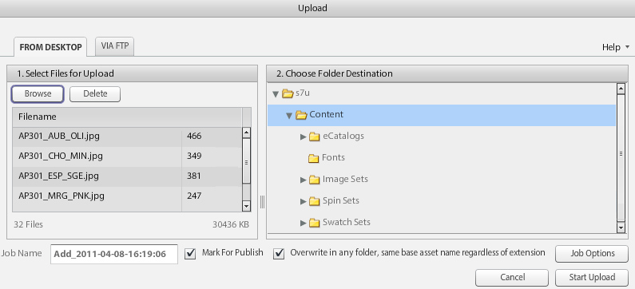

# Fluxo de trabalho principal do Dynamic Media Classic e visualização de ativos {#main-workflow}

O Dynamic Media suporta um processo de fluxo de trabalho Criar (e Fazer upload), Autor (e Publicar) e Entregar. Você start fazendo upload de ativos e, em seguida, fazendo algo com esses ativos, como criar um Conjunto de imagens, e, por fim, publicando para torná-los ativos. A etapa Build é opcional para alguns workflows. Por exemplo, se sua meta é apenas fazer dimensionamento dinâmico e aplicar zoom em imagens ou converter e publicar vídeos para transmissão, não há etapas de compilação necessárias.

O fluxo de trabalho nas soluções do Dynamic Media Classic consiste em três etapas principais:

1. Criar (e carregar) SourceContent
2. Ativos de autor (e publicação)
3. Fornecer ativos

## Etapa 1: Criar (e carregar)

Este é o início do fluxo de trabalho. Nesta etapa, você coleta ou cria o conteúdo de origem que se encaixa no fluxo de trabalho que está usando e o carrega no Dynamic Media Classic. O sistema oferece suporte a vários tipos de arquivos para imagens, vídeo e fontes, mas também para PDF, Adobe Illustrator e Adobe InDesign.

Consulte a lista completa de [Tipos de arquivos suportados](https://docs.adobe.com/content/help/en/dynamic-media-classic/using/upload-publish/uploading-files.html#supported-asset-file-formats).

Você pode carregar o conteúdo de origem de várias maneiras diferentes:

- Diretamente da sua área de trabalho ou rede local. [Saiba como](https://docs.adobe.com/content/help/en/dynamic-media-classic/using/upload-publish/uploading-files.html#upload-files-using-sps-desktop-application).
- De um servidor FTP do Dynamic Media Classic. [Saiba como](https://docs.adobe.com/content/help/en/dynamic-media-classic/using/upload-publish/uploading-files.html#upload-files-using-via-ftp).

O modo padrão é Da área de trabalho, onde você procura arquivos na rede local e start o upload.

>[!TIP]
>
>Não adicione manualmente suas pastas. Em vez disso, execute um upload do FTP e use a opção **Incluir subpastas** para recriar a estrutura de pastas no Dynamic Media Classic.

As duas opções de carregamento mais importantes estão ativadas por padrão. **Marque para Publicar**, o que discutimos anteriormente, e **Substituir**. Substituir significa que, se o arquivo que está sendo carregado tiver o mesmo nome de um arquivo que já está no sistema, o novo arquivo substituirá a versão existente. Se você desmarcar essa opção, talvez o arquivo não seja carregado.

### Opções de substituição ao carregar imagens

Há quatro variações da opção Substituir imagem que podem ser definidas para toda a sua empresa e muitas vezes são mal compreendidas. Resumindo, você define as regras de forma que deseja que os ativos com o mesmo nome sejam substituídos com mais frequência, ou deseja que as substituições ocorram com menos frequência (nesse caso, a nova imagem será renomeada com uma extensão &quot;-1&quot; ou &quot;-2&quot;).

- **Substituir na pasta atual, mesmo nome/extensão** da imagem base.
Essa opção é a regra mais rigorosa para substituição. Ele requer que você carregue a imagem de substituição na mesma pasta que a original e que a imagem de substituição tenha a mesma extensão de nome de arquivo que a original. Se esses requisitos não forem atendidos, um duplicado será criado.

- **Substituir na pasta atual, o mesmo nome do ativo base, independentemente da extensão**.
Requer que você carregue a imagem de substituição na mesma pasta do original, no entanto, a extensão do nome do arquivo pode ser diferente do original. Por exemplo, o arquivo visit.tif substitui o arquivo

- **Substituir em qualquer pasta, mesmo nome/extensão** do ativo base.
Exige que a imagem de substituição tenha a mesma extensão de nome de arquivo que a imagem original (por exemplo, o arquivo visit.jpg deve substituir o arquivo President.jpg, e não o domínio.tif ). No entanto, é possível carregar a imagem de substituição para uma pasta diferente da original. A imagem atualizada reside na nova pasta; o arquivo não pode mais ser encontrado em seu local original.

- **Substituir em qualquer pasta, o mesmo nome do ativo base, independentemente da extensão**.
Essa opção é a regra de substituição mais inclusiva. Você pode carregar uma imagem de substituição para uma pasta diferente da original, carregar um arquivo com uma extensão de nome de arquivo diferente e substituir o arquivo original. Se o arquivo original estiver em uma pasta diferente, a imagem de substituição residirá na nova pasta para a qual foi carregada.

Saiba mais sobre a [opção Substituir imagens](https://docs.adobe.com/content/help/en/dynamic-media-classic/using/setup/application-setup.html#using-the-overwrite-images-option).

Embora não seja necessário, ao fazer upload usando qualquer um dos dois métodos acima, você pode especificar Opções de trabalho para esse upload em particular. por exemplo, para agendar um upload recorrente, defina opções de recorte ao carregar e muitas outras. Estes podem ser valiosos para alguns workflows, então vale a pena considerar se podem ser para os seus.

Saiba mais sobre [Opções de Trabalho](https://docs.adobe.com/content/help/en/dynamic-media-classic/using/upload-publish/uploading-files.html#upload-options).

O upload é a primeira etapa necessária em qualquer fluxo de trabalho, pois o Dynamic Media Classic não pode funcionar com nenhum conteúdo que ainda não esteja em seu sistema. Em segundo plano durante o upload, o sistema registra cada ativo carregado com o banco de dados centralizado do Dynamic Media Classic, atribui uma ID e a copia para o armazenamento. Além disso, o sistema converte arquivos de imagem em um formato que permite redimensionamento e zoom dinâmicos e converte arquivos de vídeo para o formato compatível com a Web MP4.

### Conceito: Veja o que acontece com as imagens quando você as carrega para o Dynamic Media Classic

Quando você carrega uma imagem de qualquer tipo no Dynamic Media Classic, ela é convertida em um formato de imagem principal chamado TIFF em pirâmide ou P-TIFF. Um P-TIFF é semelhante ao formato de uma imagem de bitmap TIFF em camadas, exceto que, em vez de camadas diferentes, o arquivo contém vários tamanhos (resoluções) da mesma imagem.

À medida que a imagem é convertida, o Dynamic Media Classic pega um &quot;instantâneo&quot; do tamanho total da imagem, dimensiona isso pela metade e a salva, dimensiona pela metade e a salva, e assim por diante, até que seja preenchida com múltiplos uniformes do tamanho original. Por exemplo, um P-TIFF de 2000 pixels terá tamanhos de 1000, 500, 250 e 125 pixels (e menores) no mesmo arquivo. O arquivo P-TIFF é o formato do que é chamado de &quot;imagem principal&quot; no Dynamic Media Classic.

Quando você solicita uma imagem de determinado tamanho, a criação do P-TIFF permite que o Servidor de imagens para o Dynamic Media Classic localize rapidamente o próximo tamanho maior e diminua o tamanho. Por exemplo, se você carregar uma imagem de 2000 pixels e solicitar uma imagem de 100 pixels, o Dynamic Media Classic encontrará a versão de 125 pixels e a reduzirá para 100 pixels em vez de dimensionar de 2000 para 100 pixels. Isso torna a operação muito rápida. Além disso, ao aplicar zoom em uma imagem, isso permite que o visualizador de zoom solicite apenas um bloco da imagem com zoom, em vez da imagem com resolução completa. É assim que o formato de imagem principal, o arquivo P-TIFF, suporta o dimensionamento dinâmico e o zoom.

Da mesma forma, você pode carregar o vídeo de origem principal no Dynamic Media Classic, e fazer upload do Dynamic Media Classic pode redimensioná-lo automaticamente e convertê-lo no formato MP4 compatível com a Web.

### Regras de miniatura para determinar o tamanho ideal das imagens que você carrega

**Carregue imagens no maior tamanho necessário.**

- Se precisar aplicar zoom, carregue uma imagem de alta resolução de um intervalo de 1500 a 2500 pixels na dimensão mais longa. Considere quantos detalhes você deseja fornecer, a qualidade das imagens de origem e o tamanho do produto que está sendo exibido. Por exemplo, faça upload de uma imagem de 1000 pixels para um minúsculo anel, mas de uma imagem de 3000 pixels para uma cena inteira de salas.
- Se não precisar aplicar zoom, faça upload do zoom no tamanho exato em que ele será visto. Por exemplo, se você tiver logotipos ou imagens de apresentação/banner para colocar em suas páginas, carregue-os exatamente no tamanho 1:1 e chame-os exatamente nesse tamanho.

**Nunca atualize ou exploda suas imagens antes de fazer upload para o Dynamic Media Classic.** Por exemplo, não atualize a amostra de uma imagem menor para torná-la uma imagem de 2000 pixels. Não vai ficar bom. Torne suas imagens o mais próximas possível da perfeição antes de carregá-las.

**Não há tamanho mínimo para zoom, mas, por padrão, os visualizadores não aumentarão o zoom para além de 100%.** Se a sua imagem for muito pequena, ela não aumentará nem um pouco o zoom ou apenas aumentará um pouco o zoom para evitar que pareça ruim.

**Embora não haja um mínimo para tamanho de imagem, não recomendamos carregar imagens gigantes.** Uma imagem gigante pode ser considerada mais de 4000 pixels. Carregar imagens desse tamanho pode mostrar possíveis falhas como grãos de poeira ou pêlos na imagem. Essas imagens também ocuparão mais espaço no servidor do Dynamic Media Classic, o que pode fazer com que você ultrapasse os limites de armazenamentos contratados.

Saiba mais sobre [Carregar arquivos](https://docs.adobe.com/content/help/en/dynamic-media-classic/using/upload-publish/uploading-files.html#uploading-your-files).

## Etapa 2: Autor (e publicar)

Depois de criar e carregar seu conteúdo, você criará novos ativos de mídia avançada a partir de seus ativos carregados, executando um ou mais subworkflows. Isso inclui todos os tipos diferentes de coleções de conjuntos. Conjuntos de imagem, amostra, rotação e mídia mista, bem como modelos. Também inclui vídeo. Posteriormente, entraremos em detalhes muito maiores sobre cada tipo de conjunto de coleções de imagens e mídia avançada de vídeo. No entanto, em quase todos os casos, você start selecionando um ou mais ativos (ou não tem nenhum ativo selecionado) e escolhendo o tipo de ativo que deseja criar. Por exemplo, você pode selecionar uma imagem principal e algumas visualizações dessa imagem e optar por criar um Conjunto de imagens, uma coleção de visualizações alternativas do mesmo produto.

>[!IMPORTANT]
>
>Certifique-se de que todos os ativos estejam marcados para publicação. Embora, por padrão, todos os ativos sejam marcados automaticamente para publicação no upload, todos os ativos recém-criados do conteúdo carregado também precisarão ser marcados para publicação.

Depois de criar seu novo ativo, você executará um trabalho de publicação. Você pode fazer isso manualmente ou agendar um trabalho de publicação que é executado automaticamente. A publicação copia todo o conteúdo da esfera privada do Dynamic Media Classic para o público e publica a esfera do servidor da equação. O produto de um trabalho de publicação de Dynamic Media é um URL exclusivo para cada ativo publicado.

O servidor para o qual você publica depende do tipo de conteúdo e fluxo de trabalho. Por exemplo, todas as imagens vão para o Servidor de imagens e fazem streaming de vídeo para o Servidor FMS. Para sua conveniência, falaremos de uma &quot;publicação&quot; como um único evento para um único servidor.

A publicação publica todo o conteúdo marcado para publicação — não apenas o seu conteúdo. Um único administrador geralmente publica em nome de todos, em vez de usuários individuais que executam uma publicação. O administrador pode publicar conforme necessário ou configurar um trabalho periódico diário, semanal ou mesmo a cada 10 minutos que será publicado automaticamente. Publique em um agendamento que faça sentido para sua empresa.

>[!TIP]
>
>Automatize seus trabalhos de publicação e agende uma publicação completa para ser executada todos os dias às 12h00 ou a qualquer momento da noite.

### Conceito: Como entender o URL do Dynamic Media Classic

O produto final de um fluxo de trabalho do Dynamic Media Classic é um URL que aponta para o ativo (seja o conjunto de imagens ou o conjunto de vídeos adaptáveis). Esses URLs são muito previsíveis e seguem o mesmo padrão. No caso de imagens, cada imagem é gerada a partir da imagem principal P-TIFF.

Esta é a sintaxe do URL de uma imagem com alguns exemplos:

No URL, tudo à esquerda do ponto de interrogação é o caminho virtual para uma imagem específica. Tudo à direita do ponto de interrogação é um modificador do Servidor de imagens, uma instrução de como processar a imagem. Quando existem vários modificadores, eles são separados por E comercial.

No primeiro exemplo, o caminho virtual para a imagem &quot;Backpack_A&quot; é `http://sample.scene7.com/is/image/s7train/BackpackA`. Os modificadores do Servidor de imagens redimensionam a imagem para uma largura de 250 pixels (de wid=250) e reamostram a imagem usando o algoritmo de interpolação de Lanczos, que é afiado à medida que é redimensionado (de resMode=shark2).

O segundo exemplo aplica o que é conhecido como &quot;predefinição de imagem&quot; à mesma imagem Backpack_A, conforme indicado por $!_template300$. Os símbolos $ em ambos os lados da expressão indicam que uma predefinição de imagem, um conjunto empacotado de modificadores de imagem, está sendo aplicada à imagem.

Assim que você entender como os URLs do Dynamic Media Classic são reunidos, você saberá como alterá-los de forma programática e como integrá-los mais detalhadamente no seu site e nos sistemas de backend.

### Conceito: Compreensão do atraso do armazenamento em cache

Os ativos recém-carregados e publicados serão vistos imediatamente, enquanto os ativos atualizados podem estar sujeitos ao atraso de armazenamento em cache de 10 horas. Por padrão, todos os ativos publicados têm no mínimo 10 horas antes de expirarem. Dizemos o mínimo, porque toda vez que a imagem é visualizada, ela start um relógio que não expira até que 10 horas tenham decorrido no qual ninguém tenha visualizado essa imagem. Esse período de 10 horas é o &quot;Tempo de vida&quot; de um ativo. Quando o cache expirar para esse ativo, a versão atualizada poderá ser entregue.

Normalmente, isso não ocorre a menos que ocorra um erro e a imagem/ativo tenha o mesmo nome da versão publicada anteriormente, mas há um problema com a imagem. Por exemplo, você carregou acidentalmente uma versão de baixa resolução ou seu diretor de arte não aprovou a imagem. Nesse caso, lembre-se da imagem original e substitua-a por uma nova versão usando a mesma ID de ativo.

Saiba como [Limpar manualmente o cache para os URLs que precisam ser atualizados](https://docs.adobe.com/content/help/en/experience-manager-65/assets/dynamic/invalidate-cdn-cached-content.html).

>[!TIP]
>
>Para evitar problemas com atraso no armazenamento em cache, sempre trabalhe com antecedência. uma noite, um dia, duas semanas, etc. Acelere o tempo de garantia de qualidade/aceitação para que as partes internas provas seu trabalho antes de lançá-lo ao público. Mesmo trabalhando uma noite antes permite que você faça mudanças e republique essa noite. Pela manhã, as 10 horas passaram e o cache é atualizado com a imagem correta.

- Saiba mais sobre [Criar um trabalho de publicação](https://docs.adobe.com/content/help/en/dynamic-media-classic/using/upload-publish/publishing-files.html#creating-a-publish-job).
- Saiba mais sobre [Publicação](https://docs.adobe.com/content/help/en/dynamic-media-classic/using/upload-publish/publishing-files.html).

## Etapa 3: Entregar

Lembre-se de que o produto final de um fluxo de trabalho do Dynamic Media Classic é um URL que aponta para o ativo. O URL pode apontar para uma imagem individual, um Conjunto de imagens, um Conjunto de rotação ou outra coleção ou vídeo do Conjunto de imagens. Você precisa pegar esse URL e fazer algo com ele, como editar seu HTML para que as tags `` apontem para a imagem do Dynamic Media Classic em vez de apontar para uma imagem que vem do site atual.

Na etapa de entrega, você deve integrar esses URLs ao seu site, aplicativo móvel, campanha de email ou qualquer outro ponto de contato digital no qual deseja exibir o ativo.

Exemplo de integração do URL do Dynamic Media Classic para uma imagem em um site:

O URL em vermelho é o único elemento específico do Dynamic Media Classic.

Sua equipe de TI ou parceiro de integração pode assumir a liderança ao escrever e alterar códigos para integrar URLs do Dynamic Media Classic ao seu site. A Adobe tem uma equipe de consultoria que pode ajudar nesse esforço, fornecendo orientação técnica, criativa ou geral.

Para soluções mais complexas, como visualizadores de zoom ou visualizadores que combinam zoom com visualizações alternativas, o URL geralmente aponta para um visualizador hospedado pelo Dynamic Media Classic, e também dentro desse URL é uma referência a uma ID de ativo.

Exemplo de um link (em vermelho) que abrirá um Conjunto de imagens em um visualizador em uma nova janela pop-up:

>[!IMPORTANT]
>
>É necessário integrar os URLs do Dynamic Media Classic ao seu site, aplicativo móvel, email e outros pontos de contato digitais. O Dynamic Media Classic não pode fazer isso por você!

## Visualizar ativos

Você provavelmente vai querer pré-visualização nos ativos que carregou ou que estão criando ou editando para garantir que eles sejam exibidos como você deseja quando seus clientes os visualizações. Você pode acessar a janela Pré-visualização clicando em qualquer botão **Pré-visualização**, na miniatura do ativo, na parte superior do **Painel de navegação/criação**, ou indo para **Arquivo > Pré-visualização**. Em uma janela do navegador, ele fará a pré-visualização de qualquer ativo que estiver atualmente no painel, seja uma imagem, um vídeo ou um ativo criado, como um Conjunto de imagens.

### Pré-visualização de tamanho dinâmico (predefinições de imagem)

Você pode pré-visualização suas imagens em vários tamanhos usando a pré-visualização **Tamanhos**. Isso carrega uma lista de suas predefinições de imagem disponíveis. Discutiremos as predefinições de imagens mais tarde, mas considere-as como &quot;receitas&quot; para carregar a imagem em um tamanho nomeado com quantidades específicas de nitidez e qualidade de imagem.

### Pré-visualização de zoom

Você também pode usar a opção **Zoom** para pré-visualização da imagem em uma das várias predefinições de zoom pré-criadas, que são baseadas em diferentes visualizadores de zoom incluídos.

Saiba mais sobre [Visualizar ativos](https://docs.adobe.com/content/help/en/dynamic-media-classic/using/managing-assets/previewing-asset.html).
