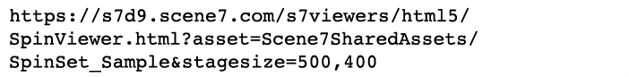

# Conjuntos de imagens, amostras, rotação e mídia mista {#media-sets}

Além de imagens únicas para dimensionamento e zoom dinâmicos, as coleções de conjuntos do Dynamic Media Classic permitem uma experiência online mais rica. Esta seção do tutorial explorará como criar os seguintes conjuntos de mídia avançada no Dynamic Media Classic:

- Definição de imagem
- Conjunto de amostras
- Grupo de rotação
- Conjunto de mix de mídia

Ele também explicará como usar predefinições de conjuntos de lotes para automatizar a criação de conjuntos de configurações por meio de um upload.

## Tudo O Que Você Sempre Deseja Saber Sobre Conjuntos

Ao lado do dimensionamento dinâmico básico e do zoom, os conjuntos são provavelmente o subproduto mais usado no Dynamic Media Classic. Os conjuntos são ativos essencialmente &quot;virtuais&quot; que não contêm imagens reais, mas consistem em um conjunto de relacionamentos com outras imagens e/ou vídeos. O principal apelo dos aparelhos é que eles são miniaplicações que estão prontas &quot;fora da prateleira&quot;. Com isso, queremos dizer que cada visualizador de conjunto contém sua própria lógica e interface para que tudo o que você precisa fazer é chamar para eles no site. Além disso, eles exigem que você rastreie uma única ID de ativo por conjunto, em vez de precisar gerenciar todos os ativos e relacionamentos do membro por conta própria.

Quando você cria um conjunto, esse conjunto é gerenciado como um ativo separado que deve ser marcado para publicação e publicação antes que possa ser disponibilizado a partir de um URL. Todos os ativos dos membros também devem ser publicados.

### Tipos de conjuntos

Saiba mais sobre os quatro tipos de conjuntos que você pode criar no Dynamic Media Classic: Conjuntos de imagens, amostras, rotação e mídia mista.

## Definição de imagem

Esse é o tipo mais comum de conjunto. Normalmente, você o usa para visualizações alternativas do mesmo item. Consiste em várias imagens que você carrega no visualizador clicando na miniatura associada a essa imagem.

_Exemplo de um conjunto de imagens_

O URL do conjunto de imagens acima pode ser exibido como:

- Saiba mais sobre Conjuntos de imagens com o [Start rápido para Conjuntos de imagens](https://docs.adobe.com/content/help/en/dynamic-media-classic/using/image-sets/quick-start-image-sets.html).
- Saiba como [Criar um conjunto de imagens](https://docs.adobe.com/content/help/en/dynamic-media-classic/using/image-sets/creating-image-set.html#creating-an-image-set).

### Conjunto de amostras

Normalmente, esse tipo de conjunto é usado para exibir visualizações coloridas do mesmo item. Consiste em pares de imagens e amostras de cores.

A principal diferença entre uma Amostra e um Conjunto de imagens é que os Conjuntos de amostras usam uma imagem diferente como uma amostra clicável, enquanto os Conjuntos de imagens usam uma versão em miniatura clicável da imagem original.

Os Conjuntos de Amostras não colorem imagens (uma concepção errônea comum). As imagens estão sendo simplesmente trocadas, exatamente como em um Conjunto de imagens. As mini imagens de amostra poderiam ter sido criadas usando o Photoshop, cada cor poderia ter sido fotografada separadamente, ou a ferramenta Recortar no Dynamic Media Classic poderia ter sido usada para fazer uma amostra de uma das imagens coloridas.

_Exemplo de um conjunto de amostras_

O URL do conjunto de amostras acima pode ser exibido como:

- Saiba mais sobre Conjuntos de amostras com o [Start rápido para Conjuntos de amostras](https://docs.adobe.com/content/help/en/dynamic-media-classic/using/swatch-sets/quick-start-swatch-sets.html).
- Saiba como [Criar um conjunto de amostras](https://docs.adobe.com/content/help/en/dynamic-media-classic/using/swatch-sets/creating-swatch-set.html#creating-a-swatch-set).

### Grupo de rotação

Normalmente, esse conjunto é usado para mostrar uma visualização de 360 graus de um item. Como os Conjuntos de Amostras, os Conjuntos de rotação não usam mágica 3D. o verdadeiro trabalho é criar muitas fotos de uma imagem de todos os lados. O visualizador simplesmente permite alternar entre as imagens como uma animação stop-motion.

Os Conjuntos de rotação podem girar em uma direção ao longo de um único eixo ou se criados alternadamente como um Conjunto de rotação 2D. gire em vários eixos. Por exemplo, um carro pode ser rodado enquanto todas as rodas estão no chão, e então pode ser &quot;virado&quot; para cima e rodado em suas rodas traseiras também. Para um Conjunto de rotação 2D configurado corretamente, o número de imagens por linha para cada eixo deve ser o mesmo. Em outras palavras, se você está girando em dois eixos, você precisa de duas vezes mais imagens do que um único ângulo girando.

_Exemplo de um conjunto de rotação_

O URL do conjunto de rotação acima pode ser exibido como:

- Saiba mais sobre Conjuntos de rotação com o [Start rápido para Conjuntos de rotação](https://docs.adobe.com/content/help/en/dynamic-media-classic/using/spin-sets/quick-start-spin-sets.html).
- Saiba como [Criar um conjunto de rotação](https://docs.adobe.com/content/help/en/dynamic-media-classic/using/spin-sets/creating-spin-set.html#creating-a-spin-set).

## Conjunto de mix de mídia

Este é um conjunto de combinações. Ele permite combinar qualquer um dos conjuntos anteriores, bem como adicionar vídeo, em um único visualizador. Neste fluxo de trabalho, você cria qualquer um dos conjuntos de componentes primeiro e os reúne em um Conjunto de Mídias Misto.

_Exemplo de um conjunto de mídia mista_

O URL do Conjunto de mídia mista acima pode ser exibido como:

- Saiba mais sobre Conjuntos de mídia mista com o [Start rápido para Conjuntos de mídia mista](https://docs.adobe.com/content/help/en/dynamic-media-classic/using/mixed-media-sets/quick-start-mixed-media-sets.html).

- Saiba como [Criar um conjunto de mídia mista](https://docs.adobe.com/content/help/en/dynamic-media-classic/using/mixed-media-sets/creating-mixed-media-set.html#creating-a-mixed-media-set).

Para exibir uma imagem para zoom, um conjunto ou um vídeo em seu site, você a chama em um &quot;visualizador do Dynamic Media Classic&quot;. O Dynamic Media Classic inclui visualizadores para ativos de mídia avançada, como Conjuntos de amostras, Conjuntos de rotação, vídeo e muitos outros.

Saiba mais sobre [Visualizadores para AEM Assets e Dynamic Media Classic](https://docs.adobe.com/content/help/en/dynamic-media-developer-resources/library/viewers-aem-assets-dmc/c-html5-s7-aem-asset-viewers.html).

## Predefinições do conjunto de lotes

Até agora, discutimos como criar conjuntos manualmente usando a função Dynamic Media Classic Build. No entanto, é possível automatizar a criação de Conjuntos de imagens e Conjuntos de rotação usando uma Predefinição de conjunto de lotes, desde que você tenha uma convenção de nomenclatura padronizada.

Cada predefinição é um conjunto exclusivo de instruções autocontidas e nomeadas que define como construir o conjunto usando imagens que correspondem às convenções de nomenclatura definidas. Na predefinição, primeiro defina as convenções de nomenclatura para os ativos que deseja agrupar em um conjunto. Uma predefinição de conjunto de lotes pode ser criada para fazer referência a essas imagens.

Embora seja possível criar a predefinição você mesmo (eles são encontrados em **Configuração > Configuração do aplicativo > Predefinições do conjunto de lotes** ), como prática recomendada, você deve ter sua equipe de consultoria ou o Suporte técnico configurado para você. Eis o porquê:

- As predefinições de conjunto de lotes podem ser complexas de configurar — eles são alimentados por expressões regulares e, a menos que você seja um desenvolvedor, essa sintaxe pode ser desconhecida ou confusa.
- Depois de criados, eles são ativados por padrão. Não há função &quot;desfazer&quot;. Se você start o carregamento de milhares de imagens e sua predefinição está configurada incorretamente, você pode acabar com centenas ou milhares de conjuntos quebrados que devem ser encontrados e excluídos manualmente.

Uma convenção de nomenclatura simples foi sugerida anteriormente que seria muito fácil de ser incorporada a uma predefinição de conjunto de lotes. No entanto, como as predefinições são muito flexíveis, elas podem lidar com estratégias de nomeação complexas. Resumindo, as imagens que pertencem a um conjunto devem ser associadas por algum nome comum. frequentemente, é o número SKU ou a ID do produto. No Dynamic Media Classic, você informa uma convenção de nomenclatura padrão para que todas as suas imagens sejam usadas para uma predefinição ou pode criar várias predefinições, cada uma com regras de nomenclatura diferentes.

As predefinições do conjunto de lotes são aplicadas somente no upload; eles não podem ser executados depois que as imagens são carregadas. Assim, é importante planejar sua convenção de nomenclatura e obter uma predefinição criada antes de start o carregamento de todas as imagens.

Depois que as predefinições forem criadas, o administrador da Empresa poderá escolher se estão ativas ou inativas. Ativo significa que elas aparecerão na página de upload em **Opções de trabalho**, enquanto as predefinições inativas permanecerão ocultas.

Saiba como [Criar uma predefinição de conjunto de lotes](https://docs.adobe.com/content/help/en/dynamic-media-classic/using/setup/application-setup.html#creating-a-batch-set-preset).

### Uso de predefinições de conjunto de lotes no upload

Veja como você usa as predefinições de conjunto de lotes no upload após elas terem sido criadas:

1. Clique em **Carregar** e escolha **Da área de trabalho** ou **Via FTP**.
2. Clique em **Opções de Trabalho**.
3. Abra a opção **Predefinições do conjunto de lotes** e marque ou desmarque a predefinição para usá-la com o upload.
4. Depois que o upload terminar, procure os conjuntos concluídos na pasta.

Saiba mais sobre [Predefinições de Conjunto de Lotes](https://docs.adobe.com/content/help/en/dynamic-media-classic/using/setup/application-setup.html#batch-set-presets).
