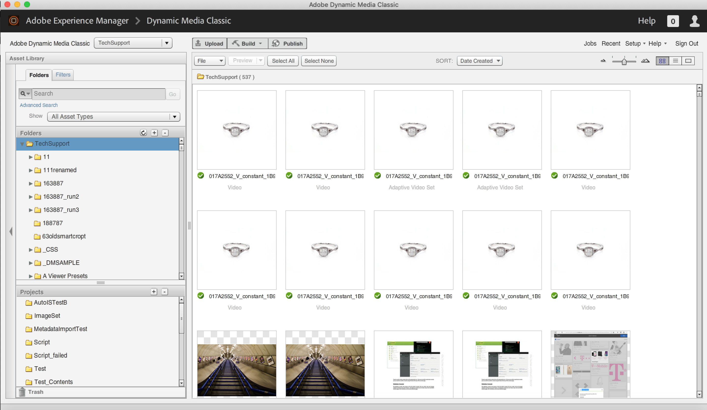

# Tutorial de práticas recomendadas do Dynamic Media Classic

Este guia tem como objetivo ajudar os usuários atuais e novos do Dynamic Media Classic a entender melhor o que eles podem fazer com a poderosa solução de mídia avançada do Adobe. Faremos isso:

- Apresentamos você ao Dynamic Media Classic, descrevendo o que é e fornecendo uma visão geral de seus principais recursos e interface do usuário (UI).
- Explicando o fluxo de trabalho geral Criar, Autor e Deliver , você seguirá ao trabalhar com ativos na solução.
- Discutir itens importantes para configurar antes de entrar e usar a solução.
- Faça um mergulho profundo no uso de vários dos principais recursos da solução.

Ao longo do guia, forneceremos exemplos, dicas e práticas recomendadas. Também explicaremos termos e conceitos importantes com os quais você deve se familiarizar ao trabalhar com o Dynamic Media Classic. E quando disponível para um determinado tópico, você será direcionado para webinars relevantes, publicações de blog e documentação online.

Esperamos que este guia forneça as informações necessárias para liberar um grande valor de sua solução Dynamic Media Classic. Para navegar mais facilmente pelos capítulos deste guia, clique no ícone de marcador no lado esquerdo do guia para ver seu conteúdo.

## Visão geral do Dynamic Media Classic

O Dynamic Media Classic é o hub no qual os clientes criam, criam e fornecem conteúdo de mídia avançada. O Dynamic Media Classic é um ambiente integrado de gerenciamento, publicação e fornecimento de mídia avançada. A mídia avançada pode ser entregue a todos os canais de marketing e vendas, incluindo Web, material impresso, campanhas por email, aplicativos da Web, desktops e dispositivos.

O serviço de imagem talvez seja a função mais usada do Dynamic Media Classic. Na verdade, a maioria dos clientes usa o Dynamic Media Classic para disponibilizar todas as imagens em seus sites, incluindo imagens para zoom ou mídia avançada. No entanto, também pode ser usado para muitos outros propósitos, incluindo entrega de vídeo e uso de IA para otimizar imagens entregues.

## Principais recursos da Dynamic Media Classic

Neste guia discutiremos os seguintes recursos principais do Dynamic Media Classic.

- **Imagem dinâmica.** O termo guarda-chuva para edição, formatação e dimensionamento em tempo real, e zoom e panorâmica interativos; Monitorização da cor e da textura; spin de 360 graus; modelos de imagem; e visualizadores de multimídia.
- **Vídeo.** Faça upload dos vídeos finais, publique-os e baixe-os progressivamente em visualizadores de vídeo configuráveis.
- **Imagem inteligente.** Tecnologia que utiliza os recursos do Adobe Sensei AI e funciona com as &quot;Predefinições de imagem&quot; existentes para melhorar o desempenho da entrega de imagens, otimizando automaticamente o formato, o tamanho e a qualidade da imagem, com base nos recursos do navegador do cliente.

Para descobrir recursos adicionais da solução, visite o [Documentação do Dynamic Media Classic](https://experienceleague.adobe.com/docs/dynamic-media-classic/using/intro/introduction.html).

## A interface do usuário (UI) do Dynamic Media Classic

A interface principal do usuário do Dynamic Media Classic consiste em três áreas principais: Barra de navegação global, Biblioteca de ativos e Painel de navegação/Painel de criação.

_Interface do usuário do Dynamic Media Classic_

**Barra de navegação global.** Localizado na parte superior da tela, você usará os botões desta barra para acessar as principais áreas e recursos da solução. Por exemplo, você o usará para acessar recursos de upload, abrir várias áreas de criação de ativos (conjunto de imagens, conjunto de rotação etc.), executar tarefas importantes, como configurar Predefinições de imagem e Predefinições do visualizador e publicar seus ativos. Desse ponto, você também pode monitorar seus trabalhos, ver atividades recentes e escolher entre uma variedade de opções de ajuda.

**Biblioteca de ativos.** Localizada no lado esquerdo da tela, há a Biblioteca de ativos, um painel que você usa para organizar os ativos em pastas e subpastas que você cria. Na parte superior do painel, você encontrará pesquisa e filtros para ajudá-lo a localizar ativos. A Pesquisa avançada permite pesquisar ao especificar várias opções como critérios para a pesquisa, incluindo campos de metadados ocultos anexados a esse ativo. Na parte inferior do painel, é possível ver os itens excluídos clicando no ícone Lixeira. Inicialmente, você não inicia com nenhuma pasta, exceto a pasta de nível superior, que tem o mesmo nome do nome de sua conta.

>[!NOTE]
>
>Os ativos na Lixeira serão automaticamente excluídos permanentemente sete dias após terem sido colocados lá, a menos que você os restaure.

**Navegar/Criar painel.** Este é o centro da interface do usuário, onde você irá procurar ativos no modo Procurar ou, se estiver no modo Criar, você o usará como uma tela para criar ativos como parte de um fluxo de trabalho. Ao entrar pela primeira vez, você verá o Painel Procurar. No centro da tela estão as versões em miniatura de suas imagens em uma exibição em Grade. É possível alterar para uma exibição de Lista ou selecionar um ativo e exibir detalhes dele usando a exibição Detalhes.

>[!IMPORTANT]
>
>Além de cada ID de ativo, há a variável **Marcar para publicação** switch. Quando a alternância está ativada (verde), isso indica que o ativo está marcado para publicação.

>[!TIP]
>
>Selecione o **Publicar após o upload** caixa de seleção na caixa de diálogo Fazer upload para publicar ativos automaticamente ao fazer upload.

Saiba mais sobre [Navegação na interface do usuário do Dynamic Media Classic](https://experienceleague.adobe.com/docs/dynamic-media-classic/using/getting-started/navigation-basics.html).
