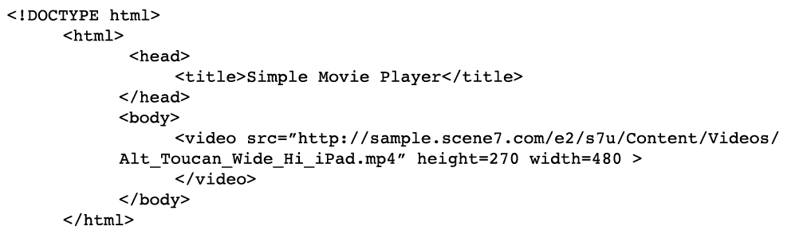

# Visão geral do vídeo {#video-overview}

O Dynamic Media Classic vem com a conversão automática de vídeo no upload, streaming de vídeo para desktop e dispositivos móveis e conjuntos de vídeo adaptáveis otimizados para reprodução com base no dispositivo e na largura de banda. Uma das coisas mais importantes sobre o vídeo é que o fluxo de trabalho é simples — é projetado para que qualquer pessoa possa usá-lo, mesmo que não esteja muito familiarizado com a tecnologia de vídeo.

Ao final desta seção do tutorial, você saberá:

- Faça upload e codifique (transcodifique) o vídeo para diferentes tamanhos e formatos
- Escolha entre predefinições de vídeo disponíveis para upload
- Adicionar ou editar uma predefinição de codificação de vídeo
- Visualizar vídeos em um visualizador de vídeo
- Implantar vídeo em sites da Web e móveis
- Adicionar legendas e marcadores de capítulo ao vídeo
- Personalizar e publicar visualizadores de vídeo para usuários de desktop e dispositivos móveis

>[!NOTE]
>
>Todos os URLs neste capítulo são apenas para fins ilustrativos; eles não são links ao vivo.

## Visão geral do vídeo do Dynamic Media Classic

Primeiramente, vamos ter uma ideia melhor das possibilidades de vídeo com o Dynamic Media Classic.

### Recursos e recursos

A plataforma de vídeo Dynamic Media Classic oferece todas as partes da solução de vídeo: upload, conversão e gerenciamento de vídeos; a capacidade de adicionar legendas e marcadores de capítulo a um vídeo; e a capacidade de usar predefinições para facilitar a reprodução.

Ele facilita a publicação de vídeos adaptativos de alta qualidade para transmissão em várias telas, incluindo dispositivos móveis para desktop, iOS, Android, Blackberry e Windows. Um Conjunto de vídeos adaptáveis agrupa versões do mesmo vídeo codificadas em diferentes formatos e taxas de bits, como 400 kbps, 800 kbps e 1000 kbps. O computador desktop ou dispositivo móvel detecta a largura de banda disponível.

Além disso, a qualidade do vídeo é alternada dinamicamente automaticamente se as condições da rede mudarem no desktop ou no dispositivo móvel. Além disso, se um cliente entrar no modo de tela cheia em um desktop, o Adaptive Video Set responde usando uma resolução melhor, melhorando assim a experiência de visualização do cliente. O uso de conjuntos de vídeos adaptáveis fornece a melhor reprodução possível para clientes que reproduzem o vídeo do Dynamic Media Classic em várias telas e dispositivos.

### Gerenciamento de vídeo

Trabalhar com vídeos pode ser mais complexo do que trabalhar com imagens digitais. Com o vídeo, você lida com vários formatos e padrões e com a incerteza sobre se o público-alvo poderá reproduzir seus clipes. O Dynamic Media Classic facilita o trabalho com vídeo, fornecendo muitas ferramentas poderosas &quot;sob o capuz&quot;, mas removendo a complexidade de trabalhar com elas.

O Dynamic Media Classic reconhece e pode trabalhar com vários formatos de origem diferentes disponíveis. No entanto, ler o vídeo é apenas uma parte do esforço — você também deve convertê-lo em um formato compatível com a Web. O Dynamic Media Classic cuida disso, permitindo a conversão de vídeo em vídeo H.264.

A conversão do vídeo você mesmo pode ficar muito complicado usando as muitas ferramentas profissionais e de entusiastas disponíveis. O Dynamic Media Classic a simplifica, oferecendo predefinições fáceis que são otimizadas para diferentes configurações de qualidade. No entanto, se você quiser algo mais personalizado, também poderá criar suas próprias predefinições.

Se você tiver muitos vídeos, ficará grato pela capacidade de gerenciar todos os seus ativos, juntamente com suas imagens e outras mídias no Dynamic Media Classic. Você pode organizar, catalogar e pesquisar seus ativos, incluindo ativos de vídeo, com suporte robusto a metadados XMP.

### Reprodução de vídeo

Semelhante ao problema de conversão de vídeo para torná-lo acessível e acessível à Web, é o problema de implementação e implantação de vídeo no site. Escolher se deseja comprar um reprodutor ou criar o seu próprio, tornando-o compatível com vários dispositivos e telas e, em seguida, manter seus reprodutores pode ser uma ocupação em tempo integral.

Novamente, a abordagem do Dynamic Media Classic é permitir que você escolha a predefinição e o visualizador que se adapte às suas necessidades. Você tem muitas opções diferentes de visualizador e uma biblioteca de várias predefinições disponíveis.

Você pode entregar vídeo facilmente na Web e em dispositivos móveis, já que o Dynamic Media Classic suporta vídeo HTML5, o que significa que você pode direcionar usuários que executam vários navegadores, bem como usuários de plataformas Android e iOS. O streaming de vídeo permite uma reprodução sem problemas de conteúdo maior ou de alta definição, enquanto o vídeo HTML5 progressivo tem predefinições otimizadas para a tela pequena.

As Predefinições do visualizador de vídeo podem ser configuradas parcialmente, dependendo do tipo do visualizador.

Assim como todos os visualizadores, a integração é via um único URL do Dynamic Media Classic por visualizador ou vídeo.

>[!NOTE]
>
>Como prática recomendada, use os visualizadores de vídeo HTML5 do Dynamic Media Classic. As predefinições usadas em visualizadores de vídeo HTML5 são players de vídeo robustos. Ao combinar em um único reprodutor a capacidade de projetar os componentes de reprodução usando HTML5 e CSS, ter reprodução incorporada e usar streaming adaptável e progressivo, dependendo da capacidade do navegador, você estende o alcance do conteúdo de mídia avançada para os usuários de desktop, tablet e dispositivos móveis e garante uma experiência de vídeo simplificada.

Uma última observação sobre o vídeo do Dynamic Media Classic que pode se aplicar a alguns clientes: nem todas as empresas podem ter conversão automática, streaming ou predefinições de vídeo ativadas para sua conta. Se, por algum motivo, você não conseguir acessar os URLs para transmissão de vídeo, esse pode ser o motivo. Você ainda poderá fazer upload e publicar progressivamente o vídeo baixado e ter acesso a todos os visualizadores de vídeo. Entretanto, para aproveitar todos os recursos de vídeo do Dynamic Media Classic, você deve entrar em contato com o Gerente de conta ou o Gerente de vendas para ativar esses recursos.

Saiba mais sobre [Vídeo no Dynamic Media Classic](https://docs.adobe.com/content/help/en/dynamic-media-classic/using/video/quick-start-video.html).

## Vídeo 101

### Conceitos básicos de vídeo e terminologia

Antes de começarmos, vamos discutir alguns termos com os quais você deve se familiarizar para trabalhar com vídeo. Esses conceitos não são específicos do Dynamic Media Classic e, se você for gerenciar vídeos para um site profissional, será bom obter mais educação sobre o assunto. Recomendaremos alguns recursos no final desta seção.

- **Codificação/transcodificação.** A codificação é o processo de aplicação da compactação de vídeo para converter dados de vídeo brutos e descompactados em um formato que facilita o trabalho. A transcodificação, embora semelhante, refere-se à conversão de um método de codificação para outro.

   - Os arquivos de vídeo mestre criados com o software de edição de vídeo geralmente são muito grandes e não estão no formato adequado para entrega em destinos online. Normalmente, eles são codificados para reprodução rápida no desktop e para edição, mas não para entrega na Web.
   - Para converter vídeo digital no formato e especificações adequados para reprodução em diferentes telas, os arquivos de vídeo são transcodificados para um tamanho de arquivo menor e eficiente, ideal para entrega na Web e em dispositivos móveis.

- **Compactação de vídeo.** Reduzir a quantidade de dados usados para representar imagens de vídeo digital e é uma combinação de compactação de imagem espacial e compensação de movimento temporal.

   - A maioria das técnicas de compactação apresenta perdas, o que significa que elas lançam dados para atingir um tamanho menor.
   - Por exemplo, o vídeo DV é compactado relativamente pouco e permite que você edite facilmente as imagens de origem, no entanto, é muito grande para usar na Web ou até mesmo colocar em um DVD.

- **Formatos de arquivo.** O formato é um contêiner, semelhante a um arquivo ZIP, que determina como os arquivos são organizados no arquivo de vídeo, mas geralmente não como são codificados.

   - Os formatos de arquivos comuns para vídeo de origem incluem Windows Media (WMV), QuickTime (MOV), Microsoft AVI e MPEG, entre outros. Os formatos publicados pelo Dynamic Media Classic são MP4.
   - Um arquivo de vídeo geralmente contém várias faixas — uma faixa de vídeo (sem áudio) e uma ou mais faixas de áudio (sem vídeo) — que são interrelacionadas e sincronizadas.
   - O formato de arquivo de vídeo determina como essas diferentes faixas de dados e metadados são organizados.

- **Codec.** Um codec de vídeo descreve o algoritmo pelo qual um vídeo é codificado por meio do uso de compactação. O áudio também é codificado por meio de um codec de áudio.

   - Os codecs minimizam a quantidade de informações necessárias para reproduzir o vídeo. Em vez de informações sobre cada quadro individual, somente as informações sobre as diferenças entre um quadro e o próximo são armazenadas.
   - Como a maioria dos vídeos muda pouco de um quadro para outro, os codecs permitem altas taxas de compactação, o que resulta em tamanhos de arquivo menores.
   - Um reprodutor de vídeo decodifica o vídeo de acordo com seu codec e exibe uma série de imagens, ou quadros, na tela.
   - Os codecs de vídeo comuns incluem H.264, On2 VP6 e H.263.

- **Resolução.** Altura e largura do vídeo em pixels.

   - O tamanho do vídeo de origem é determinado pela câmera e saída do software de edição. Uma câmera de alta definição geralmente cria vídeo de alta resolução 1920 x 1080, no entanto, para reproduzir sem problemas na Web, você pode fazer o downgrade (redimensionar) para uma resolução menor, como 1280 x 720, 640 x 480 ou menor.
   - A resolução tem um impacto direto no tamanho do arquivo, bem como na largura de banda necessária para reproduzir esse vídeo.

- **Exibir proporção.** Taxa da largura de um vídeo até a altura de um vídeo. Quando a proporção do vídeo não corresponde à proporção do player, você pode ver &quot;barras pretas&quot; ou espaço vazio. Duas taxas de aspecto comuns usadas para exibir vídeo são:

   - 4:3 (1,33:1). Usada para quase todo o conteúdo de transmissão de TV de definição padrão.
   - 16:9 (1,78:1). Usado para quase todos os conteúdos de TV de alta definição (HDTV) e filmes em tela larga.

- **Taxa de bits/taxa de dados.** A quantidade de dados que é codificada para formar um único segundo de reprodução de vídeo (em kilobits por segundo).

   - Geralmente, quanto menor a taxa de bits, mais desejável ela será para a Web, pois ela pode ser baixada mais rapidamente. No entanto, também pode significar que a qualidade é baixa por causa da perda de compressão.
   - Um bom codec deve equilibrar a baixa taxa de bits com a boa qualidade.

- **Taxa de quadros (quadros por segundo ou FPS).** O número de quadros, ou imagens estáticas, para cada segundo de vídeo. Normalmente, a TV norte-americana (NTSC) é transmitida em 29,97 FPS; A televisão europeia e asiática (PAL) é transmitida em 25 SPF; O filme (analógico e digital) é tipicamente em 24 FPS (23.976).

   - Para tornar as coisas mais confusas, há também quadros progressivos e entrelaçados. Cada quadro progressivo contém um quadro de imagem inteiro, enquanto quadros entrelaçados contêm cada outra linha de pixels em um quadro de imagem. Os quadros são reproduzidos rapidamente e parecem se misturar. O filme usa um método de varredura progressivo, enquanto o vídeo digital geralmente é entrelaçado.
   - Em geral, não importa se a gravação de origem está entrelaçada ou não — o Dynamic Media Classic manterá o método de verificação no vídeo convertido.
   - Transmissão/Entrega progressiva. O streaming de vídeo é o envio de mídia em um fluxo contínuo que pode ser reproduzido à medida que chega, enquanto o download progressivo do vídeo é feito como qualquer outro arquivo de um servidor e armazenado em cache localmente em seu navegador.

Com sorte, esse mecanismo ajuda você a entender as várias opções envolvidas no uso do vídeo do Dynamic Media Classic.

## Fluxo de trabalho do vídeo

Ao trabalhar com vídeo no Dynamic Media Classic, você segue um fluxo de trabalho básico semelhante ao trabalho com imagens.

1. Comece carregando arquivos de vídeo no Dynamic Media Classic. Para fazer isso, abra o **Tools Menu** na parte inferior do painel de extensão do Dynamic Media Classic e escolha **Upload to Dynamic Media Classic > Files to folder name** ou **Upload to Dynamic Media Classic > Folders to folder name**. &quot;Nome da pasta&quot; será qualquer pasta que você estiver navegando atualmente com a extensão. Os arquivos de vídeo podem ser grandes, portanto, recomendamos usar o FTP para fazer upload de arquivos grandes. Como parte do upload, escolha uma ou mais predefinições de vídeo para codificar seus vídeos. Vídeo pode ser transcodificado para vídeo MP4 no upload. Consulte o tópico Predefinições de vídeo abaixo para obter mais informações sobre o uso e a criação de predefinições de codificação. Saiba mais sobre [Upload e codificação de vídeos](https://docs.adobe.com/content/help/en/dynamic-media-classic/using/video/uploading-encoding-videos.html).
2. Selecione ou selecione e modifique uma predefinição do visualizador de vídeo e visualize seu vídeo. Você escolheria uma Predefinição do visualizador pré-criada ou personalizaria a sua. Se você estiver direcionando usuários móveis, não será necessário fazer nada aqui, pois as plataformas móveis não exigem um visualizador ou uma predefinição. Saiba mais sobre [Visualização de vídeos em um visualizador de vídeo](https://docs.adobe.com/content/help/en/dynamic-media-classic/using/video/previewing-videos-video-viewer.html) e [Adicionar ou editar uma predefinição do visualizador de vídeo](https://docs.adobe.com/content/help/en/dynamic-media-classic/using/video/previewing-videos-video-viewer.html#adding-or-editing-a-video-viewer-preset).
3. Execute uma publicação de vídeo, obtenha o URL e integre. A principal diferença entre essa etapa do fluxo de trabalho do vídeo e o fluxo de trabalho da imagem é que você executará uma Publicação de vídeo especial em vez de (ou talvez também) a publicação padrão de Exibição de imagem. A integração do visualizador de vídeo no desktop funciona exatamente como a integração do visualizador de imagens, no entanto, para dispositivos móveis é ainda mais simples — tudo o que você precisa é o URL do próprio vídeo.

### Sobre a transcodificação

A transcodificação foi definida anteriormente como o processo de conversão de um método de codificação para outro. No caso do Dynamic Media Classic, é o processo de conversão do vídeo de origem do formato atual para MP4. Isso é necessário antes que o vídeo seja exibido no navegador do desktop ou em um dispositivo móvel.

O Dynamic Media Classic pode lidar com toda a transcodificação para você, um grande benefício. Você pode transcodificar o vídeo por conta própria e fazer upload dos arquivos já convertidos para MP4, mas isso pode ser um processo complexo que requer software sofisticado. A menos que você saiba o que está fazendo, normalmente não obterá bons resultados em sua primeira tentativa.

O Dynamic Media Classic não só converte os arquivos para você, como também facilita o fornecimento de predefinições fáceis de usar. Você realmente não precisa saber muito sobre o lado técnico deste processo — tudo que você deve saber é aproximadamente o tamanho final que você quer obter do sistema e uma noção da largura de banda que seus usuários finais têm.

Embora as predefinições pré-criadas sejam úteis e cubram a maioria das necessidades, às vezes você quer algo mais personalizado. Nesse caso, você pode criar sua própria predefinição de codificação. No Dynamic Media Classic, uma predefinição de codificação é chamada de Predefinição de vídeo. Isso será explicado mais tarde neste capítulo.

### Sobre transmissão

Outro recurso importante que vale a pena notar é o streaming de vídeo, um recurso padrão da plataforma de vídeo Dynamic Media Classic. A mídia de streaming é constantemente recebida e apresentada a um usuário final enquanto é entregue. Isto é significativo e desejável por várias razões.

O streaming geralmente requer menos largura de banda do que o download progressivo, pois somente a parte do vídeo que é assistida é realmente entregue. O servidor de transmissão de vídeo do Dynamic Media Classic e os visualizadores usam a detecção automática de largura de banda para fornecer o melhor fluxo possível para a conexão de Internet de um usuário.

Com o streaming, o vídeo começa a ser reproduzido antes do que com outros métodos. Também torna o uso dos recursos de rede mais eficiente, pois somente as partes do vídeo visualizadas são enviadas ao cliente.

O outro método de delivery é o download progressivo. Comparado ao streaming de vídeo, há apenas um benefício consistente no download progressivo — você não precisa de um servidor de streaming para fornecer o vídeo. E é claro que é aqui que o Dynamic Media Classic entra — o Dynamic Media Classic tem um servidor de transmissão integrado à plataforma, de modo que você não precisa do incômodo ou do custo extra de manter este hardware dedicado.

O vídeo de download progressivo pode ser veiculado em qualquer servidor da Web normal. Embora isso possa ser conveniente e potencialmente econômico, lembre-se de que os downloads progressivos têm recursos limitados de busca e navegação e os usuários podem acessar e redefinir o propósito de seu conteúdo. Em algumas situações, como reprodução por trás de firewalls de rede muito rígidos, a entrega de streaming pode ser bloqueada; nesses casos, a reversão para o delivery progressivo pode ser desejável.

O download progressivo é uma boa opção para hobbies ou sites que têm requisitos de tráfego baixos; se não se importam se o seu conteúdo é armazenado em cache no computador de um usuário; caso precisem apenas fornecer vídeos de duração mais curta (menos de 10 minutos); ou se os visitantes não conseguirem receber vídeo de transmissão por algum motivo.

Você precisará transmitir o vídeo se precisar de recursos avançados e controle sobre a entrega do vídeo e/ou se precisar exibi-lo para públicos-alvo maiores (por exemplo, várias centenas de visualizadores simultâneos), rastrear e relatar o uso ou a exibição de estatísticas, ou se desejar oferecer aos visualizadores a melhor experiência interativa de reprodução.

Por fim, se você estiver preocupado com a proteção de sua mídia em questões de propriedade intelectual ou de gerenciamento de direitos, o streaming oferece uma entrega de vídeo mais segura, pois a mídia não é salva no cache do cliente quando transmitida.

## Predefinições do vídeo

Ao fazer upload do vídeo, você escolhe uma ou mais predefinições que contêm as configurações para converter o vídeo mestre em um formato compatível com a Web por meio de codificação. As predefinições de vídeo vêm em duas opções: Predefinições de vídeo adaptáveis e Predefinições de codificação única.

Consulte [Predefinições de vídeo disponíveis](https://docs.adobe.com/content/help/en/dynamic-media-classic/using/setup/application-setup.html#video-presets-for-encoding-video-files).

As Predefinições de vídeo adaptativo são ativadas por padrão, o que significa que estão disponíveis para codificação. Se quiser usar uma única predefinição de codificação, o administrador precisará ativá-la para aparecer na lista de predefinições de vídeo.

Saiba como [Ativar ou Desativar predefinições de vídeo](https://docs.adobe.com/content/help/en/dynamic-media-classic/using/video/uploading-encoding-videos.html#activating-or-deactivating-video-encoding-presets).

Você pode escolher uma das muitas predefinições pré-criadas que vêm com o Dynamic Media Classic ou pode criar as suas próprias predefinições; no entanto, nenhuma predefinição é selecionada para upload por padrão. Em outras palavras, **se você não selecionar uma Predefinição de vídeo no upload, o vídeo não será convertido e talvez não possa ser publicado**. No entanto, você pode converter o vídeo por conta própria offline e fazer upload e publicar normalmente. As predefinições de vídeo são necessárias somente se você deseja que o Dynamic Media Classic faça a conversão.

No upload, selecione uma Predefinição de vídeo escolhendo **Opções de vídeo** no painel Opções de trabalho. Em seguida, escolha se deseja codificar para Computador, Móvel ou Tablet.

- O computador é para uso na área de trabalho. Aqui você normalmente encontra predefinições maiores (como HD) que consomem mais largura de banda.
- Dispositivos móveis e tablets criam vídeo MP4 para dispositivos como iPhones e smartphones Android. A única diferença entre o Mobile e o Tablet é que as predefinições do Tablet normalmente têm uma largura de banda maior, porque são baseadas no uso do WiFi. As predefinições móveis são otimizadas para um uso 3G mais lento.

### Perguntas a se fazer antes de escolher uma predefinição

Ao escolher uma predefinição, você deve conhecer seu público-alvo, bem como suas imagens de origem. O que você sabe sobre seu cliente? Como eles estão assistindo o vídeo — com um monitor de computador ou um dispositivo móvel?

Qual é a resolução do seu vídeo? Se você escolher uma predefinição maior que a original, poderá receber um vídeo borrado/pixelado. Não há problema se o vídeo for maior que a predefinição, mas não escolha uma predefinição maior que o vídeo de origem.

Qual é a sua proporção? Se vir barras pretas em torno do vídeo convertido, então você escolheu a proporção de aspecto errada. O Dynamic Media Classic não pode detectar automaticamente essas configurações porque primeiro precisaria examinar o arquivo antes de fazer o upload.

### Detalhamento das opções de vídeo

As predefinições de vídeo determinam como o vídeo será codificado ao especificar essas configurações. Se você não estiver familiarizado com esses termos, reveja o tópico Conceitos básicos de vídeo e Terminologia, acima.

- **Taxa de proporção.** Geralmente, tela 4:3 ou ampla16:9.
- **Tamanho.** É a mesma que a resolução de exibição e é medida em pixels. Isso está relacionado à taxa de proporção. Em uma proporção de 16:9, um vídeo será de 432 x 240 pixels, enquanto em 4:3 será de 320 x 240 pixels.
- **FPS.** As taxas de quadros padrão são de 30, 25 ou 24 quadros por segundo (fps), dependendo do padrão de vídeo — NTSC, PAL ou Film. Essa configuração não importa, pois o Dynamic Media Classic sempre usará a mesma taxa de quadros do vídeo de origem.
- **Formato.** Este será MP4.
- **Largura de banda.** Essa é a velocidade de conexão desejada para o usuário direcionado. Eles têm uma conexão de Internet rápida ou lenta? Eles normalmente usam computadores desktop ou dispositivos móveis? Isso também está relacionado à resolução (tamanho), porque quanto maior for o vídeo, mais largura de banda será necessária.

### Determinar a taxa de dados ou a &quot;taxa de bits&quot; para o vídeo

Calcular a taxa de bits do seu vídeo é um dos fatores menos conhecidos para veicular vídeos na Web, mas potencialmente o mais importante, pois afeta diretamente a experiência do usuário. Se você definir sua taxa de bits muito alta, você terá alta qualidade de vídeo, mas desempenho ruim. Usuários com conexões de Internet mais lentas serão forçados a esperar enquanto o vídeo pausa constantemente enquanto é reproduzido. No entanto, se for definido como muito baixo, a qualidade sofrerá. Dentro da predefinição de vídeo, o Dynamic Media Classic sugere uma gama de dados dependendo da largura de banda de destino. Este é um bom ponto de partida.

No entanto, se você quiser descobrir isso sozinho, precisará de uma calculadora de taxa de bits. Essa é uma ferramenta comumente usada por profissionais de vídeo e entusiastas do , para estimar quantos dados se encaixarão em um determinado fluxo ou parte da mídia (como um DVD).

## Criação de uma predefinição de vídeo personalizada

Às vezes, você pode achar que precisa de uma predefinição de vídeo especial que não corresponda às configurações das predefinições de vídeo de codificação incorporadas. Isso pode acontecer se você tiver um vídeo personalizado de um tamanho específico, como um vídeo criado a partir de um software de animação 3D ou um que tenha sido cortado do tamanho original. Talvez você queira experimentar diferentes configurações de largura de banda para fornecer vídeo de qualidade superior ou inferior. Seja qual for o caso, será necessário criar uma predefinição de vídeo de codificação única personalizada.

### Fluxo de trabalho da predefinição de vídeo

1. As Predefinições de vídeo estão localizadas em **Configuração > Configuração do aplicativo > Predefinições de vídeo**. Aqui você encontrará uma lista de todas as predefinições de codificação disponíveis para sua empresa.

   - Cada conta de vídeo de transmissão tem dezenas de predefinições prontas para uso, e se você criar suas próprias predefinições personalizadas, você também as verá aqui.
   - Você pode filtrar por tipo usando o menu suspenso . As predefinições são divididas em Computador, Móvel e Tablet.
      

2. A coluna Ativo permite escolher se deseja exibir todas as predefinições no upload ou apenas aquelas que você escolher. Se estiver nos EUA, talvez você queira desmarcar as predefinições do PAL europeu e, no Reino Unido/EMEA, desmarque as predefinições do NTSC.
3. Clique no botão **Adicionar** para criar uma predefinição personalizada. Isso abre o painel Adicionar predefinição de vídeo . O processo aqui é semelhante à criação de uma Predefinição de imagem.
4. Primeiro, dê a ele um **Nome de predefinição** para aparecer na lista de predefinições. No exemplo acima, essa predefinição é para vídeos tutoriais de captura de tela.
5. A **Descrição** é opcional, mas dará aos usuários uma dica de ferramenta que descreverá a finalidade dessa predefinição.
6. O **Codificar Sufixo de arquivo** será anexado ao final do nome do vídeo que você está criando aqui. Lembre-se de que você terá um Vídeo mestre, bem como esse vídeo codificado, que é um derivado do mestre, e que dois ativos no Dynamic Media Classic não podem ter a mesma ID de ativo.
7. **Dispositivos** de reprodução nos quais você escolhe o formato de arquivo de vídeo desejado (Computador, Móvel ou Tablet). Lembre-se de que o Mobile e o Tablet produzem o mesmo formato MP4. O Dynamic Media Classic só precisa saber em qual categoria colocar a predefinição; no entanto, a diferença teórica é que as predefinições do tablet são normalmente para uma conexão mais rápida à Internet, pois todas suportam WiFi.
8. **A** Taxa de dados do Target é algo que você deve descobrir por si mesmo, no entanto, você pode ver um intervalo sugerido na imagem abaixo. Como alternativa, você pode arrastar o controle deslizante para a largura de banda aproximada do destino. Para obter uma figura mais precisa, use uma calculadora de taxa de bits. Há um pouco de tentativa e erro envolvido.

   

9. Defina a **Proporção do arquivo de origem**. Essa configuração está diretamente vinculada ao tamanho abaixo. Se você escolher _Personalizado_, será necessário inserir manualmente a largura e a altura.
10. Se você escolher uma proporção, defina um valor para **Resolution Size** e Dynamic Media Classic preencherá o outro valor automaticamente. No entanto, para uma taxa de proporção personalizada, preencha ambos os valores. Seu tamanho deve estar de acordo com sua taxa de dados. Se você definir uma taxa de dados muito baixa e um tamanho grande, você espera que a qualidade seja ruim.
11. Clique em **Salvar** para salvar sua predefinição. Diferente de todas as outras predefinições, não é necessário publicar neste ponto, pois as predefinições são apenas para upload de arquivos. Posteriormente, será necessário publicar os vídeos codificados, mas as predefinições são somente para uso interno do Dynamic Media Classic.
12. Para verificar se a predefinição de vídeo está na lista de upload, vá para **Fazer upload**.Escolha **Opções de trabalho** e expanda **Opções de vídeo**. Sua predefinição será listada na categoria do dispositivo de reprodução escolhido (Computador, Móvel ou Tablet).

Saiba mais sobre [Adicionar ou editar uma predefinição de vídeo](https://docs.adobe.com/content/help/en/dynamic-media-classic/using/video/uploading-encoding-videos.html#adding-or-editing-a-video-encoding-preset).

## Adicionar legendas ao vídeo

Em alguns casos, pode ser útil adicionar legendas ao seu vídeo, por exemplo, quando você precisar fornecer o vídeo aos visualizadores em vários idiomas, mas não quiser dublar o áudio em outro idioma ou gravar o vídeo novamente em idiomas separados. Além disso, a adição de legendas oferece maior acessibilidade para quem tem audição deficiente e usa legendas ocultas. O Dynamic Media Classic facilita a adição de legendas aos vídeos.

Saiba como [Adicionar legendas ao vídeo](https://docs.adobe.com/content/help/en/dynamic-media-classic/using/video/adding-captions-video.html).

## Adicionar marcadores de capítulo ao seu vídeo

Para vídeos de formulário longo, seus visualizadores provavelmente apreciarão a capacidade e a conveniência oferecidas ao navegar em seu vídeo com marcadores de capítulo. O Dynamic Media Classic oferece a capacidade de adicionar facilmente marcadores de capítulo ao vídeo.

Saiba como [Adicionar marcadores de capítulo ao vídeo](https://docs.adobe.com/content/help/en/dynamic-media-classic/using/video/adding-chapter-markers-video.html).

## Tópicos de implementação de vídeo

### Publicar e copiar URL

A última etapa do fluxo de trabalho do Dynamic Media Classic é publicar o conteúdo de vídeo. No entanto, o vídeo tem seu próprio trabalho de publicação, chamado Publicação do servidor de vídeo, encontrado em Avançado.

Saiba como [Publicar seu vídeo](https://docs.adobe.com/content/help/en/dynamic-media-classic/using/video/deploying-video-websites-mobile-sites.html#publishing-video).

Depois de executar uma publicação de vídeo, você poderá obter um URL para acessar seus vídeos e quaisquer predefinições do visualizador do Dynamic Media Classic prontas em um navegador da Web. No entanto, se você personalizar ou criar sua própria predefinição do visualizador de vídeo, ainda precisará executar uma publicação separada do servidor de imagens.

- Saiba como [Vincular um URL a um site para dispositivos móveis ou a um site](https://docs.adobe.com/content/help/en/dynamic-media-classic/using/video/deploying-video-websites-mobile-sites.html#linking-a-video-url-to-a-mobile-site-or-a-website).
- Saiba como [Incorporar o visualizador de vídeo em uma página da Web](https://docs.adobe.com/content/help/en/dynamic-media-classic/using/video/deploying-video-websites-mobile-sites.html#embedding-the-video-viewer-on-a-web-page).

Você também pode implantar o vídeo usando um reprodutor de vídeo criado por terceiros ou personalizado.

Saiba como [Implantar vídeo usando um reprodutor de vídeo de terceiros](https://docs.adobe.com/content/help/en/dynamic-media-classic/using/video/deploying-video-websites-mobile-sites.html#deploying-video-using-a-third-party-video-player).

Além disso, se você também quiser usar as miniaturas de vídeo, a imagem extraída do vídeo, também precisará executar uma publicação do Image Server. Isso ocorre porque a imagem em miniatura do vídeo reside no Servidor de imagem, enquanto o vídeo está no Servidor de vídeo. As miniaturas de vídeo podem ser usadas em resultados de pesquisa de vídeo, listas de reprodução de vídeo e podem ser usadas como o &quot;quadro de pôster&quot; inicial que aparece no visualizador de vídeo antes da reprodução do vídeo.

Saiba mais sobre como [Trabalhar com miniaturas de vídeo](https://docs.adobe.com/content/help/en/dynamic-media-classic/using/video/deploying-video-websites-mobile-sites.html#working-with-video-thumbnails).

### Seleção e personalização de uma predefinição do visualizador

O processo para selecionar e personalizar uma Predefinição do visualizador é exatamente o mesmo que o processo para imagens. Você pode criar uma nova predefinição ou modificar uma predefinição existente e salvar com um novo nome, fazer edições e executar uma publicação de Exibição de imagem . Todas as predefinições do visualizador são publicadas no servidor de imagens, não apenas em predefinições de imagens, e portanto você deve executar uma publicação de imagem para ver suas predefinições novas ou modificadas.

>[!TIP]
>
>Execute uma publicação do Image Serving após a publicação do Servidor de vídeo para publicar as imagens em miniatura associadas aos vídeos.

## Otimização do mecanismo de pesquisa de vídeo

A Otimização do mecanismo de pesquisa (SEO) é o processo de melhorar a visibilidade de um site ou de uma página da Web em mecanismos de pesquisa. Enquanto os mecanismos de pesquisa se excitam na coleta de informações sobre o conteúdo baseado em texto, eles não podem adquirir informações adequadamente sobre o vídeo, a menos que essas informações sejam fornecidas a eles. Usando o Dynamic Media Classic Video SEO, você pode usar metadados para fornecer aos mecanismos de pesquisa descrições dos vídeos. O recurso SEO de vídeo permite criar mapas do site de vídeo e feeds RSS de mídia (mRSS).

- **Mapa do site de vídeo**. Informa o Google exatamente onde e qual é o conteúdo de vídeo de um site. Consequentemente, os vídeos podem ser totalmente pesquisados no Google. Por exemplo, um Mapa do site de vídeo pode especificar o tempo de execução e as categorias de vídeos.
- **Feed** RSS. Usado por publicadores de conteúdo para alimentar arquivos de mídia no Yahoo! Pesquisa de vídeo. O Google suporta o protocolo de feed do Mapa do Site de Vídeo e RSS de Mídia (mRSS) para enviar informações para mecanismos de pesquisa.

Ao criar mapas do site de vídeo e feeds de mRSS, você decide quais campos de metadados dos arquivos de vídeo devem ser incluídos. Dessa forma, você descreve seus vídeos para mecanismos de pesquisa, de modo que os mecanismos de pesquisa possam direcionar o tráfego para vídeos em seu site com mais precisão.

Depois que o Mapa do site ou feed for criado, você poderá fazer com que o Dynamic Media Classic o publique automaticamente, publique manualmente ou gere um arquivo que poderá ser editado posteriormente. Além disso, o Dynamic Media Classic pode gerar e publicar automaticamente esse arquivo a cada dia.

No final do processo, você enviará o arquivo ou URL para o mecanismo de pesquisa. Essa tarefa é executada fora do Dynamic Media Classic; no entanto, discuti-lo-emos brevemente a seguir.

### Requisitos para arquivos Sitemap/mRSS

Para que o Google e outros mecanismos de pesquisa não rejeitem seus arquivos, eles devem estar no formato adequado e incluir determinadas informações. O Dynamic Media Classic gerará um arquivo corretamente formatado; no entanto, se as informações não estiverem disponíveis para alguns de seus vídeos, eles não serão incluídos no arquivo .

Os campos obrigatórios são Landing Page (o URL da página que está disponibilizando o vídeo, não o URL do próprio vídeo), Título e Descrição. Cada vídeo deve ter uma entrada para esses itens ou não será incluído no arquivo gerado. Os campos opcionais são Tags e Categoria.

Há dois outros campos obrigatórios — URL do conteúdo, URL do próprio ativo de vídeo e Miniatura, um URL para uma imagem em miniatura do vídeo — no entanto, o Dynamic Media Classic preencherá automaticamente esses valores para você.

O fluxo de trabalho recomendado é incorporar esses dados em seus vídeos antes de fazer upload usando metadados XMP, e o Dynamic Media Classic os extrairá no upload. Você usaria um aplicativo como o Adobe Bridge — que está incluído em todos os aplicativos da Adobe Creative Cloud — para preencher os dados em campos de metadados padrão.

Seguindo esse método, não será necessário inserir esses dados manualmente usando o Dynamic Media Classic. No entanto, você também pode usar as Predefinições de metadados no Dynamic Media Classic, como uma forma rápida de inserir os mesmos dados de cada vez.

Para obter mais informações sobre esse tópico, consulte [Visualização, Adição e Exportação de Metadados](https://docs.adobe.com/content/help/en/dynamic-media-classic/using/managing-assets/viewing-adding-exporting-metadata.html).

Depois que os metadados forem preenchidos, você poderá visualizá-los na Exibição de detalhes desse ativo de vídeo. As palavras-chave também podem estar presentes, mas estão localizadas na guia Palavras-chave .

- Saiba mais sobre [Adicionar palavras-chave](https://docs.adobe.com/content/help/en/dynamic-media-classic/using/managing-assets/viewing-adding-exporting-metadata.html#add-or-edit-keywords).
- Saiba mais sobre [SEO de vídeo](https://docs.adobe.com/content/help/en/dynamic-media-classic/using/setup/video-seo-search-engine-optimization.html).
- Saiba mais sobre [Configurações para SEO de vídeo](https://docs.adobe.com/content/help/en/dynamic-media-classic/using/setup/video-seo-search-engine-optimization.html#choosing-video-seo-settings).

#### Configuração da SEO de Vídeo

A configuração do SEO de vídeo começa com a escolha do tipo de formato desejado, o método de geração e quais campos de metadados devem ir para o arquivo.

1. Vá para **Configurar > Configuração do aplicativo > SEO do vídeo > Configurações**.
2. No menu **Generation Mode**, escolha um formato de arquivo. O padrão é Desativado, portanto, para ativá-lo, escolha Mapa do site de vídeo, mRSS ou Ambos.
3. Escolha se deseja gerar automaticamente ou manualmente. Para simplificar, recomendamos que você a defina para **Automatic Mode**. Se você escolher Automático, então defina também a opção **Marcar para Publicar**, caso contrário, os arquivos não serão ativados. O Mapa do site e os arquivos RSS são tipos de um documento XML e devem ser publicados como qualquer outro ativo. Use um dos modos manuais se não tiver todas as informações prontas ou se quiser apenas fazer uma geração única.
4. Preencha as tags de metadados que serão usadas nos arquivos. Esta etapa não é opcional. No mínimo, você deve incluir os três campos marcados com um asterisco (\*): **Página inicial** , **Título** e **Descrição**. Para usar seus metadados para essas tarefas, arraste e solte os campos do painel Metadados à direita em um campo correspondente no formulário. O Dynamic Media Classic preencherá automaticamente o campo de espaço reservado com os dados reais de cada vídeo. Não é necessário usar campos de metadados. Você pode digitar algum texto estático aqui, mas o mesmo texto será exibido para cada vídeo.
5. Depois de inserir as informações nos três campos obrigatórios, o Dynamic Media Classic habilitará os botões **Salvar** e **Salvar e gerar**. Clique em um para salvar suas configurações. Use **Save** se estiver no Modo automático e quiser que o Dynamic Media Classic gere os arquivos posteriormente. Use **Salvar e gerar** para criar o arquivo imediatamente.

### Testar e publicar o mapa do site de vídeo, o feed RSS ou ambos os arquivos

Os arquivos gerados aparecerão no diretório raiz (base) da sua conta.

Esses arquivos devem ser publicados, pois a ferramenta SEO de vídeo não pode executar uma publicação sozinha. Contanto que estejam marcados para publicação, serão enviados para os servidores de publicação na próxima vez que uma publicação for executada.

Após a publicação, seus arquivos estarão disponíveis usando esse formato de URL.

Exemplo:

### Envio para mecanismos de pesquisa

A etapa final do processo é enviar seus arquivos e/ou URLs para mecanismos de pesquisa. O Dynamic Media Classic não pode executar essa etapa para você; no entanto, supondo que você envie o URL e não o arquivo XML em si, seu feed deve ser atualizado na próxima vez que o arquivo for gerado e ocorrer uma publicação.

O método para enviar para seu mecanismo de pesquisa varia. No entanto, para o Google, você usa as Ferramentas do Webmaster da Google. Uma vez lá, vá para **Configuração do Site > Mapeamentos do Site** e clique no botão **Enviar um Mapa do Site** . Aqui, você pode colocar o URL do Dynamic Media Classic em seus arquivos SEO.

### Relatório de SEO do Vídeo

O Dynamic Media Classic fornece um relatório para mostrar quantos vídeos foram incluídos com êxito nos arquivos e, mais importante, que não foram incluídos devido a erros. Para acessar o relatório, vá para **Configuração > Configuração do aplicativo > SEO do vídeo > Relatório**.

## Implementação móvel para vídeo MP4

O Dynamic Media Classic não inclui Predefinições de visualizador para dispositivos móveis, pois os visualizadores não são necessários para reproduzir vídeo em dispositivos móveis compatíveis. Desde que você codifique para o formato H.264 MP4 — seja convertendo no upload ou pré-codificação no desktop — os tablets e smartphones compatíveis poderão reproduzir seus vídeos sem precisar de um visualizador. Isso é compatível com dispositivos Android e iOS (iPhone e iPad).

O motivo pelo qual nenhum visualizador é necessário é porque ambas as plataformas têm suporte H.264 nativo. Você pode incorporar o vídeo em uma página da Web em HTML5 ou incorporar o vídeo no próprio aplicativo, e os sistemas operacionais Android e iOS fornecerão um controlador para reproduzir o vídeo.

Por causa disso, o Dynamic Media Classic não fornece um URL para um visualizador para dispositivos móveis, mas fornece um URL diretamente para o vídeo. Na janela Visualização de um vídeo MP4, haverá links para Desktop e Mobile. O Mobile URL aponta para o vídeo publicado.

Uma coisa importante a ser observada sobre o vídeo publicado é que o URL lista o caminho completo para o vídeo, não apenas a ID do ativo. Ao lidar com imagens, você chama a imagem de acordo com sua ID de ativo, independentemente da estrutura da pasta. No entanto, para vídeo, você também deve especificar a estrutura da pasta. Nos URLs acima, o vídeo é armazenado no caminho:

Isso também pode ser expresso como nome da empresa/caminho da pasta/nome do vídeo.

### Método nº 1: Reprodução do navegador — Código HTML5

Para incorporar o vídeo MP4 em uma página da Web, use a tag de vídeo HTML5 .

Esse método também funcionará para a Web desktop, no entanto, você pode ter problemas com o suporte a navegador — nem todos os navegadores da Web para desktop suportam nativamente vídeo H.264, incluindo o Firefox.

### Método nº 2: Reprodução do aplicativo no iOS — Estrutura do Media Player

Como alternativa, você pode incorporar o vídeo do Dynamic Media Classic MP4 no código do aplicativo móvel. Este é um exemplo genérico para iOS usando a estrutura do Media Player fornecida apenas para fins ilustrativos:

## Recursos adicionais

Assista ao [Criador de habilidades do Dynamic Media: Vídeo no webinário sob demanda do Dynamic Media Classic](https://seminars.adobeconnect.com/p2ueiaswkuze) para saber como usar os recursos de vídeo no Dynamic Media Classic.
