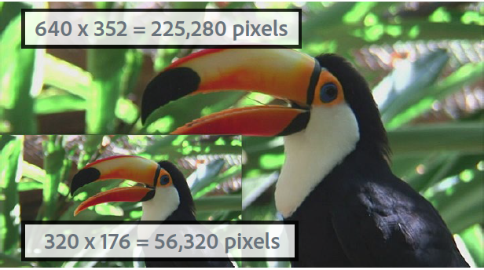

# Visão geral do vídeo {#video-overview}

O Dynamic Media Classic é fornecido com a conversão automática de vídeo no upload, streaming de vídeo para dispositivos móveis e desktop e conjuntos de vídeo adaptáveis otimizados para reprodução com base no dispositivo e na largura de banda. Uma das coisas mais importantes sobre o vídeo é que o fluxo de trabalho é simples. é projetado para que qualquer um possa usá-lo, mesmo que não esteja muito familiarizado com a tecnologia de vídeo.

Ao final desta seção do tutorial, você saberá como:

- Carregar e codificar (transcodificar) vídeo para tamanhos e formatos diferentes
- Escolha entre as predefinições de vídeo disponíveis para upload
- Adicionar ou editar uma predefinição de codificação de vídeo
- Pré-visualização de vídeos em um visualizador de vídeo
- Implantar vídeo em sites da Web e móveis
- Adicionar legendas e marcadores de capítulo ao vídeo
- Personalizar e publicar visualizadores de vídeo para usuários de desktop e dispositivos móveis

>[!NOTE]
>
>Todos os URLs neste capítulo são apenas para fins ilustrativos; não são ligações ao vivo.

## Visão geral do vídeo do Dynamic Media Classic

Primeiramente, vamos ter uma ideia melhor das possibilidades de vídeos usando o Dynamic Media Classic.

### Recursos e recursos

A plataforma de vídeo Dynamic Media Classic oferta todas as partes da solução de vídeo. upload, conversão e gerenciamento de vídeos; a capacidade de adicionar legendas e marcadores de capítulo a um vídeo; e a capacidade de usar predefinições para uma reprodução fácil.

Facilita a publicação de vídeo adaptável de alta qualidade para transmissão em várias telas, inclusive dispositivos móveis para desktop, iOS, Android, Blackberry e Windows. Um Conjunto de vídeos adaptáveis agrupa versões do mesmo vídeo que são codificadas em diferentes taxas de bits e formatos, como 400 kbps, 800 kbps e 1000 kbps. O computador desktop ou dispositivo móvel detecta a largura de banda disponível.

Além disso, a qualidade do vídeo é automaticamente alternada se as condições da rede mudarem no desktop ou no dispositivo móvel. Além disso, se um cliente entrar no modo de tela cheia em um desktop, o Conjunto de vídeos adaptáveis responderá usando uma resolução melhor, melhorando assim a experiência de visualização do cliente. O uso de Conjuntos de vídeo adaptáveis oferece a melhor reprodução possível para clientes que reproduzem o vídeo do Dynamic Media Classic em várias telas e dispositivos.

### Gerenciamento de vídeo

Trabalhar com vídeo pode ser mais complexo do que trabalhar com imagens digitais. Com o vídeo, você lida com vários formatos e padrões e com a incerteza sobre se sua audiência poderá reproduzir seus clipes. O Dynamic Media Classic facilita o trabalho com vídeos, fornecendo muitas ferramentas poderosas &quot;sob o capô&quot;, mas removendo a complexidade de trabalhar com eles.

O Dynamic Media Classic reconhece e pode trabalhar com vários formatos de origem diferentes disponíveis. Mas ler o vídeo é apenas uma parte do esforço. você também deve converter o vídeo em um formato compatível com a Web. O Dynamic Media Classic cuida disso permitindo a conversão de vídeo em vídeo H.264.

Converter o vídeo pode ficar muito complicado usando as muitas ferramentas profissionais e entusiastas disponíveis. O Dynamic Media Classic o simplifica ao oferecer predefinições fáceis que são otimizadas para configurações de qualidade diferentes. Entretanto, se você quiser algo mais personalizado, também poderá criar suas próprias predefinições.

Se você tiver muitos vídeos, apreciará a capacidade de gerenciar todos os seus ativos, juntamente com suas imagens e outras mídias no Dynamic Media Classic. Você pode organizar, catalogar e pesquisar seus ativos, incluindo ativos de vídeo, com suporte robusto a metadados XMP.

### Reprodução de vídeo

Semelhante ao problema de conversão de vídeo para torná-lo acessível e acessível à Web, é o problema de implementação e implantação de vídeo no site. Escolher se deseja comprar um player ou criar seu próprio, tornando-o compatível com vários dispositivos e telas, e manter seus players pode ser uma ocupação em tempo integral.

Novamente, a abordagem do Dynamic Media Classic é permitir que você escolha a predefinição e o visualizador que atende às suas necessidades. Você tem muitas opções diferentes de visualizador e uma biblioteca de várias predefinições disponíveis.

Você pode enviar vídeo facilmente para a Web e dispositivos móveis, já que o Dynamic Media Classic suporta vídeo HTML5, o que significa que você pode público alvo usuários que executam vários navegadores, bem como usuários de plataformas Android e iOS. O streaming de vídeo permite uma reprodução suave de conteúdo maior ou de alta definição, enquanto o vídeo HTML5 progressivo tem predefinições otimizadas para tela pequena.

As predefinições do visualizador para vídeo são parcialmente configuráveis dependendo do tipo do visualizador.

Assim como todos os visualizadores, a integração é feita por meio de um único URL do Dynamic Media Classic por visualizador ou vídeo.

>[!NOTE]
>
>Como prática recomendada, use visualizadores de vídeo HTML5 do Dynamic Media Classic. As predefinições usadas em visualizadores de vídeo HTML5 são players de vídeo robustos. Ao combinar em um único player a capacidade de projetar os componentes de reprodução usando HTML5 e CSS, ter reprodução integrada e usar streaming adaptável e progressivo dependendo da capacidade do navegador, você estende o alcance do conteúdo de mídia avançada para os usuários de desktop, tablet e dispositivos móveis, além de garantir uma experiência de vídeo otimizada.

Uma última observação sobre o vídeo do Dynamic Media Classic que pode se aplicar a alguns clientes: nem todas as empresas podem ter conversão automática, streaming ou predefinições de vídeo ativadas para sua conta. Se por algum motivo você não conseguir acessar os URLs para transmissão de vídeo, esse pode ser o motivo. Você ainda poderá carregar e publicar vídeos progressivamente baixados e ter acesso a todos os visualizadores de vídeo. Entretanto, para aproveitar os recursos completos de vídeo do Dynamic Media Classic, entre em contato com seu Gerente de conta ou Gerente de vendas para ativar esses recursos.

Saiba mais sobre [Vídeo no Dynamic Media Classic](https://docs.adobe.com/content/help/en/dynamic-media-classic/using/video/quick-start-video.html).

## Vídeo 101

### Conceitos básicos de vídeo e terminologia

Antes de começarmos, vamos discutir alguns termos com os quais você deve se familiarizar para trabalhar com vídeo. Esses conceitos não são específicos do Dynamic Media Classic, e se você for gerenciar vídeos para um site profissional, você deverá obter mais informações sobre o assunto. Recomendaremos alguns recursos no final desta seção.

- **Codificação/transcodificação.** A codificação é o processo de aplicação da compactação de vídeo para converter dados de vídeo brutos e não compactados em um formato que facilita o trabalho. A transcodificação, embora semelhante, refere-se à conversão de um método de codificação para outro.

   - Os arquivos de vídeo principais criados com o software de edição de vídeo geralmente são muito grandes e não estão no formato adequado para delivery para destinos online. Normalmente, são codificados para reprodução rápida no desktop e edição, mas não para delivery na Web.
   - Para converter vídeo digital no formato e especificações adequados para reprodução em telas diferentes, os arquivos de vídeo são transcodificados para um tamanho de arquivo menor e eficiente, ideal para delivery na Web e dispositivos móveis.

- **Compactação de vídeo.** Reduzir a quantidade de dados usados para representar imagens de vídeo digital e é uma combinação de compactação de imagem espacial e compensação de movimento temporal.

   - A maioria das técnicas de compactação apresenta perdas, o que significa que despejam dados para atingir um tamanho menor.
   - Por exemplo, o vídeo DV é compactado relativamente pouco e permite que você edite facilmente a gravação de origem, no entanto, é muito grande para usar na Web ou até mesmo colocar em um DVD.

- **Formatos de arquivo.** O formato é um container, semelhante a um arquivo ZIP, que determina como os arquivos são organizados no arquivo de vídeo, mas geralmente não como são codificados.

   - Os formatos de arquivos comuns para o vídeo de origem incluem Windows Media (WMV), QuickTime (MOV), Microsoft AVI e MPEG, entre outros. Os formatos publicados pelo Dynamic Media Classic são MP4.
   - Um arquivo de vídeo normalmente contém várias faixas. uma faixa de vídeo (sem áudio) e uma ou mais faixas de áudio (sem vídeo) — que estão inter-relacionados e sincronizados.
   - O formato de arquivo de vídeo determina como esses diferentes rastreamentos de dados e metadados são organizados.

- **Codec.** Um codec de vídeo descreve o algoritmo pelo qual um vídeo é codificado por meio do uso da compactação. O áudio também é codificado por meio de um codec de áudio.

   - Os codecs minimizam a quantidade de informações necessárias para reproduzir o vídeo. Em vez de informações sobre cada quadro individual, somente as informações sobre as diferenças entre um quadro e o seguinte são armazenadas.
   - Como a maioria dos vídeos muda pouco de um quadro para outro, os codecs permitem altas taxas de compactação, o que resulta em tamanhos menores de arquivos.
   - Um player de vídeo decodifica o vídeo de acordo com seu codec e exibe uma série de imagens, ou quadros, na tela.
   - Os codecs de vídeo comuns incluem H.264, On2 VP6 e H.263.

- **Resolução.** Altura e largura do vídeo em pixels.

   - O tamanho do vídeo de origem é determinado pela câmera e pela saída do software de edição. Uma câmera HD normalmente criará um vídeo de alta resolução 1920 x 1080, no entanto, para ser reproduzido sem problemas na Web, você reduzirá a resolução (redimensionará) para uma resolução menor, como 1280 x 720, 640 x 480 ou menor.
   - A resolução tem um impacto direto no tamanho do arquivo, bem como na largura de banda necessária para reproduzir o vídeo.

- **Exibir proporção.** Proporção entre a largura de um vídeo e a altura de um vídeo. Quando a proporção do vídeo não corresponde à proporção do player, você pode ver &quot;barras pretas&quot; ou espaço vazio. Duas proporções comuns usadas para exibir vídeo são:

   - 4:3 (1.33:1). Usado para quase todo o conteúdo de transmissão de TV de definição padrão.
   - 16:9 (1.78:1). Usado para quase todos os filmes e conteúdos de TV de alta definição (HDTV) de tela larga.

- **Taxa de bits/taxa de dados.** A quantidade de dados que é codificada para compor um único segundo de reprodução de vídeo (em kilobits por segundo).

   - Geralmente, quanto menor a taxa de bits, mais desejável ela será para a Web, pois ela pode ser baixada mais rapidamente. No entanto, isso também pode significar que a qualidade é baixa devido à perda de compressão.
   - Um bom codec deve equilibrar a taxa de bits baixa com boa qualidade.

- **Taxa de quadros (quadros por segundo ou FPS).** O número de quadros, ou imagens estáticas, para cada segundo do vídeo. Normalmente, a TV norte-americana (NTSC) é transmitida em 29,97 FPS; A TV europeia e asiática (PAL) é transmitida em 25 SPF; e o filme (analógico e digital) normalmente tem 24 (23,976) FPS.

   - Para tornar as coisas mais confusas, há também quadros progressivos e entrelaçados. Cada quadro progressivo contém um quadro de imagem inteiro, enquanto os quadros entrelaçados contêm cada outra linha de pixels em um quadro de imagem. Os quadros são reproduzidos rapidamente e parecem se misturar. O filme usa um método de varredura progressiva, enquanto o vídeo digital é normalmente entrelaçado.
   - Em geral, não importa se a gravação de origem está entrelaçada ou não... O Dynamic Media Classic preservará o método de varredura no vídeo convertido.
   - Delivery progressivo/transmissão contínua. O streaming de vídeo é o envio de mídia em um fluxo contínuo que pode ser reproduzido à medida que chega, enquanto o vídeo progressivamente baixado é baixado como qualquer outro arquivo de um servidor e armazenado em cache localmente no seu navegador.

Com sorte, essa cartilha ajuda você a entender as várias opções envolvidas no uso do vídeo do Dynamic Media Classic.

## Fluxo de trabalho de vídeo

Ao trabalhar com vídeo no Dynamic Media Classic, você segue um fluxo de trabalho básico semelhante ao trabalho com imagens.

1. Start carregando arquivos de vídeo no Dynamic Media Classic. Para fazer isso, abra o Menu **** Ferramentas na parte inferior do painel de extensão do Dynamic Media Classic e escolha **Carregar no Dynamic Media Classic > Arquivos no nome** da pasta ou **Carregar no Dynamic Media Classic > Pastas no nome** da pasta. &quot;Nome da pasta&quot; será qualquer pasta que você estiver navegando atualmente com a extensão. Os arquivos de vídeo podem ser grandes, portanto, recomendamos usar o FTP para fazer upload de arquivos grandes. Como parte do upload, escolha uma ou mais predefinições de vídeo para codificar seus vídeos. O vídeo pode ser transcodificado para MP4 Video no upload. Consulte o tópico Predefinições de vídeo abaixo para obter mais informações sobre como usar e criar predefinições de codificação. Saiba mais sobre [upload e codificação de vídeos](https://docs.adobe.com/content/help/en/dynamic-media-classic/using/video/uploading-encoding-videos.html).
2. Selecione ou selecione e modifique uma predefinição do visualizador de vídeo e pré-visualização seu vídeo. Você escolheria uma predefinição de visualizador predefinida ou personalizaria a sua própria predefinição. Se você estiver direcionando usuários móveis, não precisará fazer nada aqui, pois as plataformas móveis não exigem um visualizador ou uma predefinição. Saiba mais sobre como [Visualizar vídeos em um visualizador](https://docs.adobe.com/content/help/en/dynamic-media-classic/using/video/previewing-videos-video-viewer.html) de vídeo e [Adicionar ou editar uma predefinição](https://docs.adobe.com/content/help/en/dynamic-media-classic/using/video/previewing-videos-video-viewer.html#adding-or-editing-a-video-viewer-preset)do visualizador de vídeo.
3. Execute uma publicação de vídeo, obtenha o URL e integre-o. A principal diferença entre essa etapa do fluxo de trabalho do vídeo e o fluxo de trabalho da imagem é que você executará uma publicação de vídeo especial em vez de (ou talvez também) a publicação padrão do Serviço de imagem. A integração do visualizador de vídeo no desktop funciona exatamente como a integração do visualizador de imagens, no entanto, para dispositivos móveis é ainda mais simples. tudo o que você precisa é do URL do próprio vídeo.

### Sobre a transcodificação

A transcodificação foi definida anteriormente como o processo de conversão de um método de codificação para outro. No caso do Dynamic Media Classic, é o processo de conversão do vídeo de origem do formato atual para MP4. Isso é necessário antes que o vídeo apareça no navegador de desktop ou em um dispositivo móvel.

O Dynamic Media Classic pode lidar com toda a transcodificação para você, um grande benefício. Você mesmo pode transcodificar o vídeo e fazer upload dos arquivos já convertidos em MP4, mas isso pode ser um processo complexo que requer software sofisticado. A menos que você saiba o que está fazendo, você normalmente não obterá bons resultados na sua primeira tentativa.

O Dynamic Media Classic não só converte os arquivos para você, como também facilita o fornecimento de predefinições fáceis de usar. Não precisam de saber muito sobre o lado técnico deste processo. tudo o que você deve saber é aproximadamente o tamanho final que você deseja obter do sistema e uma noção da largura de banda que seus usuários finais têm.

Embora as predefinições pré-criadas sejam úteis e cubram a maioria das necessidades, às vezes você deseja algo mais personalizado. Nesse caso, você pode criar sua própria predefinição de codificação. No Dynamic Media Classic, uma predefinição de codificação é chamada de Predefinição de vídeo. Isso será explicado mais adiante neste capítulo.

### Sobre transmissão

Outro recurso importante que vale a pena notar é o streaming de vídeo, um recurso padrão da plataforma de vídeo Dynamic Media Classic. A mídia de streaming é constantemente recebida e apresentada a um usuário final enquanto é fornecida. Isto é significativo e desejável por várias razões.

Geralmente, a transmissão exige menos largura de banda do que o download progressivo, pois somente a parte do vídeo que é assistida é realmente entregue. O servidor de streaming de vídeo e os visualizadores do Dynamic Media Classic usam a detecção automática de largura de banda para oferecer o melhor fluxo possível para a conexão com a Internet de um usuário.

Com o streaming, os start de vídeo são reproduzidos mais cedo do que usando outros métodos. Também torna o uso dos recursos de rede mais eficiente, pois somente as partes do vídeo visualizadas são enviadas ao cliente.

O outro método de delivery é o download progressivo. Comparado ao vídeo streaming, há apenas um benefício consistente para o download progressivo. você não precisa de um servidor de streaming para entregar o vídeo. E é claro que é aqui que entra o Dynamic Media Classic. O Dynamic Media Classic tem um servidor de streaming integrado à plataforma, portanto, não é necessário o incômodo ou o custo extra para manter esse hardware dedicado.

O vídeo de download progressivo pode ser veiculado em qualquer servidor Web normal. Embora isso possa ser conveniente e potencialmente econômico, lembre-se de que os downloads progressivos têm recursos limitados de busca e navegação e os usuários podem acessar e reaproveitar seu conteúdo. Em algumas situações, como reprodução atrás de firewalls de rede muito rígidos, o delivery de transmissão pode ser bloqueado; nesses casos, pode ser desejável reverter para o delivery progressivo.

O download progressivo é uma boa opção para hobbyists ou sites que têm baixos requisitos de tráfego. se não se importam se o conteúdo é armazenado em cache no computador do usuário; se precisarem apenas de fornecer vídeos de duração mais curta (menos de 10 minutos); ou se seus visitantes não puderem receber vídeo de transmissão por algum motivo.

Você precisará transmitir seu vídeo se precisar de recursos avançados e controle sobre o delivery do vídeo e/ou se precisar exibir o vídeo para audiências maiores (por exemplo, várias centenas de visualizadores simultâneos), rastrear e reportar o uso ou a exibição de estatísticas, ou quiser oferta aos visualizadores a melhor experiência de reprodução interativa.

Finalmente, se você estiver preocupado em proteger sua mídia para questões de propriedade intelectual ou gerenciamento de direitos, o streaming proporcionará um delivery mais seguro do vídeo, pois a mídia não é salva no cache do cliente quando transmitida.

## Predefinições do vídeo

Ao carregar o vídeo, você escolhe entre uma ou mais predefinições que contêm as configurações para converter o vídeo principal em um formato compatível com a Web por meio da codificação. As predefinições de vídeo têm duas opções: Predefinições de vídeo adaptáveis e Predefinições de codificação única.

Consulte Predefinições [de vídeo](https://docs.adobe.com/content/help/en/dynamic-media-classic/using/setup/application-setup.html#video-presets-for-encoding-video-files)disponíveis.

As predefinições de vídeo adaptáveis são ativadas por padrão, o que significa que elas estão disponíveis para codificação. Se desejar usar uma única predefinição de codificação, o administrador precisará ativá-la para que ela seja exibida na lista de predefinições de vídeo.

Saiba como [ativar ou desativar predefinições](https://docs.adobe.com/content/help/en/dynamic-media-classic/using/video/uploading-encoding-videos.html#activating-or-deactivating-video-encoding-presets)de vídeo.

Você pode escolher uma das muitas predefinições pré-criadas que vêm com o Dynamic Media Classic ou pode criar a sua própria predefinição; entretanto, nenhuma predefinição é selecionada para upload por padrão. Em outras palavras, **se você não selecionar uma predefinição de vídeo no upload, o vídeo não será convertido e poderá não ser publicado**. No entanto, você pode converter o vídeo offline e fazer upload e publicar sem problemas. As predefinições de vídeo só são necessárias se você quiser que o Dynamic Media Classic faça a conversão para você.

Ao carregar, selecione uma predefinição de vídeo escolhendo Opções **de** vídeo no painel Opções de trabalho. Em seguida, escolha se deseja codificar para Computador, Móvel ou Tablet.

- O computador é para uso em desktop. Aqui você encontrará predefinições maiores (como HD) que consomem mais largura de banda.
- O Mobile e o Tablet criam vídeo MP4 para dispositivos como iPhones e smartphones Android. A única diferença entre o Mobile e o Tablet é que as predefinições do Tablet normalmente têm uma largura de banda mais alta, porque são baseadas no uso do WiFi. As predefinições de dispositivos móveis são otimizadas para um uso 3G mais lento.

### Perguntas para se perguntar antes de escolher uma predefinição

Ao escolher uma predefinição, você deve saber sua audiência, bem como sua gravação de origem. O que você sabe sobre seu cliente? Como é que eles estão a ver o vídeo? com um monitor de computador ou um dispositivo móvel?

Qual é a resolução do seu vídeo? Se você escolher uma predefinição maior que a original, poderá receber um vídeo indefinido/pixelado. Tudo bem se o vídeo for maior que o predefinido, mas não escolha uma predefinição maior que o vídeo de origem.

Qual é a sua proporção? Se você vir barras pretas ao redor do vídeo convertido, então você escolheu a proporção errada. O Dynamic Media Classic não consegue detectar automaticamente essas configurações porque primeiro teria de examinar o arquivo antes de fazer upload.

### Detalhamento das opções de vídeo

As predefinições de vídeo determinam como o vídeo será codificado especificando essas configurações. Se você não estiver familiarizado com esses termos, reveja o tópico Conceitos básicos de vídeo e Terminologia, acima.

- **Taxa de proporção.** Geralmente tela 4:3 ou widescreen 16:9 padrão.
- **Tamanho.** Isso é igual à resolução de exibição e é medido em pixels. Isso está relacionado à proporção. Com uma proporção de 16:9, um vídeo terá 432 x 240 pixels, enquanto em 4:3 terá 320 x 240 pixels.
- **FPS.** As taxas de quadros padrão são de 30, 25 ou 24 quadros por segundo (fps), dependendo do padrão de vídeo. NTSC, PAL ou Film. Essa configuração não importa, pois o Dynamic Media Classic sempre usará a mesma taxa de quadros que o vídeo de origem.
- **Formato.** Isto é MP4.
- **Largura de banda.** Esta é a velocidade de conexão desejada do usuário direcionado. Eles têm uma conexão de Internet rápida ou lenta? Eles normalmente usam computadores desktop ou dispositivos móveis? Isso também está relacionado à resolução (tamanho), porque quanto maior o vídeo, mais largura de banda ele precisa.

### Determinar a taxa de dados ou a &quot;taxa de bits&quot; para o vídeo

Calcular a taxa de bits do vídeo é um dos fatores menos conhecidos para fornecer vídeo à Web, mas potencialmente o mais importante, pois afeta diretamente a experiência do usuário. Se você definir sua taxa de bits muito alta, você terá alta qualidade de vídeo, mas baixo desempenho. Os usuários com conexões de Internet mais lentas serão forçados a esperar enquanto o vídeo é constantemente pausado durante a reprodução. No entanto, se você o definir muito baixo, a qualidade sofrerá. Dentro da predefinição de vídeo, o Dynamic Media Classic sugere uma variedade de dados, dependendo da largura de banda do seu público alvo. Este é um bom lugar para o start.

Entretanto, se você mesmo quiser descobrir, precisará de uma calculadora de taxa de bits. Essa é uma ferramenta comumente usada por profissionais de vídeo e entusiastas para estimar quantos dados se encaixarão em um determinado fluxo ou pedaço de mídia (como um DVD).

## Criação de uma predefinição de vídeo personalizada

Às vezes, você pode achar que precisa de uma predefinição de vídeo especial que não corresponda às configurações das predefinições de vídeo de codificação incorporadas. Isso pode acontecer se você tiver um vídeo personalizado de um tamanho específico, como um vídeo criado a partir de um software de animação 3D ou um que tenha sido cortado do tamanho original. Talvez você queira experimentar diferentes configurações de largura de banda para fornecer vídeo de qualidade superior ou inferior. Seja qual for o caso, será necessário criar uma predefinição de vídeo personalizada de codificação única.

### Fluxo de trabalho da predefinição de vídeo

1. As predefinições de vídeo estão localizadas em **Configuração > Configuração do aplicativo > Predefinições** de vídeo. Aqui você encontrará uma lista de todas as predefinições de codificação disponíveis para sua empresa.

   - Cada conta de vídeo de fluxo contínuo tem dezenas de predefinições prontas para uso e, se você criar suas próprias predefinições personalizadas, também as visualizará aqui.
   - Você pode filtrar por tipo usando o menu suspenso. As predefinições são divididas em Computador, Móvel e Tablet.
      

2. A coluna Ativo permite que você escolha se deseja exibir todas as predefinições no upload, ou somente aquelas escolhidas. Se estiver nos EUA, pode desmarcar as predefinições PAL europeias e, se estiver no Reino Unido/EMEA, desmarque as predefinições NTSC.
3. Clique no botão **Adicionar** para criar uma predefinição personalizada. Isso abre o painel Adicionar predefinição de vídeo. O processo aqui é semelhante à criação de uma predefinição de imagem.
4. Primeiro, atribua um Nome **** predefinido para aparecer na lista de predefinições. No exemplo acima, essa predefinição é para vídeos tutoriais de captura de tela.
5. A **Descrição** é opcional, mas dará aos usuários uma dica de ferramenta que descreverá a finalidade dessa predefinição.
6. O **Codificar sufixo** de arquivo será anexado ao final do nome do vídeo que você está criando aqui. Lembre-se de que você terá um vídeo Principal, bem como este vídeo codificado, que é um derivado do principal, e que dois ativos no Dynamic Media Classic não podem ter a mesma ID de ativo.
7. **Dispositivo** de reprodução é onde você escolhe o formato de arquivo de vídeo desejado (Computador, Móvel ou Tablet). Lembre-se de que o Mobile e o Tablet produzem o mesmo formato MP4. O Dynamic Media Classic só precisa saber em qual categoria colocar a predefinição; no entanto, a diferença teórica é que as predefinições de Tablet são geralmente para uma conexão mais rápida com a Internet, pois todas suportam WiFi.
8. **A Taxa** de dados do público alvo é algo que você terá que descobrir para si mesmo, no entanto, você pode ver um intervalo sugerido na imagem abaixo. Como alternativa, você pode arrastar o controle deslizante para a largura de banda aproximada do público alvo. Para obter uma figura mais precisa, use uma calculadora de taxa de bits. Há um pouco de tentativa e erro envolvido.

   

9. Defina a **proporção** do arquivo de origem. Esta configuração está diretamente ligada ao tamanho, abaixo. Se você escolher _Personalizado_, será necessário inserir manualmente a largura e a altura.
10. Se você escolher uma proporção, defina um valor para Tamanho **de** resolução e o Dynamic Media Classic preencherá o outro valor automaticamente. No entanto, para uma proporção personalizada, preencha ambos os valores. Seu tamanho deve estar de acordo com sua taxa de dados. Se você definir uma taxa de dados muito baixa e um tamanho grande, você espera que a qualidade seja ruim.
11. Clique em **Salvar** para salvar sua predefinição. Ao contrário de todas as outras predefinições, não é necessário publicar neste momento, pois as predefinições são apenas para carregar arquivos. Posteriormente, você terá que publicar os vídeos codificados, mas as predefinições são apenas para uso interno do Dynamic Media Classic.
12. Para verificar se a predefinição de vídeo está na lista de carregamento, vá para **Carregar**.Escolha Opções **de** Trabalho e expanda Opções **de** Vídeo. Sua predefinição será listada na categoria do dispositivo de reprodução escolhido (Computador, Móvel ou Tablet).

Saiba mais sobre como [adicionar ou editar uma predefinição](https://docs.adobe.com/content/help/en/dynamic-media-classic/using/video/uploading-encoding-videos.html#adding-or-editing-a-video-encoding-preset)de vídeo.

## Adicionar legendas ao seu vídeo

Em alguns casos, pode ser útil adicionar legendas ao vídeo. por exemplo, quando for necessário fornecer o vídeo aos visualizadores em vários idiomas, mas não quiser duplicar o áudio em outro idioma ou gravar o vídeo novamente em idiomas separados. Além disso, a adição de legendas oferece maior acessibilidade para aqueles com deficiência auditiva e que usam legendas ocultas. O Dynamic Media Classic facilita a adição de legendas aos vídeos.

Saiba como [adicionar legendas ao vídeo](https://docs.adobe.com/content/help/en/dynamic-media-classic/using/video/adding-captions-video.html).

## Adicionar marcadores de capítulo ao seu vídeo

Para vídeos de formulário longos, seus visualizadores provavelmente apreciarão a capacidade e a conveniência oferecidas ao navegar em seu vídeo com marcadores de capítulo. O Dynamic Media Classic permite adicionar facilmente marcadores de capítulo ao vídeo.

Saiba como [adicionar marcadores de capítulo ao vídeo](https://docs.adobe.com/content/help/en/dynamic-media-classic/using/video/adding-chapter-markers-video.html).

## Tópicos de implementação de vídeo

### URL de publicação e cópia

A última etapa do fluxo de trabalho do Dynamic Media Classic é publicar seu conteúdo de vídeo. No entanto, o vídeo tem seu próprio trabalho de publicação, chamado de Publicação do servidor de vídeo, encontrado em Avançado.

Saiba como [publicar seu vídeo](https://docs.adobe.com/content/help/en/dynamic-media-classic/using/video/deploying-video-websites-mobile-sites.html#publishing-video).

Depois de executar uma publicação de vídeo, você poderá obter um URL para acessar seus vídeos e quaisquer predefinições do visualizador do Dynamic Media Classic em um navegador da Web. No entanto, se você personalizar ou criar sua própria predefinição do visualizador de vídeo, ainda precisará executar uma publicação separada do Servidor de imagens.

- Saiba como [vincular um URL a um site móvel ou site](https://docs.adobe.com/content/help/en/dynamic-media-classic/using/video/deploying-video-websites-mobile-sites.html#linking-a-video-url-to-a-mobile-site-or-a-website).
- Saiba como [incorporar o Visualizador de vídeo em uma página](https://docs.adobe.com/content/help/en/dynamic-media-classic/using/video/deploying-video-websites-mobile-sites.html#embedding-the-video-viewer-on-a-web-page)da Web.

Você também pode implantar seu vídeo usando um player de vídeo criado personalizado ou de terceiros.

Saiba como [implantar vídeos usando um reprodutor](https://docs.adobe.com/content/help/en/dynamic-media-classic/using/video/deploying-video-websites-mobile-sites.html#deploying-video-using-a-third-party-video-player)de vídeo de terceiros.

Além disso, se também quiserem utilizar as miniaturas de vídeo... a imagem extraída do vídeo. você também precisará executar uma publicação do Servidor de imagens. Isso ocorre porque a imagem em miniatura do vídeo reside no servidor de imagens, enquanto o vídeo está no servidor de vídeo. As miniaturas de vídeo podem ser usadas em resultados de pesquisa de vídeo, listas de reprodução de vídeo e podem ser usadas como o &quot;quadro de pôster&quot; inicial que aparece no visualizador de vídeo antes da reprodução do vídeo.

Saiba mais sobre como [Trabalhar com miniaturas](https://docs.adobe.com/content/help/en/dynamic-media-classic/using/video/deploying-video-websites-mobile-sites.html#working-with-video-thumbnails)de vídeo.

### Selecionar e personalizar uma predefinição do visualizador

O processo de seleção e personalização de uma predefinição do visualizador é exatamente o mesmo que o processo de imagens. Crie uma nova predefinição ou modifique uma predefinição existente e salve com um novo nome, edite e execute uma publicação do Serviço de imagem. Todas as predefinições do visualizador são publicadas no Servidor de imagens, não apenas as predefinições de imagens, e, portanto, você deve executar uma publicação de imagem para ver suas predefinições novas ou modificadas.

>[!TIP]
>
>Execute uma publicação do Servidor de imagens após a publicação do Servidor de vídeo para publicar as imagens em miniatura associadas aos vídeos.

## Otimização do mecanismo de pesquisa de vídeo

A Otimização do Mecanismo de Pesquisa (SEO) é o processo de melhorar a visibilidade de um site ou de uma página da Web em mecanismos de pesquisa. Embora os mecanismos de pesquisa se superem ao coletar informações sobre o conteúdo baseado em texto, eles não podem adquirir informações adequadamente sobre o vídeo, a menos que essas informações lhes sejam fornecidas. Usando o Dynamic Media Classic Video SEO, você pode usar metadados para fornecer aos mecanismos de pesquisa descrições dos vídeos. O recurso de SEO de vídeo permite criar mapas de site de vídeo e feeds RSS de mídia (mRSS).

- **Mapa do site** do vídeo. Informa o Google exatamente onde e qual conteúdo de vídeo está em um site. Consequentemente, os vídeos podem ser totalmente pesquisados no Google. Por exemplo, um Mapa do site de vídeo pode especificar o tempo de execução e as categorias dos vídeos.
- **feed** mRSS. Usado pelos editores de conteúdo para alimentar arquivos de mídia no Yahoo! Pesquisa de vídeo. O Google oferece suporte ao protocolo de feed do Video Sitemap e do Media RSS (mRSS) para enviar informações aos mecanismos de pesquisa.

Ao criar mapas do site de vídeo e feeds mRSS, você decide quais campos de metadados dos arquivos de vídeo devem ser incluídos. Dessa forma, você descreve seus vídeos para mecanismos de pesquisa, de modo que os mecanismos de pesquisa possam direcionar o tráfego para vídeos do site com mais precisão.

Depois que o mapa do site ou feed for criado, você poderá fazer com que o Dynamic Media Classic publique-o automaticamente, publique-o manualmente ou simplesmente gere um arquivo que poderá ser editado posteriormente. Além disso, o Dynamic Media Classic pode gerar e publicar automaticamente esse arquivo a cada dia.

Ao final do processo, você enviará o arquivo ou URL para o mecanismo de pesquisa. Esta tarefa é feita fora do Dynamic Media Classic. no entanto, discutiremos brevemente a questão a seguir.

### Requisitos para arquivos Sitemap/mRSS

Para que o Google e outros mecanismos de pesquisa não rejeitem seus arquivos, eles devem estar no formato correto e incluir algumas informações. O Dynamic Media Classic gerará um arquivo devidamente formatado; no entanto, se as informações não estiverem disponíveis para alguns de seus vídeos, eles não serão incluídos no arquivo.

Os campos obrigatórios são Landing page (o URL da página que está disponibilizando o vídeo, não o URL do próprio vídeo), Título e Descrição. Cada vídeo deve ter uma entrada para esses itens ou não será incluído no arquivo gerado. Os campos opcionais são Tags e Categoria.

Existem outros dois campos obrigatórios. URL do conteúdo, URL do próprio ativo de vídeo e Miniatura, um URL para uma imagem em miniatura do vídeo. no entanto, o Dynamic Media Classic preencherá automaticamente esses valores para você.

O fluxo de trabalho recomendado é incorporar esses dados em seus vídeos antes de carregá-los usando metadados XMP, e o Dynamic Media Classic os extrairá no upload. Vocês usariam um aplicativo como o Adobe Bridge. que está incluído em todos os aplicativos Adobe Creative Cloud — para preencher os dados em campos de metadados padrão.

Seguindo esse método, não será necessário inserir esses dados manualmente usando o Dynamic Media Classic. No entanto, você também pode usar as predefinições de metadados no Dynamic Media Classic, como uma forma rápida de inserir os mesmos dados a cada vez.

Para obter mais informações sobre esse tópico, consulte [Visualização, adição e exportação de metadados](https://docs.adobe.com/content/help/en/dynamic-media-classic/using/managing-assets/viewing-adding-exporting-metadata.html).

Depois que os metadados forem preenchidos, você poderá visualizá-los na Visualização Detalhe desse ativo de vídeo. As palavras-chave também podem estar presentes, mas estão localizadas na guia Palavras-chave.

- Saiba mais sobre como [adicionar palavras-chave](https://docs.adobe.com/content/help/en/dynamic-media-classic/using/managing-assets/viewing-adding-exporting-metadata.html#add-or-edit-keywords).
- Saiba mais sobre a [Vídeo SEO](https://docs.adobe.com/content/help/en/dynamic-media-classic/using/setup/video-seo-search-engine-optimization.html).
- Saiba mais sobre [Configurações para SEO](https://docs.adobe.com/content/help/en/dynamic-media-classic/using/setup/video-seo-search-engine-optimization.html#choosing-video-seo-settings)de vídeo.

#### Configuração da SEO de Vídeo

Configuração de start SEO de vídeo com a escolha do tipo de formato desejado, do método de geração e quais campos de metadados devem ir para o arquivo.

1. Vá até **Configuração > Configuração do aplicativo > SEO de vídeo > Configurações**.
2. No menu Modo **de** geração, escolha um formato de arquivo. O padrão é Desativado, portanto, para ativá-lo, escolha Mapa do site do vídeo, mRSS ou Ambos.
3. Escolha se deseja gerar automática ou manualmente. Para simplificar, recomendamos que você a defina para Modo **** automático. Se você escolher Automático, então também defina a opção **Marcar para publicação** , ou os arquivos não serão colocados em execução. Os arquivos Sitemap e RSS são tipos de um documento XML e devem ser publicados como qualquer outro ativo. Use um dos modos manuais se você não tiver todas as informações prontas agora ou quiser fazer apenas uma geração única.
4. Preencha as tags de metadados que serão usadas nos arquivos. Esta etapa não é opcional. No mínimo, você deve incluir os três campos marcados com um asterisco (\*): **landing page** , **Título** e **Descrição**. Para usar seus metadados para essas tarefas, arraste e solte os campos do painel Metadados à direita em um campo correspondente no formulário. O Dynamic Media Classic preencherá automaticamente o campo de espaço reservado com os dados reais de cada vídeo. Não é necessário usar campos de metadados. Você pode digitar um texto estático aqui, mas o mesmo texto será exibido para cada vídeo.
5. Depois de inserir as informações nos três campos obrigatórios, o Dynamic Media Classic ativará os botões **Salvar** e **Salvar e Gerar** . Clique em uma para salvar suas configurações. Use **Salvar** se estiver no Modo automático e desejar que o Dynamic Media Classic gere os arquivos posteriormente. Use **Salvar e gerar** para criar o arquivo imediatamente.

### Teste e publicação do mapa do site de vídeo, feed mRSS ou ambos os arquivos

Os arquivos gerados aparecerão no diretório raiz (base) da sua conta.

Esses arquivos devem ser publicados, pois a ferramenta SEO de vídeo não pode executar uma publicação por si só. Desde que estejam marcados para publicação, serão enviados para os servidores de publicação na próxima vez que uma publicação for executada.

Após a publicação, seus arquivos estarão disponíveis usando esse formato de URL.

Exemplo:

### Submetendo a mecanismos de pesquisa

A etapa final do processo é enviar seus arquivos e/ou URLs para mecanismos de pesquisa. O Dynamic Media Classic não pode executar esta etapa para você; no entanto, assumindo que você envia o URL e não o arquivo XML em si, seu feed deve ser atualizado na próxima vez que seu arquivo for gerado e ocorrer uma publicação.

O método para enviar ao seu mecanismo de pesquisa variará, no entanto, para o Google, você usa as ferramentas do Google Webmaster. Depois disso, vá até Configuração **do site > Mapeamentos** do site e clique no botão **Enviar um mapa do site** . Aqui, você pode colocar o URL do Dynamic Media Classic em seus arquivos SEO.

### Relatório de SEO de Vídeo

O Dynamic Media Classic fornece um relatório para mostrar quantos vídeos foram incluídos com êxito nos arquivos, e mais importante, que não foram incluídos devido a erros. Para acessar o relatório, vá até **Configuração > Configuração do aplicativo > SEO de vídeo > Relatório**.

## Implementação móvel para vídeo MP4

O Dynamic Media Classic não inclui as predefinições do visualizador para dispositivos móveis, pois os visualizadores não precisam reproduzir vídeo em dispositivos móveis compatíveis. Contanto que você codifique para o formato H.264 MP4 — convertendo no upload ou pré-codificação no desktop. tablets e smartphones suportados poderão reproduzir seus vídeos sem precisar de um visualizador. Isso é compatível com dispositivos Android e iOS (iPhone e iPad).

O motivo pelo qual nenhum visualizador é necessário é porque ambas as plataformas têm suporte nativo a H.264. Você pode incorporar o vídeo em uma página da Web HTML5 ou incorporar o vídeo no próprio aplicativo, e os sistemas operacionais Android e iOS fornecem um controlador para reproduzir o vídeo.

Por isso, o Dynamic Media Classic não fornece um URL para um visualizador para dispositivos móveis, mas fornece um URL diretamente para o vídeo. Na janela Pré-visualização de um vídeo MP4, haverá links para Desktop e Mobile. O URL móvel aponta para o vídeo publicado.

Um aspecto importante a ser observado sobre o vídeo publicado é que o URL lista o caminho completo para o vídeo, não apenas a ID do ativo. Ao lidar com imagens, você chama a imagem por sua ID de ativo, independentemente da estrutura da pasta. No entanto, para vídeo, você também deve especificar a estrutura de pastas. Nos URLs acima, o vídeo é armazenado no caminho:

Isso também pode ser expresso como nome da empresa/caminho da pasta/nome do vídeo.

### Método nº 1: Reprodução do navegador — Código HTML5

Para incorporar o vídeo MP4 em uma página da Web, use a tag de vídeo HTML5.

Este método também funcionará para a Web da área de trabalho, no entanto, poderá ter problemas com o suporte do browser. nem todos os navegadores da Web para desktop suportam nativamente vídeo H.264, incluindo o Firefox.

### Método nº 2: Reprodução do aplicativo no iOS — Estrutura do Media Player

Como alternativa, você pode incorporar o vídeo do Dynamic Media Classic MP4 no código do aplicativo móvel. Este é um exemplo genérico para iOS usando a estrutura Media Player fornecida apenas para fins ilustrativos:

## Recursos adicionais

Assista ao Construtor de habilidades do [Dynamic Media: Vídeo no webinar sob demanda do Dynamic Media Classic](https://seminars.adobeconnect.com/p2ueiaswkuze) para saber como usar os recursos de vídeo no Dynamic Media Classic.
