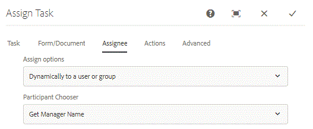

# Uso do LDAP com o fluxo de trabalho do AEM Forms

Atribuindo tarefa de fluxo de trabalho do AEM Forms ao gerente do remetente.

Ao usar o Formulário adaptável em AEM fluxo de trabalho, é necessário atribuir dinamicamente uma tarefa ao gerente do remetente do formulário. Para realizar esse caso de uso, teremos que configurar o AEM com o Ldap.

As etapas necessárias para configurar o AEM com o LDAP são explicadas em [detalhe aqui.](https://helpx.adobe.com/experience-manager/6-5/sites/administering/using/ldap-config.html)

Para a finalidade deste artigo, estou anexando arquivos de configuração usados na configuração do AEM com o Adobe Ldap. Esses arquivos estão incluídos no pacote que pode ser importado usando o gerenciador de pacotes.

Na captura de tela abaixo, estamos buscando todos os usuários pertencentes a um centro de custo específico. Se quiser buscar todos os usuários em seu LDAP, talvez você não use o filtro extra.


Na captura de tela abaixo, atribuímos os grupos aos usuários buscados do LDAP no AEM. Observe o grupo de usuários de formulários atribuído aos usuários importados. O usuário precisa ser membro desse grupo para interagir com o AEM Forms. Também armazenamos a propriedade manager no nó profile/manager no AEM.


Depois de configurar o LDAP e importar usuários no AEM, podemos criar um workflow que atribuirá a tarefa ao gerenciador dos enviantes. Para a finalidade deste artigo, desenvolvemos um fluxo de trabalho de aprovação simples de uma etapa.

A primeira etapa do fluxo de trabalho define o valor da etapa inicial como Não. A regra de negócios no formulário adaptável desativará o painel &quot;Detalhes do emissor&quot; e mostrará o painel &quot;Aprovado por&quot; com base no valor da etapa inicial.

A segunda etapa atribui a tarefa ao gerente do remetente. Obtemos o gerente do remetente usando o código personalizado.



```java
public String getParticipant(WorkItem workItem, WorkflowSession wfSession, MetaDataMap arg2) throws WorkflowException{
resourceResolver = wfSession.adaptTo(ResourceResolver.class);
UserManager userManager = resourceResolver.adaptTo(UserManager.class);
Authorizable workflowInitiator = userManager.getAuthorizable(workItem.getWorkflow().getInitiator());
.
.
String managerPorperty = workflowInitiator.getProperty("profile/manager")[0].getString();
.
.

}
```

O snippet de código é responsável por buscar a id dos gerentes e atribuir a tarefa ao gerenciador.

Contamos com a pessoa que iniciou o fluxo de trabalho. Em seguida, obtemos o valor da propriedade manager.

Dependendo de como a propriedade do gerenciador é armazenada em seu LDAP, talvez seja necessário fazer alguma manipulação de sequência de caracteres para obter a ID do gerenciador.

Leia este artigo para implementar seu próprio [ ParticipantChooser .](https://helpx.adobe.com/experience-manager/using/dynamic-steps.html)

Para testar isso em seu sistema (para funcionários do Adobe, você pode usar esta amostra pronta para uso)

* [Baixe e implante o pacote](/help/forms/assets/common-osgi-bundles/SetValueApp.core-1.0-SNAPSHOT.jar) setvalue . Este é o pacote OSGI personalizado para definir a propriedade do gerenciador.
* [Baixe e instale o DevelopingWithServiceUserBundle](/help/forms/assets/common-osgi-bundles/DevelopingWithServiceUser.jar)
* [Importe os Ativos associados a este artigo no AEM usando o gerenciador de pacotes](assets/aem-forms-ldap.zip).Incluídos como parte deste pacote são arquivos de configuração LDAP, fluxo de trabalho e um formulário adaptável.
* Configure o AEM com seu LDAP usando as credenciais LDAP apropriadas.
* Faça logon no AEM usando suas credenciais LDAP.
* Abra o [timeoffrequestform](http://localhost:4502/content/dam/formsanddocuments/helpx/timeoffrequestform/jcr:content?wcmmode=disabled)
* Preencha o formulário e envie-o.
* O gerente do remetente deve obter o formulário para revisão.

>[!NOTE]
>
>Este código personalizado para extrair o nome do gerente foi testado em relação ao Adobe LDAP. Se você estiver executando esse código em um LDAP diferente, será necessário modificar ou gravar sua própria implementação getParticipant para obter o nome do gerente.
