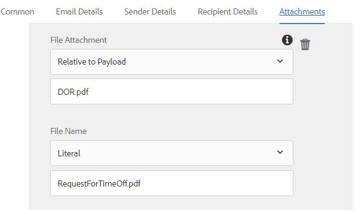

# Usando a Etapa Enviar Email do Forms Workflow {#using-send-email-step-of-forms-workflow}

A etapa Enviar email foi introduzida no AEM Forms 6.4. Usando esta etapa, podemos criar processos de negócios ou fluxo de trabalho que permitirá que você envie emails com ou sem anexos. O vídeo a seguir apresenta as etapas para configurar o componente de email de envio.

>[!VIDEO](https://video.tv.adobe.com/v/21499/?quality=9&learn=on)

Como parte deste artigo, nós o guiaremos pelo seguinte caso de uso:

1. Um usuário preenche o Formulário de solicitação de tempo limite
1. No envio do formulário, AEM fluxo de trabalho é acionado
1. O Fluxo de trabalho do AEM utiliza o componente Enviar e-mail para enviar um e-mail com o DoR como anexo

Antes de usar a etapa Enviar e-mail, certifique-se de configurar o serviço de e-mail Day CQ a partir de [configMgr](http://localhost:4502/system/console/configMgr). Forneça os valores específicos do seu ambiente

Como parte dos ativos associados a este artigo, Você obterá o seguinte

1. Formulário adaptável que acionará o fluxo de trabalho ao enviar
1. Fluxo de trabalho de amostra que enviará um email com DOR como anexo
1. Pacote OSGi que cria as propriedades de metadados

Para executar a amostra em seu sistema, faça o seguinte:

1. [Implantar o pacote Developingwithserviceuser](/help/forms/assets/common-osgi-bundles/DevelopingWithServiceUser.jar)

1. [Baixar e instalar ](/help/forms/assets/common-osgi-bundles/SetValueApp.core-1.0-SNAPSHOT.jar)conjunto setvalueEste pacote contém o código para criar as propriedades de metadados como parte da etapa do processo do fluxo de trabalho.
1. [Configurar o serviço de e-mail Day CQ](https://helpx.adobe.com/experience-manager/6-5/sites/administering/using/notification.html)
1. [Importe e instale os ativos associados a este artigo usando o gerenciador de pacote no CRX](assets/emaildoraemformskt.zip)
1. Inicie o [formulário adaptativo](http://localhost:4502/content/dam/formsanddocuments/helpx/timeoffrequestform/jcr:content?wcmmode=disabled). Preencha os campos obrigatórios e envie.
1. Você deve obter um email com DocumentOfRecord como um anexo

Explore o [modelo de fluxo de trabalho](http://localhost:4502/editor.html/conf/global/settings/workflow/models/emaildor.html)

Dê uma olhada na etapa do processo do fluxo de trabalho. O código personalizado associado à etapa do processo criará nomes de propriedades de metadados e definirá seus valores a partir dos dados enviados. Esses valores são então usados pelo componente de email de envio.

>[!NOTE]
>
>No AEM Forms 6.5 e superior, não é necessário esse código personalizado para criar propriedades de metadados. Use o recurso de variáveis no Fluxo de trabalho AEM

Verifique se a guia Anexos do componente Enviar e-mail está configurada de acordo com a captura de tela abaixo
O valor &quot;DOR.pdf&quot; tem de corresponder ao valor especificado no Documento de Caminho de registro especificado nas opções de envio do formulário adaptável.

