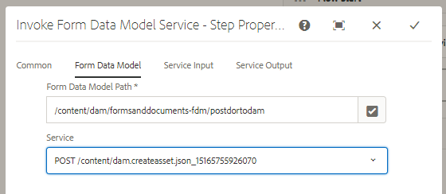

# Uso Do Modelo De Dados De Formulário Para Postar Dados Binários{#using-form-data-model-to-post-binary-data}

A partir do AEM Forms 6.4, agora temos a capacidade de invocar o Serviço do Modelo de Dados de Formulário como uma etapa AEM fluxo de trabalho. Este artigo o guiará por um exemplo de caso de uso para publicar Documento de registro usando o Serviço do Modelo de dados de formulário.

O caso de uso é o seguinte:

1. Um usuário preenche e envia o Formulário adaptável.
1. O formulário adaptável é configurado para gerar o Documento de registro.
1. Ao enviar esses formulários adaptáveis, AEM fluxo de trabalho é acionado e usará o serviço invocar Modelo de dados de formulário para POST o documento de registro para AEM DAM.

Guia Modelo de dados de formulário - Propriedades

Na guia Entrada de serviço, mapeamos o seguinte

* file(O objeto binário que precisa ser armazenado) com a propriedade DOR.pdf relativa à carga. Isso significa que quando o Formulário adaptativo é enviado, o Documento de registro gerado é armazenado em um arquivo chamado DOR.pdf relativo à carga do fluxo de trabalho.**Certifique-se de que esse DOR.pdf seja o mesmo que você fornece ao configurar a propriedade de envio do Formulário adaptável.**

* fileName - Esse é o nome pelo qual o objeto binário é armazenado no DAM. Portanto, você deseja que essa propriedade seja gerada dinamicamente, de modo que cada fileName seja único por envio. Para essa finalidade, usamos a etapa do processo no fluxo de trabalho para criar uma propriedade de metadados chamada filename e definir seu valor para combinação de Nome do Membro e Número da Conta da pessoa que envia o formulário. Por exemplo, se o nome do membro da pessoa for John Jacobs e seu número de conta for 9846, o nome do arquivo seria John Jacobs_9846.pdf

Entrada do serviço

>[!NOTE]
>
>Dicas de solução de problemas - Se por algum motivo o DOR.pdf não for criado no DAM, redefina as configurações de autenticação da fonte de dados clicando em [here](http://localhost:4502/mnt/overlay/fd/fdm/gui/components/admin/fdmcloudservice/properties.html?item=%2Fconf%2Fglobal%2Fsettings%2Fcloudconfigs%2Ffdm%2Fpostdortodam). Essas são as configurações de autenticação de AEM, que por padrão é admin/admin.

Para testar esse recurso em seu servidor, siga as etapas mencionadas abaixo:

1.[Implantar o pacote Developingwithserviceuser](/help/forms/assets/common-osgi-bundles/DevelopingWithServiceUser.jar)

1. [Baixe e implante o pacote setvalue](/help/forms/assets/common-osgi-bundles/SetValueApp.core-1.0-SNAPSHOT.jar).Este pacote OSGI personalizado é usado para criar propriedade de metadados e definir seu valor a partir dos dados de formulário enviados.

1. [Importar os ativos](assets/postdortodam.zip) associado a este artigo no AEM usando o gerenciador de pacotes. Você obterá o seguinte

   1. Modelo de fluxo de trabalho
   1. Formulário adaptável configurado para enviar para o fluxo de trabalho AEM
   1. Fonte de dados configurada para usar o arquivo PostToDam.JSON
   1. Modelo de dados de formulário que usa a fonte de dados

1. Aponte seu [navegador para abrir o formulário adaptável](http://localhost:4502/content/dam/formsanddocuments/helpx/timeoffrequestform/jcr:content?wcmmode=disabled)
1. Preencha o formulário e envie-o.
1. Verifique o aplicativo Assets se o Documento de registro for criado e armazenado.

[Arquivo Swagger](http://localhost:4502/conf/global/settings/cloudconfigs/fdm/postdortodam/jcr:content/swaggerFile) usada na criação da fonte de dados está disponível para sua referência
