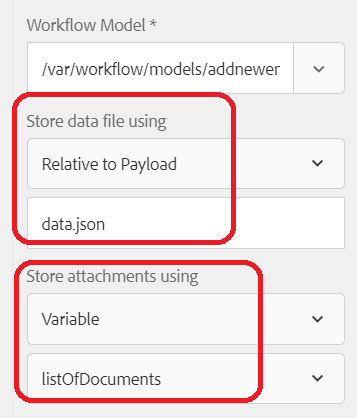

# Inserção de anexos de formulário no banco de dados

Este artigo abordará o caso de uso do armazenamento de anexos de formulário no banco de dados MySQL.

Uma tarefa comum dos clientes é armazenar dados de formulários capturados e o anexo do formulário em uma tabela de banco de dados.
Para realizar esse caso de uso, as seguintes etapas foram seguidas

## Criar tabela de banco de dados para manter os dados do formulário e o anexo

Uma tabela chamada newhire foi criada para conter os dados do formulário. Observe a imagem do nome da coluna do tipo **LONGBLOB** para armazenar o anexo do formulário


## Criar modelo de dados do formulário

Um modelo de dados de formulário foi criado para se comunicar com o banco de dados MySQL. Será necessário criar o seguinte

* [Fonte de dados JDBC no AEM](./data-integration-technical-video-setup.md)
* [Modelo de dados de formulário com base na fonte de dados JDBC](./jdbc-data-model-technical-video-use.md)

## Criar fluxo de trabalho

Ao configurar o formulário adaptável para enviar a um fluxo de trabalho de AEM, você tem a opção de salvar os anexos do formulário em uma variável de fluxo de trabalho ou salvar os anexos em uma pasta especificada sob o payload. Para esse caso de uso, precisamos salvar os anexos em uma variável de fluxo de trabalho do tipo ArrayList of Document. Nessa ArrayList, precisamos extrair o primeiro item e inicializar uma variável de documento. As variáveis de fluxo de trabalho chamadas **listOfDocuments** e **employeePhoto** foram criadas.
Quando o formulário adaptável for enviado para acionar o fluxo de trabalho, uma etapa no fluxo de trabalho inicializará a variável employeePhoto usando o script ECMA. Este é o código de script ECMA

```javascript
log.info("executing script now...");
var metaDataMap = graniteWorkItem.getWorkflow().getWorkflowData().getMetaDataMap();
var listOfAttachments = [];
// Make sure you have a workflow variable caled listOfDocuments defined
listOfAttachments = metaDataMap.get("listOfDocuments");
log.info("$$$  got listOfAttachments");
//Make sure you have a workflow variable caled employeePhoto defined
var employeePhoto = listOfAttachments[0];
metaDataMap.put("employeePhoto", employeePhoto);
log.info("Employee Photo updated");
```

A próxima etapa do fluxo de trabalho é inserir dados e o anexo do formulário na tabela usando o componente de serviço Invocar modelo de dados de formulário .

[O workflow completo com o script ecma de amostra pode ser baixado aqui](assets/add-new-employee.zip).

>[!NOTE]
> Será necessário criar um novo modelo de dados de formulário baseado em JDBC e usar esse modelo de dados de formulário no fluxo de trabalho

## Criar formulário adaptável

Crie seu formulário adaptável com base no modelo de dados de formulário criado na etapa anterior. Arraste e solte os elementos do modelo de dados de formulário no formulário. Configure o envio do formulário para acionar o fluxo de trabalho e especifique as seguintes propriedades, conforme mostrado na captura de tela abaixo
