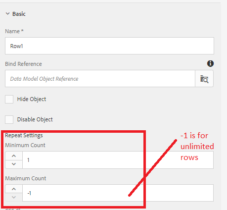

# Preencha a tabela de formulário adaptável com os resultados da chamada do serviço de modelo de dados de formulário

[O formulário em tempo real está hospedado ](https://forms.enablementadobe.com/content/dam/formsanddocuments/amortization/jcr:content?wcmmode=disabled)
aquiNeste artigo, observamos preencher a tabela de formulários adaptáveis buscando dados da chamada do serviço de modelo de dados de formulário. Vamos criar um cronograma de amortização em uma tabela que lista cada pagamento regular de uma hipoteca ao longo do tempo. Os resultados da amortização são retornados pelo nosso Modelo de dados de formulário. O serviço do Modelo de dados de formulário é chamado no botão click evento of calculate, como mostrado na captura de tela. Os parâmetros de entrada e de saída da chamada de serviço são mapeados apropriadamente, como mostrado na captura de tela. A saída é mapeada para as colunas de Row1

A linha1 está configurada para aumentar dependendo dos dados retornados pela chamada de serviço. Observe as configurações de repetição especificadas aqui. Um valor de -1 indica um número ilimitado de linhas na tabela

## Implantar no servidor

[Instalar o Tomcat conforme especificado ](/help/forms/ic-print-channel-tutorial/set-up-tomcat.md)
[aquiImplantar o ](https://forms.enablementadobe.com/content/DemoServerBundles/SampleRest.war)
[arquivo SampleRest.warInstale os ativos  ](assets/amortizationschedule.zip) usando AEM gerenciador de pacote 
[Abra o ](http://localhost:4502/content/dam/formsanddocuments/amortization/jcr:content?wcmmode=disabled)
formulário de agendamento de amamentaçãoInsira o valor apropriado e clique em calcular Agendamento de amamentação deve ser preenchido em seu formulário

