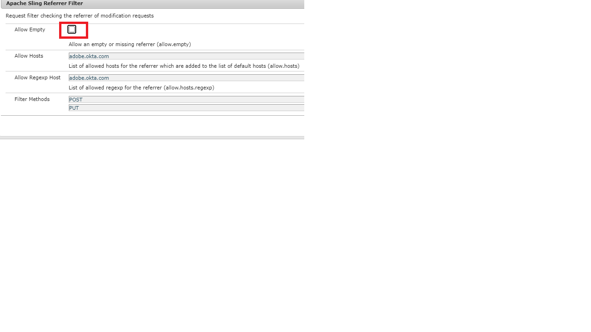

# Autenticar para o autor do AEM usando OKTA

O primeiro passo é configurar seu aplicativo no portal OKTA. Depois que seu aplicativo for aprovado pelo administrador OKTA, você terá acesso ao certificado IdP e ao URL de logon único. Veja a seguir as configurações normalmente usadas no registro do novo aplicativo.

* **Nome do aplicativo:** Este é o nome do seu aplicativo. Dê um nome exclusivo ao aplicativo.
* **Recipient SAML:** Após a autenticação de OKTA, esse é o URL que seria acessado em sua instância do AEM com a resposta SAML. O manipulador de autenticação SAML normalmente intercepta todos os URLs com / saml_login, mas seria preferível anexá-los depois da raiz do aplicativo.
* **Público-alvo SAML**: Este é o URL de domínio do seu aplicativo. Não use o protocolo (http ou https) no URL do domínio.
* **ID do nome SAML:** Selecione Email na lista suspensa.
* **Ambiente**: Escolha o ambiente apropriado.
* **Atributos**: Esses são os atributos que você obtém sobre o usuário na resposta do SAML. Especifique-as de acordo com suas necessidades.

## Adicionar o certificado OKTA (IdP) ao AEM Trust Store

Como as asserções de SAML são criptografadas, precisamos adicionar o certificado IdP (OKTA) ao armazenamento confiável AEM para permitir a comunicação segura entre OKTA e AEM.
[Inicializar armazenamento de confiança](http://localhost:4502/libs/granite/security/content/truststore.html), se ainda não tiver sido inicializado.
Lembre-se da senha do repositório de confiança. Precisaremos usar essa senha posteriormente neste processo.

* Navegar para [Armazenamento de Confiança Global](http://localhost:4502/libs/granite/security/content/truststore.html).
* Clique em &quot;Adicionar certificado do arquivo CER&quot;. Adicione o certificado IdP fornecido pelo OKTA e clique em enviar.

   >[!NOTE]
   >
   >Não mapeie o certificado para nenhum usuário

Ao adicionar o certificado ao armazenamento confiável, você deve obter o alias do certificado, conforme mostrado na captura de tela abaixo. O nome do alias pode ser diferente no seu caso.

**Anote o alias do certificado. É necessário fazer isso nas etapas posteriores.**

### Configurar o manipulador de autenticação SAML

Navegar para [configMgr](http://localhost:4502/system/console/configMgr).
Pesquise e abra &quot;Manipulador de autenticação do Adobe Granite SAML 2.0&quot;.
Forneça as seguintes propriedades conforme especificado abaixo As seguintes são as propriedades principais que precisam ser especificadas:

* **caminho** - Este é o caminho onde o manipulador de autenticação é acionado
* **Url IdP**: Este é o seu URL IdP fornecido pelo OKTA
* **Alias de certificado IDP**: é o alias que você obteve ao adicionar o certificado IdP ao AEM armazenamento confiável
* **Id Da Entidade Do Provedor De Serviços**: Este é o nome do seu servidor AEM
* **Senha do repositório de chaves**: esta é a senha do repositório de confiança que você usou
* **Redirecionamento padrão**: este é o URL para o qual redirecionar na autenticação bem-sucedida
* **Atributo UserID**:uid
* **Usar criptografia**:false
* **Criar automaticamente usuários do CRX**:true
* **Adicionar a grupos**:true
* **Grupos padrão**:oktausers(Este é o grupo ao qual os usuários são adicionados. Você pode fornecer qualquer grupo existente dentro do AEM)
* **NamedIDPolicy**: Especifica restrições no identificador de nome a ser usado para representar o assunto solicitado. Copie e cole a seguinte sequência de caracteres realçada **urn:oasis:names:tc:SAML:2.0:nameidformat:emailAddress**
* **Atributos sincronizados** - Esses são os atributos que estão sendo armazenados a partir da asserção SAML em AEM perfil

### Configurar o filtro de referência do Apache Sling

Navegar para [configMgr](http://localhost:4502/system/console/configMgr).
Pesquise e abra &quot;Filtro de referenciador do Apache Sling&quot;.Defina as seguintes propriedades conforme especificado abaixo:

* **Permitir vazio**: false
* **Permitir hosts**: Nome do host do IdP (é diferente no seu caso)
* **Permitir Host Regexp**: Nome do host do IdP (É diferente no seu caso) Captura de tela Propriedades do Referenciador de Filtro do Referenciador do Sling

#### Configurar o registro DEBUG para a integração OKTA

Ao configurar a integração OKTA no AEM, pode ser útil consultar os registros DEBUG para AEM manipulador de Autenticação SAML. Para definir o nível de log como DEBUG, crie uma nova configuração do Sling Logger por meio do console da Web OSGi AEM.

Lembre-se de remover ou desativar esse logger no Stage e na Production para reduzir o ruído de log.

Ao configurar a integração OKTA no AEM, pode ser útil consultar os logs DEBUG para AEM manipulador de autenticação SAML. Para definir o nível de log como DEBUG, crie uma nova configuração do Sling Logger por meio do console da Web OSGi AEM.
**Lembre-se de remover ou desativar esse logger no Stage e na Production para reduzir o ruído de log.**
* Navegar para [configMgr](http://localhost:4502/system/console/configMgr)

* Pesquise e abra &quot;Configuração do Apache Sling Logging Logger&quot;
* Crie um logger com a seguinte configuração:
   * **Nível de log**: Depurar
   * **Arquivo de log**: logs/saml.log
   * **Logger**: com.adobe.granite.auth.saml
* Clique em Salvar para salvar suas configurações

#### Testar sua configuração OKTA

Faça logoff da sua instância do AEM. Tente acessar o link. Você deve ver o SSO OKTA em ação.
