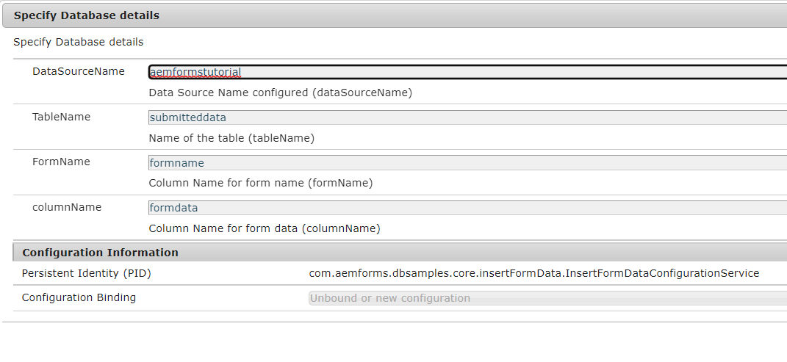

# Armazenamento de envios de formulários adaptáveis no banco de dados

Há várias maneiras de armazenar os dados do formulário enviado no banco de dados de sua escolha. Uma fonte de dados JDBC pode ser usada para armazenar os dados diretamente no banco de dados. Um pacote OSGI personalizado pode ser gravado para armazenar os dados no banco de dados. Este artigo usa a etapa de processo personalizada no fluxo de trabalho do AEM para armazenar os dados.
O caso de uso é acionar um fluxo de trabalho de AEM em um envio de formulário adaptável, e uma etapa no fluxo de trabalho armazena os dados enviados na base de dados.


## Pool de Conexões JDBC

* Ir para [ConfigMgr](http://localhost:4502/system/console/configMgr)

   * Procure por &quot;Pool de conexão JDBC&quot;. Crie um novo Pool de Conexões JDBC do Day Commons. Especifique as configurações específicas do banco de dados.

   * 

## Especificar Detalhes do Banco de Dados

* Pesquisar por &quot;**Especificar detalhes do Banco de Dados**&quot;
* Especifique as propriedades específicas do banco de dados.
   * DataSourceName: nome da origem de dados configurada anteriormente.
   * TableName - Nome da tabela na qual você deseja armazenar os dados de AF
   * FormName - O nome da coluna que conterá o nome do Formulário
   * ColumnName - O nome da coluna que conterá os dados de AF

  


## Código para configuração OSGi

```java
package com.aemforms.dbsamples.core.insertFormData;

import org.osgi.service.metatype.annotations.AttributeDefinition;
import org.osgi.service.metatype.annotations.ObjectClassDefinition;

@ObjectClassDefinition(name = "Specify Database details", description = "Specify Database details")

public @interface InsertFormDataConfiguration {
  @AttributeDefinition(name = "DataSourceName", description = "Data Source Name configured")
  String dataSourceName() default "";
  @AttributeDefinition(name = "TableName", description = "Name of the table")
  String tableName() default "";
  @AttributeDefinition(name = "FormName", description = "Column Name for form name")
  String formName() default "";
  @AttributeDefinition(name = "columnName", description = "Column Name for form data")
  String columnName() default "";

}
```

## Ler valores de configuração

```java
package com.aemforms.dbsamples.core.insertFormData;
import org.osgi.service.component.annotations.Activate;
import org.osgi.service.component.annotations.Component;
import org.osgi.service.metatype.annotations.Designate;

@Component(service={InsertFormDataConfigurationService.class})
@Designate(ocd=InsertFormDataConfiguration.class)

public class InsertFormDataConfigurationService {
    public String TABLE_NAME;
    public String DATA_SOURCE_NAME;
    public String COLUMN_NAME;
    public String FORM_NAME;
    @Activate      
      protected final void activate(InsertFormDataConfiguration insertFormDataConfiguration)
      {
        TABLE_NAME = insertFormDataConfiguration.tableName();
        DATA_SOURCE_NAME = insertFormDataConfiguration.dataSourceName();
        COLUMN_NAME = insertFormDataConfiguration.columnName();
        FORM_NAME = insertFormDataConfiguration.formName();
      }
    public String getTABLE_NAME()
    {
        return TABLE_NAME;
    }
    public String getDATA_SOURCE_NAME()
    {
        return DATA_SOURCE_NAME;
    }
    public String getCOLUMN_NAME()
    {
        return COLUMN_NAME;
    }
    public String getFORM_NAME()
    {
        return FORM_NAME;
    }
}
```

## Código para implementar a etapa do processo

```java
package com.aemforms.dbsamples.core.insertFormData;
import java.io.InputStream;
import java.io.StringWriter;
import java.nio.charset.StandardCharsets;
import java.sql.Connection;
import java.sql.PreparedStatement;
import java.sql.SQLException;

import javax.jcr.Node;
import javax.jcr.Session;
import javax.sql.DataSource;

import org.apache.commons.io.IOUtils;
import org.osgi.framework.Constants;
import org.osgi.service.component.annotations.Component;
import org.osgi.service.component.annotations.Reference;
import org.slf4j.Logger;
import org.slf4j.LoggerFactory;

import com.adobe.granite.workflow.WorkflowException;
import com.adobe.granite.workflow.WorkflowSession;
import com.adobe.granite.workflow.exec.WorkItem;
import com.adobe.granite.workflow.exec.WorkflowProcess;
import com.adobe.granite.workflow.metadata.MetaDataMap;
import com.day.commons.datasource.poolservice.DataSourcePool;

@Component(property = {
  Constants.SERVICE_DESCRIPTION + "=Insert Form Data in Database",
  Constants.SERVICE_VENDOR + "=Adobe Systems",
  "process.label" + "=Insert Form Data in Database"
})

public class InsertAfData implements WorkflowProcess {
  @Reference
  InsertFormDataConfigurationService insertFormDataConfig;
  @Reference
  DataSourcePool dataSourcePool;
  private final Logger log = LoggerFactory.getLogger(getClass());
  @Override
  public void execute(WorkItem workItem, WorkflowSession session, MetaDataMap metaDataMap) throws WorkflowException {

    String proccesArgsVals = (String) metaDataMap.get("PROCESS_ARGS", (Object)
      "string");
    String[] values = proccesArgsVals.split(",");
    String AdaptiveFormName = values[0];
    String formDataFile = values[1];
    String payloadPath = workItem.getWorkflowData().getPayload().toString();
    Session jcrSession = (Session) session.adaptTo((Class) Session.class);
    String dataFilePath = payloadPath + "/" + formDataFile + "/jcr:content";
    log.debug("The data file path is " + dataFilePath);
    PreparedStatement ps = null;
    Connection con = null;
    DataSource dbSource = null;

    try {
      dbSource = (DataSource) dataSourcePool.getDataSource(insertFormDataConfig.getDATA_SOURCE_NAME());
      log.debug("Got db source");
      con = dbSource.getConnection();

      Node xmlDataNode = jcrSession.getNode(dataFilePath);
      InputStream xmlDataStream = xmlDataNode.getProperty("jcr:data").getBinary().getStream();
      StringWriter writer = new StringWriter();
      String encoding = StandardCharsets.UTF_8.name();
      IOUtils.copy(xmlDataStream, writer, encoding);
      String queryStmt = "insert into " + insertFormDataConfig.TABLE_NAME + "(" + insertFormDataConfig.COLUMN_NAME + "," + insertFormDataConfig.FORM_NAME + ") values(?,?)";
      log.debug("The query Stmt is " + queryStmt);
      ps = con.prepareStatement(queryStmt);
      ps.setString(1, writer.toString());
      ps.setString(2, AdaptiveFormName);
      ps.executeUpdate();

    } catch (Exception e) {
      log.debug("The error message is " + e.getMessage());
    } finally {
      if (ps != null) {
        try {
          ps.close();
        } catch (SQLException sqlException) {
          log.debug(sqlException.getMessage());
        }
      }
      if (con != null) {
        try {
          con.close();
        } catch (SQLException sqlException) {
          log.error("Unable to close connection to database", sqlException);
        }
      }
    }
  }

}
```

## Implantar os ativos de amostra

* Verifique se você configurou o pool de conexão JDBC
* Especifique os detalhes do banco de dados usando o configMgr
* [Baixe o arquivo Zip e extraia o conteúdo no disco rígido](assets/article-assets.zip)

   * Implante o arquivo jar usando [Console da Web AEM](http://localhost:4502/system/console/bundles). Esse arquivo jar contém o código para armazenar os dados do formulário no banco de dados.

   * Importe os dois arquivos zip para o [AEM usando o gerenciador de pacotes](http://localhost:4502/crx/packmgr/index.jsp). Isso lhe dará a [exemplo de fluxo de trabalho](http://localhost:4502/editor.html/conf/global/settings/workflow/models/storeformdata.html) e a variável [exemplo de formulário adaptável](http://localhost:4502/editor.html/content/forms/af/addformdataindb.html) que acionará o fluxo de trabalho no envio do formulário. Observe os argumentos do processo na etapa do fluxo de trabalho. Esses argumentos indicam o nome do formulário e o nome do arquivo de dados que conterá os dados do formulário adaptável. O arquivo de dados é armazenado na pasta de carga útil no repositório crx. Observe como [formulário adaptável](http://localhost:4502/editor.html/content/forms/af/addformdataindb.html) está configurado para acionar o fluxo de trabalho do AEM no envio e na configuração do arquivo de dados (data.xml)

   * Pré-visualize e preencha o formulário e envie. Você deve ver uma nova linha criada no banco de dados

