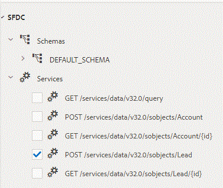

# Configuração do DataSource com Salesforce no AEM Forms 6.3 e 6.4{#configuring-datasource-with-salesforce-in-aem-forms-and}

## Pré-requisitos {#prerequisites}

Neste artigo, abordaremos o processo de criação da Fonte de Dados com o Salesforce

Pré-requisitos para este tutorial:

* Role até a parte inferior desta página e baixe o arquivo do swagger e salve-o no disco rígido.
* AEM Forms com SSL habilitado

   * [Documentação oficial para habilitar o SSL no AEM 6.3](https://helpx.adobe.com/experience-manager/6-3/sites/administering/using/ssl-by-default.html)
   * [Documentação oficial para habilitar o SSL no AEM 6.4](https://helpx.adobe.com/experience-manager/6-4/sites/administering/using/ssl-by-default.html)

* Você precisará ter a conta do Salesforce
* Será necessário criar um aplicativo conectado. O formulário oficial de documentação do Salesforce para criar o aplicativo está listado [aqui](https://help.salesforce.com/articleView?id=connected_app_create.htm&amp;type=0).
* Forneça os escopos OAuth apropriados para o aplicativo (selecionei todos os escopos OAuth disponíveis para fins de teste)
* Forneça a URL de retorno de chamada. O URL de retorno de chamada no meu caso era

   * Se você estiver usando **AEM Forms 6.3**, a URL de retorno de chamada será https://gbedekar-w7-1:6443/etc/cloudservices/fdm/createlead.html. Neste URL, createlead é o nome do meu modelo de dados de formulário.

   * Se estiver usando** AEM Forms 6.4**, a URL de retorno de chamada será [https://gbedekar-w7-:6443/libs/fd/fdm/gui/components/admin/fdmcloudservice/createcloudconfigwizard/cloudservices.html](https://gbedekar-w7-1:6443/libs/fd/fdm/gui/components/admin/fdmcloudservice/createcloudconfigwizard/cloudservices.html)

Neste exemplo, gbedekar -w7-1:6443 é o nome do meu servidor e a porta em que o AEM está em execução.

Depois de criar o Aplicativo Conectado, anote a **Chave do Consumidor e Chave Secreta**. Você precisará deles ao criar a fonte de dados no AEM Forms.

Agora que você criou seu aplicativo conectado, será necessário criar um arquivo de troca para as operações que você precisa executar no salesforce. Um arquivo de amostra swagger é incluído como parte dos ativos baixáveis. Esse arquivo swagger permite criar um objeto &quot;Lead&quot; no envio do formulário adaptável. Explore este arquivo swagger.

A próxima etapa é criar a Fonte de Dados no AEM Forms. Siga as etapas a seguir de acordo com sua versão do AEM Forms

## AEM Forms 6.3 {#aem-forms}

* Faça logon no AEM Forms usando o protocolo https
* Navegue até serviços de nuvem digitando https://&lt;servername>:&lt;serverport> /etc/cloudservices.html, Por exemplo, https://gbedekar-w7-1:6443/etc/cloudservices.html
* Role para baixo até &quot;Modelo de dados de formulário&quot;.
* Clique em &quot;Mostrar configurações&quot;.
* Clique em &quot;+&quot; para adicionar nova configuração
* Selecione &quot;Rest Full Service&quot;. Forneça um Título e um Nome significativos para a configuração. Por exemplo,

   * Nome: CreateLeadInSalesForce
   * Título: CreateLeadInSalesForce

* Clique em &quot;Criar&quot;

**Na próxima tela **

* Selecione &quot;Arquivo&quot; como a opção para o arquivo de origem do swagger. Navegue até o arquivo que você baixou anteriormente
* Selecione Tipo de autenticação como OAuth2.0
* Forneça os valores ClientID e Client Secret
* O Url de OAuth é - **https://login.salesforce.com/services/oauth2/authorize**
* Atualizar Url do Token - **https://na5.salesforce.com/services/oauth2/token**
* **Url do Toque de Acesso - https://na5.salesforce.com/services/oauth2/token**
* Escopo da Autorização: ** api   id completa do chatter_api   openid   recurso visual refresh_token web**
* Manipulador de autenticação: Portador da Autorização
* Clique em &quot;Conectar-se a OAUTH &quot;.Se tudo correr bem, você não deverá ver nenhum erro

Depois de criar seu Modelo de dados de formulário usando o Salesforce, você pode criar a Integração de dados de formulário usando a Fonte de dados que acabou de criar. A documentação oficial para criar a Integração de dados de formulário é [aqui](https://helpx.adobe.com/aem-forms/6-3/data-integration.html).

Certifique-se de configurar o Modelo de dados de formulário para incluir o serviço POST para criar um objeto de lead no SFDC.

Você também precisará configurar o Serviço de Leitura e Gravação para o objeto de Cliente Potencial. Consulte as capturas de tela na parte inferior desta página.

Depois de criar o Modelo de dados de formulário, você pode criar o Adaptive Forms com base nesse modelo e usar os métodos de envio do Modelo de dados de formulário para criar lead no SFDC.

## AEM Forms 6.4 {#aem-forms-1}

* Criar fonte de dados

   * [Navegar até Fontes de Dados](http://localhost:4502/libs/fd/fdm/gui/components/admin/fdmcloudservice/fdm.html/conf/global)

   * Clique no botão &quot;Criar&quot;
   * Fornecer alguns valores significativos

      * Nome: CreateLeadInSalesForce
      * Título: CreateLeadInSalesForce
      * Tipo de serviço: Serviço RESTful
   * Clique em Avançar
   * Fonte do Swagger: Arquivo
   * Navegue e selecione o arquivo swagger baixado na etapa anterior
   * Tipo de autenticação: OAuth 2.0. Especifique os seguintes valores
   * Forneça os valores ClientID e Client Secret
   * O Url de OAuth é - **https://login.salesforce.com/services/oauth2/authorize**
   * Atualizar Url do Token - **https://na5.salesforce.com/services/oauth2/token**
   * Token de acesso Ur **l - https://na5.salesforce.com/services/oauth2/token**
   * Escopo da Autorização: ** api chatter_api full id openid refresh_token visual web**
   * Manipulador de autenticação: Portador da Autorização
   * Clique no botão &quot;Conectar-se ao OAuth&quot;. Se você encontrar algum erro, reveja as etapas anteriores para garantir que todas as informações foram inseridas corretamente.

Depois de criar sua fonte de dados usando SalesForce, é possível criar a Integração de dados do formulário usando a fonte de dados que acabou de criar. O link da documentação para isso é [aqui](https://helpx.adobe.com/experience-manager/6-4/forms/using/create-form-data-models.html)

Certifique-se de configurar o Modelo de dados de formulário para incluir o serviço POST para criar um objeto de lead no SFDC.

Você também precisará configurar o Serviço de Leitura e Gravação para o objeto de Cliente Potencial. Consulte as capturas de tela na parte inferior desta página.

Depois de criar o Modelo de dados de formulário, você pode criar o Adaptive Forms com base nesse modelo e usar os métodos de envio do Modelo de dados de formulário para criar lead no SFDC.

>[!NOTE]
>
>Certifique-se de que o url no arquivo swagger corresponde à sua região. Por exemplo, o url no arquivo de troca de amostras é &quot;na46.salesforce.com&quot;, pois a conta foi criada na América do Norte. A maneira mais fácil é fazer logon na sua conta do Salesforce e verificar o url .

[SampleSwaggerFile](assets/swagger-sales-force-lead.json)
