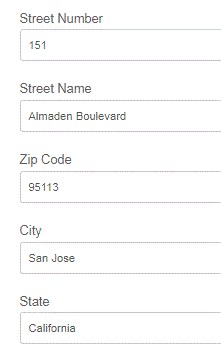

# Uso de APIs de localização geográfica em formulários adaptáveis{#using-geolocation-api-s-in-adaptive-forms}

Visite a página [AEM Forms samples](https://forms.enablementadobe.com/content/samples/samples.html?query=0) para obter um link para uma demonstração ao vivo desse recurso.

Neste artigo, vamos analisar o uso da API de localização geográfica do Google para preencher campos de um formulário adaptável. Esse caso de uso geralmente é usado quando você deseja preencher os campos de endereço atuais em um formulário.

As etapas a seguir foram seguidas para usar a API de localização geográfica em formulários adaptáveis.

1. [Obtenha o ](https://developers.google.com/maps/documentation/javascript/get-api-key) Chave da API do Google para usar a plataforma Google Maps. Você pode obter uma chave de avaliação válida por 1 ano.

1. O fragmento de formulário adaptável foi criado com campos para manter o endereço atual

1. A API de localização geográfica foi invocada no evento click do objeto de imagem do formulário adaptável

1. Os dados JSON retornados pela chamada da API foram analisados e os valores dos campos do Formulário adaptável foram definidos de acordo.

```javascript
navigator.geolocation.getCurrentPosition(showPosition);
function showPosition(position) 
{
console.log(" I am inside the showPosition in fragment");
console.log("Latitude: " + position.coords.latitude + "Longitude " + position.coords.longitude);
var url = "https://maps.googleapis.com/maps/api/geocode/json?latlng="+position.coords.latitude+","+position.coords.longitude+"&key=<your_api_key>";
  console.log(url);
  
  $.getJSON(url,function (data, textStatus){
    
    var location=data.results[0].formatted_address;
    console.log(location);
    
    for(i=0;i<data.results[0].address_components.length;i++)
        {
          if(data.results[0].address_components[i].types[0] == "street_number")
            {
              streetNumber.value = data.results[0].address_components[i].long_name;
            }
          if(data.results[0].address_components[i].types[0] == "route")
            {
              streetName.value = data.results[0].address_components[i].long_name;
            }
            if(data.results[0].address_components[i].types[0] == "postal_code")
            {
              
              zipCode.value = data.results[0].address_components[i].long_name;
            }
            if(data.results[0].address_components[i].types[0] == "locality")
            {
              
              city.value = data.results[0].address_components[i].long_name;
            }
          if(data.results[0].address_components[i].types[0] == "administrative_area_level_1")
            {
              
              state.value = data.results[0].address_components[i].long_name;
            }
        }
    
  });
}
```



Na linha 1, usamos a API de localização geográfica HTML para obter a localização atual. Depois que a localização atual for obtida, passamos a localização atual para a função showPosition.

Na função showPosition, usamos a API do Google para buscar os detalhes de endereço para a latitude e a longitude fornecidas.

O JSON retornado pela API é analisado para definir os campos do Formulário adaptável.

>[!NOTE]
>
>Para fins de teste, você pode usar o protocolo HTTP com localhost no URL.
>
>Para o servidor de produção, será necessário habilitar o SSL para o Servidor AEM para obter esse recurso.
>
>A amostra associada a este artigo foi testada com o endereço dos EUA. Se quiser usar esse recurso em outros locais geográficos, talvez seja necessário ajustar a análise JSON.

Para colocar esse recurso no servidor, siga as etapas a seguir

* Instale e inicie o servidor do AEM Forms.

>!![NOTE] Esse recurso foi testado no AEM Forms 6.3 e superior
* [Obter a chave da API do Google](https://developers.google.com/maps/documentation/javascript/get-api-key).
* [Importe os ativos relacionados a este artigo para o AEM.](assets/geolocationapi.zip)
* [Abra o fragmento do formulário adaptável no modo de edição.](http://localhost:4502/editor.html/content/forms/af/currentaddressfragment.html)
* Abra o editor de regras para o componente Escolha de imagem .
* Substitua o &lt;your_api_key> pela chave de API do Google.
* Salve as alterações.
* [Visualizar o formulário](http://localhost:4502/content/dam/formsanddocuments/currentaddressfragment/jcr:content?wcmmode=disabled).
* Clique no ícone &quot;geolocalização&quot;.
* Seu formulário deve ser preenchido com a localização atual.
