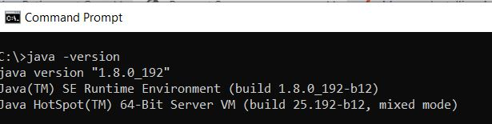

# Criar seu primeiro pacote OSGi

Um pacote OSGi é um arquivo de arquivo Java™ que contém código Java, recursos e um manifesto que descreve o pacote e suas dependências. O pacote é a unidade de implantação de um aplicativo. Este artigo destina-se aos desenvolvedores que desejam criar um serviço OSGi ou um servlet usando o AEM Forms 6.4 ou 6.5. Para criar seu primeiro pacote OSGi, siga as seguintes etapas:


## Instalar o JDK

Instale a versão compatível do JDK. Eu usei o JDK1.8. Verifique se você adicionou **JAVA_HOME** em suas variáveis de ambiente e está apontando para a pasta raiz da instalação do JDK.
Adicionar o %JAVA_HOME%/bin ao caminho


>[!NOTE]
> Não use o JDK 15. Ele não é compatível com o AEM.

### Testar a versão do JDK

Abra uma nova janela de prompt de comando e digite: `java -version`. Você deve recuperar a versão do JDK identificada pela variável `JAVA_HOME`



## Instalar o Maven

O Maven é uma ferramenta de automação de compilação usada principalmente para projetos Java. Siga as etapas a seguir para instalar o maven em seu sistema local.

* Crie uma pasta chamada `maven` na unidade C
* Baixe o [arquivo zip binário](https://maven.apache.org/download.cgi)
* Extraia o conteúdo do arquivo zip em `c:\maven`
* Crie uma variável de ambiente chamada `M2_HOME` com um valor de `C:\maven\apache-maven-3.6.0`. No meu caso, a versão **mvn** é 3.6.0. No momento da escrita deste artigo, a versão mais recente do maven é 3.6.3
* Adicione o `%M2_HOME%\bin` ao seu caminho
* Salve as alterações
* Abra um novo prompt de comando e digite `mvn -version`. Você deve ver a versão **mvn** listada como mostrado na captura de tela abaixo


## Settings.xml

Um arquivo Maven `settings.xml` define valores que configuram a execução Maven de várias maneiras. Geralmente, é usado para definir um local de repositório local, servidores de repositório remoto alternativos e informações de autenticação para repositórios privados.

Navegue até `C:\Users\<username>\.m2 folder`
Extraia o conteúdo do arquivo [settings.zip](assets/settings.zip) e coloque-o na pasta `.m2`.

## Instalar o Eclipse

Instale a versão mais recente de [eclipse](https://www.eclipse.org/downloads/)

## Criar o primeiro projeto

O Archetype é um kit de ferramentas de modelos de projeto Maven. Um arquétipo é definido como um padrão ou modelo original a partir do qual são feitas todas as outras coisas do mesmo tipo. O nome se encaixa à medida que tentamos fornecer um sistema que fornece um meio consistente de gerar projetos Maven. O arquétipo ajudará os autores a criar modelos de projeto Maven para usuários e fornece aos usuários os meios de gerar versões parametrizadas desses modelos de projeto.
Para criar seu primeiro projeto maven, siga as seguintes etapas:

* Crie uma nova pasta chamada `aemformsbundles` na unidade C
* Abra um prompt de comando e navegue até `c:\aemformsbundles`
* Execute o seguinte comando no prompt de comando
* `mvn archetype:generate  -DarchetypeGroupId=com.adobe.granite.archetypes  -DarchetypeArtifactId=aem-project-archetype -DarchetypeVersion=19`

O projeto Maven será gerado interativamente e você será solicitado a fornecer valores para várias propriedades, como:

| Nome da Propriedade | Significância | Valor |
------------------------|---------------------------------------|---------------------
| groupId | groupId identifica exclusivamente seu projeto em todos os projetos | com.learningaemforms.adobe |
| appsFolderName | Nome da pasta que manterá a estrutura do projeto | learn-aemforms |
| artifactId | artifactId é o nome do jar sem versão. Se você a criou, então você pode escolher qualquer nome que quiser com letras minúsculas e sem símbolos estranhos. | learn-aemforms |
| version | Se você distribuí-lo, poderá escolher qualquer versão típica com números e pontos (1.0, 1.1, 1.0.1, ...). | 1.0 |

Aceite os valores padrão para as outras propriedades pressionando Enter key.
Se tudo correr bem, você deverá ver uma mensagem de sucesso de criação em sua janela de comando

## Criar projeto do eclipse a partir do seu projeto Maven

Altere seu diretório de trabalho para `learningaemforms`.
Execute `mvn eclipse:eclipse` a partir da linha de comando
O comando acima lê o arquivo pom e cria projetos Eclipse com metadados corretos para que o Eclipse entenda os tipos de projeto, os relacionamentos, o classpath, etc.

## Importar o projeto para o eclipse

Iniciar **Eclipse**

Vá para **File -> Import** e selecione **Existing Maven Projects** conforme mostrado aqui


Clique em Avançar

Selecione `c:\aemformsbundles\learningaemform`s clicando no botão **Procurar**


>[!NOTE]
>Você pode optar por importar os módulos apropriados, dependendo de suas necessidades. Selecione e importe somente o módulo principal, caso você só crie o código Java no seu projeto.

Clique em **Finish** para iniciar o processo de importação

O projeto é importado para o Eclipse e você verá várias pastas `learningaemforms.xxxx`

Expanda o `src/main/java` na pasta `learningaemforms.core`. Esta é a pasta na qual você gravará a maior parte do seu código.


## Crie seu projeto


Depois de escrever seu serviço OSGi, ou servlet, você precisará criar seu projeto para gerar o pacote OSGi que pode ser implantado usando o console da Web Felix. Consulte [AEMFD Client SDK](https://repo.adobe.com/nexus/content/groups/public/com/adobe/aemfd/aemfd-client-sdk-) para incluir o SDK do cliente apropriado em seu projeto Maven. Você terá que incluir o SDK do cliente do FD AEM na seção de dependências de `pom.xml` do projeto principal, conforme mostrado abaixo.


```xml
<dependency>
    <groupId>com.adobe.aemfd</groupId>
    <artifactId>aemfd-client-sdk</artifactId>
    <version>6.0.122</version>
</dependency>
```

Para criar seu projeto, siga as seguintes etapas:

* Abrir **janela de prompt de comando**
* Vá até `c:\aemformsbundles\learningaemforms\core`
* Execute o comando `mvn clean install -PautoInstallBundle`
O comando acima cria e instala o pacote no servidor AEM em execução em `http://localhost:4502`. O pacote também estará disponível no sistema de arquivos em
   `C:\AEMFormsBundles\learningaemforms\core\target` e podem ser implantados usando o console da Web do  [Felix](http://localhost:4502/system/console/bundles)
