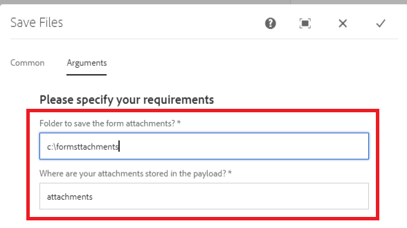

# Etapa de processo personalizada

Este tutorial é destinado aos clientes do AEM Forms que precisam implementar um componente de fluxo de trabalho personalizado. A primeira etapa na criação do componente de fluxo de trabalho é gravar seu código java que será associado ao componente de fluxo de trabalho. Para a finalidade deste tutorial, vamos gravar uma classe java simples para armazenar os anexos de formulário adaptável no sistema de arquivos. Esse código java lerá os argumentos especificados no componente de fluxo de trabalho.

As etapas a seguir são necessárias para gravar a classe java e implantar a classe como um pacote OSGi

## Criar projeto Maven

O primeiro passo é criar um projeto maven usando o Adobe Archetype apropriado. As etapas detalhadas estão listadas neste [artigo](https://experienceleague.adobe.com/docs/experience-manager-learn/forms/creating-your-first-osgi-bundle/create-your-first-osgi-bundle.html). Depois que o projeto maven for importado para o eclipse, você estará pronto para começar a gravar seu primeiro componente OSGi que pode ser usado na etapa do processo.


### Criar classe que implemente o WorkflowProcess

Abra o projeto maven no eclipse IDE. Expandir **nome do projeto** > **núcleo** pasta. Expanda a pasta src/main/java. Você deve ver um pacote que termine com &quot;núcleo&quot;. Crie a classe Java que implementa WorkflowProcess neste pacote. Você precisará substituir o método de execução. A assinatura do método execute é a seguinte execução pública void (WorkItem workItem, WorkflowSession workflowSession, MetaDataMap processArguments)aciona WorkflowException

Neste tutorial, gravaremos os anexos adicionados ao Formulário adaptável no sistema de arquivos como parte do fluxo de trabalho do AEM.

Para realizar esse caso de uso, a seguinte classe java foi gravada

Vamos dar uma olhada neste código

```java
package com.mysite.core;
import java.io.File;
import java.io.InputStream;
import java.util.HashMap;
import java.util.Map;
import javax.jcr.Node;
import javax.jcr.Session;
import org.osgi.framework.Constants;
import org.osgi.service.component.annotations.Component;
import org.osgi.service.component.annotations.Reference;
import org.slf4j.Logger;
import org.slf4j.LoggerFactory;
import com.adobe.aemfd.docmanager.Document;
import com.adobe.granite.workflow.WorkflowException;
import com.adobe.granite.workflow.WorkflowSession;
import com.adobe.granite.workflow.exec.WorkItem;
import com.adobe.granite.workflow.exec.WorkflowProcess;
import com.adobe.granite.workflow.metadata.MetaDataMap;
import com.day.cq.search.PredicateGroup;
import com.day.cq.search.Query;
import com.day.cq.search.QueryBuilder;
import com.day.cq.search.result.Hit;
import com.day.cq.search.result.SearchResult;
@Component(property = {
  Constants.SERVICE_DESCRIPTION + "=Custom component to wrtie form attachments to file system",
  Constants.SERVICE_VENDOR + "=Adobe Systems",
  "process.label" + "=Custom component to wrtie form attachments to file system"
})
public class WriteFormAttachmentsToFileSystem implements WorkflowProcess {

  private static final Logger log = LoggerFactory.getLogger(WriteFormAttachmentsToFileSystem.class);
  @Reference
  QueryBuilder queryBuilder;

  @Override
  public void execute(WorkItem workItem, WorkflowSession workflowSession, MetaDataMap metaDataMap)
  throws WorkflowException {

    String attachmentsPath = metaDataMap.get("attachmentsPath", String.class);

    log.debug("Got attachments path: " + attachmentsPath);
    String saveToLocation = metaDataMap.get("SaveToLocation", String.class);
    log.debug("Got save location: " + saveToLocation);

    log.debug("The seperator is" + File.separator);
    String payloadPath = workItem.getWorkflowData().getPayload().toString();
    Map < String, String > map = new HashMap < String, String > ();
    map.put("path", payloadPath + "/" + attachmentsPath);
    File saveLocationFolder = new File(saveToLocation);
    if (!saveLocationFolder.exists()) {
      saveLocationFolder.mkdirs();
    }

    map.put("type", "nt:file");
    Query query = queryBuilder.createQuery(PredicateGroup.create(map), workflowSession.adaptTo(Session.class));
    query.setStart(0);
    query.setHitsPerPage(20);

    SearchResult result = query.getResult();
    log.debug("Got  " + result.getHits().size() + " attachments ");
    Node attachmentNode = null;
    for (Hit hit: result.getHits()) {
      try {
        String path = hit.getPath();
        log.debug("The attachment title is  " + hit.getTitle() + " and the attachment path is  " + path);
        attachmentNode = workflowSession.adaptTo(Session.class).getNode(path + "/jcr:content");
        InputStream documentStream = attachmentNode.getProperty("jcr:data").getBinary().getStream();
        Document attachmentDoc = new Document(documentStream);
        attachmentDoc.copyToFile(new File(saveLocationFolder + File.separator + hit.getTitle()));
        attachmentDoc.close();
      } catch (Exception e) {
        log.error("Error saving file " + e.getMessage());
      }
    }
  }
}
```


* attachmentPath - Esse é o mesmo local especificado no formulário adaptável quando você configura a ação de envio do formulário adaptável para chamar AEM fluxo de trabalho. Este é um nome da pasta na qual você deseja que os anexos sejam salvos em AEM em relação à carga do fluxo de trabalho.

* saveToLocation - esse é o local em que você deseja que os anexos sejam salvos no sistema de arquivos do servidor AEM.

Esses dois valores são passados como argumentos de processo usando a caixa de diálogo do componente de fluxo de trabalho



O serviço QueryBuilder é usado para consultar nós do tipo nt:file na pasta attachmentPath. O restante do código é repetido por meio dos resultados da pesquisa para criar um objeto de Documento e salvá-lo no sistema de arquivos


>[!NOTE]
>
>Como estamos usando um objeto de Documento específico para o AEM Forms, é necessário incluir a dependência aemfd-client-sdk em seu projeto maven.

```xml
<dependency>
    <groupId>com.adobe.aemfd</groupId>
    <artifactId>aemfd-client-sdk</artifactId>
    <version>6.0.772</version>
</dependency>
```

#### Criar e implantar

[Crie o pacote conforme descrito aqui](https://experienceleague.adobe.com/docs/experience-manager-learn/forms/creating-your-first-osgi-bundle/create-your-first-osgi-bundle.html)
[Certifique-se de que o pacote esteja implantado e no estado ativo](http://localhost:4502/system/console/bundles)

## Próximas etapas

Crie seu [componente de fluxo de trabalho personalizado](./custom-workflow-component.md)

