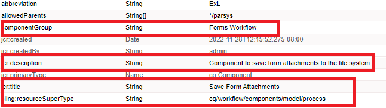

# Componente de fluxo de trabalho personalizado

Este tutorial destina-se aos clientes do AEM Forms que precisam criar um componente de fluxo de trabalho personalizado. O componente de fluxo de trabalho será configurado para executar o código escrito na etapa anterior. O componente de fluxo de trabalho pode especificar argumentos de processo para o código. Neste artigo, exploraremos o componente de fluxo de trabalho associado ao código.

[Baixar o componente de fluxo de trabalho personalizado](assets/saveFiles.zip)
Importar o componente de fluxo de trabalho [usando o gerenciador de pacotes](http://localhost:4502/crx/packmgr/index.jsp)

O componente de fluxo de trabalho personalizado está localizado em /apps/AEMFormsDemoListings/workflowcomponent/SaveFiles

Selecione o nó SaveFiles e examine suas propriedades

**componentGroup** - O valor dessa propriedade determina a categoria do componente do fluxo de trabalho.

**jcr:Title** - Este é o título do componente do fluxo de trabalho.

**sling:resourceSuperType** O valor dessa propriedade determinará a herança desse componente. Nesse caso, estamos herdando do componente do processo

## cq:dialog

As caixas de diálogo são usadas para permitir que o autor interaja com o componente. O cq:dialog está no nó SaveFiles

Os nós no nó itens representam as guias do componente pelas quais os autores interagem com o componente. As guias comum e processo estão ocultas. As guias Comum e Argumentos ficam visíveis.

Os argumentos do processo estão no nó processargs

O autor especifica os argumentos conforme mostrado na captura de tela abaixo

Os valores são armazenados como propriedades do nó de metadados. Por exemplo, o valor **c:\formsattachments** será armazenado na propriedade saveToLocation do nó de metadados

## cq:editConfig

O cq:EditConfig é simplesmente um nó com o tipo primário cq:EditConfig e o nome cq:editConfig na raiz do componente
O comportamento de edição de um componente é configurado adicionando um nó cq:editConfig do tipo cq:EditConfig abaixo do nó do componente (do tipo cq:Component)

cq:formParameters (tipo de nó nt:unstructured): define parâmetros adicionais que são adicionados ao formulário da caixa de diálogo.

Observe as propriedades do nó cq:formParameters

O valor da propriedade PROCESS indica o código java que será associado ao componente do fluxo de trabalho.
