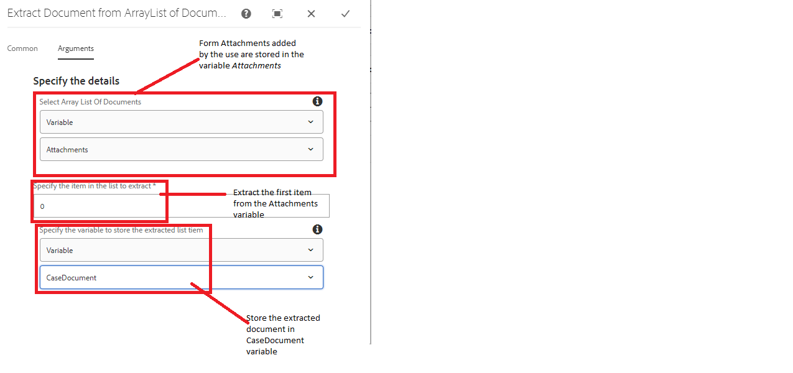

# Extrair documento da lista de documentos

Um caso de uso comum é enviar os dados de formulário e o anexo do formulário a um sistema externo usando a etapa chamar modelo de dados de formulário em um fluxo de trabalho do AEM. Por exemplo, ao criar um caso no ServiceNow, você gostaria de enviar detalhes do caso com um documento de suporte. Os anexos adicionados ao formulário adaptável são armazenados em uma variável do tipo lista de matriz de documentos e, para extrair um documento específico dessa lista de matriz, será necessário gravar o código personalizado.

Este artigo o guiará pelas etapas de uso do componente de fluxo de trabalho personalizado para extrair e armazenar o documento em uma variável de documento.

## Criar fluxo de trabalho

É necessário criar um fluxo de trabalho para lidar com o envio do formulário. O workflow precisa ter as seguintes variáveis definidas

* Uma variável do tipo ArrayList of Document(Essa variável manterá os anexos de formulário adicionados pelo usuário)
* Uma variável do tipo Documento.(Essa variável manterá o documento extraído de ArrayList)

* Adicione o componente personalizado ao seu fluxo de trabalho e configure as propriedades dele
  

## Configurar formulário adaptável

* Configure a ação de envio do formulário adaptável para acionar o fluxo de trabalho do AEM
  

## Testar a solução

[Implante o pacote personalizado usando o console da Web OSGi](assets/ExtractItemsFromArray.core-1.0.0-SNAPSHOT.jar)

[Importar o componente de fluxo de trabalho usando o gerenciador de pacotes](assets/Extract-item-from-documents-list.zip)

[Importar a amostra de fluxo de trabalho](assets/extract-item-sample-workflow.zip)

[Importar o formulário adaptável](assets/test-attachment-extractions-adaptive-form.zip)

[Visualizar o formulário](http://localhost:4502/content/dam/formsanddocuments/testattachmentsextractions/jcr:content?wcmmode=disabled)

Adicione um anexo ao formulário e envie-o.

>[!NOTE]
>
>O documento extraído pode ser usado em qualquer outra etapa do fluxo de trabalho, como Enviar email ou Chamar etapa do FDM

