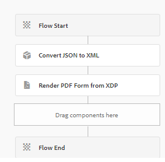

# Gerar PDF com dados do componente principal com base no envio de formulário

Aqui está o texto revisado com &quot;Componentes principais&quot; em maiúsculas:

Um cenário típico envolve a geração de um PDF a partir de dados enviados por meio de um formulário adaptável baseado em Componentes principais. Esses dados estão sempre no formato JSON. Para gerar um PDF usando a API Render PDF, é necessário converter os dados JSON no formato XML. O método `toString` de `org.json.XML` é usado para esta conversão. Para obter mais detalhes, consulte a [documentação do `org.json.XML.toString` método](https://www.javadoc.io/doc/org.json/json/20171018/org/json/XML.html#toString-java.lang.Object-).

## Baseado em formulário adaptável no esquema JSON

Siga estas etapas para criar um esquema JSON para seu formulário adaptável:

### Gerar dados de amostra para o XDP

Para simplificar o processo, siga estas etapas refinadas:

1. Abra o arquivo XDP no AEM Forms Designer.
1. Navegue até &quot;Arquivo&quot; > &quot;Propriedades do formulário&quot; > &quot;Visualização&quot;.
1. Selecione &quot;Gerar dados de visualização&quot;.
1. Clique em &quot;Gerar&quot;.
1. Atribua um nome de arquivo significativo, como `form-data.xml`.

### Gerar esquema JSON a partir dos dados XML

Você pode utilizar qualquer ferramenta online gratuita para [converter XML em JSON](https://jsonformatter.org/xml-to-jsonschema) usando os dados XML gerados na etapa anterior.

### Processo de fluxo de trabalho personalizado para converter JSON em XML

O código fornecido converte JSON em XML, armazenando o XML resultante em uma variável de processo de fluxo de trabalho chamada `dataXml`.

```java
import org.slf4j.LoggerFactory;
import com.adobe.granite.workflow.WorkflowException;
import java.io.InputStream;
import java.io.BufferedReader;
import java.io.InputStreamReader;
import javax.jcr.Node;
import javax.jcr.Session;
import org.json.JSONObject;
import org.json.XML;
import org.slf4j.Logger;
import org.osgi.service.component.annotations.Component;
import com.adobe.granite.workflow.WorkflowSession;
import com.adobe.granite.workflow.exec.WorkItem;
import com.adobe.granite.workflow.exec.WorkflowProcess;
import com.adobe.granite.workflow.metadata.MetaDataMap;

@Component(property = {
    "service.description=Convert JSON to XML",
    "process.label=Convert JSON to XML"
})
public class ConvertJSONToXML implements WorkflowProcess {

    private static final Logger log = LoggerFactory.getLogger(ConvertJSONToXML.class);

    @Override
    public void execute(final WorkItem workItem, final WorkflowSession workflowSession, final MetaDataMap arg2) throws WorkflowException {
        String processArgs = arg2.get("PROCESS_ARGS", "string");
        log.debug("The process argument I got was " + processArgs);
        
        String submittedDataFile = processArgs;
        String payloadPath = workItem.getWorkflowData().getPayload().toString();
        log.debug("The payload in convert json to xml " + payloadPath);
        
        String dataFilePath = payloadPath + "/" + submittedDataFile + "/jcr:content";
        try {
            Session session = workflowSession.adaptTo(Session.class);
            Node submittedJsonDataNode = session.getNode(dataFilePath);
            InputStream jsonDataStream = submittedJsonDataNode.getProperty("jcr:data").getBinary().getStream();
            BufferedReader streamReader = new BufferedReader(new InputStreamReader(jsonDataStream, "UTF-8"));
            StringBuilder stringBuilder = new StringBuilder();
            String inputStr;
            while ((inputStr = streamReader.readLine()) != null) {
                stringBuilder.append(inputStr);
            }
            JSONObject submittedJson = new JSONObject(stringBuilder.toString());
            log.debug(submittedJson.toString());
            
            String xmlString = XML.toString(submittedJson);
            log.debug("The json converted to XML " + xmlString);
            
            MetaDataMap metaDataMap = workItem.getWorkflow().getWorkflowData().getMetaDataMap();
            metaDataMap.put("xmlData", xmlString);
        } catch (Exception e) {
            log.error("Error converting JSON to XML: " + e.getMessage(), e);
        }
    }
}
```

### Criar fluxo de trabalho

Para lidar com envios de formulários, crie um fluxo de trabalho que inclua duas etapas:

1. A etapa inicial emprega um processo personalizado para transformar os dados JSON enviados em XML.
1. A etapa subsequente gera um PDF ao combinar os dados XML com o modelo XDP.




## Implante o código de exemplo

Para testar isso no servidor local, siga estas etapas simplificadas:

1. [Baixe e instale o pacote personalizado por meio do console da Web AEM OSGi](assets/convertJsonToXML.core-1.0.0-SNAPSHOT.jar).
1. [Importar o pacote de fluxo de trabalho](assets/workflow_to_render_pdf.zip).
1. [Importe o formulário adaptável de exemplo e o modelo XDP](assets/adaptive_form_and_xdp_template.zip).
1. [Visualizar o Formulário Adaptável](http://localhost:4502/content/dam/formsanddocuments/f23/jcr:content?wcmmode=disabled).
1. Preencha alguns campos de formulário.
1. Envie o formulário para iniciar o fluxo de trabalho do AEM.
1. Localize o PDF renderizado na pasta de conteúdo do fluxo de trabalho.
