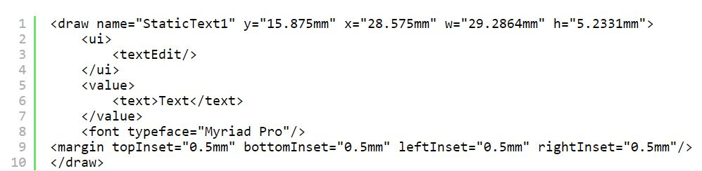

# PDF

O Portable Document Format (PDF) é, na verdade, uma família de formatos de arquivo, e este artigo detalha os que são mais relevantes para desenvolvedores de formulários. Muitos dos detalhes técnicos e padrões de diferentes tipos de PDF estão evoluindo e mudando. Alguns desses formatos e especificações são padrões da Organização Internacional de Normalização (ISO), e alguns são propriedade intelectual específica de propriedade da Adobe.

Este artigo mostra como criar vários tipos de PDF. Ele ajuda você a entender como e por que usar cada um. Todos esses tipos funcionam melhor na principal ferramenta de cliente para visualizar e trabalhar com o PDF — Adobe Acrobat DC.

Veja a seguir um exemplo de um arquivo PDF/A no Acrobat DC.

Os arquivos de exemplo podem ser [baixado aqui](assets/pdf-file-types.zip)

## PDF da arquitetura XML Forms (PDF XFA)

O Adobe usa o termo formulário PDF XFA para se referir ao Forms interativo e dinâmico criado com o AEM Forms Designer. O Forms e os arquivos criados com o Designer são baseados na Adobe XML Forms Architecture (XFA). De muitas formas, o formato de arquivo PDF XFA está mais próximo de um arquivo HTML do que de um arquivo PDF tradicional. Por exemplo, o código a seguir mostra como um objeto de texto simples se parece em um arquivo PDF XFA.

O XFA Forms é baseado em XML. Esse formato bem estruturado e flexível permite que um servidor AEM Forms transforme seus arquivos Designer em diferentes formatos, incluindo PDF, PDF/A e HTML tradicionais. Você pode ver a estrutura XML completa do Forms no Designer selecionando a guia Código-fonte XML do Editor de layout. Você pode criar Forms XFA estático e dinâmico no AEM Forms Designer.

## PDF estático

O layout estático de PDF forms do XFA nunca é alterado no tempo de execução, mas pode ser interativo para o usuário. Estas são algumas das vantagens dos PDF forms XFA estáticos:

* O layout estático de PDF forms do XFA nunca é alterado no tempo de execução, mas pode ser interativo para o usuário.
* O Forms estático é compatível com as ferramentas de Comentário e Marcação da Acrobat.
* O Forms estático permite importar e exportar comentários do Acrobat.
* O Forms estático suporta a subconfiguração de fonte, que é uma técnica que pode ser feita em um servidor AEM Forms.
* O Forms estático pode ser renderizado usando o visualizador de PDF integrado que vem com navegadores modernos.

>[!NOTE]
>
> Você pode criar PDF estáticos usando o AEM Forms Designer, salvando o XDP como o Formulário PDF estático de Adobe

### Forms dinâmico

Os PDF XFA dinâmicos podem alterar seu layout em tempo de execução, portanto, os recursos de comentários e marcação não são compatíveis. No entanto, os PDF XFA dinâmicos oferecem as seguintes vantagens:

* Os formulários dinâmicos são compatíveis com scripts do lado do cliente que alteram o layout e a paginação do formulário. Por exemplo, o Purchase Order.xdp se expandirá e paginará para acomodar uma quantidade infinita de dados se você salvá-lo como um formulário dinâmico
* Os formulários dinâmicos suportam todas as propriedades do formulário no tempo de execução, enquanto os formulários estáticos suportam apenas um subconjunto

* [Consulte este documento para entender as diferenças entre formulários pdf estáticos e dinâmicos](https://experienceleague.adobe.com/docs/experience-manager-learn/forms/document-services/pdf-forms-and-documents.html#:~:text=Dynamic%20forms%20support%20all%20the,forms%20support%20only%20a%20subset)

>[!NOTE]
>
> Você pode criar pdfs dinâmicos usando o AEM Forms Designer, salvando o XDP como o Formulário XML dinâmico do Adobe

>[!NOTE]
>
> Os formulários dinâmicos não podem ser renderizados usando os visualizadores de PDF incorporados dos navegadores modernos.

### Arquivo PDF (PDF tradicional)

Um Documento certificado fornece ao documento PDF e aos recipients do Forms garantias adicionais de autenticidade e integridade.

O formato de PDF mais popular e difundido é o arquivo de PDF tradicional. Há várias maneiras de criar um arquivo de PDF tradicional, incluindo o uso do Acrobat e de várias ferramentas de terceiros. O Acrobat fornece todas as seguintes maneiras de criar arquivos PDF tradicionais. Se o Acrobat não estiver instalado, talvez você não veja essas opções no computador.

* Ao capturar o fluxo de impressão de um aplicativo de desktop: escolha o comando Imprimir de um aplicativo de criação e selecione o ícone da impressora Adobe PDF. Em vez de uma cópia impressa do documento, você terá criado um arquivo PDF do documento
* Ao usar o plug-in Acrobat PDFMaker com aplicativos do Microsoft Office: ao instalar o Acrobat, ele adiciona um menu Adobe PDF aos aplicativos do Microsoft Office e um ícone à faixa Office. Você pode usar esses recursos adicionados para criar arquivos de PDF diretamente no Microsoft Office
* Ao usar o Acrobat Distiller para converter arquivos Postscript e Postscript Encapsulado (EPS) em PDF: o Distiller geralmente é usado na publicação de impressão e outros fluxos de trabalho que exigem uma conversão do formato Postscript para o formato PDF
* Sob o capô, um PDF tradicional é muito diferente de um PDF XFA. Ele não tem a mesma estrutura XML e, como é criado pela captura do fluxo de impressão de um arquivo, um PDF tradicional é um arquivo estático e somente leitura.

Um Documento certificado fornece aos destinatários do documento de PDF e dos formulários garantias adicionais de sua autenticidade e integridade.

### Acroforms

Adobe As acroformas são tecnologias de formulário interativo mais antigas; elas remontam à versão 3 do Acrobat. O Adobe fornece a [Referência da API do Acrobat Forms](assets/FormsAPIReference.pdf), de maio de 2003, para fornecer os detalhes técnicos dessa tecnologia. Os acroforms são uma combinação dos seguintes itens:

* Um PDF tradicional que define o layout estático e os gráficos do formulário.
* Campos de formulário interativos fixados em cima com as ferramentas de formulário do programa Adobe Acrobat. Essas ferramentas de formulário são um pequeno subconjunto do que está disponível no AEM Forms Designer.

### PDF/A (PDF para arquivamento)

O PDF/A (PDF para arquivos) baseia-se nos benefícios de armazenamento de documentos dos PDF tradicionais com muitos detalhes específicos que melhoram o arquivamento de longo prazo. O formato de arquivo PDF tradicional oferece muitos benefícios para o armazenamento de documentos a longo prazo. A natureza compacta do PDF facilita a transferência e conserva espaço, e sua natureza bem estruturada permite poderosos recursos de indexação e pesquisa. O PDF tradicional oferece suporte extensivo aos metadados e o PDF tem um longo histórico de suporte a diferentes ambientes de computador.

Como o PDF, PDF/A é uma especificação padrão ISO. Ele foi desenvolvido por uma força-tarefa que incluía a AIIM (Association for Information and Image Management), a NPES (National Printing Equipment Association) e o Escritório Administrativo dos Tribunais dos EUA. Como o objetivo da especificação PDF/A é fornecer um formato de arquivo de longo prazo, muitos recursos de PDF são omitidos para que os arquivos possam ser autocontidos. A seguir estão alguns pontos-chave sobre a especificação que melhoram a reprodutibilidade a longo prazo do arquivo PDF/A:

* Todo o conteúdo deve estar contido no arquivo e não pode haver dependências em fontes externas como hiperlinks, fontes ou programas de software.
* Todas as fontes devem ser incorporadas e precisam ser fontes com licença de uso ilimitado para documentos eletrônicos.
* JavaScript não é permitido
* Transparência não permitida
* A criptografia não é permitida
* O conteúdo de áudio e vídeo não é permitido
* Os espaços de cores devem ser definidos de maneira independente de dispositivos
* Todos os metadados devem seguir determinados padrões

### Visualização de um arquivo PDF/A

Dois arquivos nos arquivos de amostra foram criados a partir do mesmo arquivo do Microsoft Word. Um foi criado como um PDF tradicional e o outro como um arquivo PDF/A. Abra esses dois arquivos no Acrobat Professional:

* simpleWordFile.pdf
* simpleWordFilePDFA.pdf

Embora os documentos tenham a mesma aparência, o arquivo PDF/A é aberto com uma barra azul na parte superior, indicando que você está vendo esse documento no modo PDF/A. Essa barra azul é a barra de mensagens do documento do Acrobat, que você vê ao abrir determinados tipos de arquivos PDF.

A barra de mensagens do documento inclui instruções e, possivelmente, botões para ajudá-lo a concluir uma tarefa. Ele é codificado por cores, e você verá a cor azul quando abrir tipos especiais de PDF (como esse arquivo PDF/A), bem como PDF certificados e assinados digitalmente. A barra muda para roxo para PDF forms e para amarelo quando você está participando de uma revisão de PDF.

>[!NOTE]
>
> Se você clicar em Habilitar edição, removerá este documento da conformidade com o PDF/A.
