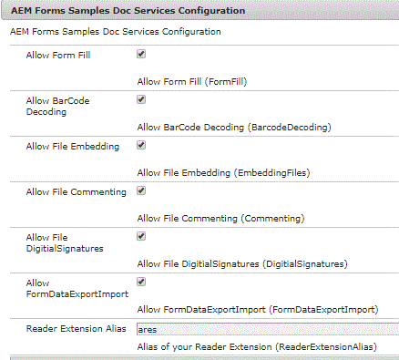

# Renderização do XDP em PDF com direitos de uso{#rendering-xdp-into-pdf-with-usage-rights}

Um caso de uso comum é renderizar o xdp em PDF e aplicar as Extensões de leitura ao PDF renderizado.

Por exemplo, no portal de formulários do AEM Forms, quando um usuário clica em XDP, podemos renderizar o XDP como PDF e o leitor estender o PDF.

Para testar esse recurso, você pode tentar este [link](https://forms.enablementadobe.com/content/samples/samples.html?query=0). O nome da amostra é &quot;Renderizar XDP com RE&quot;

Para realizar esse caso de uso, precisamos fazer o seguinte.

* Adicione o certificado Reader Extensions ao usuário &quot;fd-service&quot;. As etapas para adicionar credenciais das Extensões de Leitor são listadas [aqui](https://helpx.adobe.com/experience-manager/6-3/forms/using/configuring-document-services.html)

* Crie um serviço OSGi personalizado que renderizará e aplicará direitos de uso. O código para fazer isso está listado abaixo

## Renderizar XDP e Aplicar direitos de uso {#render-xdp-and-apply-usage-rights}

* Linha 7: Usando o renderPDFForm do FormsService, geramos PDF a partir do XDP.

* Linhas 8-14: Os direitos de uso apropriados são definidos. Esses direitos de uso são obtidos das configurações do OSGi.

* Linha 20 : Usar o resourceresolver associado ao serviço fd do usuário de serviço

* Linha 24: O método secureDocument do DocumentAssuranceService é usado para aplicar os direitos de uso

```java
 public Document renderAndExtendXdp(String xdpPath) {
  // TODO Auto-generated method stub
  log.debug("In renderAndExtend xdp the alias is " + docConfig.ReaderExtensionAlias());
  PDFFormRenderOptions renderOptions = new PDFFormRenderOptions();
  renderOptions.setAcrobatVersion(AcrobatVersion.Acrobat_11);
  try {
   Document xdpRenderedAsPDF = formsService.renderPDFForm("crx://" + xdpPath, null, renderOptions);
   UsageRights usageRights = new UsageRights();
   usageRights.setEnabledBarcodeDecoding(docConfig.BarcodeDecoding());
   usageRights.setEnabledFormFillIn(docConfig.FormFill());
   usageRights.setEnabledComments(docConfig.Commenting());
   usageRights.setEnabledEmbeddedFiles(docConfig.EmbeddingFiles());
   usageRights.setEnabledDigitalSignatures(docConfig.DigitialSignatures());
   usageRights.setEnabledFormDataImportExport(docConfig.FormDataExportImport());
   ReaderExtensionsOptionSpec reOptionsSpec = new ReaderExtensionsOptionSpec(usageRights, "Sample ARES");
   UnlockOptions unlockOptions = null;
   ReaderExtensionOptions reOptions = ReaderExtensionOptions.getInstance();
   reOptions.setCredentialAlias(docConfig.ReaderExtensionAlias());
   log.debug("set the credential");
   reOptions.setResourceResolver(getResolver.getFormsServiceResolver());
   
   reOptions.setReOptions(reOptionsSpec);
   log.debug("set the resourceResolver and re spec");
   xdpRenderedAsPDF = docAssuranceService.secureDocument(xdpRenderedAsPDF, null, null, reOptions,
     unlockOptions);

   return xdpRenderedAsPDF;
  } catch (FormsServiceException e) {
   // TODO Auto-generated catch block
   e.printStackTrace();
  } catch (Exception e) {
   // TODO Auto-generated catch block
   e.printStackTrace();
  }
  return null;

 }
```

A captura de tela a seguir mostra as propriedades de configuração expostas. A maioria dos direitos de uso comuns é exposta por meio dessa configuração.



O código a seguir mostra o código usado para criar as configurações do OSGi

```java
package com.aemformssamples.configuration;

import org.osgi.service.metatype.annotations.AttributeDefinition;
import org.osgi.service.metatype.annotations.AttributeType;
import org.osgi.service.metatype.annotations.ObjectClassDefinition;

@ObjectClassDefinition(name = "AEM Forms Samples Doc Services Configuration", description = "AEM Forms Samples Doc Services Configuration")
public @interface DocSvcConfiguration {
 @AttributeDefinition(name = "Allow Form Fill", description = "Allow Form Fill", type = AttributeType.BOOLEAN)
 boolean FormFill() default false;

 @AttributeDefinition(name = "Allow BarCode Decoding", description = "Allow BarCode Decoding", type = AttributeType.BOOLEAN)
 boolean BarcodeDecoding() default false;

 @AttributeDefinition(name = "Allow File Embedding", description = "Allow File Embedding", type = AttributeType.BOOLEAN)
 boolean EmbeddingFiles() default false;

 @AttributeDefinition(name = "Allow Commenting", description = "Allow Commenting", type = AttributeType.BOOLEAN)
 boolean Commenting() default false;

 @AttributeDefinition(name = "Allow DigitialSignatures", description = "Allow File DigitialSignatures", type = AttributeType.BOOLEAN)
 boolean DigitialSignatures() default false;

 @AttributeDefinition(name = "Allow FormDataExportImport", description = "Allow FormDataExportImport", type = AttributeType.BOOLEAN)
 boolean FormDataExportImport() default false;

 @AttributeDefinition(name = "Reader Extension Alias", description = "Alias of your Reader Extension")
 String ReaderExtensionAlias() default "";

}
```

## Criar servlet para transmitir o PDF {#create-servlet-to-stream-the-pdf}

A próxima etapa é criar um servlet com um método GET para retornar o PDF estendido do leitor ao usuário. Nesse caso, o usuário será solicitado a salvar o PDF em seu sistema de arquivos. Isso ocorre porque o PDF é renderizado como PDF dinâmico e os visualizadores de pdf que vêm com os navegadores não lidam com pdfs dinâmicos.

A seguir, o código do servlet. Passamos o caminho do XDP no repositório CRX para este servlet.

Em seguida, chamamos o método renderAndExtendXdp de com.aemformssamples.documentservices.core.DocumentServices.

O PDF estendido pelo leitor é então transmitido ao aplicativo chamador

```java
package com.aemformssamples.documentservices.core.servlets;

import java.io.IOException;
import java.io.InputStream;
import java.io.OutputStream;

import javax.servlet.Servlet;

import org.apache.sling.api.SlingHttpServletRequest;
import org.apache.sling.api.SlingHttpServletResponse;
import org.apache.sling.api.servlets.SlingSafeMethodsServlet;
import org.osgi.service.component.annotations.Component;
import org.osgi.service.component.annotations.Reference;
import org.slf4j.Logger;
import org.slf4j.LoggerFactory;

import com.adobe.aemfd.docmanager.Document;
import com.adobe.fd.forms.api.FormsService;
import com.aemformssamples.documentservices.core.DocumentServices;

@Component(service = Servlet.class, property = {

  "sling.servlet.methods=get",

  "sling.servlet.paths=/bin/renderandextend"

})
public class RenderAndReaderExtend extends SlingSafeMethodsServlet {
 @Reference
 FormsService formsService;
 @Reference
 DocumentServices documentServices;
 private static final Logger log = LoggerFactory.getLogger(RenderAndReaderExtend.class);
 private static final long serialVersionUID = 1L;

 protected void doGet(SlingHttpServletRequest request, SlingHttpServletResponse response) {
  log.debug("The path of the XDP I got was " + request.getParameter("xdpPath"));
  Document renderedPDF = documentServices.renderAndExtendXdp(request.getParameter("xdpPath"));
  response.setContentType("application/pdf");
  response.addHeader("Content-Disposition", "attachment; filename=AemFormsRocks.pdf");
  try {
   response.setContentLength((int) renderedPDF.length());
   InputStream fileInputStream = null;
   fileInputStream = renderedPDF.getInputStream();
   OutputStream responseOutputStream = null;
   responseOutputStream = response.getOutputStream();
   int bytes;
   while ((bytes = fileInputStream.read()) != -1) {
    {
     responseOutputStream.write(bytes);
    }

   }
  } catch (IOException e2) {
   // TODO Auto-generated catch block
   e2.printStackTrace();
  }

 }

}
```

Para testar isso em seu servidor local, siga as etapas a seguir
1. [Baixe e instale o pacote DevelopingWithServiceUser](/help/forms/assets/common-osgi-bundles/DevelopingWithServiceUser.jar)
1. [Baixe e instale o pacote AEMFormsDocumentServices](/help/forms/assets/common-osgi-bundles/AEMFormsDocumentServices.core-1.0-SNAPSHOT.jar)
1. [Baixe e importe os ativos relacionados a este artigo para o AEM usando o gerenciador de pacotes](assets/renderandextendxdp.zip)
   * Este pacote tem um portal de exemplo e um arquivo xdp
1. Adicionar certificado de extensões do leitor ao usuário &quot;fd-service&quot;
1. Aponte seu navegador para [página da Web do portal](http://localhost:4502/content/AemForms/ReaderExtensionsXdp.html)
1. Clique no ícone de pdf para renderizar o xdp e obter pdf, que é o Reader Extended


