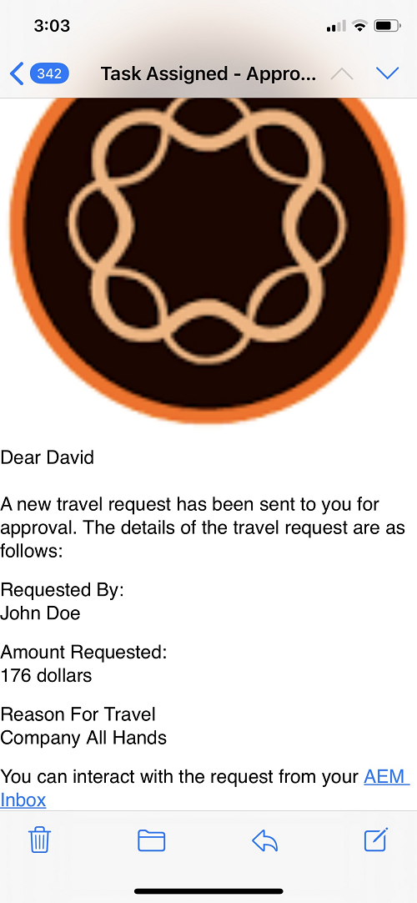

# Personalizar Atribuir Notificação de Tarefa

O componente Atribuir tarefa é usado para atribuir tarefas aos participantes do fluxo de trabalho. Quando uma tarefa é atribuída a um usuário ou grupo, uma notificação por email é enviada ao usuário ou aos membros do grupo definidos.
Normalmente, essa notificação por e-mail conterá dados dinâmicos relacionados à tarefa. Esses dados dinâmicos são obtidos usando a variável [propriedades de metadados](https://experienceleague.adobe.com/docs/experience-manager-65/forms/publish-process-aem-forms/use-metadata-in-email-notifications.html#using-system-generated-metadata-in-an-email-notification).
Para incluir valores dos dados de formulário enviados na notificação por email, precisamos criar uma propriedade de metadados personalizada e usar essas propriedades de metadados personalizadas no modelo de email


## Criação da propriedade de metadados personalizada

A abordagem recomendada é criar um componente OSGI que implemente o método getUserMetadata do [ServiçoDeMetadadosDeUsuárioDeTrabalho](https://helpx.adobe.com/experience-manager/6-5/forms/javadocs/com/adobe/fd/workspace/service/external/WorkitemUserMetadataService.html#getUserMetadataMap--)

O código a seguir cria quatro propriedades de metadados (_firstName_,_lastName_,_motivo_ e _amountRequested_) e define seu valor a partir dos dados enviados. Por exemplo, a propriedade de metadados _firstName_ O valor de está definido como o valor do elemento chamado firstName a partir dos dados enviados. O código a seguir presume que os dados enviados do formulário adaptável estão no formato xml. O Forms adaptável baseado em esquema JSON ou modelo de dados de formulário gera dados no formato JSON.


```java
package com.aemforms.workitemuserservice.core;

import java.io.InputStream;
import java.util.HashMap;
import java.util.Map;

import javax.jcr.Session;
import javax.xml.parsers.DocumentBuilder;
import javax.xml.parsers.DocumentBuilderFactory;
import javax.xml.xpath.XPath;

import org.osgi.framework.Constants;
import org.osgi.service.component.annotations.Component;
import org.slf4j.Logger;
import org.slf4j.LoggerFactory;
import org.w3c.dom.*;


import com.adobe.fd.workspace.service.external.WorkitemUserMetadataService;
import com.adobe.granite.workflow.WorkflowSession;
import com.adobe.granite.workflow.exec.WorkItem;
import com.adobe.granite.workflow.metadata.MetaDataMap;
@Component(property={Constants.SERVICE_DESCRIPTION+"=A sample implementation of a user metadata service.",
Constants.SERVICE_VENDOR+"=Adobe Systems",
"process.label"+"=Sample Custom Metadata Service"})


public class WorkItemUserServiceImpl implements WorkitemUserMetadataService {
private static final Logger log = LoggerFactory.getLogger(WorkItemUserServiceImpl.class);

@Override
public Map<String, String> getUserMetadata(WorkItem workItem, WorkflowSession workflowSession,MetaDataMap metadataMap)
{
HashMap<String, String> customMetadataMap = new HashMap<String, String>();
String payloadPath = workItem.getWorkflowData().getPayload().toString();
String dataFilePath = payloadPath + "/Data.xml/jcr:content";
Session session = workflowSession.adaptTo(Session.class);
DocumentBuilderFactory factory = null;
DocumentBuilder builder = null;
Document xmlDocument = null;
javax.jcr.Node xmlDataNode = null;
try
{
    xmlDataNode = session.getNode(dataFilePath);
    InputStream xmlDataStream = xmlDataNode.getProperty("jcr:data").getBinary().getStream();
    XPath xPath = javax.xml.xpath.XPathFactory.newInstance().newXPath();
    factory = DocumentBuilderFactory.newInstance();
    builder = factory.newDocumentBuilder();
    xmlDocument = builder.parse(xmlDataStream);
    Node firstNameNode = (org.w3c.dom.Node) xPath.compile("afData/afUnboundData/data/firstName")
            .evaluate(xmlDocument, javax.xml.xpath.XPathConstants.NODE);
    log.debug("The value of first name element  is " + firstNameNode.getTextContent());
    Node lastNameNode = (org.w3c.dom.Node) xPath.compile("afData/afUnboundData/data/lastName")
            .evaluate(xmlDocument, javax.xml.xpath.XPathConstants.NODE);
    Node amountRequested = (org.w3c.dom.Node) xPath
            .compile("afData/afUnboundData/data/amountRequested")
            .evaluate(xmlDocument, javax.xml.xpath.XPathConstants.NODE);
    Node reason = (org.w3c.dom.Node) xPath.compile("afData/afUnboundData/data/reason")
            .evaluate(xmlDocument, javax.xml.xpath.XPathConstants.NODE);
    customMetadataMap.put("firstName", firstNameNode.getTextContent());
    customMetadataMap.put("lastName", lastNameNode.getTextContent());
    customMetadataMap.put("amountRequested", amountRequested.getTextContent());
    customMetadataMap.put("reason", reason.getTextContent());
    log.debug("Created  " + customMetadataMap.size() + " metadata  properties");

}
catch (Exception e)
{
    log.debug(e.getMessage());
}
return customMetadataMap;
}

}
```

## Usar as propriedades de metadados personalizadas no modelo de email de notificação de tarefa

No modelo de email, é possível incluir a propriedade de metadados usando a seguinte sintaxe, em que amountRequested é a propriedade de metadados `${amountRequested}`

## Configurar Atribuir Tarefa para usar a propriedade de metadados personalizada

Depois que o componente OSGi for criado e implantado no servidor AEM, configure o componente Atribuir tarefa como mostrado abaixo para usar propriedades de metadados personalizadas.


## Permitir o uso de propriedades de metadados personalizadas


## Para tentar isso no servidor

* [Configurar o Day CQ Mail Service](https://experienceleague.adobe.com/docs/experience-manager-65/administering/operations/notification.html#configuring-the-mail-service)
* Associar uma ID de e-mail válida a [usuário administrador](http://localhost:4502/security/users.html)
* Baixe e instale o [Modelo de fluxo de trabalho e notificação](assets/workflow-and-task-notification-template.zip) usar [gerenciador de pacotes](http://localhost:4502/crx/packmgr/index.jsp)
* Baixar [Formulário adaptável](assets/request-travel-authorization.zip) e importar para o AEM da [interface do usuário de formulários e documentos](http://localhost:4502/aem/forms.html/content/dam/formsanddocuments).
* Implante e inicie o [Pacote personalizado](assets/work-items-user-service-bundle.jar) usando o [console da web](http://localhost:4502/system/console/bundles)
* [Pré-visualizar e enviar o formulário](http://localhost:4502/content/dam/formsanddocuments/requestfortravelauhtorization/jcr:content?wcmmode=disabled)

No envio do formulário, a notificação de atribuição de tarefa é enviada para a ID de e-mail associada ao usuário administrador. A captura de tela a seguir mostra um exemplo de notificação de atribuição de tarefa



>[!NOTE]
>O template de email para a notificação da tarefa atribuída precisa estar no seguinte formato.
>
> subject=Tarefa atribuída - `${workitem_title}`
>
> message=String que representa seu modelo de email sem nenhum caractere de nova linha.

## Comentários da Tarefa na notificação por e-mail da Tarefa Atribuída

Em alguns casos, você pode querer incluir os comentários do proprietário da tarefa anterior nas notificações de tarefas subsequentes. O código para capturar o último comentário da tarefa está listado abaixo:

```java
package samples.aemforms.taskcomments.core;

import org.osgi.service.component.annotations.Component;

import java.util.HashMap;
import java.util.List;
import java.util.Map;

import javax.jcr.Session;

import org.osgi.framework.Constants;
import org.slf4j.Logger;
import org.slf4j.LoggerFactory;
import com.adobe.granite.workflow.WorkflowSession;
import com.adobe.granite.workflow.exec.HistoryItem;
import com.adobe.granite.workflow.exec.WorkItem;
import com.adobe.granite.workflow.metadata.MetaDataMap;

import com.adobe.fd.workspace.service.external.WorkitemUserMetadataService;
@Component(property = {
  Constants.SERVICE_DESCRIPTION + "=A sample implementation of a user metadata service.",
  Constants.SERVICE_VENDOR + "=Adobe Systems",
  "process.label" + "=Capture Workflow Comments"
})

public class CaptureTaskComments implements WorkitemUserMetadataService {
  private static final Logger log = LoggerFactory.getLogger(CaptureTaskComments.class);
  @Override
  public Map <String, String> getUserMetadata(WorkItem workItem, WorkflowSession workflowSession, MetaDataMap metadataMap) {
    HashMap < String, String > customMetadataMap = new HashMap < String, String > ();
    workflowSession.adaptTo(Session.class);
    try {
      List <HistoryItem> workItemsHistory = workflowSession.getHistory(workItem.getWorkflow());
      int listSize = workItemsHistory.size();
      HistoryItem lastItem = workItemsHistory.get(listSize - 1);
      String reviewerComments = (String) lastItem.getWorkItem().getMetaDataMap().get("workitemComment");
      log.debug("####The comment I got was ...." + reviewerComments);
      customMetadataMap.put("comments", reviewerComments);
      log.debug("Created  " + customMetadataMap.size() + " metadata  properties");

    } catch (Exception e) {
      log.debug(e.getMessage());
    }
    return customMetadataMap;
  }

}
```

O pacote com o código acima pode ser [baixado aqui](assets/samples.aemforms.taskcomments.taskcomments.core-1.0-SNAPSHOT.jar)
