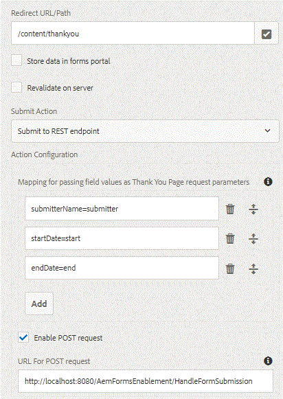

# Enviando para a página de agradecimento {#submitting-to-thank-you-page}

A opção Enviar para ponto de extremidade REST transmite os dados preenchidos no formulário para uma página de confirmação configurada como parte da solicitação de GET HTTP. É possível adicionar o nome dos campos a serem solicitados. O formato da solicitação é:

\{fieldName\} = \{parameterName\}. Por exemplo, o submitterName é o nome de um campo de formulário adaptável e o remetente é o nome do parâmetro. Na página de agradecimento, você pode acessar o parâmetro do remetente usando request.getParameter(&quot;submitter&quot;) para obter a retenção do valor do campo de nome do remetente.

submitterName=submitter

Na captura de tela abaixo, enviamos o formulário adaptável para agradecer a sua página localizada em /content/ankyou. Para esta página de agradecimento, estamos transmitindo 3 atributos de solicitação que manterão os valores do campo de formulário.

Também é possível enviar para o terminal externo por POST. Para fazer isso, basta selecionar a caixa de seleção &quot;ativar solicitação de postagem&quot; e fornecer o URL do terminal externo. Ao enviar seu formulário, você receberá a página de agradecimento e o terminal POST será chamado simultaneamente.

Para testar esse recurso em seu servidor, siga as instruções mencionadas abaixo:

* Importe o arquivo [assets associado a este artigo para AEM usando o gerenciador de pacote](assets/submittingtorestendpoint.zip)
* Aponte seu navegador para o [Formulário de solicitação de tempo limite](http://localhost:4502/content/dam/formsanddocuments/helpx/timeoffrequestform/jcr:content?wcmmode=disabled)
* Preencha o campo obrigatório e envie o formulário
* Você deve obter a página de agradecimento com suas informações preenchidas na página

