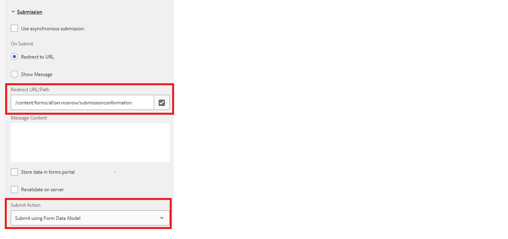

# Personalizar página de agradecimento

Ao enviar um formulário adaptável para um endpoint REST, você gostaria de mostrar uma mensagem de confirmação informando ao usuário que o envio do formulário foi bem-sucedido. A resposta do POST contém detalhes sobre o envio, como a ID de envio, e uma mensagem de confirmação bem projetada inclui a ID de envio, contribuindo para uma melhor experiência do usuário. Essa resposta pode ser exibida na página de agradecimento configurada com seu formulário adaptável.

A captura de tela a seguir mostra que um formulário está sendo enviado usando a ação Enviar modelo de dados de formulário com uma página de agradecimento configurada



O POST de um Modelo de dados de formulário sempre retornará um objeto JSON na resposta. Este JSON está disponível na URL da página de agradecimento como um parâmetro de consulta chamado _fdmSubmitResult_. Você pode analisar esse parâmetro de consulta e exibir os elementos JSON na página de agradecimento.
O código de amostra a seguir analisa a resposta JSON para extrair o valor do campo de número. O xml apropriado é construído e passado no slingRequest para preencher o formulário. Normalmente, esse código é escrito no jsp do componente Página associado ao modelo de Formulário adaptável.

```java
if(request.getParameter("fdmSubmitResult")!=null)
{
    String fdmSubmitResult =  request.getParameter("fdmSubmitResult");
    String status = request.getParameter("status");
    com.google.gson.JsonObject jsonObject = com.google.gson.JsonParser.parseString(fdmSubmitResult).getAsJsonObject();
    String caseNumber = jsonObject.get("result").getAsJsonObject().get("number").getAsString();
    slingRequest.setAttribute("data","<afData><afUnboundData><data><caseNumber>"+caseNumber+"</caseNumber><status>"+status+"</status></data></afUnboundData></afData>");
}
```

É recomendável basear sua página de agradecimento em um novo modelo de formulário adaptável que permite escrever o código personalizado para extrair a resposta dos parâmetros de consulta.

## Testar a solução

Crie um Formulário adaptável e configure-o para enviar o formulário usando a ação de envio do modelo de dados de formulário.
[Implantar o modelo de formulário adaptável de exemplo](assets/thank-you-page-template.zip)
Crie um formulário de agradecimento com base neste modelo
Associe esta página de agradecimento ao seu formulário principal
Modifique o código jsp no [createXml.jsp](http://localhost:4502/apps/thank-you-page-template/component/page/thankyoupage/createxml.jsp) para criar o xml necessário para preencher previamente o formulário adaptável.
Pré-visualize e envie seu formulário adaptável.
A página de agradecimento deve ser exibida e pré-preenchida com dados conforme especificado no XML
