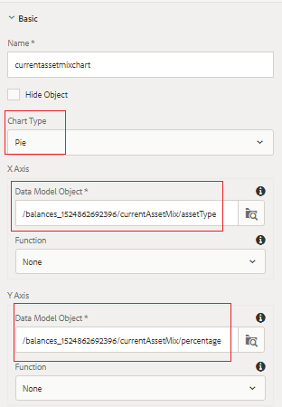

# Configuração do Painel de Combinação de Investimentos

Nesta parte, adicionaremos gráficos de pizza para exibir a combinação de investimento atual e modelo.

* Faça logon no AEM Forms e navegue até Adobe Experience Manager > Forms > Forms e Documentos.

* Abra a pasta 401KStatement.

* Abra a 401KStatement no modo de edição.

* Acrescentaremos dois gráficos de pizza para representar a combinação de investimento atual e modelo do titular da conta.

## Combinação de ativos atual {#current-asset-mix}

* Toque no painel &quot;CurrentAssetMix&quot; no lado direito e selecione o ícone &quot;+&quot; e insira o componente de texto. Altere o texto padrão para &quot;Combinação de ativos atual&quot;.

* Toque no painel &quot;CurrentAssetMix&quot; e selecione o ícone &quot;+&quot; e insira o componente gráfico. Toque no componente de gráfico recém-inserido e clique no ícone &quot;chave de fenda&quot; para abrir a folha de propriedades de configuração do gráfico.

* Defina as propriedades conforme mostrado na imagem abaixo. Certifique-se de que o tipo de gráfico é Gráfico de pizza.

* Observe o objeto de modelo de dados vinculado aos eixos X e Y. É necessário selecionar o elemento raiz do modelo de dados de formulário e, em seguida, detalhar para selecionar o elemento apropriado.

* 

## Mistura de ativos de modelo {#model-asset-mix}

* Toque no painel &quot;RecommendedAssetMix&quot; à direita e selecione o ícone &quot;+&quot; e insira o componente de texto. Altere o texto padrão para &quot;Mistura de ativos modelo&quot;.

* Toque no painel &quot;RecommendedAssetMix&quot; e selecione o ícone &quot;+&quot; e insira o componente de gráfico. Toque no componente de gráfico recém-inserido e clique no ícone &quot;chave de fenda&quot; para abrir a folha de propriedades de configuração do gráfico.

* Defina as propriedades conforme mostrado na imagem abaixo. Certifique-se de que o tipo de gráfico é Gráfico de pizza.

* Observe o objeto de modelo de dados vinculado aos eixos X e Y. É necessário selecionar o elemento raiz do modelo de dados de formulário e, em seguida, detalhar para selecionar o elemento apropriado.

* 

