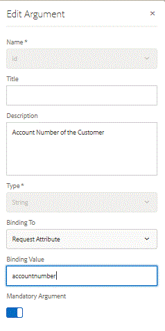

# Configuração do delivery do documento do canal da Web {#setting-up-the-delivery-of-web-channel-document}

Nessa parte, verificamos o delivery de documentos do canal da Web por email.

Depois de definir e testar seu documento de comunicação interativa de canal da Web, você precisa de um mecanismo de delivery para entregar o documento de canal da Web ao recipient.

Para poder usar o email como um mecanismo de delivery para nosso documento de canal da Web, precisamos fazer uma pequena alteração no modelo de dados de formulário.

[Para saber mais sobre a entrega do canal da Web por email](/help/forms/interactive-communications/delivery-of-web-channel-document-tutorial-use.md)

Faça logon em AEM Forms.

* Navegue até Formulários -> Integrações de dados

* Abra o Modelo de Dados RetimentaçãoContaDemonstrativo no modo de edição.

* Selecione o objeto de saldos e clique no botão editar.

* Selecione o ícone &quot;lápis&quot; para abrir o argumento id no modo de edição.

* Altere o vínculo para &quot;RequestAttribute&quot;.

* Defina o número da conta no valor do vínculo, como mostrado abaixo.

* Dessa forma, passamos o número da conta pelo atributo de solicitação para o modelo de dados de formulário

* Salve as alterações.
   

## Testar Entrega de Email do Documento de Canal da Web {#test-email-delivery-of-web-channel-document}

* [Instale os ativos de exemplo usando o gerenciador de pacotes](assets/webchanneldelivery.zip)
* [Logon no crx](http://localhost:4502/crx/de/index.jsp#)

* Navegue para /home/users

* Procure por usuário administrador no nó do usuário.

* Selecione o nó do perfil do usuário administrador.

* Crie uma propriedade chamada &quot;accountnumber&quot;. Certifique-se de que o tipo de propriedade seja uma string.

* Defina o valor dessa propriedade account number como &quot;3059827&quot;. Você pode definir esse valor como qualquer número aleatório desejado.

* [Abra getad.html](http://localhost:4502/content/getad.html)

* O código associado a este URL obterá o número da conta do usuário conectado. Esse número de conta é passado como requestattribute para o FDM. O FDM buscará os dados associados a esse número de conta e preencherá o documento do canal da Web.

>[!NOTE]
>
>Consulte o arquivo **/apps/AEMForms/fetchad/GET.jsp** no crx. Verifique se a variável String webChannelDocument está apontando para um caminho de documento de comunicação válido.
