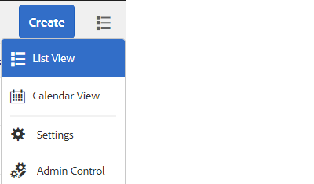

# Caixa de entrada AEM

AEM Caixa de entrada consolida notificações e tarefas de vários componentes de AEM, incluindo workflows do Forms. Quando um fluxo de trabalho de formulários contendo uma etapa de tarefa Atribuir é acionado, o aplicativo associado é listado como uma tarefa na Caixa de entrada do destinatário.

A interface do usuário da Caixa de entrada fornece exibições de lista e calendário para visualizar tarefas. Você também pode definir as configurações de exibição. Você pode filtrar tarefas com base em vários parâmetros.

Você pode personalizar uma Caixa de entrada Experience Manager para alterar o título padrão de uma coluna, reordenar a posição de uma coluna e exibir colunas adicionais com base nos dados de um fluxo de trabalho.

>[!NOTE]
>
>Você precisa ser um membro de administradores ou administradores de fluxo de trabalho para personalizar as colunas da caixa de entrada

## Personalização de coluna

[Iniciar AEM caixa de entrada](http://localhost:4502/aem/inbox)
Abra o Admin Control clicando no botão _Exibição de lista_ e depois selecionando _Controle de administração_ como mostrado na captura de tela abaixo

Na interface do usuário de personalização da coluna, é possível executar as seguintes operações

* Excluir colunas
* Reordenar as colunas
* Renomear colunas

## Personalização da marca

Na personalização da marca, você pode fazer o seguinte

* Adicionar o logotipo da organização
* Personalizar o texto do cabeçalho
* Personalizar o link de ajuda
* Ocultar opções de navegação

