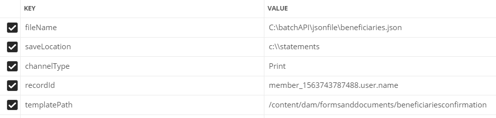

# API em lote

Você pode usar a API de lote para produzir várias comunicações interativas a partir de um modelo. O modelo é uma comunicação interativa sem dados. A API de lote combina dados com um modelo para produzir uma comunicação interativa. A API é útil na produção em massa de comunicações interativas. Por exemplo, contas telefônicas, declarações de cartão de crédito para vários clientes.

[Saiba mais sobre a API de geração de lote](https://docs.adobe.com/content/help/en/experience-manager-65/forms/interactive-communications/generate-multiple-interactive-communication-using-batch-api.html)

Este artigo fornece ativos de amostra para gerar documentos de Comunicações interativas usando a API de lote.

## Geração de lote usando a pasta assistida

* Importe o [modelo de comunicação interativa](assets/Beneficiaries-confirmation.zip) para o servidor AEM Forms.
* Importe a [configuração de pasta assistida](assets/batch-generation-api.zip). Isso criará uma pasta chamada `batchAPI` na unidade C.

**Se você estiver executando o AEM Forms em sistemas operacionais que não sejam Windows, siga as três etapas mencionadas abaixo:**

1. [Abrir pasta assistida](http://localhost:4502/libs/fd/core/WatchfolderUI/content/UI.html)
2. Selecione BatchAPIWatchedFolder e clique em Editar.
3. Altere o Caminho para corresponder ao seu sistema operacional.

* Baixe e extraia o conteúdo de [arquivo zip](assets/jsonfile.zip). O arquivo zip contém a pasta chamada `jsonfile` que contém o arquivo `beneficiaries.json`. Esse arquivo tem os dados para gerar 3 documentos.

* Solte a pasta `jsonfile` na pasta de entrada da sua pasta assistida.
* Depois que a pasta for selecionada para processamento, verifique a pasta de resultados da pasta assistida. Você deve ver 3 arquivos PDF gerados

## Geração de lote usando solicitações REST

Você pode chamar a [API de lote](https://helpx.adobe.com/experience-manager/6-5/forms/javadocs/index.html) por meio de solicitações REST. Você pode expor pontos de extremidade REST para outros aplicativos para chamar a API para gerar documentos.
A amostra de ativos fornecida expõe o ponto de extremidade REST para gerar documentos de comunicação interativa. O servlet aceita os seguintes parâmetros:

* fileName - Localização do arquivo de dados no sistema de arquivos.
* templatePath - caminho do modelo IC
* saveLocation - local para salvar os documentos gerados no sistema de arquivos
* channelType - Imprimir, Web ou ambos
* recordId - caminho JSON para elemento para definir o nome de uma comunicação interativa

A captura de tela a seguir mostra os parâmetros e seus valores

## Implantar ativos de amostra em seu servidor

* Importe [ICTemplate](assets/ICTemplate.zip) usando [gerenciador de pacote](http://localhost:4502/crx/packmgr/index.jsp)
* Importar [processador de Submissão Personalizado](assets/BatchAPICustomSubmit.zip) utilizando [gestor de pacote](http://localhost:4502/crx/packmgr/index.jsp)
* Importe [Formulário adaptativo](assets/BatchGenerationAPIAF.zip) usando a [interface Forms e Documento](http://localhost:4502/aem/forms.html/content/dam/formsanddocuments)
* Implantar e start [Pacote OSGI personalizado](assets/batchgenerationapi.batchgenerationapi.core-1.0-SNAPSHOT.jar) usando [console Web Felix](http://localhost:4502/system/console/bundles)
* [Acionar geração de lote enviando o formulário](http://localhost:4502/content/dam/formsanddocuments/batchgenerationapi/jcr:content?wcmmode=disabled)
