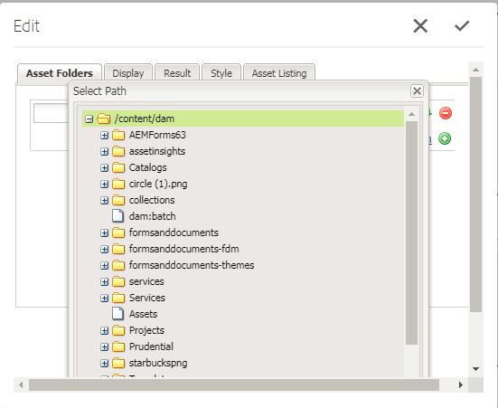

# Registrando tipos de ativos personalizados {#registering-custom-asset-types}

Ativar tipos de ativos personalizados para listagem no Portal AEMorms

>[!NOTE]
>
>Verifique se você tem o AEM 6.3 com SP1 e o AEM Forms Add On Installed correspondente. Este recurso funciona somente com o AEM Forms 6.3 SP1 e superior

## Especificar caminho base {#specify-base-path}

O caminho base é o caminho do repositório de nível superior que compreende todos os ativos que um usuário pode querer listar no componente de pesquisa e lister. Se desejar, o usuário também pode configurar locais específicos no caminho base da caixa de diálogo de edição de componentes, de modo que a pesquisa seja acionada em locais específicos em vez de pesquisar todos os nós dentro do caminho base. Por padrão, o caminho base é usado como critério do caminho de pesquisa para buscar os ativos, a menos que o usuário configure um conjunto de caminhos específicos a partir desse local. É importante ter um valor ideal desse caminho para fazer uma pesquisa com desempenho. O valor padrão do caminho base permanecerá como **_/content/dam/formsanddocuments_** porque todos os ativos do AEM Forms residem em **_/content/dam/formsanddocuments._**

Etapas para configurar o caminho base

1. Logon no crx
1. Navegue até **/libs/fd/fp/extensions/querybuilder/basepath**

1. Clique em &quot;Sobrepor nó&quot; na barra de ferramentas
1. Verifique se o local da sobreposição é &quot;/apps/&quot;
1. Clique em Ok
1. Clique em Salvar
1. Navegue até a nova estrutura criada em **/apps/fd/fp/extensions/querybuilder/basepath**

1. Altere o valor da propriedade path para **&quot;/content/dam&quot;**
1. Clique em Salvar

Ao especificar a propriedade do caminho para **&quot;/content/dam&quot;**, você está basicamente definindo Caminho Base como /content/dam. Isso pode ser verificado abrindo o componente Pesquisa e Lister .

## Registrar tipos de ativos personalizados {#register-custom-asset-types}

Adicionamos uma nova guia (Listagem de ativos) no componente de pesquisa e lister. Esta guia listará os tipos de ativos prontos para uso e os tipos de ativos adicionais configurados. Por padrão, os seguintes tipos de ativos são listados

1. Formulários adaptáveis
1. Modelos de formulário
1. Formulários PDF
1. Documento(PDFs estáticos)

**Etapas para registrar o tipo de ativo personalizado**

1. Criar nó de sobreposição de **/libs/fd/fp/extensions/querybuilder/ASSettypes**

1. Defina o local da sobreposição como &quot;/apps&quot;
1. Navegue até a nova estrutura criada em **/apps/fd/fp/extensions/querybuilder/assets **

1. Neste local, crie um nó &#39;nt:unstructured&#39; para o tipo a ser registrado, nomeie o nó **mp4files. Adicione as duas propriedades a seguir a este nó mp4files**

   1. Adicione a propriedade jcr:title para especificar o nome de exibição do tipo de ativo. Defina o valor de jcr:title como &quot;Arquivos Mp4&quot;.
   1. Adicione a propriedade &quot;type&quot; e defina seu valor para &quot;videos&quot;. Esse é o valor que usamos em nosso modelo para listar ativos dos vídeos do tipo . Salve as alterações.

1. Crie um nó do tipo &quot;nt:unstructured&quot; em arquivos mp4. Nomeie este nó como &quot;critérios de pesquisa&quot;
1. Adicione um ou mais filtros em critérios de pesquisa. Suponha que, se o usuário quiser ter um filtro de pesquisa para listar arquivos mp4 cujo tipo MIME é &quot;vídeo/mp4&quot;, você pode fazer isso aqui
1. Crie um nó do tipo &quot;nt:unstructured&quot; nos critérios de pesquisa do nó. Nomeie este nó como &quot;filetypes&quot;
1. Adicione as 2 propriedades a seguir a este nó &quot;filetypes&quot;

   1. name: ./jcr:content/metadata/dc:format
   1. valor: video/mp4

1. Isso significa que os ativos com a propriedade dc:format igual a video/mp4 serão considerados um tipo de ativo &quot;Vídeos Mp4&quot;. Você pode usar qualquer propriedade listada no nó &quot;jcr:content/metadata&quot; para os critérios de pesquisa

1. **Salve seu trabalho**

Após executar as etapas acima, o novo tipo de ativo (Arquivos Mp4) começará a ser exibido na lista suspensa tipos de ativos do componente Pesquisa e Lister , como mostrado abaixo

[Se tiver problemas para fazer com que isso funcione, você pode importar o seguinte pacote.](assets/assettypeskt1.zip) O pacote tem dois tipos de ativos personalizados definidos. Arquivos Mp4 e documentos do Word. Sugira que você dê uma olhada nos **/apps/fd/fp/extensions/querybuilder/assettypes**

[Instale o pacote customeportal](assets/customportalpage.zip). Este pacote contém página de portal de exemplo. Esta página será usada na parte 2 deste tutorial

