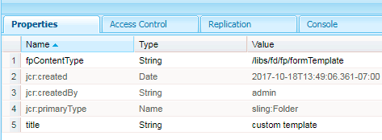

# Listar tipos de ativos personalizados em AEM Forms {#listing-custom-asset-types-in-aem-forms}

## Criando modelo personalizado {#creating-custom-template}


Para a finalidade deste artigo, criaremos um modelo personalizado para exibir os tipos de ativos personalizados e os tipos de ativos OOTB na mesma página. Para criar um modelo personalizado, siga as instruções a seguir

1. Criar um sling: em /apps. Nomeie-o como &quot; myportalcomponent &quot;
1. Adicione uma propriedade &quot;fpContentType&quot;. Defina seu valor como &quot;**/libs/fd/ fp/formTemplate&quot;.**
1. Adicione uma propriedade &quot;title&quot; e defina seu valor para &quot;custom template&quot;. Esse é o nome que você verá na lista suspensa do Componente de pesquisa e lister
1. Crie um &quot;template.html&quot; nesta pasta. Esse arquivo manterá o código com o estilo e exibirá os vários tipos de ativos.



O código a seguir lista os vários tipos de ativos usando o componente de pesquisa e lister. Criamos elementos html separados para cada tipo de ativo, conforme mostrado pela tag data-type = &quot;videos&quot;. Para o tipo de ativo &quot;vídeos&quot;, usamos o elemento &lt;vídeo> para reproduzir o vídeo em linha. Para o tipo de ativo &quot;documentos do Word&quot;, usamos uma marcação html diferente.

```html
<div class="__FP_boxes-container __FP_single-color">
   <div  data-repeatable="true">
     <div class = "__FP_boxes-thumbnail" style="float:left;margin-right:20px;" data-type = "videos">
   <video width="400" controls>
       <source src="${path}" type="video/mp4">
    </video>
         <h3 class="__FP_single-color" title="${name}" tabindex="0">${name}</h3>
     </div>
     <div class="__FP_boxes-thumbnail" style="float:left;margin-right:20px;" data-type = "worddocuments">
       <a href="/assetdetails.html${path}" target="_blank">
           
          </a>
          <h3 class="__FP_single-color" title="${name}" tabindex="0">${name}</h3>
     </div>
  <div class="__FP_boxes-thumbnail" style="float:left;margin-right:20px;" data-type = "xfaForm">
       <a href="/assetdetails.html${path}" target="_blank">
           
          </a>
          <h3 class="__FP_single-color" title="${name}" tabindex="0">${name}</h3>
                <a href="{formUrl}"></a><p>

     </div>
  <div class="__FP_boxes-thumbnail" style="float:left;margin-right:20px;" data-type = "printForm">
       <a href="/assetdetails.html${path}" target="_blank">
           
          </a>
          <h3 class="__FP_single-color" title="${name}" tabindex="0">${name}</h3>
                <a href="{pdfUrl}"></a><p>
     </div>
   </div>
</div>
```

>[!NOTE]
>
>Linha 11 - Altere a imagem src para apontar para uma imagem de sua escolha no DAM.
>
>Para listar Formulários Adaptativos nesse modelo, crie um novo div e defina seu atributo de tipo de dados como &quot;guia&quot;. Você pode copiar e colar o div cujos dados-type=&quot;printForm e definir o tipo de dados de div recém-copiado como &quot;guia&quot;

## Configurar Componente De Pesquisa E Lister {#configure-search-and-lister-component}

Depois de definir o modelo personalizado, agora precisamos associar esse modelo personalizado ao componente &quot;Pesquisar e lister&quot;. Aponte seu navegador [para este URL ](http://localhost:4502/editor.html/content/AemForms/CustomPortal.html).

Alterne para o modo Design e configure o sistema de parágrafo para incluir o componente Pesquisa e Lister no grupo de componentes permitidos. O componente Pesquisa e Lister faz parte do grupo Serviços de Documento.

Alterne para o modo de edição e adicione o componente Pesquisa e Lister ao ParSys.

Abra as propriedades de configuração do componente &quot;Pesquisa e Lister&quot;. Verifique se a guia &quot;Pastas de ativos&quot; está selecionada. Selecione as pastas das quais deseja listar os ativos no componente de pesquisa e lister. Para a finalidade deste artigo, eu selecionei

* /content/dam/VideosAndWordDocuments
* /content/dam/formsanddocuments/assettypes


Guia para a guia &quot;Exibir&quot;. Aqui, você escolherá o modelo que deseja exibir os ativos no componente de pesquisa e lister.

Selecione &quot;modelo personalizado&quot; no menu suspenso, como mostrado abaixo.


Configure os tipos de ativos que deseja listar no portal. Para configurar os tipos de guia do ativo para a &quot;Lista de ativos&quot; e configurar os tipos de ativos. Neste exemplo, configuramos os seguintes tipos de ativos

1. Arquivos MP4
1. Documentos do Word
1. Documento(Este é o tipo de ativo OOTB)
1. Modelo de Formulário (este é o tipo de ativo OOTB)

A captura de tela a seguir mostra os tipos de ativos configurados para listagem


Agora que você configurou seu Componente do Portal de Pesquisa e Lister, é hora de ver o lister em ação. Aponte seu navegador [para este URL ](http://localhost:4502/content/AemForms/CustomPortal.html?wcmmode=disabled). Os resultados devem ser algo como a imagem mostrada abaixo.

>[!NOTE]
>
>Se o seu portal estiver listando tipos de ativos personalizados em um servidor de publicação, certifique-se de fornecer permissão de &quot;leitura&quot; para o usuário &quot;fd-service&quot; no nó **/apps/fd/fp/extensions/querybuilder**


[tipos de ativosBaixe e instale este pacote usando o gerenciador de pacotes.](assets/customassettypekt1.zip) Ele contém amostras de documentos mp4 e word e arquivos xdp que serão usados como tipos de ativos para listar usando o componente de pesquisa e lister
