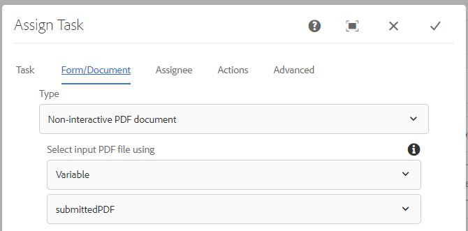

# Fluxo de trabalho para revisar e aprovar o PDF enviado

A última e última etapa é criar AEM fluxo de trabalho que gerará um PDF estático ou não interativo para revisão e aprovação. O fluxo de trabalho será acionado por meio de um Iniciador AEM configurado no nó `/content/pdfsubmissions`.

A captura de tela a seguir mostra as etapas envolvidas no fluxo de trabalho.

## Gerar etapa de fluxo de trabalho de PDF não interativo

O modelo XDP e os dados a serem unidos ao modelo são especificados aqui. Os dados a serem unidos são os dados enviados do PDF. Esses dados enviados são armazenados sob o nó `/content/pdfsubmissions`.

O PDF gerado é atribuído à variável de fluxo de trabalho chamada `submittedPDF`.

### Atribua o pdf gerado para revisão e aprovação

Atribuir componente de fluxo de trabalho de tarefa é usado aqui para atribuir o PDF gerado para revisão e aprovação. A variável `submittedPDF` é usada na guia Forms e Documentos do componente de fluxo de trabalho Atribuir Tarefa.

