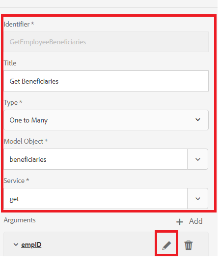

# Configuração do modelo de dados de formulário

## Fonte de dados agrupada da conexão Apache Sling

A primeira etapa na criação do modelo de dados de formulário RDBMS é configurar a fonte de dados agrupada da conexão Apache Sling. Para configurar a fonte de dados, siga as etapas listadas abaixo:

* Aponte seu navegador para [configMgr](http://localhost:4502/system/console/configMgr)
* Procure por **Origem de Dados agrupada da Conexão Apache Sling**
* Adicione uma nova entrada e forneça os valores conforme mostrado na captura de tela.
* 
* Salve as alterações

>[!NOTE]
>O URI, o nome de usuário e a senha da conexão JDBC serão alterados dependendo da configuração do banco de dados MySQL.

## Criação do Modelo de dados de formulário

* Aponte seu navegador para [Integrações de dados](http://localhost:4502/aem/forms.html/content/dam/formsanddocuments-fdm)
* Clique em _Criar_->_Modelo de Dados de Formulário_
* Forneça um nome e título significativos para o modelo de dados de formulário, como **Funcionário**
* Clique em _Avançar_
* Selecione a fonte de dados criada na seção anterior (fóruns)
* Clique em _Criar_->Editar para abrir o modelo de dados de formulário recém-criado no modo de edição
* Expanda o nó _forums_ para ver o schema do funcionário. Expanda o nó do funcionário para ver as 2 tabelas

## Adicionar entidades ao modelo

* Certifique-se de que o nó do funcionário seja expandido
* Selecione as entidades de novos e beneficiários e clique em _Adicionar Selecionados_

## Adicionar Serviço de Leitura a qualquer entidade

* Selecionar entidade nova
* Clique em _Editar Propriedades_
* Selecione obter na lista suspensa Serviço de leitura
* Clique no ícone + para adicionar um parâmetro ao serviço get
* Especifique os valores como mostrado na captura de tela
* 
>[!NOTE]
> O serviço get espera um valor mapeado para a coluna empID de uma entidade nova.Há várias maneiras de transmitir esse valor e, neste tutorial, a empID será passada pelo parâmetro de solicitação chamado empID.
* Clique em _Concluído_ para salvar os argumentos para o serviço get
* Clique em _Concluído_ para salvar as alterações no modelo de dados de formulário

## Adicionar Associação entre duas entidades

As associações definidas entre entidades de banco de dados não são criadas automaticamente no modelo de dados de formulário. As associações entre entidades precisam ser definidas usando o editor de modelo de dados de formulário. Cada entidade pode ter um ou mais beneficiários, precisamos definir uma associação de um para muitos entre as entidades do país e os beneficiários.
As etapas a seguir guiarão você pelo processo de criação da associação um para muitos

* Selecione qualquer entidade e clique em _Adicionar Associação_
* Forneça um Título significativo e um identificador para a associação e outras propriedades, conforme mostrado na captura de tela abaixo
   

* Clique no ícone _edit_ na seção Argumentos

* Especificar valores como mostrado nesta captura de tela
* 
* **Estamos vinculando as duas entidades usando a coluna empID de beneficiários e novas entidades.**
* Clique em _Concluído_ para salvar suas alterações

## Testar seu modelo de dados de formulário

Nosso modelo de dados de formulário agora tem o serviço **_get_** que aceita empID e retorna os detalhes do novo e de seus beneficiários. Para testar o serviço get, siga as etapas listadas abaixo.

* Selecionar entidade nova
* Clique em _Objeto de Modelo de Teste_
* Forneça empID válido e clique em _Testar_
* Você deve obter os resultados conforme mostrado na captura de tela abaixo
* 
