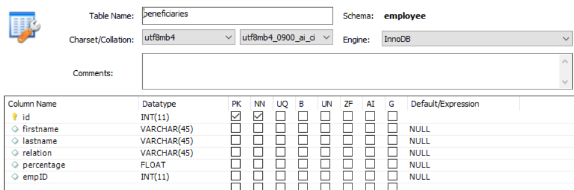

# Criar Tabelas de Banco de Dados

O modelo de dados de formulário pode ser baseado em fontes RDBMS, RESTfull, SOAP ou OData. O foco deste curso é no preenchimento prévio do formulário adaptável usando o modelo de dados de formulário apoiado pela fonte de dados RDBMS. Para a finalidade deste tutorial, foi usado o banco de dados MYSQL. Criamos as duas tabelas a seguir para demonstrar o caso de uso

* **** nwhiretable - Esta tabela armazena as informações completas

   

* **** beneficiários - Isso armazena beneficiários novos

   

Você pode importar o [arquivo sql](assets/db-schema.sql) usando o Workbench MySQL para criar tabelas com alguns dados de amostra.