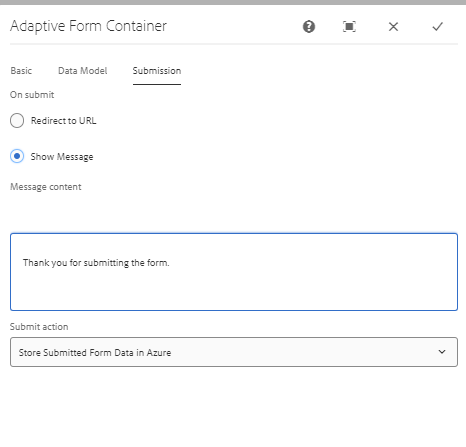

# Criar serviço de preenchimento

Para preencher o formulário com os dados e anexos enviados, o seguinte serviço de preenchimento prévio foi gravado

```java
package com.azuredemo.core;

import com.adobe.forms.common.service.*;
import com.azuredemo.core.SaveAndFetchFromAzure.*;
import org.apache.commons.lang3.StringUtils;
import org.osgi.service.component.annotations.Component;
import org.osgi.service.component.annotations.Reference;
import org.slf4j.Logger;
import org.slf4j.LoggerFactory;

import java.io.ByteArrayInputStream;
import java.io.InputStream;
import java.io.UnsupportedEncodingException;

@Component(
    service = {
        DataProvider.class,
        PrefillFromAzure.class
    },
    immediate = true
)
public class PrefillFromAzure implements DataProvider {

    @Reference
    // custom component to store and fetch data from azure portal
    private StoreAndFetchDataFromAzureStorage saveAndFetchFromAzure;
    private transient Logger logger = LoggerFactory.getLogger(PrefillFromAzure.class);
    @Override
    public PrefillData getPrefillData(DataOptions dataOptions) throws FormsException {
        // get the guid parameter from the url
        String guid = (String) dataOptions.getExtras().get("guid");
        // get the data associated with the guid 
        String data = saveAndFetchFromAzure.getBlobData(guid);
        InputStream dataInputStream = null;
        ContentType contentType = dataOptions.getContentType();
        PrefillData prefillData = null;
        if (StringUtils.isNotBlank(data)) {
            System.out.println("Returning prefill data");
            dataInputStream = getDataInputStream(data);
            prefillData = new PrefillData(dataInputStream, contentType);

        }
        return prefillData;


    }

    @Override
    public String getServiceName() {
        return "Prefill from azure portal";
    }

    @Override
    public String getServiceDescription() {
        return "Service to fetch data from azure portal storage";
    }
    private InputStream getDataInputStream(String data) {
        InputStream dataInputStream = null;
        System.out.println("got data  " + data);
        try {
            dataInputStream = new ByteArrayInputStream(data.getBytes("UTF-8"));
        } catch (UnsupportedEncodingException e) {
            logger.error("[Custom AF Prefill] Exception in custom af prefill service", e);
        }
        return dataInputStream;
    }
}
```

## Código para buscar dados do Azure

```java
// Fetch the blob from Azure using the Blob Id
public String getBlobData(String blobID) {
    String sasToken = azurePortalConfigurationService.getSASToken();
    String storageURI = azurePortalConfigurationService.getStorageURI();
    logger.debug("The SAS Token is " + sasToken);
    logger.debug("The Storage URL is " + storageURI);
    int timeout = 5;
    RequestConfig config = RequestConfig.custom()
        .setConnectTimeout(timeout * 1000)
        .setConnectionRequestTimeout(timeout)
        .setSocketTimeout(timeout * 1000).build();
    org.apache.http.impl.client.CloseableHttpClient httpClient = HttpClientBuilder.create().setDefaultRequestConfig(config).build();
    String getRequestURL = storageURI + blobID;
    HttpGet httpGet = new HttpGet(getRequestURL + sasToken);
    logger.debug("The url is:  " + getRequestURL + sasToken);
    try {
        CloseableHttpResponse response = httpClient.execute(httpGet);
        HttpEntity httpEntity = response.getEntity();
        String rawResponse = EntityUtils.toString(httpEntity);
        logger.debug("The Form Data  is " + rawResponse);
        return rawResponse;
    } catch (IOException e) {
        throw new RuntimeException(e);
    }


}
```

## Associar o serviço de preenchimento prévio ao formulário

Associe o serviço de preenchimento prévio personalizado ao formulário adaptável, conforme mostrado abaixo



Visualize o formulário incluindo o parâmetro guid no url, como mostrado abaixo

```html
http://localhost:4502/content/dam/formsanddocuments/azureportal/benefitsenrollment/jcr:content?wcmmode=disabled&guid=411b2f29-f0d0-468c-875b-4562dcc546fe
```
