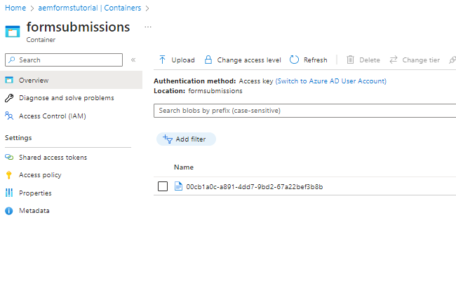

# Armazenar envios de formulários no Armazenamento do Azure

Este artigo mostra como fazer chamadas REST para armazenar dados AEM Forms enviados no Armazenamento do Azure.
Para poder armazenar dados de formulário enviados no Armazenamento do Azure, as etapas a seguir devem ser seguidas.

## Criar conta de Armazenamento do Azure

[Faça logon na sua conta de portal do Azure e crie uma conta de armazenamento](https://learn.microsoft.com/en-us/azure/storage/common/storage-account-create?tabs=azure-portal#create-a-storage-account-1). Forneça um nome significativo para a conta de armazenamento, clique em Revisar e em Criar. Isso cria sua conta de armazenamento com todos os valores padrão. Para os fins deste artigo, nomeamos nossa conta de armazenamento `aemformstutorial`.

## Criar acesso compartilhado

Vamos usar a Assinatura de Acesso Compartilhado ou o Método SAS de autorização para interagir com o contêiner de Armazenamento do Azure.
Na página da conta de armazenamento no portal, clique no item de menu Assinatura de acesso compartilhado à esquerda para abrir a nova página de configurações da chave de assinatura de acesso compartilhado. Certifique-se de especificar as configurações e a data final apropriada, como mostrado na captura de tela abaixo, e clique no botão Gerar SAS e cadeia de conexão. Copie o url SAS do serviço de blob. Usaremos esse URL para fazer nossas chamadas HTTP


## Criar contêiner

A próxima coisa que precisamos fazer é criar um container para armazenar os dados de envios de formulários.
Na página da conta de armazenamento, clique no item de menu Containers à esquerda e crie um container chamado `formssubmissions`. Verifique se o nível de acesso público está definido como privado


## Criar solicitação PUT

A próxima etapa é criar uma solicitação PUT para armazenar os dados de formulário enviados no Armazenamento do Azure. Teremos que modificar o URL SAS do Serviço Blob para incluir o nome do contêiner e a ID do BLOB no URL. Todo envio de formulário precisa ser identificado por uma ID de BLOB exclusiva. O ID de BLOB exclusivo geralmente é criado em seu código e inserido no url da solicitação PUT.
Veja a seguir o URL parcial da solicitação PUT. A variável `aemformstutorial` é o nome da conta de armazenamento, formsubmissions é o contêiner no qual os dados serão armazenados com uma ID de BLOB exclusiva. O restante do URL permanecerá o mesmo.
https://aemformstutorial.blob.core.windows.net/formsubmissions/00cb1a0c-a891-4dd7-9bd2-67a22bef3b8b?...............

A função a seguir é gravada para armazenar os dados do formulário enviado no Armazenamento do Azure usando uma solicitação PUT. Observe o uso do nome do container e da uuid no url. Você pode criar um serviço OSGi ou um servlet sling usando o código de amostra listado abaixo e armazenar os envios de formulários no Armazenamento do Azure.

```java
 public String saveFormDatainAzure(String formData) {
        System.out.println("in SaveFormData!!!!!"+formData);
        org.apache.http.impl.client.CloseableHttpClient httpClient = HttpClientBuilder.create().build();
        UUID uuid = UUID.randomUUID();
        
        String url = "https://aemformstutorial.blob.core.windows.net/formsubmissions/"+uuid.toString();
        url = url+"?sv=2022-11-02&ss=bf&srt=o&sp=rwdlaciytfx&se=2024-06-28T00:42:59Z&st=2023-06-27T16:42:59Z&spr=https&sig=v1MR%2FJuhEledioturDFRTd9e2fIDVSGJuAiUt6wNlkLA%3D";
        HttpPut httpPut = new HttpPut(url);
        httpPut.addHeader("x-ms-blob-type","BlockBlob");
        httpPut.addHeader("Content-Type","text/plain");
        try {
            httpPut.setEntity(new StringEntity(formData));
            CloseableHttpResponse response = httpClient.execute(httpPut);
            log.debug("Response code "+response.getStatusLine().getStatusCode());
        } catch (IOException e) {
            log.error("Error: "+e.getMessage());
            throw new RuntimeException(e);
        }
        return uuid.toString();


    }
```

## Verificar dados armazenados no container


