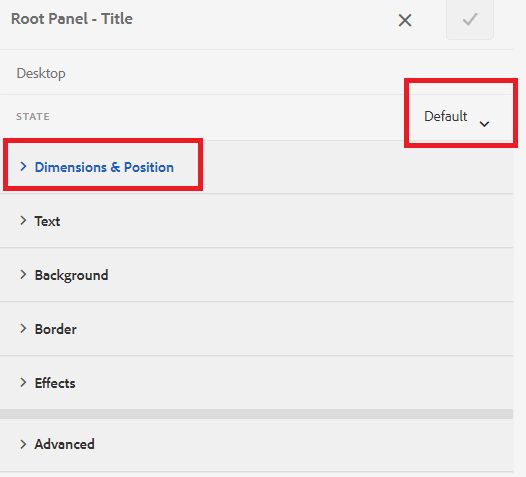

# Adicionar ícones para indicar guias ativas e concluídas

Ao ter um formulário adaptável com a navegação da guia esquerda, talvez você queira exibir ícones para indicar o status da guia . Por exemplo, você deseja mostrar um ícone para indicar a guia ativa e o ícone para indicar a guia concluída, como mostrado na captura de tela abaixo.

## Criar um formulário adaptável

Um formulário adaptável simples baseado no modelo básico e no tema Canvas 3.0 foi usado para criar o formulário de amostra.
O [ícones usados neste artigo](assets/icons.zip) pode ser baixado aqui.

## Estilo do estado padrão

Abra o formulário no modo de edição Verifique se você está na camada de estilo e selecione qualquer guia (por exemplo, guia Geral ).
Você está no estado padrão ao abrir o editor de estilo para a guia, como mostrado na captura de tela abaixo

Defina as propriedades de CSS para o estado padrão, como mostrado abaixo | Categoria | Nome da propriedade | Valor de propriedade | |—|—|—| | Dimension e posição | Largura | 50px | | Texto | Peso da fonte| Negrito | | Texto | Cor | #FFF | |Texto | Altura da linha| 3 | |Texto | Alinhamento de texto | Esquerda | |Fundo| Cor | #056data |

Salve as alterações

## Estilo do estado ativo

Verifique se você está no estado Ativo e crie o estilo das seguintes propriedades de CSS

| Categoria | Nome da Propriedade | Valor da propriedade |
|:---|:---|:---|
| Dimension e posição | Largura | 50px |
| Texto | Espessura da Fonte | Negrito |
| Texto | Cor | #FFF |
| Texto | Altura da Linha | 3 |
| Texto | Alinhamento do Texto | À esquerda |
| Segundo plano | Cor | #056data |

Estilo da imagem de plano de fundo como mostrado na captura de tela abaixo

Salve as alterações.

## Estilo do estado visitado

Verifique se você está no estado visitado e coloque o estilo nas seguintes propriedades

| Categoria | Nome da Propriedade | Valor da propriedade |
|:---|:---|:---|
| Dimension e posição | Largura | 50px |
| Texto | Espessura da Fonte | Negrito |
| Texto | Cor | #FFF |
| Texto | Altura da Linha | 3 |
| Texto | Alinhamento do Texto | À esquerda |
| Segundo plano | Cor | #056data |

Estilo da imagem de plano de fundo como mostrado na captura de tela abaixo

Salve as alterações

Visualize o formulário e teste os ícones como esperado.
