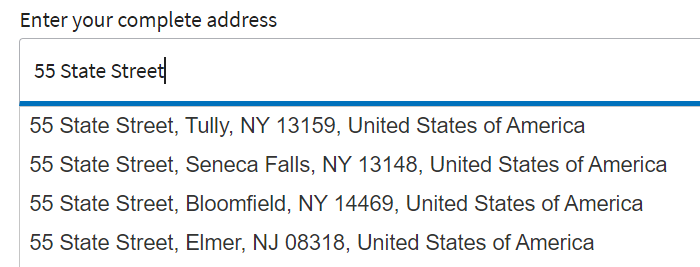
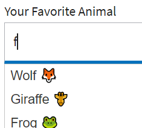

# Implementação do Preenchimento automático

Implemente o recurso de preenchimento automático em formulários AEM usando o recurso de preenchimento automático do jquery.
A amostra incluída neste artigo usa uma variedade de fontes de dados (matriz estática, matriz dinâmica preenchida a partir de uma resposta da API REST) para preencher as sugestões conforme o usuário começa a digitar no campo de texto.

O código usado para executar o recurso de preenchimento automático está associado ao evento de inicialização do campo.

## Fornecendo sugestão para endereço




Este é o código usado para fornecer sugestões de endereço

```javascript
$(".streetAddress input").autocomplete({
    source: function(request, response) {
        $.ajax({
            url: "https://api.geoapify.com/v1/geocode/autocomplete?text=" + request.term + "&apiKey=Your API Key", //please get your own API key with geoapify.com
            responseType: "application/json",
            success: function(data) {
                console.log(data.features.length);
                response($.map(data.features, function(item) {
                    return {
                        label: [item.properties.formatted],
                        value: [item.properties.formatted]
                    };
                }));
            },
        });
    },
    minLength: 5,
    select: function(event, ui) {
        console.log(ui.item ?
            "Selected: " + ui.item.label :
            "Nothing selected, input was " + this.value);
    }

});
```


## Sugestões com emoji



O código a seguir foi usado para exibir emojis na lista de sugestões

```javascript
var values=["Wolf \u{1F98A}", "Lion \u{1F981}","Puppy \u{1F436}","Giraffe \u{1F992}","Frog \u{1F438}"];
$(".Animals input").autocomplete( {
minLength: 1, source: values, delay: 0
}

);
```

A variável [o formulário de exemplo pode ser baixado](assets/auto-complete-form.zip) daqui. Forneça seu próprio nome de usuário/chave de API usando o editor de código para que o código faça chamadas REST bem-sucedidas.

>[!NOTE]
>
> Para que o preenchimento automático funcione, verifique se seu formulário usa a seguinte biblioteca do cliente **cq.jquery.ui**. Esta biblioteca cliente vem com AEM.
