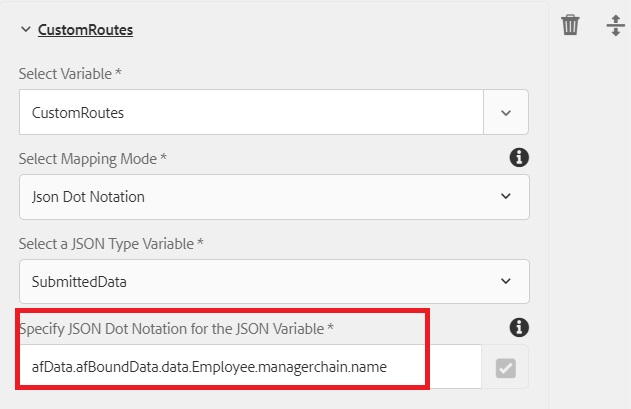

# Variável ArrayList no fluxo de trabalho do AEM

Variáveis do tipo ArrayList foram introduzidas no AEM Forms 6.5. Um caso de uso comum para usar a variável ArrayList é definir rotas personalizadas para serem usadas no AssignTask.

Para usar a variável ArrayList em um fluxo de trabalho do AEM, é necessário criar um formulário adaptável que gere elementos repetitivos nos dados enviados. Uma prática comum é definir um schema que contenha um elemento de matriz. Para a finalidade deste artigo, criei um esquema JSON simples contendo elementos de matriz. O caso de uso é de um funcionário que preenche um relatório de despesas. No relatório de despesas, capturamos o nome de gerente do remetente e o nome de gerente do gerente. Os nomes do gerente são armazenados em um storage chamado gerenciamento de cadeia. A captura de tela abaixo mostra o formulário de relatório de despesas e os dados do envio do Adaptive Forms.


A seguir estão os dados do envio do formulário adaptável. O formulário adaptável era baseado no esquema JSON, os dados vinculados ao esquema eram armazenados no elemento de dados do elemento afBoundData . A cadeia de gerenciamento é uma matriz e precisamos preencher a ArrayList com o elemento name do objeto dentro da matriz da cadeia de gerenciamento.

```json
{
    "afData": {
        "afUnboundData": {
            "data": {
                "numericbox_2762582281554154833426": 700
            }
        },
        "afBoundData": {
            "data": {
                "Employee": {
                    "Name": "Conrad Simms",
                    "Department": "IT",
                    "managerchain": [{
                        "name": "Gloria Rios"
                    }, {
                        "name": "John Jacobs"
                    }]
                },
                "expense": [{
                    "description": "Hotel",
                    "amount": 300
                }, {
                    "description": "Air Fare",
                    "amount": 400
                }]
            }
        },
        "afSubmissionInfo": {
            "computedMetaInfo": {},
            "stateOverrides": {},
            "signers": {},
            "afPath": "/content/dam/formsanddocuments/helpx/travelexpensereport",
            "afSubmissionTime": "20190402102953"
            }
        }
}
```

Para inicializar a variável ArrayList da sequência de subtipo, você pode usar a Notação de pontos JSON ou o modo de mapeamento XPath. A captura de tela a seguir mostra que você preenche uma variável ArrayList chamada CustomRoutes usando a Notação de Ponto JSON. Certifique-se de apontar para um elemento em um objeto de matriz, como mostrado na captura de tela abaixo. Estamos preenchendo a CustomRoutes ArrayList com os nomes do objeto de matriz da cadeia de gerenciamento.
A ArrayList CustomRoutes é então usada para preencher as Rotas no componente AssignTask

Depois que a variável CustomRoutes ArrayList é inicializada com os valores dos dados enviados, as Rotas do componente AssignTask são preenchidas usando a variável CustomRoutes . A captura de tela abaixo mostra as rotas personalizadas em uma AssignTask


Para testar esse fluxo de trabalho em seu sistema, siga as etapas a seguir

* Baixe e salve o arquivo ArrayListVariable.zip em seu sistema de arquivos
* [Importe o arquivo zip ](assets/arraylistvariable.zip) usando o Gerenciador de pacotes do AEM
* [Abra o formulário TravelExpenseReport](http://localhost:4502/content/dam/formsanddocuments/helpx/travelexpensereport/jcr:content?wcmmode=disabled)
* Insira algumas despesas e os 2 nomes do gerente
* Clique no botão Enviar
* [Abrir sua caixa de entrada](http://localhost:4502/aem/inbox)
* Você deve ver uma nova tarefa intitulada &quot;Atribuir ao administrador de despesas&quot;
* Abra o formulário associado à tarefa
* Você deve ver duas rotas personalizadas com os nomes do gerente
   [Explore o ReviewExpenseReportWorkflow.](http://localhost:4502/editor.html/conf/global/settings/workflow/models/ReviewExpenseReport.html) Esse workflow usa a variável ArrayList, a variável do tipo JSON, o editor de regras no componente Or-Split
