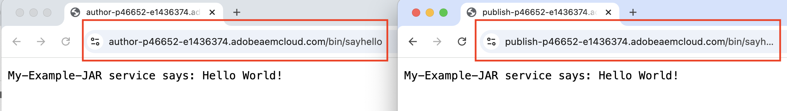

# Instalar artefatos de terceiros - não disponível no repositório Maven público

Saiba como instalar artefatos de terceiros que não estão *disponíveis no repositório Maven público* ao compilar e implantar um projeto do AEM.

Os **artefatos de terceiros** podem ser:

- [Pacote OSGi](https://www.osgi.org/resources/architecture/): um pacote OSGi é um arquivo morto Java™ que contém classes, recursos e um manifesto Java que descreve o pacote e suas dependências.
- [Java jar](https://docs.oracle.com/javase/tutorial/deployment/jar/basicsindex.html): um arquivo de repositório Java™ que contém classes e recursos Java.
- [Pacote](https://experienceleague.adobe.com/pt-br/docs/experience-manager-65/content/sites/administering/contentmanagement/package-manager#what-are-packages): um pacote é um arquivo zip que contém o conteúdo do repositório no formato de serialização do sistema de arquivos.

## Cenário padrão

Normalmente, você instalaria o pacote de terceiros, pacote esse *está disponível* no repositório Maven público como uma dependência no arquivo `pom.xml` do seu projeto do AEM.

Por exemplo:

- Os [Componentes Principais do AEM WCM](https://github.com/adobe/aem-core-wcm-components) **pacote** foram adicionados como uma dependência no arquivo [&#x200B; &#x200B;](https://github.com/adobe/aem-guides-wknd/blob/main/pom.xml#L747-L753) do `pom.xml`projeto WKND. Aqui, o escopo `provided` é usado, pois o conjunto de componentes principais WCM do AEM é fornecido pelo tempo de execução do AEM. Se o pacote não for fornecido pelo tempo de execução do AEM, você usaria o escopo `compile` e esse é o escopo padrão.

- [WKND Compartilhado](https://github.com/adobe/aem-guides-wknd-shared) **pacote** é adicionado como uma dependência no arquivo [&#x200B; &#x200B;](https://github.com/adobe/aem-guides-wknd/blob/main/pom.xml#L767-L773) do `pom.xml`projeto WKND.


## Cenário raro

Ocasionalmente, ao criar e implantar um projeto do AEM, talvez seja necessário instalar um pacote de terceiros ou jar ou pacote **que não esteja disponível** no [Repositório Central Maven](https://mvnrepository.com/) ou no [Repositório Público Adobe](https://repo.adobe.com/index.html).

Os motivos podem ser:

- O pacote é fornecido por uma equipe interna ou fornecedor terceirizado e _não está disponível no repositório Maven público_.

- O arquivo jar do Java™ _não é um pacote OSGi_ e pode ou não estar disponível no repositório Maven público.

- Você precisa de um recurso que ainda não foi lançado na versão mais recente do pacote de terceiros disponível no repositório Maven público. Você decidiu instalar a versão RELEASE ou SNAPSHOT criada localmente.

## Pré-requisitos

Para seguir este tutorial, você precisa:

- Instalação do [ambiente de desenvolvimento local do AEM](https://experienceleague.adobe.com/pt-br/docs/experience-manager-learn/cloud-service/local-development-environment-set-up/overview) ou do [Ambiente de Desenvolvimento Rápido(RDE)](https://experienceleague.adobe.com/pt-br/docs/experience-manager-learn/cloud-service/developing/rde/overview).

- O [projeto WKND do AEM](https://github.com/adobe/aem-guides-wknd) _para adicionar o pacote ou jar ou o pacote de terceiros_ e verificar as alterações.

## Configuração

- Configurar o ambiente de desenvolvimento local do AEM 6.X ou AEM as a Cloud Service (AEMCS) ou RDE.

- Clonar e implantar o projeto WKND do AEM.

  ```
  $ git clone git@github.com:adobe/aem-guides-wknd.git
  $ cd aem-guides-wknd
  $ mvn clean install -PautoInstallPackage 
  ```

  Verifique se as páginas do site WKND são renderizadas corretamente.

## Instalar um pacote de terceiros em um projeto do AEM{#install-third-party-bundle}

Vamos instalar e usar um OSGi de demonstração [my-example-bundle](./assets/install-third-party-articafcts/my-example-bundle.zip) que _não está disponível no repositório Maven público_ para o projeto WKND do AEM.

O **my-example-bundle** exporta o serviço OSGi `HelloWorldService`, seu método `sayHello()` retorna a mensagem `Hello Earth!`.

Para obter mais detalhes, consulte o arquivo README.md no arquivo [my-example-bundle.zip](./assets/install-third-party-articafcts/my-example-bundle.zip).

### Adicionar o pacote ao módulo `all`

A primeira etapa é adicionar `my-example-bundle` ao módulo `all` do projeto WKND do AEM.

- Baixe e extraia o arquivo [my-example-bundle.zip](./assets/install-third-party-articafcts/my-example-bundle.zip).

- No módulo `all` do projeto WKND do AEM, crie a estrutura de diretório `all/src/main/content/jcr_root/apps/wknd-vendor-packages/container/install`. O diretório `/all/src/main/content` existe, você só precisa criar os diretórios `jcr_root/apps/wknd-vendor-packages/container/install`.

- Copie o arquivo `my-example-bundle-1.0-SNAPSHOT.jar` do diretório `target` extraído para o diretório `all/src/main/content/jcr_root/apps/wknd-vendor-packages/container/install` acima.

  

### Usar o serviço do pacote

Vamos usar o serviço OSGi `HelloWorldService` do `my-example-bundle` no projeto WKND do AEM.

- No módulo `core` do projeto WKND do AEM, crie o servlet Sling `SayHello.java` às `core/src/main/java/com/adobe/aem/guides/wknd/core/servlet`.

  ```java
  package com.adobe.aem.guides.wknd.core.servlet;
  
  import java.io.IOException;
  
  import javax.servlet.Servlet;
  import javax.servlet.ServletException;
  
  import org.apache.sling.api.SlingHttpServletRequest;
  import org.apache.sling.api.SlingHttpServletResponse;
  import org.apache.sling.api.servlets.HttpConstants;
  import org.apache.sling.api.servlets.ServletResolverConstants;
  import org.apache.sling.api.servlets.SlingSafeMethodsServlet;
  import org.osgi.service.component.annotations.Component;
  import org.osgi.service.component.annotations.Reference;
  import com.example.services.HelloWorldService;
  
  @Component(service = Servlet.class, property = {
      ServletResolverConstants.SLING_SERVLET_PATHS + "=/bin/sayhello",
      ServletResolverConstants.SLING_SERVLET_METHODS + "=" + HttpConstants.METHOD_GET
  })
  public class SayHello extends SlingSafeMethodsServlet {
  
          private static final long serialVersionUID = 1L;
  
          // Injecting the HelloWorldService from the `my-example-bundle` bundle
          @Reference
          private HelloWorldService helloWorldService;
  
          @Override
          protected void doGet(SlingHttpServletRequest request, SlingHttpServletResponse response) throws ServletException, IOException {
              // Invoking the HelloWorldService's `sayHello` method
              response.getWriter().write("My-Example-Bundle service says: " + helloWorldService.sayHello());
          }
  }
  ```

- No arquivo `pom.xml` raiz do projeto WKND do AEM, adicione o `my-example-bundle` como uma dependência.

  ```xml
  ...
  <!-- My Example Bundle -->
  <dependency>
      <groupId>com.example</groupId>
      <artifactId>my-example-bundle</artifactId>
      <version>1.0-SNAPSHOT</version>
      <scope>system</scope>
      <systemPath>${maven.multiModuleProjectDirectory}/all/src/main/content/jcr_root/apps/wknd-vendor-packages/container/install/my-example-bundle-1.0-SNAPSHOT.jar</systemPath>
  </dependency>
  ...
  ```

  Aqui:
   - O escopo `system` indica que a dependência não deve ser pesquisada no repositório Maven público.
   - O `systemPath` é o caminho para o arquivo `my-example-bundle` no módulo `all` do projeto WKND do AEM.
   - O `${maven.multiModuleProjectDirectory}` é uma propriedade Maven que aponta para o diretório raiz do projeto de vários módulos.

- No arquivo `core` do módulo `core/pom.xml` do projeto WKND do AEM, adicione `my-example-bundle` como uma dependência.

  ```xml
  ...
  <!-- My Example Bundle -->
  <dependency>
      <groupId>com.example</groupId>
      <artifactId>my-example-bundle</artifactId>
  </dependency>
  ...
  ```

- Crie e implante o projeto WKND do AEM usando o seguinte comando:

  ```
  $ mvn clean install -PautoInstallPackage
  ```

- Verifique se o servlet `SayHello` funciona conforme esperado acessando a URL `http://localhost:4502/bin/sayhello` no navegador.

- Confirme as alterações acima no repositório do projeto WKND do AEM. Em seguida, verifique as alterações no ambiente RDE ou AEM executando o pipeline do Cloud Manager.

  

A ramificação [tutorial/install-3rd-party-bundle](https://github.com/adobe/aem-guides-wknd/compare/main...tutorial/install-3rd-party-bundle) do projeto WKND do AEM tem as alterações acima para sua referência.

### Principais aprendizados{#key-learnings-bundle}

Os pacotes OSGi que não estão disponíveis no repositório Maven público podem ser instalados em um projeto do AEM seguindo estas etapas:

- Copie o pacote OSGi para o diretório `all` do módulo `jcr_root/apps/<PROJECT-NAME>-vendor-packages/container/install`. Essa etapa é necessária para empacotar e implantar o pacote na instância do AEM.

- Atualize os arquivos `pom.xml` dos módulos raiz e principal para adicionar o pacote OSGi como uma dependência com o escopo `system` e `systemPath` apontando para o arquivo de pacote. Essa etapa é necessária para compilar o projeto.

## Instalar um jar de terceiros em um projeto do AEM

Neste exemplo, o `my-example-jar` não é um pacote OSGi, mas um arquivo jar Java.

Vamos instalar e usar uma demonstração [my-example-jar](./assets/install-third-party-articafcts/my-example-jar.zip) de que _não está disponível no repositório Maven público_ para o projeto WKND do AEM.

O **my-example-jar** é um arquivo jar Java que contém uma classe `MyHelloWorldService` com um método `sayHello()` que retorna a mensagem `Hello World!`.

Para obter mais detalhes, consulte o arquivo README.md no arquivo [my-example-jar.zip](./assets/install-third-party-articafcts/my-example-jar.zip).

### Adicionar o jar ao módulo `all`

A primeira etapa é adicionar `my-example-jar` ao módulo `all` do projeto WKND do AEM.

- Baixe e extraia o arquivo [my-example-jar.zip](./assets/install-third-party-articafcts/my-example-jar.zip).

- No módulo `all` do projeto WKND do AEM, crie a estrutura de diretório `all/resource/jar`.

- Copie o arquivo `my-example-jar-1.0-SNAPSHOT.jar` do diretório `target` extraído para o diretório `all/resource/jar` acima.

  

### Usar o serviço do jar

Vamos usar o `MyHelloWorldService` do `my-example-jar` no projeto WKND do AEM.

- No módulo `core` do projeto WKND do AEM, crie o servlet Sling `SayHello.java` às `core/src/main/java/com/adobe/aem/guides/wknd/core/servlet`.

  ```java
  package com.adobe.aem.guides.wknd.core.servlet;
  
  import java.io.IOException;
  
  import javax.servlet.Servlet;
  import javax.servlet.ServletException;
  
  import org.apache.sling.api.SlingHttpServletRequest;
  import org.apache.sling.api.SlingHttpServletResponse;
  import org.apache.sling.api.servlets.HttpConstants;
  import org.apache.sling.api.servlets.ServletResolverConstants;
  import org.apache.sling.api.servlets.SlingSafeMethodsServlet;
  import org.osgi.service.component.annotations.Component;
  
  import com.my.example.MyHelloWorldService;
  
  @Component(service = Servlet.class, property = {
          ServletResolverConstants.SLING_SERVLET_PATHS + "=/bin/sayhello",
          ServletResolverConstants.SLING_SERVLET_METHODS + "=" + HttpConstants.METHOD_GET
  })
  public class SayHello extends SlingSafeMethodsServlet {
  
      private static final long serialVersionUID = 1L;
  
      @Override
      protected void doGet(SlingHttpServletRequest request, SlingHttpServletResponse response)
              throws ServletException, IOException {
  
          // Creating an instance of MyHelloWorldService
          MyHelloWorldService myHelloWorldService = new MyHelloWorldService();
  
          // Invoking the MyHelloWorldService's `sayHello` method
          response.getWriter().write("My-Example-JAR service says: " + myHelloWorldService.sayHello());
      }
  }    
  ```

- No arquivo `pom.xml` raiz do projeto WKND do AEM, adicione o `my-example-jar` como uma dependência.

  ```xml
  ...
  <!-- My Example JAR -->
  <dependency>
      <groupId>com.my.example</groupId>
      <artifactId>my-example-jar</artifactId>
      <version>1.0-SNAPSHOT</version>
      <scope>system</scope>
      <systemPath>${maven.multiModuleProjectDirectory}/all/resource/jar/my-example-jar-1.0-SNAPSHOT.jar</systemPath>
  </dependency>            
  ...
  ```

  Aqui:
   - O escopo `system` indica que a dependência não deve ser pesquisada no repositório Maven público.
   - O `systemPath` é o caminho para o arquivo `my-example-jar` no módulo `all` do projeto WKND do AEM.
   - O `${maven.multiModuleProjectDirectory}` é uma propriedade Maven que aponta para o diretório raiz do projeto de vários módulos.

- No arquivo `core` do módulo `core/pom.xml` do projeto WKND do AEM, faça duas alterações:

   - Adicione o `my-example-jar` como uma dependência.

     ```xml
     ...
     <!-- My Example JAR -->
     <dependency>
         <groupId>com.my.example</groupId>
         <artifactId>my-example-jar</artifactId>
     </dependency>
     ...
     ```

   - Atualize a configuração `bnd-maven-plugin` para incluir `my-example-jar` no pacote OSGi (aem-guides-wknd.core) que está sendo compilado.

     ```xml
     ...
     <plugin>
         <groupId>biz.aQute.bnd</groupId>
         <artifactId>bnd-maven-plugin</artifactId>
         <executions>
             <execution>
                 <id>bnd-process</id>
                 <goals>
                     <goal>bnd-process</goal>
                 </goals>
                 <configuration>
                     <bnd><![CDATA[
                 Import-Package: javax.annotation;version=0.0.0,*
                 <!-- Include the 3rd party jar as inline resource-->
                 -includeresource: \
                 lib/my-example-jar.jar=my-example-jar-1.0-SNAPSHOT.jar;lib:=true
                         ]]></bnd>
                 </configuration>
             </execution>
         </executions>
     </plugin>        
     ...
     ```

- Crie e implante o projeto WKND do AEM usando o seguinte comando:

  ```
  $ mvn clean install -PautoInstallPackage
  ```

- Verifique se o servlet `SayHello` funciona conforme esperado acessando a URL `http://localhost:4502/bin/sayhello` no navegador.

- Confirme as alterações acima no repositório do projeto WKND do AEM. Em seguida, verifique as alterações no ambiente RDE ou AEM executando o pipeline do Cloud Manager.

  

A ramificação [tutorial/install-3rd-party-jar](https://github.com/adobe/aem-guides-wknd/compare/main...tutorial/install-3rd-party-jar) do projeto WKND do AEM tem as alterações acima para sua referência.

Em cenários em que o arquivo jar do Java _está disponível no repositório Maven público, mas NÃO é um pacote OSGi_, você pode seguir as etapas acima, exceto o escopo `<dependency>` de `system`, e os elementos `systemPath` não são obrigatórios.

### Principais aprendizados{#key-learnings-jar}

Os jars do Java que não são pacotes OSGi e podem ou não estar disponíveis no repositório Maven público podem ser instalados em um projeto AEM seguindo estas etapas:

- Atualize a configuração `bnd-maven-plugin` no arquivo `pom.xml` do módulo principal para incluir o Java jar como um recurso em linha no pacote OSGi que está sendo criado.

As seguintes etapas só serão necessárias se o jar do Java não estiver disponível no repositório Maven público:

- Copie o jar do Java para o diretório `all` do módulo `resource/jar`.

- Atualize os arquivos `pom.xml` da raiz e do módulo principal para adicionar o jar Java como uma dependência com o escopo `system` e `systemPath` apontando para o arquivo jar.

## Instalar um pacote de terceiros em um projeto do AEM

Vamos instalar a versão [ACS AEM Commons](https://adobe-consulting-services.github.io/acs-aem-commons/) _SNAPSHOT_ criada localmente a partir da ramificação principal.

É feito apenas para demonstrar as etapas para instalar um pacote do AEM que não está disponível no repositório Maven público.

O pacote ACS AEM Commons está disponível no repositório Maven público. Consulte o [Adicionar ACS AEM Commons ao seu projeto AEM Maven](https://adobe-consulting-services.github.io/acs-aem-commons/pages/maven.html) para adicioná-lo ao seu projeto AEM.

### Adicionar o pacote ao módulo `all`

A primeira etapa é adicionar o pacote ao módulo `all` do projeto WKND do AEM.

- Comente ou remova a dependência da versão ACS AEM Commons do arquivo POM. Consulte o [Adicionar ACS AEM Commons ao seu projeto AEM Maven](https://adobe-consulting-services.github.io/acs-aem-commons/pages/maven.html) para identificar a dependência.

- Clonar a ramificação `master` do [repositório do ACS AEM Commons](https://github.com/Adobe-Consulting-Services/acs-aem-commons) no computador local.

- Crie a versão ACS AEM Commons SNAPSHOT usando o seguinte comando:

  ```
  $mvn clean install
  ```

- O pacote criado localmente está localizado em `all/target`, há dois arquivos .zip, um que termina com `-cloud` é destinado ao AEM as a Cloud Service e o outro é para o AEM 6.X.

- No módulo `all` do projeto WKND do AEM, crie a estrutura de diretório `all/src/main/content/jcr_root/apps/wknd-vendor-packages/container/install`. O diretório `/all/src/main/content` existe, você só precisa criar os diretórios `jcr_root/apps/wknd-vendor-packages/container/install`.

- Copie o arquivo de pacote (.zip) criado localmente no diretório `/all/src/main/content/jcr_root/apps/mysite-vendor-packages/container/install`.

- Crie e implante o projeto WKND do AEM usando o seguinte comando:

  ```
  $ mvn clean install -PautoInstallPackage
  ```

- Verifique o pacote ACS AEM Commons instalado:

   - Gerenciador de Pacotes do CRX @ `http://localhost:4502/crx/packmgr/index.jsp`

     

   - O console OSGi @ `http://localhost:4502/system/console/bundles`

     

- Confirme as alterações acima no repositório do projeto WKND do AEM. Em seguida, verifique as alterações no ambiente RDE ou AEM executando o pipeline do Cloud Manager.

### Principais aprendizados{#key-learnings-package}

Os pacotes do AEM que não estão disponíveis no repositório Maven público podem ser instalados em um projeto do AEM seguindo estas etapas:

- Copie o pacote para o diretório `all` do módulo `jcr_root/apps/<PROJECT-NAME>-vendor-packages/container/install`. Essa etapa é necessária para empacotar e implantar o pacote na instância do AEM.


## Resumo

Neste tutorial, você aprendeu a instalar artefatos de terceiros (pacote, jar Java e pacote) que não estão disponíveis no repositório Maven público ao criar e implantar um projeto do AEM.
