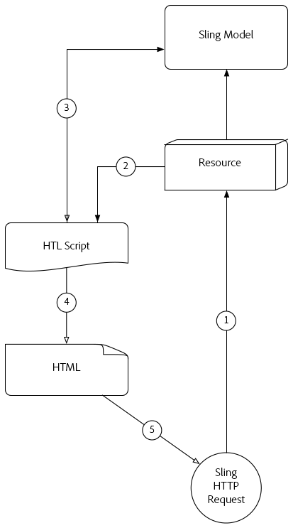

# Entender [!DNL Sling Model Exporter]

O Apache [!DNL Sling Models] 1.3.0 introduz [!DNL Sling Model Exporter], uma maneira elegante de exportar ou serializar objetos [!DNL Sling Model] em abstrações personalizadas. Este artigo justapõe o caso de uso tradicional de usar [!DNL Sling Models] para preencher scripts HTL, com o aproveitamento da estrutura [!DNL Sling Model Exporter] para serializar um [!DNL Sling Model] no JSON.

## Fluxo de Solicitação HTTP do Modelo de Sling Tradicional

O caso de uso tradicional de [!DNL Sling Models] é fornecer uma abstração de negócios para um recurso ou solicitação, que fornece scripts HTL (ou, anteriormente, JSPs) e uma interface para acessar funções de negócios.

Padrões comuns estão desenvolvendo [!DNL Sling Models] que representam Componentes ou Páginas do AEM e usando os objetos [!DNL Sling Model] para alimentar os scripts HTL com dados, com um resultado final de HTML exibido no navegador.

### Fluxo de Solicitação HTTP do Modelo Sling

1. [!DNL HTTP GET] A solicitação é feita para um recurso no AEM.

   Exemplo: `HTTP GET /content/my-resource.html`

1. Com base no `sling:resourceType` do recurso de solicitação, o script apropriado é resolvido.

1. O Script adapta a Solicitação ou o Recurso ao [!DNL Sling Model] desejado.

1. O script usa o objeto [!DNL Sling Model] para gerar a representação HTML.

1. O HTML gerado pelo Script é retornado na Resposta HTTP.

Esse padrão tradicional funciona bem no contexto da geração de HTML, pois o [!DNL Sling Model] pode ser facilmente aproveitado via HTL. Criar dados mais estruturados, como JSON ou XML, é um esforço muito mais entediante, já que HTL não se presta naturalmente à definição desses formatos.

## [!DNL Sling Model Exporter] Fluxo de solicitação HTTP

O Apache [!DNL Sling Model Exporter] vem com um Exportador Jackson fornecido pelo Sling que serializa automaticamente um objeto &quot;comum&quot; [!DNL Sling Model] no JSON. O Exportador Jackson, embora bastante configurável, em seu núcleo inspeciona o objeto [!DNL Sling Model] e gera JSON usando qualquer método &quot;getter&quot; como chaves JSON, e o getter return values como os valores JSON.

A serialização direta de [!DNL Sling Models] permite que elas atendam às solicitações normais da Web com suas respostas HTML criadas usando o fluxo de solicitação tradicional [!DNL Sling Model] (veja acima), mas também exponham representações JSON que podem ser consumidas por serviços da Web ou aplicativos JavaScript.

*Este fluxo descreve o fluxo utilizando o exportador de Jackson fornecido para produzir a saída JSON. O uso de exportadores personalizados segue o mesmo fluxo, mas com seu formato de saída.*

1. A Solicitação HTTP GET é feita para um recurso no AEM com o seletor e a extensão registrados no Exportador do [!DNL Sling Model].

   Exemplo: `HTTP GET /content/my-resource.model.json`

1. O Sling resolve o `sling:resourceType` do recurso solicitado, o seletor e a extensão para um Servlet Sling Exporter gerado dinamicamente, que é mapeado para [!DNL Sling Model] com Exportador.
1. O Servlet Exportador Sling resolvido chama o [!DNL Sling Model Exporter] em relação ao objeto [!DNL Sling Model] adaptado a partir da solicitação ou do recurso (como determinado pelas adaptáveis dos Modelos Sling).
1. O exportador serializa o [!DNL Sling Model] com base nas anotações Opções do Exportador e no Modelo de Sling específico do Exportador e retorna o resultado ao Servlet do Exportador Sling.
1. O Servlet do Exportador Sling retorna a representação JSON do [!DNL Sling Model] na Resposta HTTP.

>[!NOTE]
>
>Embora o projeto Apache Sling forneça o Exportador Jackson que serializa [!DNL Sling Models] para JSON, o quadro Exportador também suporta Exportadores personalizados. Por exemplo, um projeto pode implementar um Exportador personalizado que serializa um [!DNL Sling Model] no XML.

>[!NOTE]
>
>Além de [!DNL Sling Model Exporter] *serializar* [!DNL Sling Models], também pode exportá-los como objetos Java. A exportação para outros objetos Java não desempenha uma função no fluxo da Solicitação HTTP e, portanto, não aparece no diagrama acima.

## Materiais de apoio

* [ [!DNL Sling Model Exporter] Documentação do ApacheFramework](https://sling.apache.org/documentation/bundles/models.html#exporter-framework-since-130)
